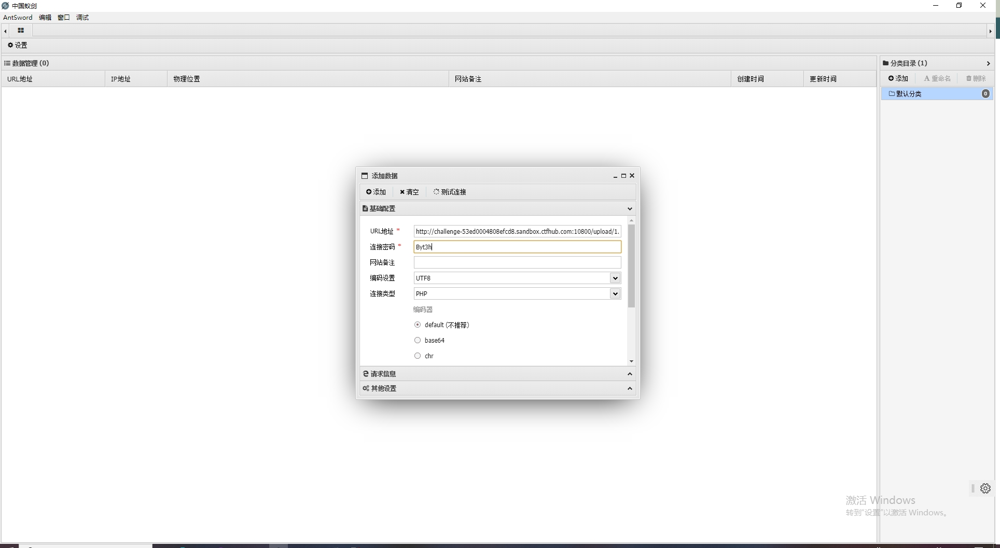

## 无验证

+ 直接上传文件

+ 中国蚁剑直接添加数据<code>getshell</code>

## 前端验证

+ 准备好相应的<code>jpg</code>文件，然后上传<code>jpg</code>文件绕过前端验证后用<code>Burpsuit</code>拦截后改文件名为<code>php</code>后缀

## MIME绕过

+ 正常上传<code>php</code>一句话木马文件
+ 用<code>burpsuite</code>拦截后修改<code>Content-Type</code>处为<code>image/jpeg</code>绕过<code>MIME</code>验证

+ 可以看到直接上传成功

+ 用蚁剑连接

  

  

+ 可以找到相应的<code>flag</code>

## 00截断

+ 正常上传一句话木马<code>php</code>文件

+ 阅读一下该关的源代码

+ 用<code>burpsuite</code>拦截后修改<code>get</code>后的参数为<code>1.php%00</code>然后修改<code>filename</code>为<code>1.jpg</code>，然后放包

+ 用蚁剑连接

## 双写绕过

+ 阅读下该关的源码，可知相应文件名中的<code>php</code>字符会被替代成空白，所以双写<code>php</code>可以绕过

+ 用<code>burpsuite</code>拦截后双写<code>php</code>即可绕过

+ 上传文件成功

+ 用蚁剑连接并找到<code>flag</code>

## 文件头检查

+ 随便找一张<code>jpg</code>文件和一句话代码<code>php</code>文件

+ 用<code>copy 1.png /a + SevenSecondMethod.php /b 2.png</code>将两者合成png格式文件

+ 上传<code>2.png</code>文件并用<code>burpsuite</code>修改文件后缀为<code>php</code>

 

+ 用蚁剑连接并找到<code>flag</code>

## .htaccess

+ 编辑一句话木马并保存为<code>jpg</code>文件

+ 编辑相应的<code>.htaccess</code>文件

该文件的含义是

~~~ txt
1. <FilesMatch "jpg">
作用：开启一个配置块，匹配文件名中包含 jpg 字符串的请求。

细节：

FilesMatch 指令通过正则表达式（默认）匹配请求的文件名。

当前模式 "jpg" 存在问题：

它会匹配文件名中任意位置包含 jpg 的文件（例如 image.jpg, jpg.png, backup_jpg.txt 等）。

更安全的写法应为 \.jpg$，表示以 .jpg 结尾的文件。

建议添加 (?i) 标志忽略大小写（如 (?i)\.jpg$），以匹配 .JPG、.Jpg 等扩展名。

2. SetHandler application/x-httpd-php
作用：强制将匹配到的文件交给 PHP 解析器执行。

细节：

即使文件扩展名是 .jpg，Apache 也会调用 PHP 解析器处理文件内容。

常用于动态生成图片的场景（例如通过 PHP 脚本输出图像数据）。

风险：

若用户能上传 .jpg 文件，攻击者可上传伪装成图片的 PHP 代码并执行，导致服务器被入侵。

真实的图片文件若被误解析为 PHP，可能返回错误或泄露敏感信息。

3. </FilesMatch>
作用：结束 FilesMatch 配置块。
~~~

+ 首先上传相应的<code>.htaccess</code>文件

+ 然后上传相应的<code>jpg</code>文件

+ 用蚂蚁剑连接并找到<code>flag</code>

