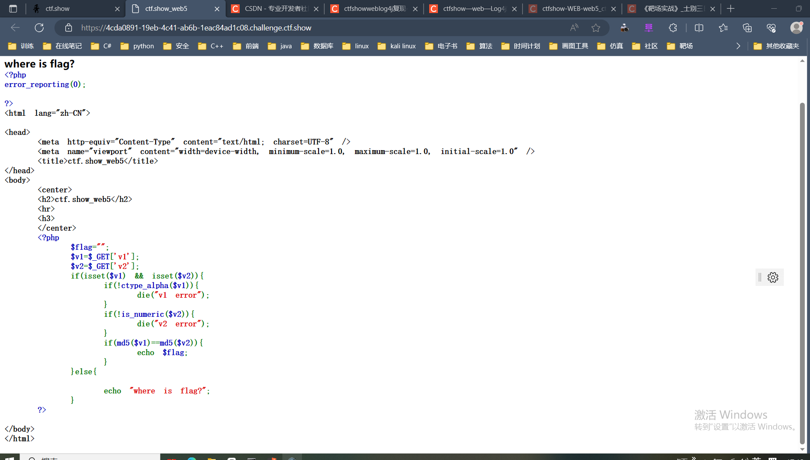
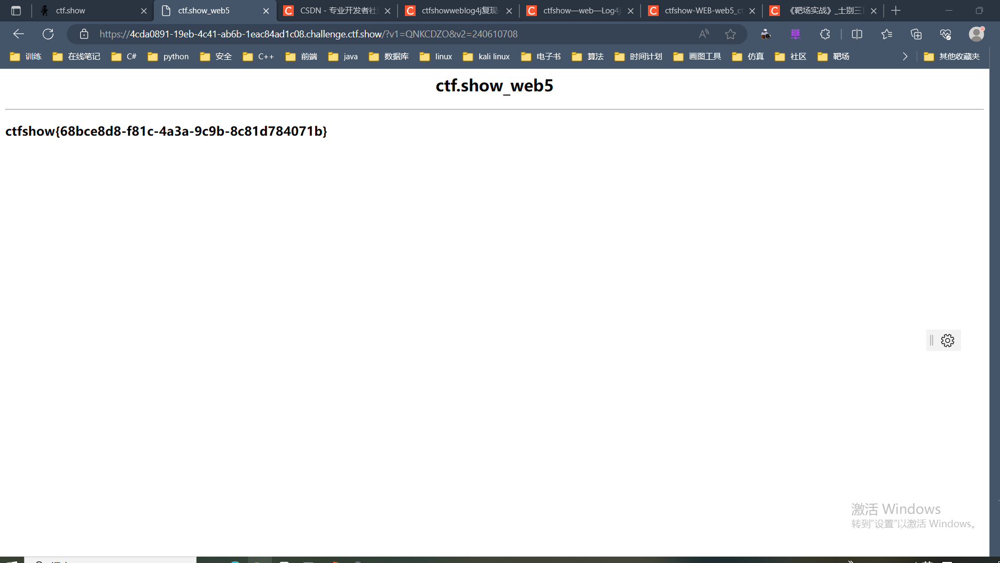

# web5

 页面中展示了部分源码,从源码中我们可以得知,想要夺旗需要通过GET请求传递两个参数v1和v2,并且参数v1必须是纯字母字符串,参数v2必须是数字或者数字字符串,并且两个参数的md5值必须相等

+ ctype_alpha()函数用于检测字符串中是否仅包含字母,是则返回true,否则返回false
+ is_numeric()函数用于检测变量是否为数字或数字字符串,是则返回true,否则返回false
  

可以用MD5的0e绕过方式,输入一下payload

~~~ shell
?v1=QNKCDZO&v2=240610708

QNKCDZO 的md5值为 0e830400451993494058024219903391
240610708 的md5值为 0e462097431906509019562988736854
~~~

分别满足纯字母和数字字符串,并且md5值以0e开头,而0e开头的字符串参与比较(==)时,会转化为0,也就是 0==0,返回true使if判断成立,从而输出flag

