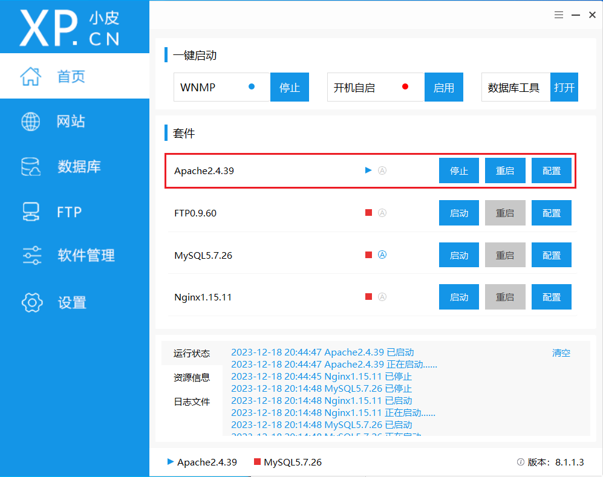
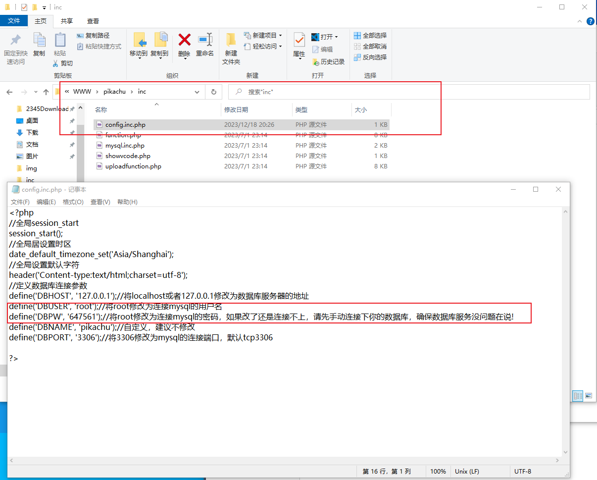
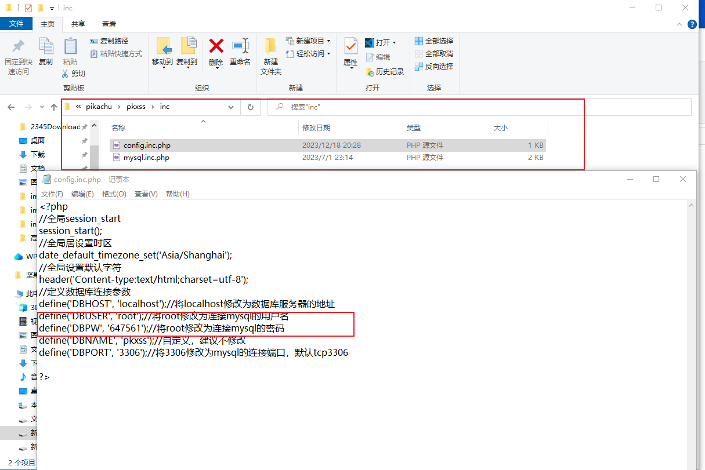
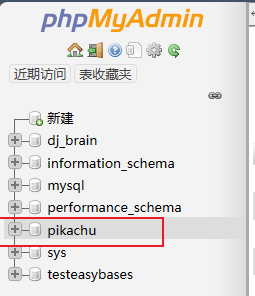
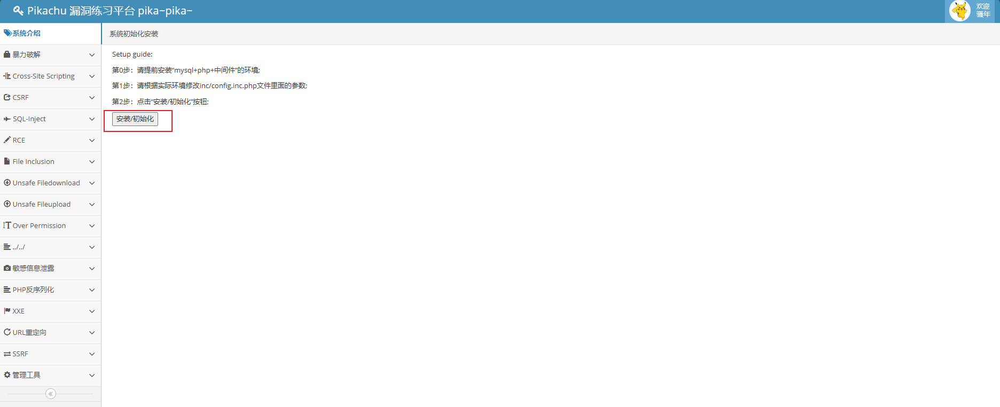

# pikachu靶场通关

## 靶场搭建

+ 靶场地址：https://github.com/zhuifengshaonianhanlu/pikachu

+ 首次从靶场地址下载源文件的文件夹到本地
+ 解压到phpstudy的www目录下，名字改为<code>pikachu</code>
+ 运行<code>phpstudy</code>打开浏览器直接进入 http://127.0.0.1/pikachu/ 即可访问靶场

### 启动环境

#### 启动phpstudy

+ 启动<code>phpstudy</code>自带的<code>Apache</code>

#### 连接本地数据库

+ 连接本地的安装的<code>mysql</code>数据库，不使用<code>phpstudy</code>带有的<code>mysql</code>数据库

+ 首先启动本地自带的<code>mysql</code>服务

+ 修改以下两个配置文件<code>mysql</code>设置，将其中的用户及密码修改为本地连接数据库的用户密码

+ 在本地<code>Mysql</code>数据库中创建数据库<code>pikachu</code>

+ 登录<code>http://localhost/pikachu/</code>,发现配置正常

### 初始化

+ 登录<code>http://localhost/pikachu/install.php</code>

+ 点击<code>安装/初始化</code>按钮初始化完成后查看相应<code>mysql</code>数据库中已经有相应的数据：

如此，数据初始化成功

## 暴力破解

[pikachu靶场全15关通过教程_皮卡丘靶场通关-CSDN博客](https://blog.csdn.net/qq_65165505/article/details/131568188?ops_request_misc=%7B%22request%5Fid%22%3A%22170439296416800186547369%22%2C%22scm%22%3A%2220140713.130102334..%22%7D&request_id=170439296416800186547369&biz_id=0&utm_medium=distribute.pc_search_result.none-task-blog-2~all~top_positive~default-1-131568188-null-null.142^v99^control&utm_term=pikachu通关)