## 一、环境搭建

### 1、靶场描述

~~~ bash
DC-3 is another purposely built vulnerable lab with the intent of gaining experience in the world of penetration testing.
As with the previous DC releases, this one is designed with beginners in mind, although this time around, there is only one flag, one entry point and no clues at all.
Linux skills and familiarity with the Linux command line are a must, as is some experience with basic penetration testing tools.
For beginners, Google can be of great assistance, but you can always tweet me at @DCAU7 for assistance to get you going again. But take note: I won't give you the answer, instead, I'll give you an idea about how to move forward.
For those with experience doing CTF and Boot2Root challenges, this probably won't take you long at all (in fact, it could take you less than 20 minutes easily).
If that's the case, and if you want it to be a bit more of a challenge, you can always redo the challenge and explore other ways of gaining root and obtaining the flag.
~~~

> 只有一个flag

### 2、下载靶场环境

> 靶场下载地址：
>
> ~~~ bash
> https://www.vulnhub.com/entry/dc-32,312/
> ~~~

### 3、启动靶场环境

> 下载下来是虚拟机压缩文件，直接用Vmvare导入就行。

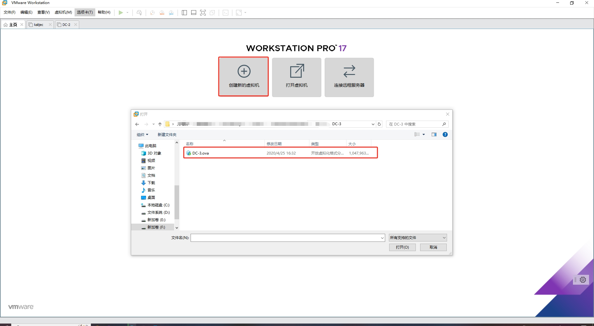

> 设置虚拟机名称

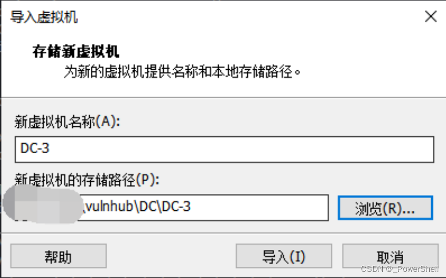

> 导入中

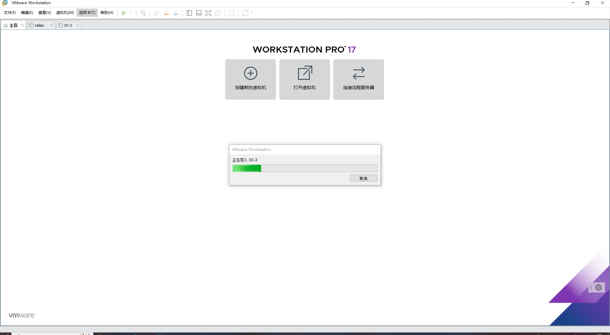

> 导入完成后打开将网络模式设置为NAT模式

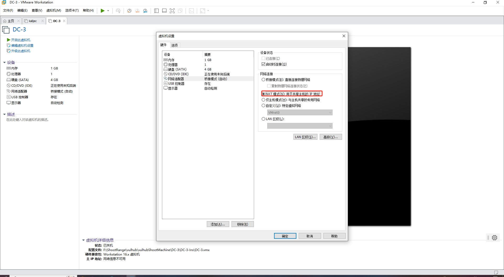

> 开启虚拟机报错
>
> 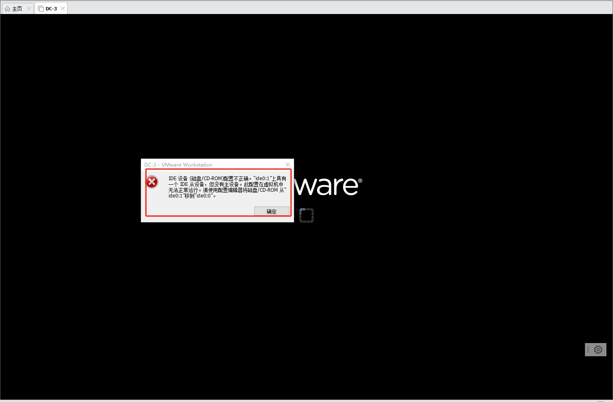
>
> 
>
> #### 解决方法：
>
> **选择具体的虚拟机，点 \**“虚拟机”->“设置”->选择 “磁盘/光驱IDE设备" ->点 ”高级“\**，**
>
> **将要 启动设备 设置到 IDE 0:0 即可。**
>
> 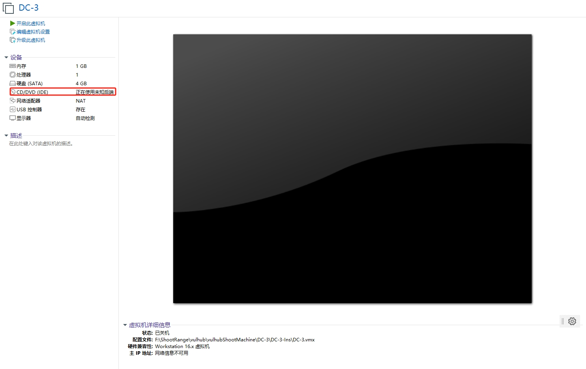
>
> 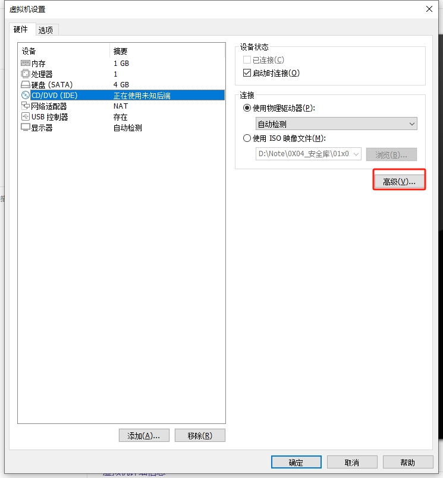
>
> 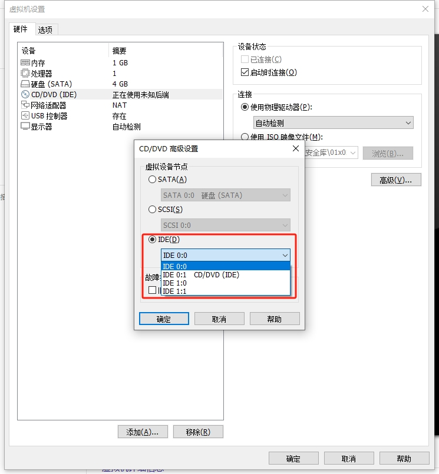

> 虚拟机开启之后界面如下，我们不知道ip，需要自己探活，网段知道：192.168.223.0/24

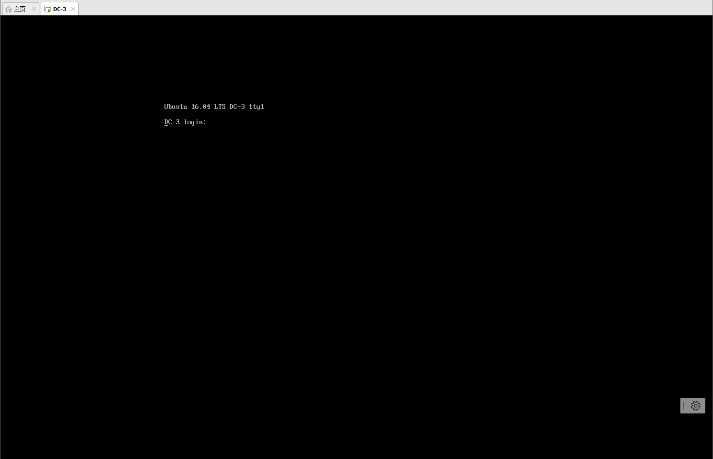

## 二、渗透靶场

### 1、确定目标

#### 1、首先确定kali自身的网址

~~~ bash
ifconfig
~~~

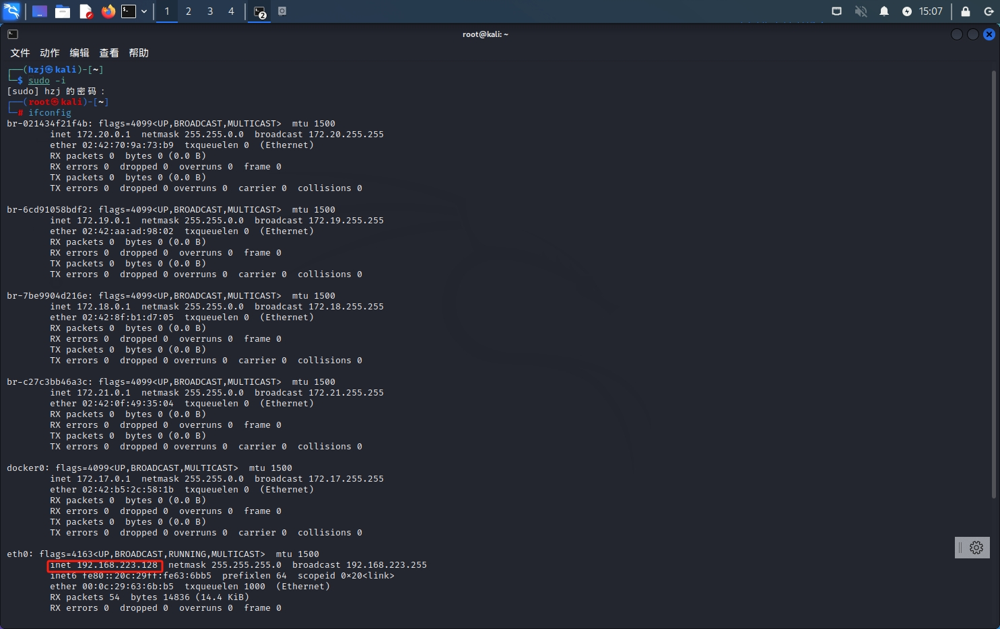

> kali自身ip是192.168.223.128

#### 2、信息收集：寻找靶机真实IP

~~~ bash
nmap -sP 192.168.223.0/24
~~~

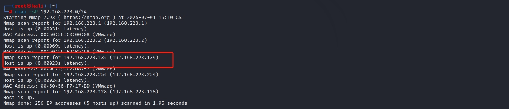

> kali本机ip为192.168.223.128
> 所以分析可得靶机ip为192.168.223.134

~~~ bash
192.168.223.1		vm8网卡
192.168.223.2		网关
192.168.233.128	    kali本机
192.168.223.134	    靶机ip
192.168.233.254	    DHCP服务器
~~~

### 3、信息收集：探端口及服务

~~~ bash
nmap -A -p- -v  192.168.223.134
~~~

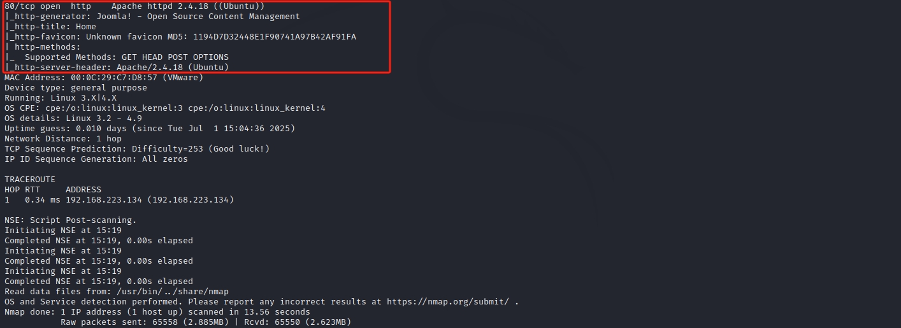

> 发现开放了80端口，存在web服务，Apache/2.4.18，CMS为Joomla

> 尝试访问对应的web服务

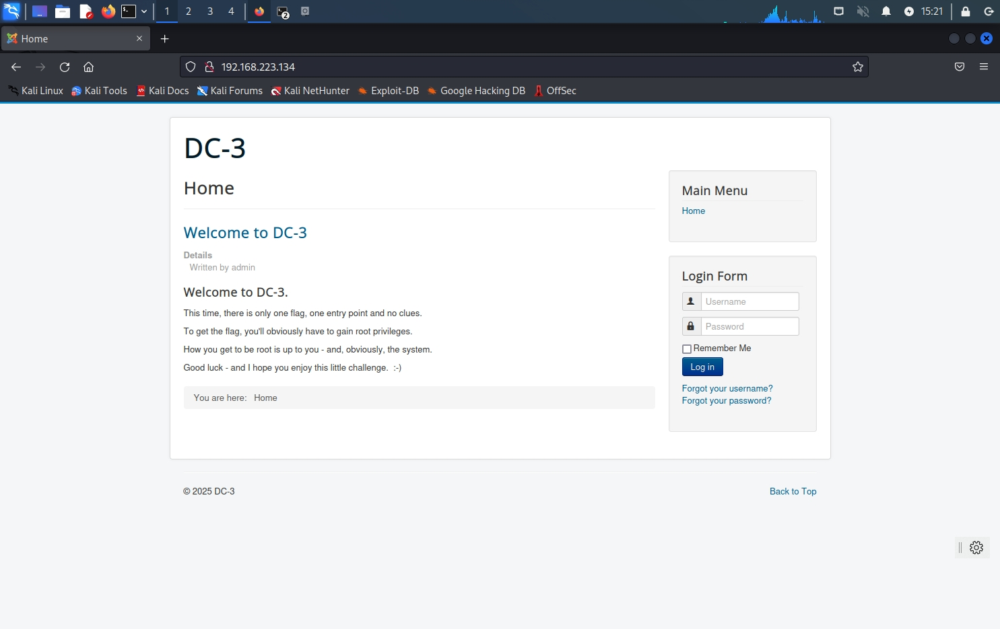

[[ vulnhub靶机通关篇 \] 渗透测试综合靶场 DC-3 通关详解 (附靶机搭建教程)-CSDN博客](https://blog.csdn.net/qq_51577576/article/details/129470364)

[[ vulnhub靶机通关篇 \] 渗透测试综合靶场 DC-4 通关详解 (附靶机搭建教程)_vulnhub靶场题解-CSDN博客](https://blog.csdn.net/qq_51577576/article/details/129479752)

[[ vulnhub靶机通关篇 \] 渗透测试综合靶场 DC-5 通关详解 (附靶机搭建教程)_vulnhub靶场hello?payload=111-CSDN博客](https://blog.csdn.net/qq_51577576/article/details/129972333)

[[ vulnhub靶机通关篇 \] 渗透测试综合靶场 DC-6 通关详解 (附靶机搭建教程)-CSDN博客](https://blog.csdn.net/qq_51577576/article/details/130117937)

[[ vulnhub靶机通关篇 \] 渗透测试综合靶场 DC-7 通关详解 (附靶机搭建教程)_dc-7靶场-CSDN博客](https://blog.csdn.net/qq_51577576/article/details/143277367)

[[ vulnhub靶机通关篇 \] 渗透测试综合靶场 DC-8 通关详解 (附靶机搭建教程)_dc-8靶场-CSDN博客](https://blog.csdn.net/qq_51577576/article/details/143276450)

[[ vulnhub靶机通关篇 \] 渗透测试综合靶场 DC-9 通关详解 (附靶机搭建教程)_vulnhub靶场通关-CSDN博客](https://blog.csdn.net/qq_51577576/article/details/143316331)

[[ windows权限维持 \] 利用永恒之蓝(MS17-010)漏洞取靶机权限并创建后门账户_永恒之蓝 怎么利用新增系统用户-CSDN博客](https://blog.csdn.net/qq_51577576/article/details/143351584)

[[ 漏洞复现篇\] IE浏览器远程代码执行漏洞(CVE-2018-8174)复现-CSDN博客](https://blog.csdn.net/qq_51577576/article/details/124666480)